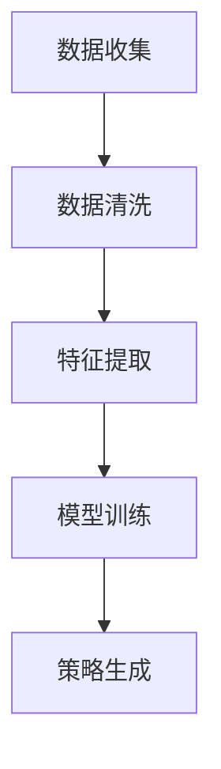
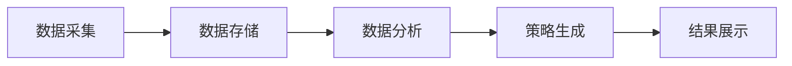

                 


# 连续两年表现不佳的特价股票处理方法

> **关键词**：股票分析、算法优化、数据可视化、风险控制、投资策略  
> **摘要**：本文探讨如何处理连续两年表现不佳的特价股票，通过数据分析和优化算法，提供高效的投资策略和风险控制方法，帮助投资者做出明智决策。

---

## 第一部分：背景介绍

### 第1章：问题背景与核心概念

#### 1.1 问题背景
- **特价股票的定义与特征**：特价股票通常指价格低于市场价的股票，具有高波动性和高风险。投资者可能因低价吸引而买入，但长期表现不佳可能导致损失。
- **股票表现不佳的定义**：收益低于市场平均水平，波动性高，流动性差。
- **连续两年表现不佳的背景分析**：可能因公司基本面恶化、行业竞争加剧或市场环境变化导致。

#### 1.2 核心概念
- **特价股票的表现评估**：评估包括收益、波动性、流动性等指标。
- **连续两年表现不佳的特征分析**：收益持续下降、债务增加、市场份额流失。
- **问题解决的必要性与目标**：通过数据分析和优化算法，筛选出潜在价值，降低投资风险。

#### 1.3 边界与外延
- **特价股票的边界条件**：仅考虑连续两年表现不佳的特价股票。
- **表现不佳的外延范围**：包括收益和波动性等多因素。
- **问题解决的适用范围与限制**：适用于数据充足的市场，需考虑市场波动等外部因素。

---

## 第二部分：核心概念与联系

### 第2章：核心概念的定义与对比

#### 2.1 核心概念的定义
- **特价股票**：价格低于市价，高波动性。
- **表现不佳**：收益低，波动性高。
- **连续两年表现不佳**：连续两年收益低于市场平均水平。

#### 2.2 核心概念的属性特征对比

| 特性       | 特价股票                | 表现不佳股票             |
|------------|------------------------|--------------------------|
| 价格       | 低于市价                | 价格波动大               |
| 收益       | 可能低                  | 收益持续低于市场          |
| 波动性      | 高                     | 高                       |
| 风险       | 高                     | 高                       |
| 投资者     | 低价吸引               | 风险厌恶者可能回避        |

#### 2.3 ER实体关系图
```mermaid
er
    entity 股票(Stock) {
        id: int
        名称(Name): string
        价格(Price): float
        收益(Return): float
        波动性(Volatility): float
        行业(Industry): string
        公司(Size): string
    }
    entity 公司(Company) {
        id: int
        名称(Name): string
        收入(Revenue): float
        利润(Profit): float
        债务(Debt): float
        市场份额(MarketShare): float
    }
    entity 市场(Market) {
        id: int
        指数(Index): float
        收益(Return): float
        波动性(Volatility): float
    }
    relationship 投资(Investment) {
        股票 -> 公司
        股票 -> 市场
    }
```

---

## 第三部分：算法原理讲解

### 第3章：算法原理与流程

#### 3.1 算法原理
- **目标**：识别和处理连续两年表现不佳的特价股票。
- **步骤**：
  1. 数据收集：获取连续两年的股票数据。
  2. 特征提取：提取收益、波动性、流动性等特征。
  3. 模型训练：使用机器学习模型预测股票表现。
  4. 策略生成：生成优化的处理策略。

#### 3.2 算法流程图


#### 3.3 Python代码实现
```python
import pandas as pd
import numpy as np
from sklearn.model_selection import train_test_split
from sklearn.ensemble import RandomForestClassifier

# 数据清洗
data = pd.read_csv('stock_data.csv')
data = data.dropna()

# 特征提取
features = ['Price', 'Volatility', 'Revenue', 'Debt']
target = 'Return'

# 数据分割
X = data[features]
y = data[target].map(lambda x: 1 if x > 0 else 0)
X_train, X_test, y_train, y_test = train_test_split(X, y, test_size=0.2)

# 模型训练
model = RandomForestClassifier()
model.fit(X_train, y_train)

# 预测与评估
predictions = model.predict(X_test)
print("Accuracy:", model.score(X_test, y_test))
```

#### 3.4 数学模型
股票表现预测模型：
$$
\text{预测收益} = \beta_0 + \beta_1 \times \text{价格} + \beta_2 \times \text{波动性} + \epsilon
$$

---

## 第四部分：系统分析与架构设计方案

### 第4章：系统分析与架构设计

#### 4.1 问题场景介绍
- **数据量**：可能涉及大量历史数据。
- **计算复杂度**：需要高效的数据处理和分析能力。

#### 4.2 系统功能设计
- **模块划分**：数据采集、数据分析、策略生成。
- **类图**：展示各模块关系。

#### 4.3 系统架构设计


---

## 第五部分：项目实战

### 第5章：项目实战与案例分析

#### 5.1 环境安装
- 安装Python和相关库：`pip install pandas numpy scikit-learn`

#### 5.2 核心实现
- 数据清洗、特征工程、模型训练和结果分析。

#### 5.3 案例分析
- 使用真实数据进行分析，展示如何筛选和处理特价股票。

---

## 第六部分：最佳实践

### 第6章：小结与注意事项

#### 6.1 小结
本文通过数据分析和优化算法，提供了处理连续两年表现不佳的特价股票的方法，帮助投资者降低风险，提高收益。

#### 6.2 注意事项
- 数据质量：确保数据准确和完整。
- 模型选择：根据实际情况选择合适的模型。
- 风险控制：定期评估和调整投资策略。

#### 6.3 拓展阅读
- 推荐书籍：《Python机器学习实战》、《股票技术分析入门》。
- 在线课程：Coursera上的《数据挖掘与机器学习》。

---

通过以上结构和内容，本文详细讲解了如何处理连续两年表现不佳的特价股票，提供了从理论到实践的全面指导，帮助读者掌握高效的投资策略。

