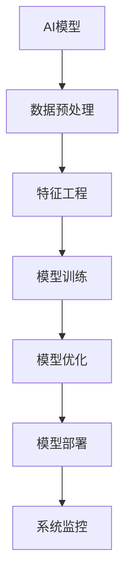
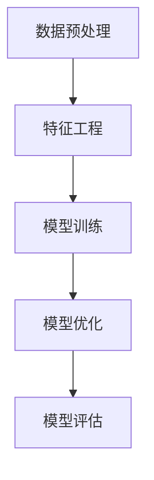
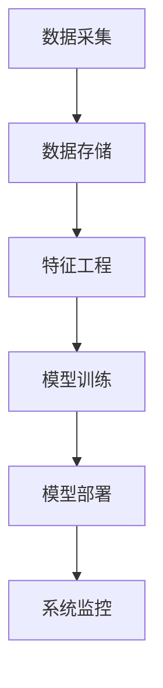

                 


# 金融AI应用的DevOps流程设计与实施

> 关键词：金融AI、DevOps、机器学习、系统架构、持续集成、自动化部署、微服务

> 摘要：本文详细探讨了金融AI应用的DevOps流程设计与实施，从背景、核心概念、算法原理、系统架构到项目实战，逐步分析和讲解了如何在金融领域高效地设计和实施AI应用的DevOps流程。通过理论与实践相结合的方式，为读者提供了从理解问题到解决问题的完整思路。

---

## 第1章: 金融AI应用的背景与概述

### 1.1 金融AI应用的背景

#### 1.1.1 人工智能在金融领域的应用现状
人工智能（AI）技术正在深刻改变金融行业的运作方式。从智能投顾、风险评估到欺诈检测，AI技术已经渗透到金融业务的各个环节。根据统计，全球金融机构在AI技术上的投入年均增长超过30%，AI已经成为金融行业数字化转型的核心驱动力。

#### 1.1.2 金融行业对AI技术的需求
金融行业对AI技术的需求主要集中在以下几个方面：
- **智能投顾**：为用户提供个性化的投资建议。
- **风险控制**：通过AI模型进行信用评估和欺诈检测。
- **高频交易**：利用AI算法快速捕捉市场机会。
- **客户画像**：基于AI技术进行精准营销。

#### 1.1.3 DevOps在金融行业的发展趋势
DevOps（Development Operations）是一种结合了开发（Development）和运维（Operations）的协作模式，强调自动化、持续集成和快速交付。随着金融行业对技术响应速度和系统稳定性的要求不断提高，DevOps已经成为金融IT系统建设的重要趋势。

### 1.2 问题背景与问题描述

#### 1.2.1 传统金融业务中的痛点
传统金融业务在IT系统建设中存在以下痛点：
- **开发效率低**：传统开发模式周期长，难以快速响应业务需求。
- **系统耦合度高**：系统模块之间耦合度高，维护成本高。
- **测试覆盖率低**：测试用例覆盖率低，导致系统上线风险高。

#### 1.2.2 AI技术在金融业务中的应用挑战
AI技术在金融业务中的应用面临以下挑战：
- **数据隐私**：金融数据涉及用户隐私，数据处理需要符合严格的安全规范。
- **模型迭代**：AI模型需要不断迭代优化，如何高效地进行模型部署和更新是一个难题。
- **系统稳定性**：AI系统的稳定性直接影响业务的连续性，如何保证系统稳定性是一个关键问题。

#### 1.2.3 DevOps在金融AI应用中的作用
DevOps在金融AI应用中的作用主要体现在以下几个方面：
- **自动化部署**：通过自动化工具实现AI模型的快速部署。
- **持续集成**：通过CI/CD流程保证AI模型的代码质量。
- **监控与反馈**：通过实时监控系统运行状态，快速发现并解决问题。

### 1.3 问题解决与边界定义

#### 1.3.1 金融AI应用的解决方案
金融AI应用的解决方案包括以下几个方面：
- **AI模型开发**：基于金融数据开发高精度的AI模型。
- **DevOps流程设计**：设计自动化部署和持续集成流程。
- **系统架构优化**：设计高效的系统架构，保证系统的可扩展性和稳定性。

#### 1.3.2 问题的边界与外延
金融AI应用的边界主要集中在以下几个方面：
- **数据范围**：限定于金融相关数据，不涉及其他领域的数据。
- **功能范围**：限定于AI模型的开发、部署和监控，不涉及其他业务功能。
- **系统范围**：限定于金融AI应用的IT系统，不涉及其他业务系统。

#### 1.3.3 核心概念与组成要素
金融AI应用的核心概念包括：
- **AI模型**：基于机器学习算法开发的模型。
- **DevOps流程**：自动化部署和持续集成流程。
- **系统架构**：高效的系统架构设计。

---

## 第2章: 金融AI应用的核心概念与联系

### 2.1 AI与DevOps的核心概念

#### 2.1.1 AI模型开发流程
AI模型开发流程包括以下几个阶段：
1. 数据采集与预处理。
2. 模型训练与优化。
3. 模型部署与监控。

#### 2.1.2 DevOps的核心理念
DevOps的核心理念包括：
- **自动化**：通过自动化工具实现开发、测试和部署的自动化。
- **持续集成**：通过CI/CD流程保证代码质量和交付速度。
- **协作开发**：通过协作开发模式提高团队效率。

#### 2.1.3 金融AI应用中的DevOps特点
金融AI应用中的DevOps特点包括：
- **高可用性**：系统需要7×24小时稳定运行。
- **高安全性**：数据处理需要符合严格的保密要求。
- **快速迭代**：AI模型需要快速迭代优化。

### 2.2 核心概念对比分析

#### 2.2.1 AI与传统开发的对比
| 对比维度 | AI开发 | 传统开发 |
|----------|--------|----------|
| 开发周期 | 短     | 长       |
| 模型迭代 | 快     | 慢       |
| 数据依赖 | 高     | 低       |

#### 2.2.2 DevOps与传统金融系统开发的对比
| 对比维度 | DevOps开发 | 传统开发 |
|----------|------------|----------|
| 自动化水平 | 高         | 低       |
| 交付速度 | 快         | 慢       |
| 系统稳定性 | 高         | 中       |

#### 2.2.3 金融AI应用中的概念关系图



---

## 第3章: 金融AI应用的算法原理

### 3.1 算法原理概述

#### 3.1.1 机器学习基础
机器学习是一种通过数据训练模型的技术，主要分为监督学习、无监督学习和强化学习三种类型。

#### 3.1.2 深度学习在金融中的应用
深度学习是一种基于人工神经网络的机器学习技术，广泛应用于金融领域的图像识别、语音识别和自然语言处理。

#### 3.1.3 AI模型训练流程
AI模型训练流程包括数据预处理、特征工程、模型训练、模型优化和模型评估五个阶段。

### 3.2 算法实现与流程图

#### 3.2.1 机器学习算法的实现流程



#### 3.2.2 使用Mermaid绘制算法流程图


#### 3.2.3 算法实现的Python代码示例

```python
import numpy as np
from sklearn.linear_model import LinearRegression

# 数据预处理
X = np.array([[1], [2], [3], [4], [5]])
y = np.array([2, 4, 5, 4, 5])

# 特征工程
model = LinearRegression()

# 模型训练
model.fit(X, y)

# 模型预测
print(model.predict([[6]]))
```

#### 3.2.4 算法原理的数学模型和公式
线性回归的数学模型如下：

$$ y = \beta_0 + \beta_1 x + \epsilon $$

其中，$\beta_0$是截距，$\beta_1$是回归系数，$\epsilon$是误差项。

优化过程如下：

$$ \text{损失函数} = \frac{1}{2m} \sum_{i=1}^{m} (y_i - (\beta_0 + \beta_1 x_i))^2 $$

---

## 第4章: 金融AI应用的系统架构设计

### 4.1 系统分析与设计

#### 4.1.1 问题场景介绍
金融AI应用需要处理大量金融数据，包括交易数据、客户数据和市场数据。

#### 4.1.2 系统功能设计
系统功能设计包括数据采集、模型训练、模型部署和系统监控四个模块。

#### 4.1.3 系统架构设计



---

## 第5章: 金融AI应用的项目实战

### 5.1 环境安装与配置

#### 5.1.1 安装Python和相关库
```bash
pip install numpy scikit-learn matplotlib
```

#### 5.1.2 安装Jupyter Notebook
```bash
pip install jupyter
```

### 5.2 系统核心实现源代码

#### 5.2.1 数据预处理代码
```python
import pandas as pd

# 读取数据
data = pd.read_csv('financial_data.csv')

# 数据清洗
data = data.dropna()
```

#### 5.2.2 模型训练代码
```python
from sklearn.model_selection import train_test_split
from sklearn.linear_model import LinearRegression

# 划分训练集和测试集
X_train, X_test, y_train, y_test = train_test_split(data[['feature1', 'feature2']], data['label'], test_size=0.2)

# 模型训练
model = LinearRegression()
model.fit(X_train, y_train)

# 模型预测
print(model.score(X_test, y_test))
```

### 5.3 案例分析与实际应用

#### 5.3.1 案例分析
以股票价格预测为例，通过AI模型实现股票价格的预测。

#### 5.3.2 代码应用解读与分析
```python
import numpy as np
import pandas as pd
from sklearn.linear_model import LinearRegression
from sklearn.metrics import mean_squared_error

# 读取数据
data = pd.read_csv('stock_data.csv')

# 数据预处理
data['date'] = pd.to_datetime(data['date'])
data.set_index('date', inplace=True)

# 划分训练集和测试集
train_data = data['2019-01-01':'2020-12-31']
test_data = data['2021-01-01':'2021-12-31']

# 特征工程
features = ['open', 'high', 'low', 'close']
target = 'next_day_close'

# 模型训练
model = LinearRegression()
model.fit(train_data[features], train_data[target])

# 模型预测
test_predictions = model.predict(test_data[features])
print(mean_squared_error(test_data[target], test_predictions))
```

#### 5.3.3 项目小结
通过案例分析，我们可以看到AI模型在金融领域的应用潜力，同时也需要注意模型的稳定性和数据的安全性。

---

## 第6章: 总结与展望

### 6.1 最佳实践 tips
- **数据安全**：高度重视数据的保密性和安全性。
- **模型迭代**：定期更新和优化AI模型，确保模型的有效性。
- **系统监控**：建立完善的系统监控机制，确保系统的稳定运行。

### 6.2 小结
本文详细探讨了金融AI应用的DevOps流程设计与实施，从背景、核心概念、算法原理、系统架构到项目实战，为读者提供了从理解问题到解决问题的完整思路。

### 6.3 注意事项
- **数据隐私**：严格遵守数据隐私保护相关法律法规。
- **系统稳定性**：确保系统的高可用性和稳定性。
- **团队协作**：加强团队协作，提高开发效率。

### 6.4 拓展阅读
- 《机器学习实战》
- 《DevOps实战手册》
- 《金融风险管理》

---

通过本文的学习，读者可以掌握金融AI应用的DevOps流程设计与实施的关键点，为后续的实际应用打下坚实的基础。

