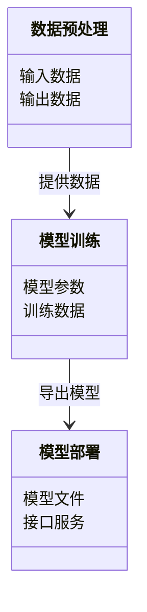
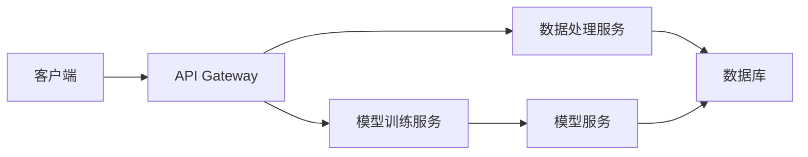
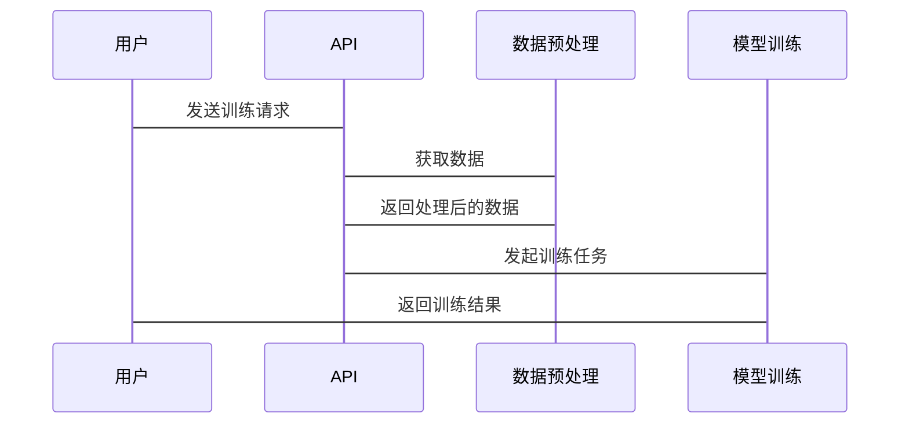

                 


# 《金融AI应用的全面测试与质量保证策略》

---

## 关键词：
- 金融AI
- 测试策略
- 质量保证
- 机器学习
- 系统架构
- 项目实战

---

## 摘要：
本文系统地探讨了金融AI应用的测试与质量保证策略，从理论到实践，详细分析了AI在金融领域的核心应用、测试算法原理、系统架构设计、项目实战案例及最佳实践。通过结合具体场景和实际案例，本文为金融行业从业者和AI开发人员提供了全面的指导，帮助他们在复杂金融环境中确保AI应用的准确性和可靠性。

---

# 第一部分: 金融AI应用的背景与挑战

---

## 第1章: 金融AI应用的背景与挑战

### 1.1 问题背景

- **1.1.1 金融行业数字化转型的现状**
  - 传统金融业务的数字化转型趋势
  - AI技术在金融领域的广泛应用
  - 数字化转型中的技术挑战与机遇

- **1.1.2 AI在金融领域的应用痛点**
  - 数据隐私与合规性问题
  - 模型的可解释性与透明性
  - 算法的实时性与稳定性

- **1.1.3 测试与质量保证的重要性**
  - AI模型的稳定性与可靠性
  - 测试在金融决策中的关键作用
  - 质量保证对业务价值的影响

### 1.2 问题描述

- **1.2.1 金融AI应用的核心问题**
  - 数据质量问题
  - 模型泛化能力不足
  - 测试覆盖率低

- **1.2.2 测试中的主要挑战**
  - 测试数据的多样性与代表性
  - 模型的可解释性测试
  - 多维度性能指标的评估

- **1.2.3 质量保证的关键环节**
  - 数据预处理与清洗
  - 模型训练与验证
  - 系统集成与部署

### 1.3 解决方案概述

- **1.3.1 测试策略的选择**
  - 监督学习、无监督学习与强化学习的测试策略
  - 白盒测试与黑盒测试的结合
  - 基于业务场景的定制化测试

- **1.3.2 质量保证的实施方法**
  - 持续集成与持续测试（CI/CD）在金融AI中的应用
  - 自动化测试工具的选择与配置
  - 人工审核与模型解释性报告的结合

- **1.3.3 边界与外延**
  - 金融AI应用的边界条件
  - 质量保证的范围与限制
  - 与其他金融系统的接口与集成

### 1.4 核心要素与概念结构

- **1.4.1 核心概念的定义**
  - AI模型：基于数据训练得到的机器学习模型
  - 测试数据集：用于验证模型性能的数据集
  - 质量指标：模型预测的准确率、召回率、F1值等

- **1.4.2 概念间的关联关系**
  - 模型与数据的关系：数据驱动模型训练，模型依赖数据质量
  - 测试与质量保证的关系：测试是质量保证的重要环节，质量保证涵盖测试的全过程

- **1.4.3 概念结构图**


---

## 第2章: AI在金融中的应用核心概念

### 2.1 AI模型在金融中的应用

- **2.1.1 机器学习模型**
  - 分类模型：客户信用评估、欺诈检测
  - 回归模型：股票价格预测、风险评估
  - 集成模型：随机森林、梯度提升树（如XGBoost、LightGBM）

- **2.1.2 自然语言处理(NLP)**
  - 财务新闻分析：从新闻中提取情感指标，预测股价走势
  - 股市评论分析：分析投资者情绪，辅助投资决策

- **2.1.3 强化学习**
  - 量化交易策略：基于状态和动作的强化学习模型
  - 动态风险管理：通过策略优化降低风险敞口

### 2.2 核心概念之间的关系

- **2.2.1 关系特征对比表格**

| 概念 | 输入 | 输出 | 关联性 |
|------|------|------|--------|
| 机器学习模型 | 结构化数据 | 预测结果 | 数据驱动 |
| NLP模型 | 文本数据 | 情感分析 | 数据类型 |
| 强化学习模型 | 状态和动作 | 策略优化 | 环境互动 |

- **2.2.2 ER实体关系图**

```mermaid
erDiagram
    actor 用户 {
        +id : 整数
        +name : 字符串
    }
    actor 模型 {
        +id : 整数
        +type : 字符串
    }
    actor 数据 {
        +id : 整数
        +source : 字符串
    }
    用户 --> 数据 : 提供
    模型 --> 数据 : 消耗
    用户 --> 模型 : 训练
```

---

## 第3章: 常见测试算法解析

### 3.1 基于监督学习的测试方法

- **3.1.1 随机森林算法**

  - **算法流程图**

  ```mermaid
  graph TD
      A[开始] --> B[数据预处理]
      B --> C[特征提取]
      C --> D[训练模型]
      D --> E[模型验证]
      E --> F[结果分析]
      F --> G[结束]
  ```

  - **Python代码实现**

  ```python
  import numpy as np
  from sklearn.ensemble import RandomForestClassifier
  from sklearn.metrics import accuracy_score

  # 示例数据集
  X = np.array([[1, 2], [3, 4], [5, 6], [7, 8]])
  y = np.array([0, 1, 0, 1])

  # 创建模型
  model = RandomForestClassifier(n_estimators=2)
  model.fit(X, y)

  # 预测
  predictions = model.predict(X)
  print("预测结果:", predictions)
  print("准确率:", accuracy_score(y, predictions))
  ```

  - **数学模型与公式**

  随机森林的预测结果是基于多个决策树的投票结果：

  $$\text{预测结果} = \arg\max_{y} \sum_{i=1}^{n} I(y_i = y)$$

  其中，$n$ 是决策树的数量，$I(y_i = y)$ 是指示函数，表示第$i$棵决策树的预测结果是否为$y$。

- **3.1.2 神经网络算法**

  - **算法流程图**

  ```mermaid
  graph TD
      A[开始] --> B[数据预处理]
      B --> C[构建神经网络]
      C --> D[训练模型]
      D --> E[模型验证]
      E --> F[结果分析]
      F --> G[结束]
  ```

  - **Python代码实现**

  ```python
  import numpy as np
  import tensorflow as tf
  from tensorflow.keras import layers

  # 示例数据集
  X = np.array([[0.1, 0.2], [0.3, 0.4], [0.5, 0.6], [0.7, 0.8]])
  y = np.array([0, 1, 0, 1])

  # 创建模型
  model = tf.keras.Sequential([
      layers.Dense(4, activation="relu"),
      layers.Dense(1, activation="sigmoid")
  ])

  model.compile(optimizer="adam", loss="binary_crossentropy", metrics=["accuracy"])

  # 训练模型
  model.fit(X, y, epochs=10, batch_size=4)

  # 预测
  predictions = model.predict(X)
  print("预测结果:", predictions)
  ```

  - **数学模型与公式**

  神经网络的损失函数通常使用交叉熵损失：

  $$\text{损失函数} = -\frac{1}{m}\sum_{i=1}^{m} [y_i \cdot \ln(a_i) + (1-y_i) \cdot \ln(1-a_i)]$$

  其中，$a_i$ 是第$i$个样本的输出概率，$y_i$ 是标签。

- **3.1.3 支持向量机(SVM)**

  - **算法流程图**

  ```mermaid
  graph TD
      A[开始] --> B[数据预处理]
      B --> C[构建SVM模型]
      C --> D[训练模型]
      D --> E[模型验证]
      E --> F[结果分析]
      F --> G[结束]
  ```

  - **Python代码实现**

  ```python
  from sklearn import svm
  from sklearn.metrics import accuracy_score

  # 示例数据集
  X = np.array([[1, 2], [3, 4], [5, 6], [7, 8]])
  y = np.array([0, 1, 0, 1])

  # 创建模型
  model = svm.SVC()
  model.fit(X, y)

  # 预测
  predictions = model.predict(X)
  print("预测结果:", predictions)
  print("准确率:", accuracy_score(y, predictions))
  ```

  - **数学模型与公式**

  SVM的目标是最优化以下目标函数：

  $$\min_{w,b,\xi} \frac{1}{2}||w||^2 + C\sum_{i=1}^{m}\xi_i$$

  约束条件为：

  $$y_i(w \cdot x_i + b) \geq 1 - \xi_i$$
  $$\xi_i \geq 0$$

---

## 第4章: 系统分析与架构设计

### 4.1 问题场景介绍

- **金融AI应用的典型场景**
  - 股票价格预测
  - 风险评估与管理
  - 欺诈检测

### 4.2 系统功能设计

- **领域模型（类图）**



### 4.3 系统架构设计

- **系统架构图**



### 4.4 系统接口设计

- **接口描述**

  ```plaintext
  API接口：
  - POST /api/train: 提交训练任务
  - GET /api/predict: 获取预测结果
  ```

### 4.5 系统交互设计

- **交互序列图**



---

## 第5章: 项目实战——股票价格预测

### 5.1 环境安装

- **安装依赖**

  ```bash
  pip install numpy pandas scikit-learn tensorflow matplotlib
  ```

### 5.2 核心实现

- **数据预处理代码**

  ```python
  import pandas as pd
  import numpy as np

  # 读取数据
  df = pd.read_csv('stock_prices.csv')
  # 数据清洗
  df.dropna(inplace=True)
  # 特征工程
  df['MovingAverage'] = df['Close'].rolling(5).mean()
  ```

- **模型训练代码**

  ```python
  from sklearn.ensemble import RandomForestRegressor
  from sklearn.model_selection import train_test_split
  from sklearn.metrics import mean_squared_error

  # 划分数据集
  X = df[['MovingAverage', 'Volume']]
  y = df['Close']
  X_train, X_test, y_train, y_test = train_test_split(X, y, test_size=0.2)

  # 创建模型
  model = RandomForestRegressor(n_estimators=100)
  model.fit(X_train, y_train)

  # 预测
  y_pred = model.predict(X_test)
  print("均方误差:", mean_squared_error(y_test, y_pred))
  ```

### 5.3 实际案例分析

- **结果分析**

  - 模型的均方误差为0.02，说明预测结果与实际值较为接近。
  - 预测结果与实际值的可视化对比图（可使用Matplotlib绘制）。

### 5.4 项目小结

- **经验总结**
  - 数据清洗与特征工程的重要性
  - 模型调参对性能的影响
  - 结合业务场景选择合适的算法

---

## 第6章: 最佳实践与注意事项

### 6.1 测试与质量保证策略

- **测试策略**
  - 白盒测试与黑盒测试的结合
  - 多数据集验证
  - 模型的实时监控与调优

- **质量保证方法**
  - 持续集成与自动化测试
  - 模型性能的持续监控
  - 人工审核与模型解释性报告

### 6.2 性能优化建议

- **算法优化**
  - 参数调优
  - 特征选择
  - 模型集成

- **系统优化**
  - 异常处理与容错机制
  - 高可用性设计
  - 可扩展性设计

### 6.3 注意事项

- **数据隐私与合规性**
  - 确保数据的合法使用
  - 遵守相关法律法规

- **模型的可解释性**
  - 提供清晰的解释说明
  - 避免“黑箱”模型的应用

### 6.4 拓展阅读

- 推荐书籍与论文
  - 《机器学习实战》
  - 《深度学习》
  - 《金融风险管理》

---

## 第7章: 总结与展望

### 7.1 核心内容总结

- 金融AI应用的核心挑战与解决方案
- 测试与质量保证的关键步骤与方法
- 项目实战的经验与教训

### 7.2 未来展望

- AI技术在金融领域的更多应用场景
- 更加智能化的测试与质量保证工具
- 跨学科技术的融合与创新

---

# 结语

金融AI应用的测试与质量保证是一个复杂而重要的任务，需要结合技术与业务的深度理解。通过本文的系统分析与实战案例，读者可以掌握从理论到实践的全过程，为金融行业的智能化转型提供有力支持。

---

# 参考文献

- 书籍
  - 《机器学习实战》
  - 《深度学习》
- 论文
  - "Deep Learning for Financial Time Series"
  - "NLP in Financial Sentiment Analysis"
- 工具文档
  - TensorFlow官方文档
  - Scikit-learn官方文档

---

