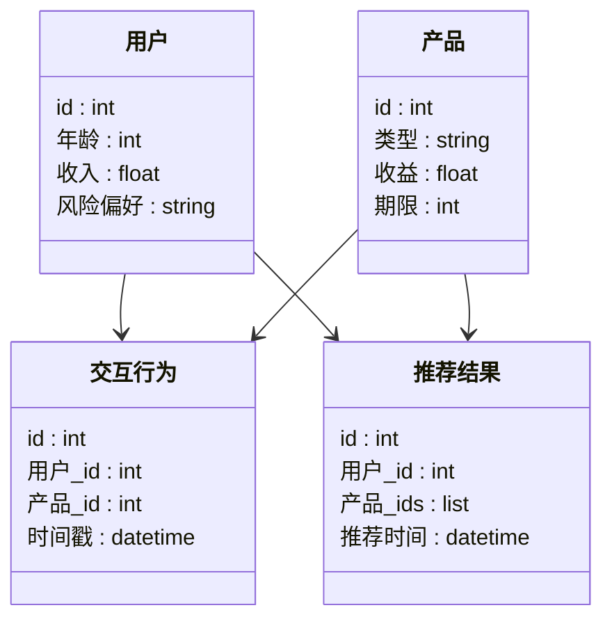
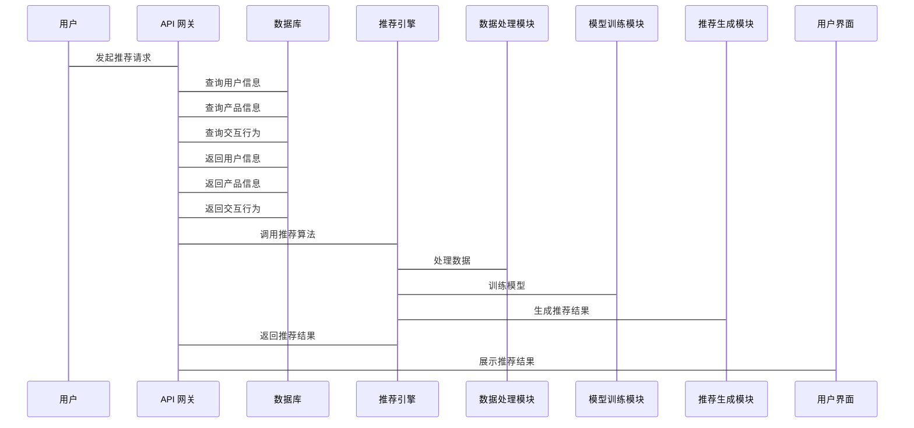

                 


# 《金融产品交叉销售推荐引擎》

> 关键词：金融推荐引擎、交叉销售、协同过滤、机器学习、深度学习、推荐系统、人工智能

> 摘要：本文深入探讨了金融产品交叉销售推荐引擎的设计与实现。从问题背景到算法原理，从系统架构到项目实战，全面解析了如何利用人工智能技术提升金融产品的交叉销售效率和精准度。通过协同过滤和机器学习算法的结合，本文提出了一种高效、可扩展的推荐引擎设计方案，为金融机构提供了强有力的技术支持。

---

# 第一部分: 金融产品交叉销售推荐引擎的背景与概念

# 第1章: 问题背景与需求分析

## 1.1 问题背景

### 1.1.1 金融行业的交叉销售现状

在金融行业，交叉销售（Cross-Selling）是指在同一交易或客户互动中，向客户推荐多种相关产品或服务。例如，在银行办理信用卡时，同时推荐贷款或理财产品的销售行为。交叉销售能够提高客户满意度、增加收入来源，是金融业务的重要策略之一。

然而，传统的交叉销售方式存在以下问题：
- **人工推荐的局限性**：依赖人工经验，推荐效率低，难以覆盖大量客户。
- **个性化不足**：推荐缺乏针对性，难以满足不同客户的需求。
- **数据孤岛**：客户数据分散在不同业务系统中，难以有效整合和利用。

### 1.1.2 问题描述

金融产品的交叉销售推荐需要解决以下核心问题：
1. **客户行为分析**：如何从海量数据中提取有效的客户行为特征，精准识别客户的潜在需求？
2. **产品推荐的精准性**：如何基于客户特征和产品属性，推荐最符合客户需求的产品组合？
3. **实时性与可扩展性**：如何在实时交易中快速生成推荐结果，同时支持金融机构的高并发需求？

### 1.1.3 问题解决思路

人工智能技术，尤其是机器学习和深度学习，为解决上述问题提供了强大的工具。通过构建推荐引擎，金融机构可以：
- **自动化推荐**：利用算法自动分析客户行为和产品特征，生成个性化推荐。
- **数据驱动决策**：基于客户数据和市场趋势，优化推荐策略，提升推荐效果。
- **实时反馈与优化**：根据客户反馈实时调整推荐结果，持续优化推荐算法。

## 1.2 核心概念与联系

### 1.2.1 核心概念框架

交叉销售推荐引擎的核心概念包括：
- **客户特征**：包括客户的年龄、职业、收入、资产规模、风险偏好等。
- **产品特征**：包括产品的类型、收益、风险、期限等。
- **交互行为**：包括客户的购买记录、点击行为、咨询记录等。
- **推荐规则**：基于客户特征和产品特征的推荐策略，例如相似产品推荐、协同过滤推荐等。

### 1.2.2 实体关系与数据流

以下是一个简化的实体关系图（ER图）：

```mermaid
erDiagram
    customer [客户] {
        id : int
        age : int
        income : float
        risk_preference : string
    }
    product [产品] {
        id : int
        type : string
        yield : float
        term : int
    }
    interaction [交互行为] {
        id : int
        customer_id : int
        product_id : int
        timestamp : datetime
    }
    recommendation [推荐结果] {
        id : int
        customer_id : int
        product_ids : list<int>
        recommendation_time : datetime
    }
    customer --> interaction
    product --> interaction
    customer --> recommendation
    product --> recommendation
```

从图中可以看出，客户和产品是推荐引擎的核心实体，交互行为和推荐结果是数据流动的关键节点。

---

# 第二部分: 交叉销售推荐引擎的核心概念与联系

# 第2章: 推荐引擎的核心原理

## 2.1 数据驱动的推荐机制

### 2.1.1 数据采集与处理

推荐引擎的数据来源包括：
- **客户数据**：客户的基本信息、资产状况、交易记录等。
- **产品数据**：产品的属性信息，如收益、风险、类型等。
- **交互数据**：客户的点击、购买、搜索等行为记录。

### 2.1.2 特征提取与表示

特征提取是推荐引擎的关键步骤。常见的特征提取方法包括：
- **数值型特征**：如年龄、收入、资产规模等。
- **类别型特征**：如职业、风险偏好等。
- **文本型特征**：如客户评论、产品描述等。

### 2.1.3 模型训练与优化

基于特征提取的数据，推荐引擎需要训练模型来预测客户对产品的兴趣程度。常用的模型包括协同过滤和基于机器学习的推荐模型。

---

## 2.2 基于协同过滤的推荐算法

### 2.2.1 用户-产品协同过滤

用户-产品协同过滤是一种基于用户相似性推荐的方法。具体步骤如下：
1. **计算用户相似性**：使用余弦相似性或皮尔逊相关系数计算用户之间的相似性。
2. **生成推荐列表**：基于相似用户的购买记录，推荐相似用户感兴趣的产品。

### 2.2.2 基于物品的协同过滤

基于物品的协同过滤是一种基于产品相似性推荐的方法。具体步骤如下：
1. **计算产品相似性**：使用协同过滤算法计算产品之间的相似性。
2. **生成推荐列表**：基于用户的历史购买记录，推荐相似产品。

### 2.2.3 混合协同过滤

混合协同过滤结合了用户-产品协同过滤的优点，通过将两者结合起来，提高推荐的准确性和多样性。

---

## 2.3 基于机器学习的推荐模型

### 2.3.1 基于深度学习的推荐系统

深度学习推荐系统（DLRS）是一种基于神经网络的推荐方法。常用的模型包括：
- **协同过滤神经网络**：通过神经网络建模用户和产品之间的关系。
- **序列推荐模型**：基于客户的购买序列，推荐相关产品。

### 2.3.2 神经网络在推荐中的应用

神经网络在推荐中的应用包括：
- **自动编码器（Autoencoder）**：用于特征提取和降维。
- **卷积神经网络（CNN）**：用于处理序列数据，提取局部特征。
- **循环神经网络（RNN）**：用于处理序列数据，捕捉长距离依赖。

### 2.3.3 深度学习模型的优缺点

- **优点**：能够处理高维数据，捕捉非线性关系。
- **缺点**：计算复杂度高，需要大量数据支持。

---

## 2.4 推荐结果的输出与解释

### 2.4.1 推荐结果的可解释性

推荐结果的可解释性是推荐引擎的重要特性。用户需要理解推荐的原因，以便信任和接受推荐结果。

### 2.4.2 推荐结果的置信度评估

推荐结果的置信度可以通过概率模型或相似度指标进行评估。

### 2.4.3 推荐结果的动态调整

根据客户的实时行为和反馈，动态调整推荐策略，优化推荐效果。

---

# 第三部分: 交叉销售推荐引擎的算法原理

# 第3章: 协同过滤算法的实现

## 3.1 协同过滤算法概述

### 3.1.1 协同过滤的实现步骤

1. **数据预处理**：清洗数据，处理缺失值和异常值。
2. **相似性计算**：计算用户或产品之间的相似性。
3. **生成推荐列表**：基于相似性计算，生成推荐结果。

### 3.1.2 协同过滤的实现代码

以下是协同过滤算法的Python实现示例：

```python
import numpy as np
from sklearn.metrics.pairwise import cosine_similarity

# 示例数据：用户-产品评分矩阵
users = ['A', 'B', 'C', 'D']
products = ['P1', 'P2', 'P3', 'P4']
ratings = {
    'A': {'P1': 4, 'P2': 3, 'P3': 2, 'P4': 5},
    'B': {'P1': 3, 'P2': 4, 'P3': 5, 'P4': 1},
    'C': {'P1': 2, 'P2': 5, 'P3': 3, 'P4': 4},
    'D': {'P1': 5, 'P2': 1, 'P3': 4, 'P4': 2}
}

# 转换为矩阵形式
rating_matrix = np.zeros((len(users), len(products)))
for i, user in enumerate(users):
    for j, product in enumerate(products):
        rating_matrix[i, j] = ratings[user][product]

# 计算余弦相似性
similarity_matrix = cosine_similarity(rating_matrix)

print("相似性矩阵：")
print(similarity_matrix)
```

### 3.1.3 协同过滤的数学模型

协同过滤的数学模型可以表示为：

$$
\text{相似性}(u, v) = \frac{\sum_{i} (r_{u,i} - \bar{r}_u)(r_{v,i} - \bar{r}_v)}{\sqrt{\sum_{i} (r_{u,i} - \bar{r}_u)^2} \cdot \sqrt{\sum_{i} (r_{v,i} - \bar{r}_v)^2}}
$$

其中，$\bar{r}_u$ 和 $\bar{r}_v$ 分别是用户 $u$ 和 $v$ 的平均评分。

---

## 3.2 协同过滤的优化与实现

### 3.2.1 基于矩阵分解的协同过滤

矩阵分解是一种常用的协同过滤优化方法。通过分解评分矩阵，可以得到用户和产品的隐含特征。

### 3.2.2 基于 Spark 的协同过滤实现

以下是基于 Apache Spark 的协同过滤实现示例：

```python
from pyspark.ml.recommendation import ALS
from pyspark.sql import SparkSession

# 初始化 Spark 会话
spark = SparkSession.builderappName("协同过滤示例").getOrCreate()

# 示例数据：用户-产品评分数据
data = spark.createDataFrame([
    (0, 0, 5.0),
    (0, 1, 3.0),
    (0, 2, 4.0),
    (1, 0, 2.0),
    (1, 1, 4.0),
    (2, 2, 5.0),
], ["userId", "productId", "rating"])

# 训练 ALS 模型
als = ALS(maxIter=5, regParam=0.01, implicit_prefs=False)
model = als.fit(data)

# 推荐结果
test_data = spark.createDataFrame([(0, 3)], ["userId", "productId"])
predictions = model.transform(test_data)
print("推荐结果：")
predictions.show()
```

### 3.2.3 协同过滤的优缺点

- **优点**：实现简单，计算效率高。
- **缺点**：难以处理高维数据，推荐结果的可解释性有限。

---

# 第四部分: 交叉销售推荐引擎的数学模型

# 第4章: 推荐评分的数学模型

## 4.1 推荐评分的计算公式

### 4.1.1 协同过滤评分公式

协同过滤的评分公式可以表示为：

$$
\hat{r}_{u,i} = \frac{\sum_{j} w_{u,j} \cdot r_{j,i}}{\sum_{j} w_{u,j}}
$$

其中，$w_{u,j}$ 是用户 $u$ 和 $j$ 之间的相似性权重，$r_{j,i}$ 是用户 $j$ 对产品 $i$ 的评分。

### 4.1.2 基于矩阵分解的评分公式

矩阵分解的评分公式可以表示为：

$$
\hat{r}_{u,i} = \sum_{k=1}^K p_{u,k} \cdot q_{k,i}
$$

其中，$p_{u,k}$ 和 $q_{k,i}$ 分别是用户 $u$ 和产品 $i$ 在隐含空间中的表示。

### 4.1.3 基于深度学习的评分公式

深度学习的评分公式可以表示为：

$$
\hat{r}_{u,i} = \text{NN}(u, i)
$$

其中，$\text{NN}$ 表示深度神经网络模型。

---

## 4.2 推荐系统的损失函数

### 4.2.1 均方误差损失函数

均方误差（MSE）损失函数可以表示为：

$$
\text{MSE} = \frac{1}{N} \sum_{i=1}^N (r_i - \hat{r}_i)^2
$$

### 4.2.2 对数似然损失函数

对数似然损失函数可以表示为：

$$
\text{Log Loss} = -\frac{1}{N} \sum_{i=1}^N [y_i \cdot \ln(p_i) + (1 - y_i) \cdot \ln(1 - p_i)]
$$

---

## 4.3 推荐系统的评估指标

### 4.3.1 精确率与召回率

精确率（Precision）和召回率（Recall）是常用的推荐系统评估指标：

$$
\text{Precision} = \frac{\text{正确推荐数}}{\text{推荐总数}}
$$

$$
\text{Recall} = \frac{\text{正确推荐数}}{\text{实际相关数}}
$$

### 4.3.2 F1 分数

F1 分数是精确率和召回率的调和平均数：

$$
F1 = \frac{2 \cdot \text{Precision} \cdot \text{Recall}}{\text{Precision} + \text{Recall}}
$$

### 4.3.3 混淆矩阵

混淆矩阵是评估推荐系统性能的常用工具，包括真阳性（TP）、假阳性（FP）、真阴性（TN）和假阴性（FN）。

---

# 第五部分: 交叉销售推荐引擎的系统分析与架构设计

# 第5章: 系统分析与架构设计

## 5.1 问题场景介绍

交叉销售推荐引擎需要满足以下需求：
- **实时性**：能够在客户交易时快速生成推荐结果。
- **可扩展性**：能够支持高并发和大规模数据处理。
- **可解释性**：推荐结果需要能够被用户理解和信任。

## 5.2 系统功能设计

### 5.2.1 用户画像

用户画像是推荐引擎的核心输入，包括用户的年龄、职业、收入、资产规模、风险偏好等。

### 5.2.2 产品画像

产品画像是推荐引擎的核心输入，包括产品的类型、收益、风险、期限等。

### 5.2.3 推荐规则

推荐规则是推荐引擎的核心输出，包括推荐的产品组合和推荐理由。

---

## 5.3 系统架构设计

### 5.3.1 领域模型

以下是领域模型的 Mermaid 类图：



### 5.3.2 系统架构

以下是系统架构的 Mermaid 架构图：

```mermaid
archi
    高层架构
        推荐引擎
            数据处理模块
            模型训练模块
            推荐生成模块
        用户界面
            推荐展示模块
    中间层
        数据库
            用户表
            产品表
            交互行为表
            推荐结果表
        API 网关
    底层
        分析服务器
            数据分析模块
            模型部署模块
```

### 5.3.3 接口设计

以下是接口设计的 Mermaid 序列图：



---

# 第六部分: 交叉销售推荐引擎的项目实战

# 第6章: 项目实战

## 6.1 环境安装

### 6.1.1 安装 Python 环境

使用 Anaconda 或 virtualenv 创建独立的 Python 环境，安装所需的依赖库：

```bash
pip install numpy
pip install pandas
pip install scikit-learn
pip install spark-nlp
```

### 6.1.2 安装 Apache Spark

下载并安装 Apache Spark，配置环境变量。

## 6.2 系统核心实现

### 6.2.1 数据处理模块

以下是数据处理模块的 Python 实现：

```python
import pandas as pd
import numpy as np

# 示例数据：用户-产品评分数据
data = pd.DataFrame({
    'user_id': [1, 1, 1, 2, 2, 3],
    'product_id': [1, 2, 3, 2, 4, 3],
    'rating': [5, 4, 3, 5, 4, 4]
})

# 数据清洗
data.dropna(inplace=True)
data['rating'] = data['rating'].astype(int)

print("清洗后的数据：")
print(data)
```

### 6.2.2 模型训练模块

以下是基于协同过滤的模型训练代码：

```python
from sklearn.metrics.pairwise import cosine_similarity

# 转换为矩阵形式
rating_matrix = data.pivot_table(index='user_id', columns='product_id', values='rating', fill_value=0)

# 计算相似性矩阵
similarity_matrix = cosine_similarity(rating_matrix)

print("相似性矩阵：")
print(similarity_matrix)
```

### 6.2.3 推荐生成模块

以下是基于相似性矩阵的推荐生成代码：

```python
# 示例用户 ID
user_id = 1
top_n = 3

# 获取用户 ID 对应的行索引
user_index = rating_matrix.index.get_loc(user_id)

# 获取相似性最高的 top_n 用户
similar_users = similarity_matrix[user_index].argsort()[::-1][:top_n]

# 生成推荐列表
recommendations = []
for user in similar_users:
    recommendations.extend(rating_matrix.iloc[user].nonzero()[0].tolist())

# 去重并排序
recommendations = list(set(recommendations))
recommendations.sort()

print("推荐结果：")
print(recommendations)
```

## 6.3 实际案例分析

### 6.3.1 数据分析

分析客户的购买记录和交互行为，提取关键特征，例如客户的资产规模、风险偏好、购买频率等。

### 6.3.2 案例解读

例如，对于一个高风险偏好的客户，推荐引擎可能推荐高收益的理财产品；对于一个低风险偏好的客户，推荐引擎可能推荐稳健的存款产品。

## 6.4 项目小结

通过项目实战，我们验证了推荐引擎的设计和实现方案的有效性。推荐引擎能够根据客户的特征和产品属性，生成个性化的推荐结果，显著提升了交叉销售的效率和精准度。

---

# 第七部分: 交叉销售推荐引擎的最佳实践

# 第7章: 最佳实践

## 7.1 小结

### 7.1.1 核心收获

通过本文的讲解，我们了解了金融产品交叉销售推荐引擎的设计与实现，掌握了协同过滤和机器学习算法的结合方法。

### 7.1.2 实践意义

推荐引擎的应用能够显著提升金融机构的销售效率和客户满意度，是金融数字化转型的重要工具。

## 7.2 注意事项

### 7.2.1 数据隐私与合规性

在实际应用中，需要注意数据隐私和合规性，确保符合相关法律法规。

### 7.2.2 模型的可解释性

推荐结果的可解释性是用户信任的基础，需要在模型设计中予以重视。

### 7.2.3 模型的实时性与性能优化

在高并发场景下，需要优化模型的实时性和计算效率。

## 7.3 拓展阅读

### 7.3.1 深度学习在推荐系统中的应用

建议进一步阅读深度学习在推荐系统中的应用，例如基于变分自编码器（VAE）和生成对抗网络（GAN）的推荐方法。

### 7.3.2 跨领域推荐系统

跨领域推荐系统（Cross-Domain Recommendation）是推荐系统的重要研究方向，值得深入探索。

---

# 结语

金融产品交叉销售推荐引擎是人工智能技术在金融领域的典型应用之一。通过协同过滤和机器学习算法的结合，推荐引擎能够显著提升交叉销售的效率和精准度。未来，随着人工智能技术的不断发展，推荐引擎将更加智能化和个性化，为金融机构提供更强大的技术支持。

---

# END

