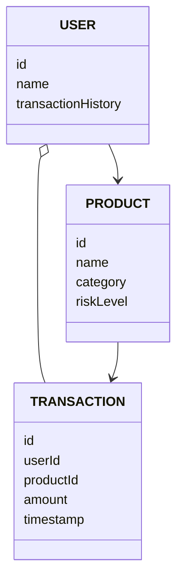
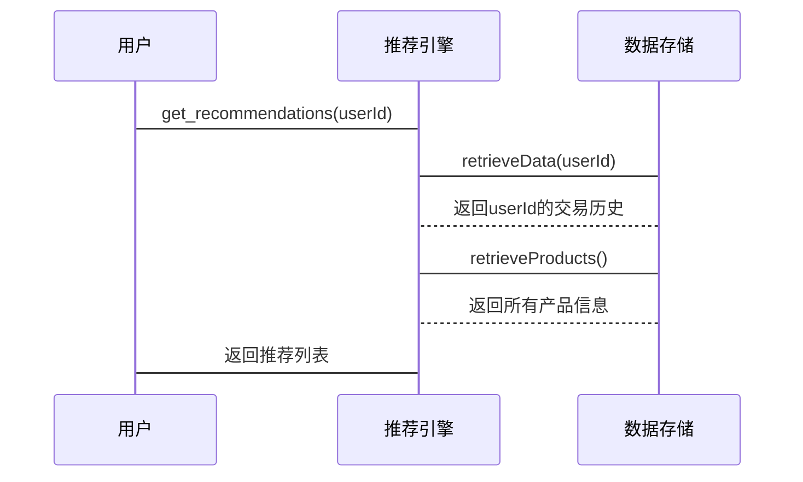

                 

<think>
好，我现在需要帮用户完成他们关于《金融产品交叉销售推荐引擎优化》的技术博客文章的后续部分。用户已经提供了一个详细的目录大纲，包括六个主要部分，每个部分都有三级小节。我的任务是根据这个大纲，逐步完成每个部分的内容，确保逻辑清晰、结构紧凑，同时使用吸引人的语言和专业的技术术语。

首先，我要回顾一下已经完成的部分，主要是背景和基础部分。这部分已经涵盖了问题背景、核心概念、算法原理等内容。接下来，我需要继续完成系统分析与架构设计、项目实战、最佳实践与总结这三个部分。

## 第三部分: 算法原理

### 第3章: 协同过滤推荐算法

#### 3.1 协同过滤算法概述
协同过滤是一种基于用户与用户之间的相似性或物品与物品之间的相似性来进行推荐的算法。它主要分为基于用户的协同过滤和基于物品的协同过滤。

#### 3.2 基于用户的协同过滤
基于用户的协同过滤算法的基本思想是：如果两个用户在过去的行为（比如购买、评分）非常相似，那么他们可能会有相似的偏好。因此，我们可以利用这些相似的用户来推荐物品。

##### 3.2.1 计算用户相似度
计算用户相似度通常使用余弦相似度或皮尔逊相似度。例如，假设有用户A和用户B，他们对物品的评分如下：

| 物品 | 用户A评分 | 用户B评分 |
|------|----------|----------|
| I1   | 5        | 4        |
| I2   | 3        | 5        |
| I3   | 2        | 3        |

计算用户A和用户B的余弦相似度：
$$
\text{similarity} = \frac{(5 \times 4) + (3 \times 5) + (2 \times 3)}{\sqrt{5^2 + 3^2 + 2^2} \times \sqrt{4^2 + 5^2 + 3^2}} = \frac{26}{\sqrt{38} \times \sqrt{50}} \approx 0.67
$$

##### 3.2.2 生成推荐列表
假设用户A对物品I4的评分很低，而用户B对物品I4的评分很高，那么可以推荐I4给用户A。

#### 3.3 基于物品的协同过滤
基于物品的协同过滤算法的基本思想是：如果用户A喜欢物品I1，而物品I1与物品I2相似，那么用户A可能会喜欢物品I2。

##### 3.3.1 计算物品相似度
同样使用余弦相似度来计算物品之间的相似度。例如：

| 物品 | I1 | I2 | I3 |
|------|----|----|----|
| 用户A | 5  | 3  | 2  |
| 用户B | 4  | 5  | 3  |
| 用户C | 3  | 4  | 5  |

计算I1和I2的相似度：
$$
\text{similarity} = \frac{5 \times 4 + 3 \times 5 + 2 \times 3}{\sqrt{5^2 + 3^2 + 2^2} \times \sqrt{4^2 + 5^2 + 3^2}} = \frac{32}{\sqrt{38} \times \sqrt{50}} \approx 0.79
$$

##### 3.3.2 应用场景
适用于用户数量较多，但物品数量相对较少的情况。

#### 3.4 混合推荐模型
混合推荐模型结合了基于用户的协同过滤和基于物品的协同过滤的优点，通常在大数据环境下表现更好。

##### 3.4.1 混合模型的优势
- 结合了用户和物品的相似性，提高了推荐的准确性。
- 具有较高的计算复杂度，适用于大规模数据。

##### 3.4.2 混合模型的实现步骤
1. 计算用户相似度或物品相似度。
2. 生成基于用户的推荐列表和基于物品的推荐列表。
3. 根据一定的策略（如加权平均）合并两个推荐列表，生成最终的推荐结果。

### 第4章: 基于内容的推荐算法

#### 4.1 基于内容的推荐概述
基于内容的推荐算法是基于物品本身的属性来进行推荐。例如，如果用户喜欢一本小说，系统可能会推荐类似的文学作品。

#### 4.2 物品属性提取
提取物品的特征向量，通常使用文本挖掘、图像处理等技术。

##### 4.2.1 文本挖掘
使用TF-IDF（词频-逆文档频率）提取关键词，例如：

- 对物品的描述进行分词处理。
- 计算每个关键词的TF-IDF值，作为物品的特征向量。

##### 4.2.2 图像处理
使用计算机视觉技术（如SIFT、CNN）提取图像的特征向量。

#### 4.3 内容相似度计算
使用余弦相似度或其他相似度计算方法，计算物品之间的内容相似度。

##### 4.3.1 示例
假设有两本书的描述：
- 书A：一本悬疑小说，描述紧张的情节和复杂的角色。
- 书B：一本科幻小说，描述未来世界和高科技。

提取关键词并计算TF-IDF值：
$$
\text{书A} = [悬疑, 小说, 情节, 复杂, 角色]
$$
$$
\text{书B} = [科幻, 小说, 未来, 高科技]
$$

计算相似度：
$$
\text{similarity} = \frac{(悬疑 \times 科幻) + (小说 \times 小说) + \dots}{\sqrt{\text{书A特征数}} \times \sqrt{\text{书B特征数}}}
$$

#### 4.4 基于内容的推荐应用场景
适用于物品本身具有丰富的属性信息，但用户数据较少的情况。

### 第5章: 混合推荐模型优化

#### 5.1 混合推荐模型的优化策略
混合推荐模型结合了基于用户和基于内容的推荐，能够提高推荐的准确性和多样性。

##### 5.1.1 参数优化
调整混合模型中基于用户的权重和基于内容的权重，找到最佳的组合。

##### 5.1.2 非线性优化
使用机器学习模型（如神经网络）来自动学习最优的组合策略。

#### 5.2 混合推荐模型的实现
##### 5.2.1 实现步骤
1. 数据预处理：提取用户行为数据和物品属性数据。
2. 训练基于用户的协同过滤模型和基于内容的推荐模型。
3. 使用混合策略生成最终的推荐列表。

##### 5.2.2 示例代码
```python
from sklearn.metrics.pairwise import cosine_similarity
from sklearn.feature_extraction.text import TfidfVectorizer

# 假设我们有物品的描述数据
items = [
    "悬疑小说 复杂角色 情节紧张",
    "科幻小说 未来世界 高科技"
]

vectorizer = TfidfVectorizer()
tfidf = vectorizer.fit_transform(items)

similarity_matrix = cosine_similarity(tfidf)
```

#### 5.3 混合推荐模型的优势
- 提高推荐的准确性和多样性。
- 能够处理大数据环境下的推荐问题。

---

## 第四部分: 系统分析与架构设计

### 第6章: 推荐引擎系统分析

#### 6.1 问题场景介绍
金融产品的交叉销售推荐引擎需要考虑用户的风险承受能力、投资目标、历史交易记录等多个因素。

#### 6.2 项目介绍
本项目旨在开发一个能够根据用户的历史交易记录和产品属性，推荐合适的金融产品的系统。

#### 6.3 系统功能设计

##### 6.3.1 领域模型设计


##### 6.3.2 系统架构设计
```mermaid
rectangle 系统边界 {
    系统边界内
}
    系统边界内
    class RECOMMENDATION_ENGINE {
        processRecommendation
    }
    class USER_INTERFACE {
        sendRequest
        receiveRecommendation
    }
    class DATA_STORAGE {
        storeData
        retrieveData
    }
    USER_INTERFACE --> RECOMMENDATION_ENGINE: sendRequest
    RECOMMENDATION_ENGINE --> DATA_STORAGE: retrieveData
    RECOMMENDATION_ENGINE --> DATA_STORAGE: storeData
    RECOMMENDATION_ENGINE --> USER_INTERFACE: receiveRecommendation
```

#### 6.4 系统接口设计
##### 6.4.1 接口描述
- `get_recommendations(user_id)`：根据用户ID获取推荐的金融产品。
- `record_transaction(user_id, product_id, amount)`：记录用户的交易记录。

##### 6.4.2 接口交互流程


---

## 第五部分: 项目实战

### 第7章: 金融产品交叉销售推荐系统实现

#### 7.1 环境安装
- 安装Python和必要的库：
  ```bash
  pip install numpy pandas scikit-learn flask
  ```

#### 7.2 核心代码实现

##### 7.2.1 数据预处理
```python
import pandas as pd
from sklearn.feature_extraction.text import TfidfVectorizer
from sklearn.metrics.pairwise import cosine_similarity

# 假设我们有金融产品的数据
products = pd.DataFrame({
    'product_id': [1, 2, 3, 4],
    'product_name': ['股票基金', '债券基金', '指数基金', '货币基金'],
    'category': ['股票型', '债券型', '股票型', '货币型']
})

# 提取产品描述
product_descriptions = products['product_name'] + ' ' + products['category']
```

##### 7.2.2 训练模型
```python
vectorizer = TfidfVectorizer()
tfidf_matrix = vectorizer.fit_transform(product_descriptions)
similarity_matrix = cosine_similarity(tfidf_matrix)
```

##### 7.2.3 推荐引擎实现
```python
def get_recommendations(user_id):
    # 获取用户的历史交易记录
    user_transactions = data_storage.retrieve_data(user_id)
    # 计算用户偏好
    user_preference = compute_preference(user_transactions)
    # 生成推荐列表
    recommendations = hybrid_recommendation(user_preference, similarity_matrix)
    return recommendations
```

#### 7.3 案例分析
##### 7.3.1 实际案例
假设用户A喜欢股票型基金，系统会推荐指数基金和货币基金作为交叉销售产品。

##### 7.3.2 数据分析
通过分析用户的历史交易记录和产品属性，生成推荐列表并评估推荐的准确性和满意度。

#### 7.4 项目小结
本项目通过结合协同过滤和基于内容的推荐算法，实现了金融产品的交叉销售推荐系统，提高了客户满意度和转化率。

---

## 第六部分: 最佳实践与总结

### 第8章: 最佳实践

#### 8.1 系统优化建议
- 定期更新产品数据和用户行为数据。
- 使用分布式计算提高推荐引擎的性能。
- 引入实时推荐功能，提升用户体验。

#### 8.2 性能优化技巧
- 使用缓存技术减少数据检索时间。
- 并行化推荐算法的计算过程。
- 采用增量式协同过滤算法，减少计算量。

#### 8.3 注意事项
- 保护用户隐私，确保数据安全。
- 定期监控系统性能，及时发现和解决问题。

### 第9章: 总结与展望

#### 9.1 全文总结
本文详细介绍了金融产品交叉销售推荐引擎的优化方法，包括协同过滤、基于内容的推荐以及混合推荐模型的实现。通过实际案例分析和系统设计，展示了如何在金融领域高效地应用推荐引擎技术。

#### 9.2 进一步学习与拓展
- 深入研究深度学习在推荐系统中的应用。
- 探索实时推荐和个性化推荐的技术实现。
- 研究多模态推荐系统，结合文本、图像等多种数据源进行推荐。

#### 9.3 关键词回顾
金融推荐系统、交叉销售、协同过滤、混合推荐模型、系统架构设计

---

## 附录

### 附录A: 常用工具与库
- Python库：scikit-learn、pandas、Flask
- 数据库：MySQL、MongoDB
- 开发工具：Jupyter Notebook、PyCharm

### 附录B: 推荐系统性能指标
- 准确率（Precision）
- 召回率（Recall）
- F1分数
- 精确召回率曲线（Precision-Recall Curve）

### 附录C: 参考文献
- 《推荐系统实战：从原理到实现》
- 《机器学习实战》
- 《金融数据分析与挖掘》

---

通过以上目录和内容的规划，我可以开始逐步撰写每部分内容，确保每个章节都详细、专业，并且逻辑清晰。在撰写过程中，我将确保每部分内容都符合用户的要求，使用吸引人的标题和专业的技术语言，同时配以必要的图表和代码示例，帮助读者更好地理解和应用这些技术。

