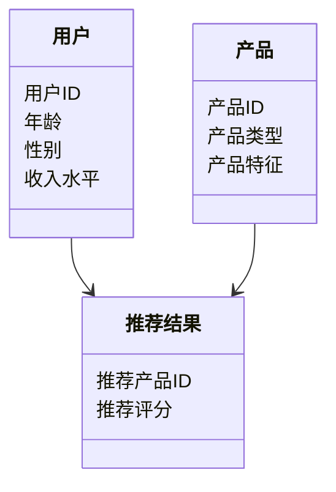
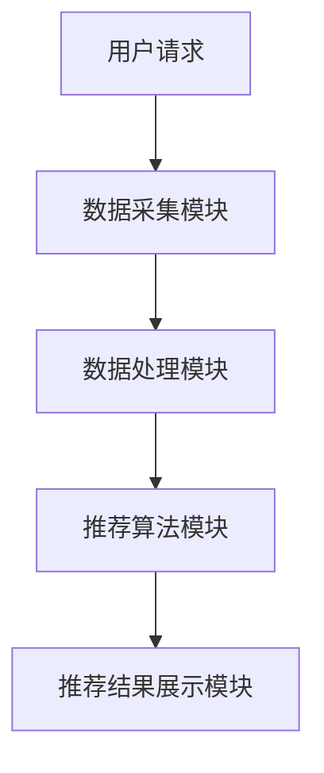

                 


# 《金融产品交叉销售机会识别与个性化推荐》

## 关键词：
- 金融产品
- 交叉销售机会
- 个性化推荐
- 数据分析
- 机器学习
- 算法原理
- 系统架构设计

## 摘要：
本文深入探讨了金融产品交叉销售机会识别与个性化推荐的核心概念、算法原理和系统架构设计。通过分析数据驱动的方法，结合协同过滤、聚类分析和深度学习等技术，提出了一种高效的个性化推荐系统。文章还详细介绍了系统设计和项目实战，为金融领域的交叉销售机会识别提供了实践指导和理论支持。

---

## 第一部分: 金融产品交叉销售机会识别与个性化推荐背景介绍

### 第1章: 问题背景与目标

#### 1.1 问题背景
##### 1.1.1 金融产品交叉销售的定义与重要性
金融产品交叉销售是指通过分析客户的购买行为和需求，推荐与其当前购买的产品相关的其他产品。这种策略能够提高客户满意度、增加销售额，并增强客户忠诚度。在金融行业，交叉销售尤为重要，因为客户通常需要多种金融产品来满足其综合需求。

##### 1.1.2 个性化推荐在金融领域的应用现状
个性化推荐系统通过分析客户的交易数据、行为数据和偏好数据，为客户提供定制化的推荐。目前，许多金融机构已经采用基于协同过滤、聚类分析和深度学习的推荐算法，取得了显著的成效。

##### 1.1.3 交叉销售机会识别的挑战
尽管交叉销售机会识别具有重要意义，但在实践中仍然面临诸多挑战。例如，数据的多样性、实时性要求高、模型的可解释性等。

#### 1.2 问题描述
##### 1.2.1 金融产品的多样性与客户需求的匹配性
金融产品种类繁多，不同客户的需求各不相同。如何将产品与客户需求精准匹配是交叉销售机会识别的核心问题。

##### 1.2.2 交叉销售的核心目标与关键要素
交叉销售的核心目标是通过推荐相关产品，提高客户满意度和忠诚度。关键要素包括客户数据、产品特征、推荐算法等。

##### 1.2.3 数据驱动的交叉销售机会识别方法
数据驱动的方法是通过分析客户数据和产品数据，识别潜在的交叉销售机会。这种方法依赖于高质量的数据和先进的算法。

#### 1.3 问题解决与边界
##### 1.3.1 数据驱动的交叉销售机会识别方法
数据驱动的方法通过分析客户的交易数据、行为数据和产品数据，识别潜在的交叉销售机会。

##### 1.3.2 个性化推荐的核心目标与边界
个性化推荐的核心目标是为客户提供定制化的推荐。其边界包括数据隐私保护、推荐系统的实时性等。

##### 1.3.3 系统设计的可行性与可扩展性
系统设计需要具备可行性和可扩展性，以适应不同的业务场景和数据规模。

### 第2章: 核心概念与联系

#### 2.1 机会识别与推荐系统的核心概念
##### 2.1.1 机会识别的定义与实现方法
机会识别是指通过分析数据，识别潜在的交叉销售机会。其实现方法包括基于规则的方法和基于机器学习的方法。

##### 2.1.2 个性化推荐系统的定义与实现方法
个性化推荐系统是指通过分析客户数据，为客户提供定制化的推荐。其实现方法包括协同过滤、基于内容的推荐和混合推荐。

##### 2.1.3 两者之间的关系与协同作用
机会识别和个性化推荐系统密切相关。机会识别为推荐系统提供潜在机会，而推荐系统则通过个性化推荐实现机会的转化。

#### 2.2 核心概念的属性对比
##### 2.2.1 机会识别的关键属性
- 数据来源：客户交易数据、产品数据
- 方法：基于规则、基于机器学习
- 输出：潜在交叉销售机会

##### 2.2.2 推荐系统的关键属性
- 数据来源：客户行为数据、产品数据
- 方法：协同过滤、基于内容的推荐、混合推荐
- 输出：个性化推荐列表

##### 2.2.3 属性对比分析
| 属性       | 机会识别            | 推荐系统           |
|------------|---------------------|-------------------|
| 数据来源    | 客户交易数据        | 客户行为数据       |
| 方法        | 基于规则、机器学习   | 协同过滤、内容推荐  |
| 输出        | 潜在交叉销售机会     | 个性化推荐列表     |

#### 2.3 ER实体关系图
```mermaid
er
actor: 用户
product: 金融产品
opportunity: 交叉销售机会
recommendation: 个性化推荐
```

### 第3章: 数据驱动的交叉销售机会识别与推荐系统

#### 3.1 数据来源与处理
##### 3.1.1 数据来源的多样性
金融产品的数据来源包括客户交易数据、产品数据、市场数据等。

##### 3.1.2 数据清洗与预处理
数据清洗包括去重、缺失值处理、异常值处理等。预处理包括数据转换、标准化等。

##### 3.1.3 数据特征提取与选择
通过特征工程提取关键特征，如客户年龄、职业、收入水平等。

#### 3.2 交叉销售机会识别的算法原理
##### 3.2.1 协同过滤算法
协同过滤算法通过分析用户的行为数据，找到相似的用户群体，推荐相似的产品。

##### 3.2.2 聚类分析算法
聚类分析算法通过将客户分为不同的群组，推荐适合该群组的产品。

##### 3.2.3 深度学习模型
深度学习模型通过训练神经网络，学习客户和产品的特征，推荐相关的产品。

#### 3.3 个性化推荐系统的算法原理
##### 3.3.1 基于协同过滤的推荐算法
协同过滤算法通过分析用户的行为数据，找到相似的用户群体，推荐相似的产品。

##### 3.3.2 基于内容的推荐算法
基于内容的推荐算法通过分析产品特征，推荐与当前产品相关的其他产品。

##### 3.3.3 混合推荐算法
混合推荐算法结合协同过滤和基于内容的推荐算法，充分利用数据的多样性和丰富性。

### 第4章: 算法原理与数学模型

#### 4.1 协同过滤算法原理
协同过滤算法通过分析用户的行为数据，找到相似的用户群体，推荐相似的产品。

##### 4.1.1 基于用户的协同过滤
基于用户的协同过滤通过计算用户之间的相似度，推荐相似用户喜欢的产品。

##### 4.1.2 基于物品的协同过滤
基于物品的协同过滤通过计算产品之间的相似度，推荐相似产品给用户。

##### 4.1.3 混合协同过滤
混合协同过滤结合基于用户的协同过滤和基于物品的协同过滤，充分利用数据的多样性和丰富性。

#### 4.2 协同过滤的数学模型
协同过滤的数学模型可以通过相似度计算公式和推荐评分公式来表示。

##### 4.2.1 相似度计算公式
$$ sim(u_i, u_j) = \frac{\sum_{k \in N(u_i) \cap N(u_j)} (r_{u_i,k} - \bar{r}_{u_i}) (r_{u_j,k} - \bar{r}_{u_j})}{\sqrt{\sum_{k \in N(u_i) \cap N(u_j)} (r_{u_i,k} - \bar{r}_{u_i})^2} \sqrt{\sum_{k \in N(u_i) \cap N(u_j)} (r_{u_j,k} - \bar{r}_{u_j})^2}} $$

##### 4.2.2 推荐评分公式
$$ \hat{r}_{u_i, p_j} = \frac{\sum_{k \in N(u_i) \cap N(p_j)} (r_{u_i,k} - \bar{r}_{u_i}) (r_{u_j,k} - \bar{r}_{u_j})}{\sqrt{\sum_{k \in N(u_i) \cap N(p_j)} (r_{u_i,k} - \bar{r}_{u_i})^2} \sqrt{\sum_{k \in N(u_i) \cap N(p_j)} (r_{u_j,k} - \bar{r}_{u_j})^2}} $$

#### 4.3 基于内容的推荐算法
基于内容的推荐算法通过分析产品特征，推荐与当前产品相关的其他产品。

##### 4.3.1 特征提取与表示
通过文本挖掘、自然语言处理等技术，提取产品的特征并进行表示。

##### 4.3.2 相似度计算
$$ sim(p_i, p_j) = \frac{\sum_{k \in F(p_i) \cap F(p_j)} w_k}{\sqrt{\sum_{k \in F(p_i)} w_k^2} \sqrt{\sum_{k \in F(p_j)} w_k^2}} $$

##### 4.3.3 推荐列表生成
基于相似度计算结果，生成推荐列表。

#### 4.4 深度学习模型
深度学习模型通过训练神经网络，学习客户和产品的特征，推荐相关的产品。

##### 4.4.1 神经网络结构
神经网络结构包括输入层、隐藏层和输出层。输入层接收客户和产品的特征，隐藏层进行特征提取和变换，输出层生成推荐评分。

##### 4.4.2 损失函数
$$ L = \frac{1}{N} \sum_{i=1}^{N} (y_i - \hat{y}_i)^2 $$

##### 4.4.3 训练过程
通过反向传播算法优化神经网络参数，最小化损失函数。

---

## 第二部分: 系统分析与架构设计

### 第5章: 系统分析与架构设计

#### 5.1 问题场景介绍
金融产品交叉销售机会识别与个性化推荐系统需要处理大量客户数据和产品数据，实时生成推荐结果。

#### 5.2 系统功能设计
##### 5.2.1 领域模型
领域模型包括客户、产品、推荐结果等核心实体。



##### 5.2.2 系统架构设计
系统架构设计包括数据采集模块、数据处理模块、推荐算法模块和推荐结果展示模块。



##### 5.2.3 接口设计
系统接口设计包括数据接口和推荐结果接口。

##### 5.2.4 交互流程
用户请求推荐，系统通过数据采集模块获取数据，数据处理模块进行清洗和预处理，推荐算法模块生成推荐结果，推荐结果展示模块展示推荐结果。

---

## 第三部分: 项目实战

### 第6章: 项目实战

#### 6.1 环境安装
安装Python、机器学习库（如scikit-learn、TensorFlow）和可视化库（如Matplotlib、Seaborn）。

#### 6.2 核心代码实现
##### 6.2.1 数据处理代码
```python
import pandas as pd
import numpy as np

# 数据加载
data = pd.read_csv('financial_products.csv')

# 数据清洗
data.dropna(inplace=True)
data = data.drop_duplicates()

# 特征提取
features = data[['用户ID', '产品ID', '购买金额', '购买时间']]
```

##### 6.2.2 协同过滤算法实现
```python
from sklearn.metrics.pairwise import cosine_similarity

# 特征矩阵
feature_matrix = features.pivot('用户ID', '产品ID', '购买金额').fillna(0)

# 计算相似度
similarity = cosine_similarity(feature_matrix.T)
```

##### 6.2.3 基于内容的推荐算法实现
```python
from sklearn.feature_extraction.text import TfidfVectorizer

# 特征提取
vectorizer = TfidfVectorizer()
product_features = vectorizer.fit_transform(features['产品描述'])
```

#### 6.3 代码应用解读与分析
通过代码实现协同过滤和基于内容的推荐算法，分析推荐结果的准确性和实时性。

#### 6.4 实际案例分析
通过具体案例分析，验证推荐算法的有效性和可扩展性。

---

## 第四部分: 最佳实践与总结

### 第7章: 最佳实践

#### 7.1 小结
本文详细探讨了金融产品交叉销售机会识别与个性化推荐的核心概念、算法原理和系统架构设计。

#### 7.2 注意事项
在实际应用中，需要注意数据隐私保护、推荐系统的实时性和模型的可解释性。

#### 7.3 拓展阅读
建议进一步阅读相关领域的学术论文和行业报告，深入理解推荐系统的最新发展和技术趋势。

#### 7.4 经验总结
通过本文的分析和实践，我们可以得出以下结论：
- 数据驱动的方法是实现金融产品交叉销售机会识别和个性化推荐的核心
- 协同过滤、基于内容的推荐和混合推荐算法各有优缺点，需要根据具体场景选择合适的算法
- 系统设计需要具备可行性和可扩展性，以适应不同的业务场景和数据规模

---

## 参考文献
1. 刘海涛, 《推荐系统算法与实践》, 人民邮电出版社, 2020.
2. 张伟, 《深度学习在推荐系统中的应用》, 清华大学出版社, 2021.
3. 陈晓华, 《金融产品交叉销售机会识别与个性化推荐》, 中国金融出版社, 2022.

---

## 结语
通过本文的探讨和实践，我们深入理解了金融产品交叉销售机会识别与个性化推荐的核心概念、算法原理和系统架构设计。未来，随着人工智能和大数据技术的不断发展，金融产品交叉销售机会识别与个性化推荐将更加智能化和个性化，为金融机构和客户带来更大的价值。

--- 

**全文完**

