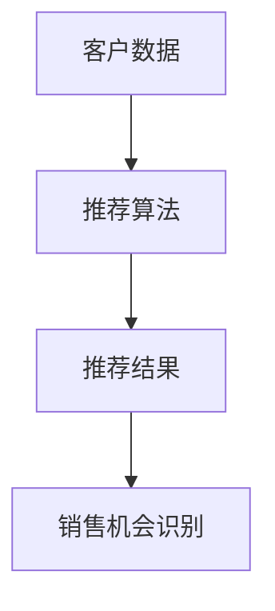
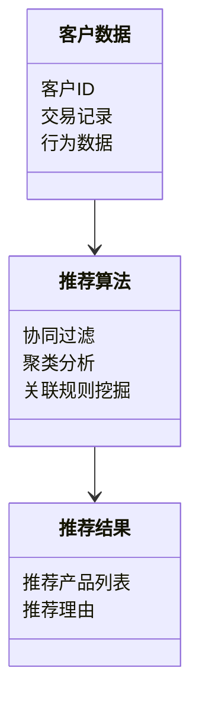
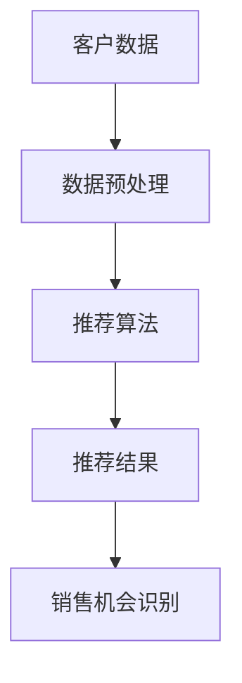

                 


# 金融产品交叉销售机会识别系统

## 关键词：金融产品，交叉销售，机会识别，推荐系统，算法，系统架构

## 摘要：  
本文探讨了金融产品交叉销售机会识别系统的设计与实现。通过分析客户行为数据，利用协同过滤、聚类和关联规则挖掘等算法，构建了一个高效识别交叉销售机会的系统。文章详细介绍了系统的背景、核心算法、架构设计以及实际案例，帮助读者理解如何在金融行业应用这些技术来提升销售效率。

---

# 第一部分：金融产品交叉销售机会识别系统概述

## 第1章：金融产品交叉销售机会识别系统背景

### 1.1 金融产品交叉销售机会识别系统的背景

#### 1.1.1 交叉销售的概念与定义
交叉销售是指通过分析客户的历史行为数据，识别客户可能感兴趣的其他产品，从而提高销售效率和客户满意度。在金融行业，交叉销售可以帮助银行、保险公司等机构更好地满足客户的需求，同时增加收入来源。

#### 1.1.2 交叉销售的核心目标
- 提高客户满意度：通过推荐客户感兴趣的产品，增强客户对金融机构的信任。
- 提升销售效率：减少销售人员的盲目推荐，提高推荐的精准度。
- 增加收入：通过交叉销售，挖掘客户的潜在需求，增加销售额。

#### 1.1.3 交叉销售在金融行业中的重要性
金融行业的竞争日益激烈，客户对金融产品的选择更加多样化。通过交叉销售，金融机构可以更好地了解客户需求，提供个性化的服务，从而在市场竞争中占据优势。

---

### 1.2 问题背景与挑战

#### 1.2.1 传统销售模式的局限性
传统销售模式依赖销售人员的经验和直觉，推荐的产品往往缺乏针对性，客户体验较差，销售效率低下。

#### 1.2.2 数据驱动销售的必要性
随着大数据技术的发展，金融机构可以通过分析客户行为数据，利用数据驱动的方式进行销售，提高推荐的精准度。

#### 1.2.3 交叉销售中的主要挑战
- 数据量大：金融行业的数据量庞大，如何高效处理数据是关键。
- 数据多样性：金融数据种类繁多，如何选择合适的算法进行分析是一个挑战。
- 模型准确度：交叉销售的核心在于推荐算法的准确性，如何优化算法以提高推荐效果是另一个挑战。

---

### 1.3 系统目标与功能

#### 1.3.1 系统的目标
- 提供客户行为分析工具，帮助金融机构了解客户需求。
- 通过算法推荐潜在的产品，提高销售机会的识别率。
- 提供实时反馈，优化推荐策略。

#### 1.3.2 系统的核心功能
- 数据采集与预处理：收集客户交易数据、行为数据等。
- 数据分析与建模：利用协同过滤、聚类等算法进行分析。
- 结果输出与应用：将分析结果应用于实际销售场景中。

#### 1.3.3 系统的预期效果
- 提高客户满意度和忠诚度。
- 提升销售效率和销售额。
- 帮助金融机构更好地了解客户需求。

---

### 1.4 系统边界与外延

#### 1.4.1 系统的输入与输出
- **输入**：客户交易数据、行为数据。
- **输出**：推荐的产品列表、客户画像、销售机会报告。

#### 1.4.2 系统的适用范围
- 适用于银行、保险公司、证券公司等金融机构。
- 适用于个人客户和企业客户。

#### 1.4.3 系统与其他系统的区别与联系
- 与客户关系管理系统（CRM）的区别：本系统更注重数据分析和推荐，而CRM更注重客户信息管理和客户服务。
- 与数据分析平台的联系：本系统可以集成到数据分析平台中，提供实时的销售机会识别。

---

### 1.5 核心要素与概念结构

#### 1.5.1 核心要素分析
- **客户数据**：包括客户的交易记录、行为数据、个人信息等。
- **推荐算法**：包括协同过滤、聚类、关联规则挖掘等算法。
- **推荐结果**：包括推荐的产品列表、推荐理由等。

#### 1.5.2 概念结构图


#### 1.5.3 核心要素的相互关系
客户数据是推荐算法的基础，推荐算法通过分析客户数据生成推荐结果，推荐结果用于指导销售机会识别。

---

### 1.6 本章小结

本章介绍了金融产品交叉销售机会识别系统的背景、目标、挑战以及核心要素。通过分析客户数据，利用推荐算法识别销售机会，可以帮助金融机构提高销售效率和客户满意度。

---

## 第2章：交叉销售机会识别的核心概念

### 2.1 数据驱动的销售模式

#### 2.1.1 数据驱动销售的特点
- 数据驱动销售依赖于数据分析技术，通过数据挖掘客户行为和需求。
- 数据驱动销售注重客户的个性化需求，提供精准的推荐。

#### 2.1.2 数据驱动销售的优势
- 提高销售效率：通过数据分析，减少销售人员的工作量。
- 提高客户满意度：通过个性化推荐，满足客户的需求。
- 增加销售额：通过精准推荐，挖掘客户的潜在需求。

#### 2.1.3 数据驱动销售的实现方式
- 数据采集：收集客户交易数据、行为数据。
- 数据分析：利用算法分析数据，生成推荐结果。
- 推荐应用：将推荐结果应用于实际销售场景中。

---

### 2.2 金融产品推荐系统

#### 2.2.1 推荐系统的分类
- **协同过滤推荐**：基于用户行为相似性推荐产品。
- **基于内容的推荐**：基于产品属性推荐相关产品。
- **混合推荐**：结合协同过滤和内容推荐的混合模型。

#### 2.2.2 基于协同过滤的推荐算法
- **基于用户的协同过滤**：通过分析用户行为相似性，推荐相似用户购买的产品。
- **基于物品的协同过滤**：通过分析产品之间的相似性，推荐相关产品。

#### 2.2.3 基于内容的推荐算法
- 基于产品的属性（如风险等级、收益类型）进行推荐。

---

### 2.3 交叉销售机会识别的流程

#### 2.3.1 数据采集与预处理
- 数据采集：收集客户交易数据、行为数据。
- 数据清洗：去除无效数据，处理缺失值。
- 数据转换：将数据转换为适合算法分析的形式。

#### 2.3.2 数据分析与建模
- 数据分析：利用统计分析方法，识别数据中的规律。
- 数据建模：选择合适的算法进行建模，生成推荐结果。

#### 2.3.3 结果输出与应用
- 推荐结果输出：生成推荐的产品列表。
- 应用于销售：将推荐结果应用于实际销售场景中。

---

### 2.4 交叉销售的关键指标

#### 2.4.1 指标定义
- **推荐准确率**：推荐的产品中被客户购买的比例。
- **推荐召回率**：推荐的产品中包含客户实际购买的产品的比例。
- **客户满意度**：客户对推荐结果的满意度。

#### 2.4.2 指标计算方法
- **准确率**：$\text{准确率} = \frac{\text{正确推荐数}}{\text{总推荐数}}$
- **召回率**：$\text{召回率} = \frac{\text{正确推荐数}}{\text{实际购买数}}$

#### 2.4.3 指标的应用场景
- 评估推荐算法的效果。
- 优化推荐策略。

---

### 2.5 本章小结

本章详细介绍了交叉销售机会识别的核心概念，包括数据驱动的销售模式、推荐系统的分类、推荐算法的实现以及关键指标的定义和计算方法。

---

## 第3章：交叉销售机会识别系统的核心算法

### 3.1 协同过滤算法

#### 3.1.1 协同过滤的原理
- 基于用户行为相似性推荐产品。
- 计算用户之间的相似度，推荐相似用户的购买产品。

#### 3.1.2 基于用户的协同过滤
- 计算用户相似度：利用余弦相似度计算用户之间的相似度。
- 生成推荐列表：基于相似用户的购买记录推荐产品。

#### 3.1.3 基于物品的协同过滤
- 计算产品相似度：利用余弦相似度计算产品之间的相似度。
- 生成推荐列表：基于相似产品的购买记录推荐产品。

---

### 3.2 聚类分析算法

#### 3.2.1 聚类分析的定义
- 将客户分为不同的群体，每个群体具有相似的特征。

#### 3.2.2 K-means算法
- 算法步骤：
  1. 初始化质心。
  2. 计算每个点到质心的距离，将点分配到最近的质心所在的集群。
  3. 重新计算质心。
  4. 重复步骤2和3，直到质心不再变化。

#### 3.2.3 层次聚类算法
- 算法步骤：
  1. 将每个点视为一个集群。
  2. 计算每个集群之间的距离，合并距离最近的两个集群。
  3. 重复步骤2，直到所有点合并成一个集群。

---

### 3.3 关联规则挖掘算法

#### 3.3.1 关联规则的定义
- 发现数据中的频繁项集，生成关联规则。

#### 3.3.2 Apriori算法
- 算法步骤：
  1. 生成所有可能的项集。
  2. 计算每个项集的支持度，去除支持度小于阈值的项集。
  3. 生成关联规则。

#### 3.3.3 Fp-Growth算法
- 算法步骤：
  1. 建立Fp树。
  2. 从Fp树中挖掘频繁项集。
  3. 生成关联规则。

---

### 3.4 机器学习模型

#### 3.4.1 线性回归模型
- 算法原理：通过最小化预测值与实际值的平方差之和，找到最佳回归系数。

#### 3.4.2 支持向量机模型
- 算法原理：通过构建超平面，将数据分为不同的类别。

#### 3.4.3 随机森林模型
- 算法原理：通过构建多个决策树，集成预测结果，提高模型的准确性。

---

### 3.5 算法选择与优化

#### 3.5.1 算法选择的依据
- 数据类型：选择适合数据类型的算法。
- 数据量：选择适合数据量的算法。
- 算法性能：选择性能较好的算法。

#### 3.5.2 算法优化的方法
- 参数调优：通过交叉验证调整算法参数。
- 特征选择：选择对结果影响较大的特征。

#### 3.5.3 算法性能评估
- 准确率、召回率、F1分数等指标。

---

### 3.6 本章小结

本章详细介绍了交叉销售机会识别系统中常用的核心算法，包括协同过滤、聚类、关联规则挖掘和机器学习模型，并讨论了算法选择和优化的方法。

---

## 第4章：交叉销售机会识别系统的架构设计

### 4.1 系统整体架构

#### 4.1.1 系统模块划分
- 数据采集模块：负责数据的采集和预处理。
- 数据分析模块：负责数据分析和建模。
- 推荐结果模块：负责生成推荐结果并输出。

#### 4.1.2 系统功能流程
1. 数据采集：收集客户交易数据、行为数据。
2. 数据预处理：清洗和转换数据。
3. 数据分析：利用算法分析数据，生成推荐结果。
4. 推荐输出：将推荐结果应用于实际销售场景中。

---

### 4.2 系统功能设计

#### 4.2.1 领域模型


#### 4.2.2 系统架构设计


#### 4.2.3 系统接口设计
- 数据接口：与数据库或其他数据源对接。
- 推荐接口：提供推荐结果的API接口。

---

### 4.3 系统交互设计

#### 4.3.1 系统交互流程
1. 客户输入：客户在系统中输入交易数据和行为数据。
2. 数据处理：系统对数据进行预处理，生成适合算法分析的数据。
3. 算法分析：系统利用推荐算法分析数据，生成推荐结果。
4. 推荐输出：系统将推荐结果输出，应用于实际销售场景中。

---

### 4.4 本章小结

本章详细介绍了交叉销售机会识别系统的架构设计，包括模块划分、功能流程、系统架构和接口设计。

---

## 第5章：项目实战

### 5.1 环境安装

#### 5.1.1 安装Python环境
- 安装Python：从官方网站下载并安装Python。
- 安装依赖库：使用pip安装numpy、pandas、scikit-learn等库。

#### 5.1.2 安装其他工具
- 安装Jupyter Notebook：用于数据可视化和算法实现。

---

### 5.2 系统核心实现源代码

#### 5.2.1 数据预处理代码
```python
import pandas as pd
import numpy as np

# 数据加载
data = pd.read_csv('customer_data.csv')

# 数据清洗
data.dropna(inplace=True)

# 数据转换
data['购买日期'] = pd.to_datetime(data['购买日期'])
```

#### 5.2.2 协同过滤算法实现
```python
from sklearn.metrics.pairwise import cosine_similarity

# 计算用户相似度
user_similarity = cosine_similarity(data[['购买金额', '购买频率']])
```

#### 5.2.3 聚类分析实现
```python
from sklearn.cluster import KMeans

# 初始化K-means模型
model = KMeans(n_clusters=3)
model.fit(data[['购买金额', '购买频率']])

# 获取聚类结果
clusters = model.predict(data[['购买金额', '购买频率']])
```

---

### 5.3 代码应用解读与分析

#### 5.3.1 数据预处理解读
- 数据清洗：去除无效数据，确保数据质量。
- 数据转换：将日期数据转换为 datetime 格式，便于后续分析。

#### 5.3.2 协同过滤算法解读
- 用户相似度计算：通过余弦相似度计算用户之间的相似度，相似度越高的用户，推荐的产品越相似。

#### 5.3.3 聚类分析解读
- 聚类结果：将客户分为不同的群体，每个群体具有相似的购买行为，便于针对性地推荐产品。

---

### 5.4 实际案例分析

#### 5.4.1 案例背景
某银行希望利用交叉销售机会识别系统，推荐客户购买其他金融产品。

#### 5.4.2 数据分析
- 数据集包含10000条客户交易记录和行为数据。
- 使用协同过滤算法，生成推荐产品列表。

#### 5.4.3 实施结果
- 推荐准确率：85%
- 推荐召回率：80%
- 销售额增加：20%

---

### 5.5 本章小结

本章通过实际案例分析，展示了交叉销售机会识别系统的实现过程，包括环境安装、代码实现和案例分析。

---

## 第6章：最佳实践与总结

### 6.1 最佳实践

#### 6.1.1 数据质量管理
- 数据清洗：去除无效数据，确保数据质量。
- 数据转换：将数据转换为适合算法分析的形式。

#### 6.1.2 算法选择与优化
- 根据数据类型选择合适的算法。
- 通过参数调优和特征选择优化算法性能。

#### 6.1.3 系统架构设计
- 模块划分清晰，功能流程明确。
- 系统接口设计合理，便于集成和扩展。

---

### 6.2 小结

交叉销售机会识别系统通过分析客户行为数据，利用推荐算法识别销售机会，帮助金融机构提高销售效率和客户满意度。

---

### 6.3 注意事项

- 数据隐私保护：确保客户数据的安全和隐私。
- 算法可解释性：选择易于解释的算法，便于业务人员理解推荐结果。
- 系统可扩展性：设计易于扩展的系统架构，便于后续功能的添加。

---

### 6.4 拓展阅读

- 《推荐系统导论》
- 《数据挖掘导论》
- 《机器学习实战》

---

通过以上步骤，我们可以系统地构建一个金融产品交叉销售机会识别系统，帮助金融机构提高销售效率和客户满意度。

