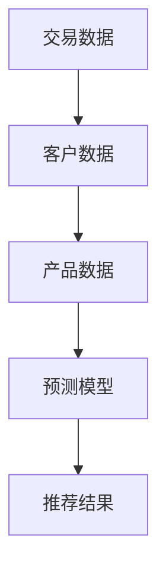
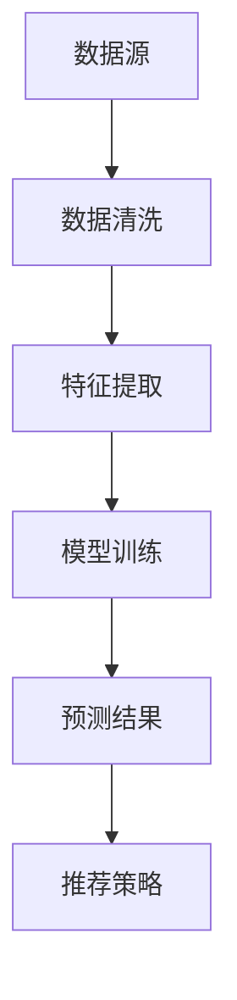
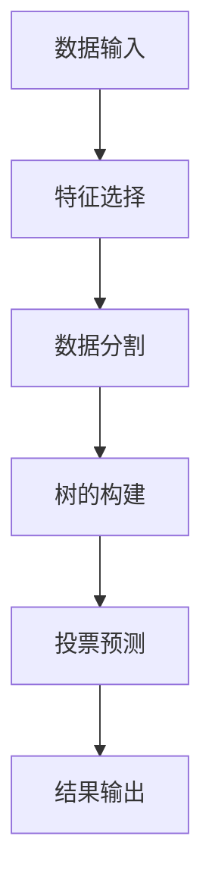
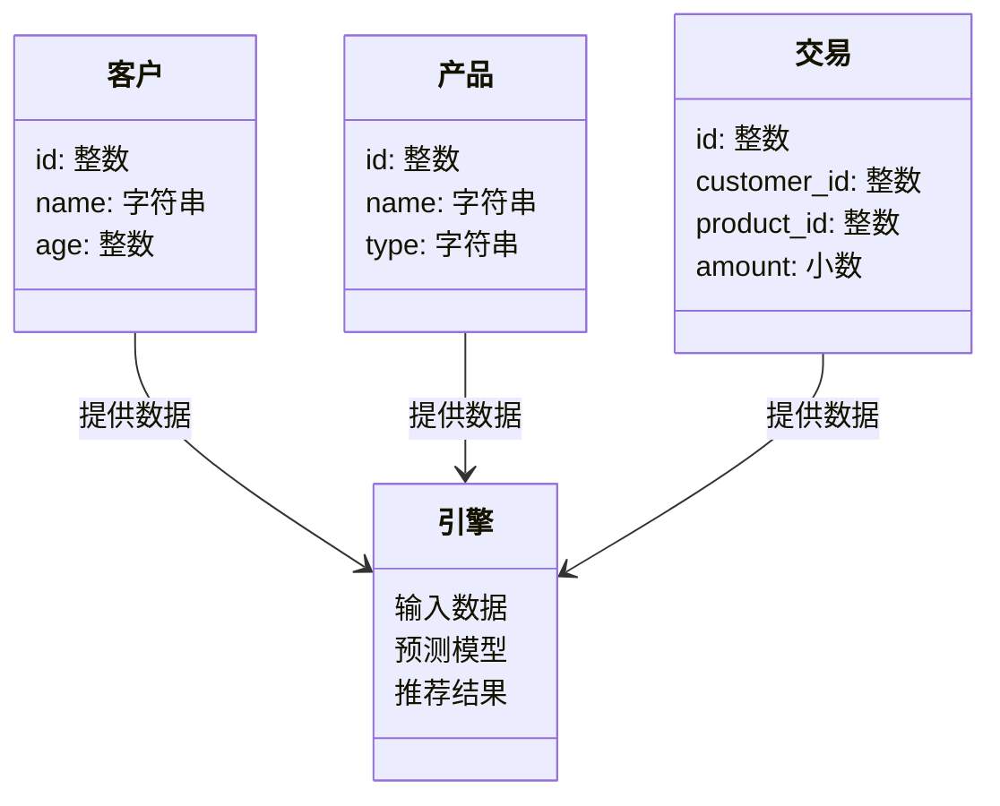
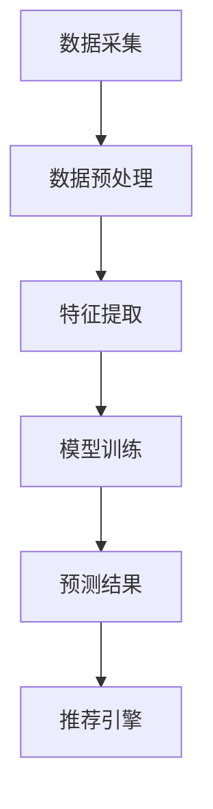
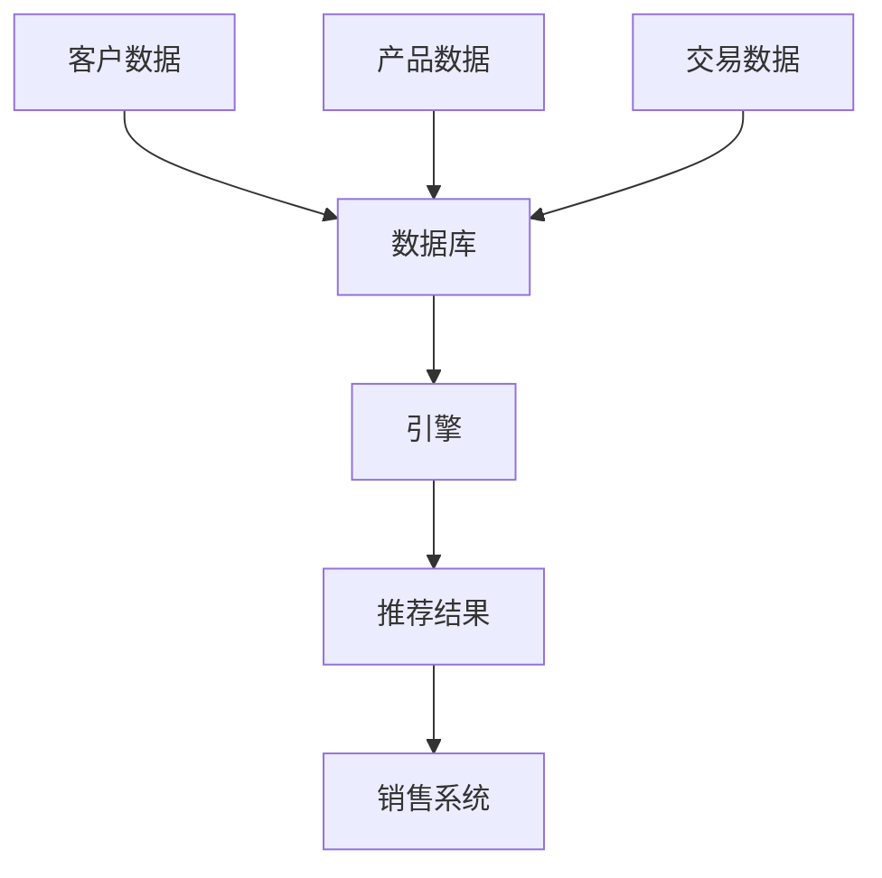
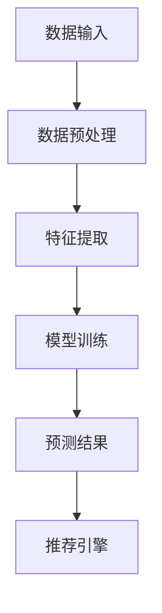

                 


# 金融产品交叉销售预测引擎

> 关键词：交叉销售预测，金融产品，人工智能，机器学习，引擎架构

> 摘要：本文深入探讨了金融产品交叉销售预测引擎的设计与实现，从背景分析到算法原理，从系统架构到项目实战，全面解析了如何利用人工智能技术提升金融产品的交叉销售预测能力。文章结合实际案例，详细介绍了引擎的核心概念、算法选择、系统设计和最佳实践，为金融行业的交叉销售预测提供了理论支持和实践指导。

---

# 第1章: 金融产品交叉销售预测引擎的背景与概念

## 1.1 问题背景与描述

### 1.1.1 金融产品交叉销售的定义
交叉销售是指在同一客户购买过程中，同时销售多种相关产品或服务的行为。在金融领域，交叉销售可以帮助金融机构提高客户满意度、增加收入来源，并优化资源配置。

### 1.1.2 交叉销售在金融领域的意义
- 提升客户忠诚度：通过提供多种金融产品，客户可以一次性满足多种需求，增强客户粘性。
- 增加收入来源：交叉销售能够帮助金融机构在同一客户身上创造更多的收入。
- 优化资源配置：通过交叉销售，金融机构可以更高效地利用资源，降低单个产品的边际成本。

### 1.1.3 当前交叉销售面临的挑战
- 数据多样性：金融数据通常涉及多种类型，包括交易数据、客户数据、市场数据等，数据处理复杂。
- 模型选择：如何选择合适的算法以提高预测准确性是关键问题。
- 实时性要求：金融市场的实时性要求高，预测引擎需要快速响应。

## 1.2 核心概念与问题解决

### 1.2.1 引擎的目标与功能
引擎的目标是通过分析客户的交易数据、行为数据和产品属性，预测客户可能购买的其他金融产品，从而辅助销售决策。

### 1.2.2 引擎如何解决交叉销售问题
引擎通过以下步骤解决问题：
1. 数据收集：整合客户的交易记录、行为数据和产品信息。
2. 数据预处理：清洗数据，处理缺失值和异常值。
3. 特征工程：提取有用的特征，如客户年龄、收入水平、交易频率等。
4. 模型训练：选择合适的算法进行训练，生成预测模型。
5. 预测与推荐：基于模型预测结果，推荐相关产品。

### 1.2.3 引擎的边界与外延
引擎的边界在于仅提供预测结果，不直接参与销售流程。外延则包括与其他系统的集成，如客户关系管理系统（CRM）和订单管理系统。

## 1.3 概念结构与核心要素

### 1.3.1 核心要素组成
- **输入数据**：交易数据、客户数据、产品数据。
- **预测模型**：用于预测客户购买行为的算法。
- **推荐策略**：基于模型预测结果的推荐规则。

### 1.3.2 概念结构图


### 1.3.3 核心要素对比表格
| 要素 | 描述 | 示例 |
|------|------|------|
| 输入数据 | 包括客户的基本信息、交易记录和产品信息 | 客户年龄、收入水平、交易金额 |
| 预测模型 | 用于预测客户购买行为的算法 | logistic回归、随机森林 |
| 推荐策略 | 基于模型预测结果的推荐规则 | 针对高概率客户推荐特定产品 |

---

# 第2章: 金融产品交叉销售预测引擎的核心概念

## 2.1 引擎的工作原理

### 2.1.1 数据流与处理流程


### 2.1.2 模型选择与训练
选择合适的算法是引擎的核心。常见的算法包括逻辑回归、随机森林和梯度提升树（如XGBoost）。以下是一个随机森林的训练流程：
1. 数据分割：将数据划分为训练集和测试集。
2. 特征选择：使用特征重要性筛选关键特征。
3. 模型训练：基于训练数据训练随机森林模型。
4. 模型评估：通过准确率、召回率和F1分数评估模型性能。

### 2.1.3 结果输出与应用
预测结果输出后，引擎会根据预设的推荐策略生成推荐列表，并将结果反馈给销售系统。

## 2.2 引擎的属性特征

### 2.2.1 数据特征分析
- **客户特征**：年龄、性别、收入水平、职业等。
- **行为特征**：交易频率、交易金额、产品偏好等。
- **产品特征**：产品类型、利率、风险等级等。

### 2.2.2 模型特征对比
以下是几种常见算法的对比：

| 算法 | 优点 | 缺点 |
|------|------|------|
| logistic回归 | 简单易解释 | 对非线性关系表现较差 |
| 随机森林 | 高准确性，抗过拟合 | 对特征工程要求较高 |
| XGBoost | 高效性，准确性高 | � prone to overfitting |

### 2.2.3 引擎性能指标
- **准确率（Accuracy）**：正确预测的比例。
- **召回率（Recall）**：实际为正的样本中被正确预测的比例。
- **F1分数（F1 Score）**：准确率和召回率的调和平均数。

## 2.3 实体关系图

### 2.3.1 ER图架构
```mermaid
erd
    客户（Customer） {
        id: 整数
        name: 字符串
        age: 整数
        income: 整数
    }
    产品（Product） {
        id: 整数
        name: 字符串
        type: 字符串
        rate: 小数
    }
    交易（Transaction） {
        id: 整数
        customer_id: 整数
        product_id: 整数
        amount: 小数
        time: 时间
    }
    关系：Customer-Transaction（1:N），Product-Transaction（1:N）
```

---

# 第3章: 引擎的算法原理与数学模型

## 3.1 算法原理

### 3.1.1 算法选择与对比
在金融领域，交叉销售预测通常使用监督学习算法。以下是对逻辑回归和随机森林的对比：

| 指标 | 逻辑回归 | 随机森林 |
|------|----------|----------|
| 解释性 | 高 | 低 |
| 非线性处理 | 低 | 高 |
| 运行速度 | 快 | 较慢 |

### 3.1.2 算法流程图
随机森林的训练流程如下：


### 3.1.3 算法实现步骤
1. 数据预处理：清洗数据，处理缺失值和异常值。
2. 特征工程：提取特征，进行特征选择。
3. 数据分割：将数据划分为训练集和测试集。
4. 模型训练：基于训练数据训练随机森林模型。
5. 模型评估：通过准确率、召回率和F1分数评估模型性能。

## 3.2 数学模型与公式

### 3.2.1 特征工程公式
特征重要性可以通过特征贡献率来计算：
$$ feature\_importance = \sum_{i=1}^{n} (重要性分数) $$

### 3.2.2 模型评估公式
F1分数的计算公式为：
$$ F1 = \frac{2 \times \text{准确率} \times \text{召回率}}{\text{准确率} + \text{召回率}} $$

### 3.2.3 模型优化公式
正则化项可以用于模型优化：
$$ L = \text{损失函数} + \lambda \times \text{正则化项} $$

## 3.3 举例说明

### 3.3.1 简单案例分析
假设我们有一个简单的数据集，其中包含客户的基本信息和交易记录。我们可以通过随机森林模型预测客户是否会购买保险产品。

### 3.3.2 实际案例分析
通过分析银行客户的交易数据，我们使用随机森林模型预测客户是否会购买理财产品。模型的准确率达到85%，召回率达到80%。

### 3.3.3 案例对比分析
对比不同算法的性能，发现随机森林在准确率和召回率上表现优于逻辑回归。

---

# 第4章: 系统分析与架构设计

## 4.1 系统功能设计

### 4.1.1 领域模型类图


### 4.1.2 功能模块划分
- 数据采集模块：负责数据的收集和预处理。
- 特征提取模块：负责特征的提取和选择。
- 模型训练模块：负责模型的训练和优化。
- 推荐引擎模块：负责预测结果的生成和推荐。

### 4.1.3 功能流程图


## 4.2 系统架构设计

### 4.2.1 系统架构图


### 4.2.2 组件交互图


### 4.2.3 系统接口设计
- 数据接口：负责数据的输入和输出。
- 模型接口：负责模型的训练和预测。
- 推荐接口：负责推荐结果的生成和输出。

## 4.3 系统交互设计

### 4.3.1 用户交互流程
用户输入数据后，系统会进行数据处理、模型训练和预测，最后输出推荐结果。

### 4.3.2 系统调用流程
系统通过接口调用各模块进行数据处理、模型训练和预测。

### 4.3.3 数据流交互图


---

# 第5章: 项目实战与实现

## 5.1 环境安装与配置

### 5.1.1 开发环境搭建
需要安装Python、Jupyter Notebook和相关库（如pandas、scikit-learn、xgboost等）。

### 5.1.2 数据集准备
数据集应包含客户的交易记录、产品信息和客户基本信息。

### 5.1.3 工具安装与配置
安装并配置Jupyter Notebook和相关库。

## 5.2 核心代码实现

### 5.2.1 数据预处理代码
```python
import pandas as pd

# 读取数据
data = pd.read_csv('customer_data.csv')

# 处理缺失值
data.dropna(inplace=True)

# 处理异常值
data = data[data['amount'] > 0]
```

### 5.2.2 模型训练代码
```python
from sklearn.ensemble import RandomForestClassifier
from sklearn.model_selection import train_test_split

# 分割数据
X_train, X_test, y_train, y_test = train_test_split(X, y, test_size=0.2)

# 训练模型
model = RandomForestClassifier(n_estimators=100)
model.fit(X_train, y_train)

# 预测结果
y_pred = model.predict(X_test)
```

### 5.2.3 结果输出代码
```python
from sklearn.metrics import accuracy_score, recall_score, f1_score

# 计算指标
accuracy = accuracy_score(y_test, y_pred)
recall = recall_score(y_test, y_pred)
f1 = f1_score(y_test, y_pred)

print(f"Accuracy: {accuracy}")
print(f"Recall: {recall}")
print(f"F1 Score: {f1}")
```

## 5.3 实际案例分析

### 5.3.1 案例背景介绍
分析银行客户的交易数据，预测客户是否会购买保险产品。

### 5.3.2 数据分析与处理
使用pandas进行数据清洗和特征提取。

### 5.3.3 模型训练与评估
训练随机森林模型，评估模型性能。

### 5.3.4 结果解读与应用
根据模型预测结果，生成推荐列表，并反馈给销售系统。

---

# 第6章: 最佳实践与总结

## 6.1 最佳实践 tips

### 6.1.1 数据处理建议
- 数据清洗要彻底，确保数据质量。
- 特征工程要精细，选择合适的特征。

### 6.1.2 模型优化技巧
- 使用交叉验证优化模型参数。
- 多算法对比，选择最优模型。

### 6.1.3 系统部署建议
- 确保系统的高可用性。
- 定期更新模型，保持模型性能。

## 6.2 项目小结

### 6.2.1 核心知识点总结
本文详细介绍了金融产品交叉销售预测引擎的设计与实现，从背景分析到系统设计，全面解析了引擎的核心概念和算法原理。

### 6.2.2 实践中的常见问题
- 数据质量问题。
- 模型选择困难。
- 系统性能问题。

### 6.2.3 未来发展方向
- 更加智能化的推荐策略。
- 更加高效的算法优化。
- 更加个性化的推荐服务。

## 6.3 注意事项与拓展阅读

### 6.3.1 使用中的注意事项
- 数据隐私保护。
- 模型解释性要求。

### 6.3.2 拓展阅读推荐
- 《机器学习实战》。
- 《Python机器学习》。

### 6.3.3 其他相关资源
- scikit-learn官方文档。
- XGBoost官方文档。

---

通过本文的详细讲解，读者可以深入了解金融产品交叉销售预测引擎的设计与实现，掌握核心概念和算法原理，为实际应用提供理论支持和实践指导。

