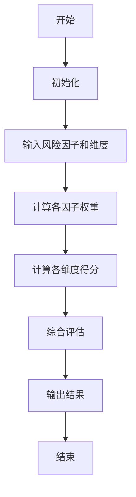
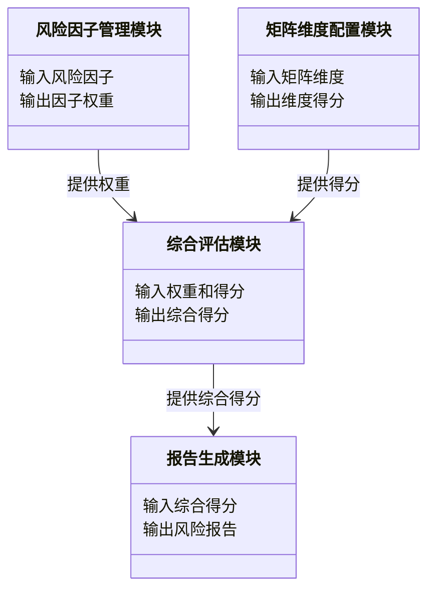
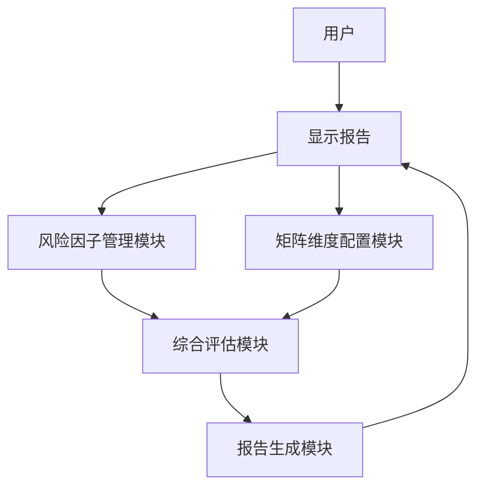
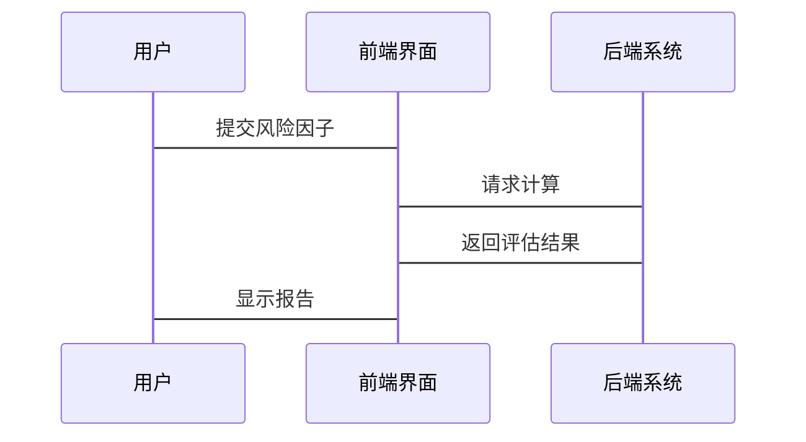

                 


```markdown
# 《金融产品创新风险评估矩阵设计》

---

## 关键词：金融产品创新、风险评估、矩阵设计、风险因子、权重分配、数学模型、系统架构

---

## 摘要：  
本文详细探讨了金融产品创新过程中风险评估矩阵的设计方法。通过分析金融产品创新的风险特征与分类，提出了基于多维度评估的矩阵设计思路，并结合实际案例，详细讲解了矩阵设计的算法原理、系统架构及项目实战。文章内容涵盖了背景介绍、核心概念、算法原理、系统分析与架构设计、项目实战、最佳实践等多个方面，为金融产品创新的风险管理提供了理论与实践相结合的解决方案。

---

# 第一部分: 金融产品创新风险评估矩阵设计背景

## 第1章: 金融产品创新风险评估矩阵概述

### 1.1 问题背景与定义
#### 1.1.1 金融产品创新的背景与现状
- 金融产品创新是金融机构提升竞争力的重要手段。
- 创新过程中面临市场、操作、法律等多重风险。
- 风险评估是创新成功的关键环节。

#### 1.1.2 风险评估在金融产品创新中的重要性
- 风险评估能够降低创新失败的概率。
- 通过矩阵设计实现风险的系统化管理。
- 为决策者提供科学依据。

#### 1.1.3 矩阵设计的目标与意义
- 建立多维度的风险评估体系。
- 提供量化风险的方法。
- 实现风险的可视化管理。

### 1.2 金融产品创新风险的特征与分类
#### 1.2.1 风险的多维度特征分析
- 市场风险、信用风险、流动性风险等。
- 风险的动态性和复杂性。

#### 1.2.2 风险的分类与影响
- 按性质分类：系统性风险、非系统性风险。
- 按影响范围分类：局部风险、全局风险。

#### 1.2.3 矩阵设计的核心要素
- 风险因子：市场、政策、技术等。
- 矩阵维度：风险程度、影响范围、发生概率。

### 1.3 矩阵设计的必要性与创新点
#### 1.3.1 传统风险评估方法的局限性
- 主观性强，缺乏系统性。
- 难以量化多维度风险。

#### 1.3.2 矩阵设计的创新性与优势
- 多维度量化评估。
- 可视化管理风险。
- 便于动态调整。

#### 1.3.3 应用场景与实际价值
- 产品开发阶段的风险控制。
- 市场推广前的风险评估。
- 投资决策中的风险分析。

### 1.4 本章小结
- 介绍了矩阵设计的背景与意义。
- 分析了金融产品创新风险的特征与分类。
- 强调了矩阵设计的必要性与创新点。

---

## 第2章: 风险评估矩阵的核心概念与联系

### 2.1 核心概念原理
#### 2.1.1 风险因子的提取与权重分配
- 风险因子的提取方法：基于文献分析、专家访谈等。
- 权重分配的原则：风险影响程度、发生概率。

#### 2.1.2 矩阵维度的设计原则
- 矩阵维度的选择：风险类别、风险影响、风险可控性。
- 维度的量化方法：标准化、分层评估。

#### 2.1.3 多维度评估的逻辑关系
- 维度之间的关联性分析。
- 综合评估的逻辑框架。

### 2.2 核心概念属性对比表
#### 2.2.1 风险因子的属性特征
| 风险因子 | 影响程度 | 发生概率 | 可控性 |
|----------|----------|----------|--------|
| 市场风险 | 高       | 中       | 中     |
| 信用风险 | 中       | 高       | 高     |

#### 2.2.2 矩阵维度的属性特征
| 矩阵维度 | 描述               | 量化方式       |
|----------|--------------------|----------------|
| 风险程度 | 风险的严重性       | 1-5分评估       |
| 影响范围 | 影响的业务范围     | 局部/全局分类   |
| 发生概率 | 风险发生的可能性   | 低/中/高分类   |

#### 2.2.3 属性对比表的构建方法
- 确定风险因子和矩阵维度。
- 收集数据，进行属性对比。
- 构建对比表，分析结果。

### 2.3 实体关系图（ER图）架构
```mermaid
erDiagram
    actor 用户角色 {
        <属性> 风险因子
        <属性> 矩阵维度
    }
    actor 风险评估系统 {
        <关联> 风险因子
        <关联> 矩阵维度
    }
    用户角色 --> 风险评估系统 : 提交风险因子
    风险评估系统 --> 用户角色 : 返回评估结果
```

### 2.4 本章小结
- 解释了风险评估矩阵的核心概念。
- 通过属性对比表和ER图展示了各要素之间的关系。

---

## 第3章: 风险评估矩阵的算法原理

### 3.1 算法原理概述
#### 3.1.1 矩阵设计的基本算法思路
- 确定风险因子和矩阵维度。
- 计算各因子的权重。
- 综合评估各维度的风险得分。

#### 3.1.2 算法的输入与输出
- 输入：风险因子、矩阵维度、权重分配。
- 输出：综合风险评估结果。

#### 3.1.3 算法的优化与改进
- 动态调整权重。
- 引入反馈机制。

### 3.2 算法流程图


### 3.3 数学模型与公式
#### 3.3.1 风险因子权重计算公式
$$ w_i = \frac{f_i}{\sum_{j=1}^{n} f_j} $$
其中，$f_i$ 表示第 $i$ 个风险因子的影响程度，$w_i$ 表示权重。

#### 3.3.2 矩阵评估的综合得分公式
$$ S = \sum_{i=1}^{m} w_i \cdot r_i $$
其中，$S$ 表示综合得分，$w_i$ 表示第 $i$ 个因子的权重，$r_i$ 表示第 $i$ 个因子的风险得分。

#### 3.3.3 示例计算与解
- 示例：假设风险因子为市场风险（权重0.4）和信用风险（权重0.6）。
- 市场风险得分80，信用风险得分70。
- 综合得分 $S = 0.4 \times 80 + 0.6 \times 70 = 32 + 42 = 74$。

### 3.4 本章小结
- 介绍了矩阵设计的算法原理。
- 通过流程图和公式展示了评估过程。

---

## 第4章: 系统分析与架构设计

### 4.1 问题场景介绍
- 金融产品创新的全生命周期管理。
- 多部门协作的需求。
- 实时风险监控的要求。

### 4.2 项目介绍
#### 4.2.1 项目目标
- 实现风险评估矩阵的系统化设计。
- 提供实时风险监控功能。

#### 4.2.2 系统功能设计
- 风险因子管理模块。
- 矩阵维度配置模块。
- 综合评估模块。
- 报告生成模块。

#### 4.2.3 领域模型设计


#### 4.2.4 系统架构设计


### 4.3 系统接口设计
#### 4.3.1 接口定义
- API接口：RESTful风格。
- 输入：风险因子和维度。
- 输出：综合评估结果。

#### 4.3.2 接口实现
- 使用JSON格式传递数据。
- 通过HTTPS进行数据传输。

### 4.4 系统交互设计
#### 4.4.1 交互流程


### 4.5 本章小结
- 分析了系统的功能需求。
- 设计了系统的架构和接口。
- 绘制了系统的交互流程图。

---

## 第5章: 项目实战

### 5.1 环境安装
- 安装Python和相关库（如numpy、pandas、scikit-learn）。
- 安装开发工具（如PyCharm、Jupyter Notebook）。

### 5.2 系统核心实现源代码
#### 5.2.1 风险因子权重计算
```python
import numpy as np

def calculate_weights(factors):
    total = np.sum(factors)
    weights = factors / total
    return weights

# 示例
factors = np.array([0.4, 0.6])
weights = calculate_weights(factors)
print(weights)  # 输出：[0.4  0.6]
```

#### 5.2.2 矩阵评估综合得分
```python
def calculate_score(weights, risks):
    score = np.dot(weights, risks)
    return score

# 示例
risks = np.array([80, 70])
score = calculate_score(weights, risks)
print(score)  # 输出：74.0
```

### 5.3 代码应用解读与分析
- 风险因子权重计算：根据输入的风险因子，计算各因子的权重。
- 综合得分计算：根据权重和各因子的得分，计算综合得分。

### 5.4 实际案例分析
#### 5.4.1 案例背景
- 某创新金融产品面临市场风险和信用风险。

#### 5.4.2 数据收集与处理
- 市场风险得分：80
- 信用风险得分：70
- 权重分配：市场风险0.4，信用风险0.6

#### 5.4.3 算法实现与结果
- 权重计算：市场风险0.4，信用风险0.6
- 综合得分：74

### 5.5 本章小结
- 通过实际案例展示了矩阵设计的应用。
- 详细讲解了代码实现与结果分析。

---

## 第6章: 最佳实践与总结

### 6.1 最佳实践 tips
- 定期更新风险因子和权重。
- 结合实时数据进行动态调整。
- 建立反馈机制，优化矩阵设计。

### 6.2 小结
- 总结了金融产品创新风险评估矩阵设计的核心内容。
- 强调了矩阵设计在风险管理中的重要性。

### 6.3 注意事项
- 数据的准确性和及时性。
- 矩阵设计的动态调整。
- 团队协作与沟通。

### 6.4 拓展阅读
- 推荐相关书籍和文献。
- 提供在线资源和工具。

---

## 参考文献
- [1] 《金融风险管理》
- [2] 《矩阵分析与应用》
- [3] 相关学术论文

---

## 附录
- 代码示例的完整实现
- 实验数据表格
- 额外参考资料

---

# 结束语

感谢您的阅读！希望本文能够为金融产品创新的风险评估矩阵设计提供有价值的参考与启发。
```

