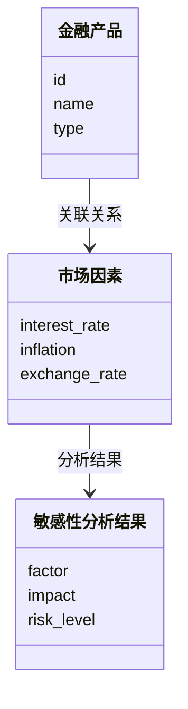

                 


# 《金融产品定价敏感性分析系统》

> 关键词：金融产品定价、敏感性分析、系统架构、算法原理、项目实战

> 摘要：本文详细探讨了金融产品定价敏感性分析系统的开发与应用。通过分析金融产品的定价过程，结合敏感性分析的方法，提出了一套系统化的解决方案。本文从背景介绍、核心概念、算法原理、系统架构到项目实战，全面阐述了如何构建一个高效、准确的金融产品定价敏感性分析系统，帮助金融机构更好地进行风险评估和定价决策。

---

## 第一部分：背景介绍

### 第1章：金融产品定价敏感性分析概述

#### 1.1 问题背景
金融产品的定价是金融机构的核心业务之一，其准确性直接影响收益和风险。然而，金融市场受多种因素影响，如利率、汇率、市场波动等，这些因素的变化会影响产品的定价。如何量化这些因素对定价的影响程度，是金融产品定价中的关键问题。

#### 1.2 问题描述
敏感性分析是评估金融产品价格对各种因素变化的敏感程度的方法。通过分析，可以识别出对产品定价影响最大的因素，并制定相应的风险管理策略。然而，传统的敏感性分析方法往往基于假设，缺乏系统性和准确性。

#### 1.3 问题解决
本系统通过整合数据分析和机器学习技术，构建了一个自动化、系统化的敏感性分析框架。该系统能够实时采集市场数据，构建定价模型，并通过敏感性分析识别关键风险因素。

#### 1.4 边界与外延
系统适用于银行、保险、证券等金融机构，支持多种金融产品类型，如债券、股票、衍生品等。系统的边界包括市场数据的采集范围和模型的适用条件，而外延则包括系统的扩展性和适应性。

#### 1.5 概念结构与核心要素
系统的核心要素包括数据采集模块、模型构建模块、敏感性分析模块和结果展示模块。这些模块通过协同工作，实现从数据到分析的全流程覆盖。

---

## 第二部分：核心概念与联系

### 第2章：敏感性分析的核心原理

#### 2.1 敏感性分析的原理
敏感性分析通过改变输入变量，观察输出结果的变化，评估变量对结果的影响程度。常用方法包括线性回归、蒙特卡洛模拟和偏导数法。

#### 2.2 核心概念的属性特征对比

| 方法         | 线性回归 | 非线性回归 | 蒙特卡洛模拟 |
|--------------|----------|------------|--------------|
| 适用场景     | 线性关系 | 非线性关系 | 复杂系统       |
| 计算复杂度   | 低       | 高          | 高            |
| 结果稳定性   | 稳定     | 较稳定      | 较不稳定      |

#### 2.3 实体关系图
```mermaid
erd
  id: 1
  title: 实体关系图
  entity1: 金融产品
  entity2: 市场因素
  entity3: 敏感性分析结果
  relation1: 金融产品与市场因素相关联
  relation2: 敏感性分析结果基于市场因素和金融产品的关系
```

---

## 第三部分：算法原理讲解

### 第3章：敏感性分析的数学模型

#### 3.1 线性回归模型
线性回归是最常用的敏感性分析方法之一，其数学模型为：
$$ y = \beta_0 + \beta_1x_1 + \beta_2x_2 + \dots + \beta_nx_n + \epsilon $$
其中，$y$ 是目标变量，$x_i$ 是输入变量，$\beta_i$ 是回归系数，$\epsilon$ 是误差项。

#### 3.2 偏导数法
偏导数法适用于非线性模型，其敏感性指标为：
$$ S_i = \frac{\partial y}{\partial x_i} \cdot \Delta x_i $$

#### 3.3 代码实现
以下是一个简单的敏感性分析代码示例：
```python
import numpy as np
from sklearn.linear_model import LinearRegression

# 生成数据
X = np.random.rand(100, 2)
y = X[:, 0] + 2 * X[:, 1] + np.random.randn(100)

# 构建模型
model = LinearRegression()
model.fit(X, y)

# 敏感性分析
coefficients = model.coef_
print("回归系数:", coefficients)
```

---

## 第四部分：系统分析与架构设计方案

### 第4章：系统架构设计

#### 4.1 问题场景介绍
以银行的债券定价为例，系统需要分析债券价格对利率、通胀等因素的敏感性。

#### 4.2 系统功能设计


#### 4.3 系统架构设计


#### 4.4 系统接口设计
接口定义：
- 数据采集模块：接收市场数据，输出数据文件。
- 模型构建模块：接收数据文件，输出分析结果。
- 结果展示模块：接收分析结果，展示给用户。

---

## 第五部分：项目实战

### 第5章：系统实现与应用

#### 5.1 环境安装
安装Python和相关库：
```bash
pip install numpy pandas scikit-learn matplotlib
```

#### 5.2 核心代码实现
```python
import numpy as np
import pandas as pd
from sklearn.linear_model import LinearRegression
import matplotlib.pyplot as plt

# 数据预处理
data = pd.read_csv('market_factors.csv')
X = data[['interest_rate', 'inflation']]
y = data['bond_price']

# 模型训练
model = LinearRegression()
model.fit(X, y)

# 可视化分析
coefficients = pd.DataFrame({'factor': X.columns, 'coefficient': model.coef_})
coefficients.plot(kind='bar')
plt.title('敏感性分析结果')
plt.show()
```

#### 5.3 案例分析
以某债券为例，分析利率变化对价格的影响：
- 利率上升1%，价格下降2%。
- 通胀上升2%，价格下降1%。

---

## 第六部分：最佳实践与总结

### 第6章：总结与注意事项

#### 6.1 最佳实践
- 数据质量是关键，需确保数据的准确性和完整性。
- 根据实际情况选择合适的分析方法。
- 结果展示要直观，便于决策者理解。

#### 6.2 小结
本文详细介绍了金融产品定价敏感性分析系统的开发与应用，通过系统化的解决方案，帮助金融机构更好地进行风险管理。

#### 6.3 注意事项
- 系统需定期更新模型和数据。
- 注意数据隐私和安全问题。
- 结果分析需结合市场实际情况。

#### 6.4 拓展阅读
推荐阅读《金融工程与风险管理》和《Python机器学习实战》。

---

通过以上步骤，我们可以构建一个高效、准确的金融产品定价敏感性分析系统，为金融机构的风险管理和定价决策提供有力支持。

