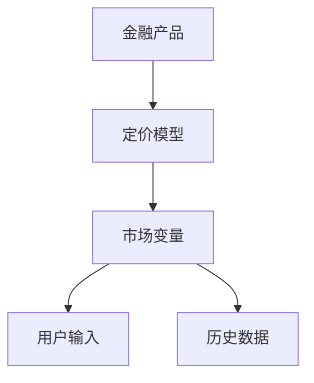
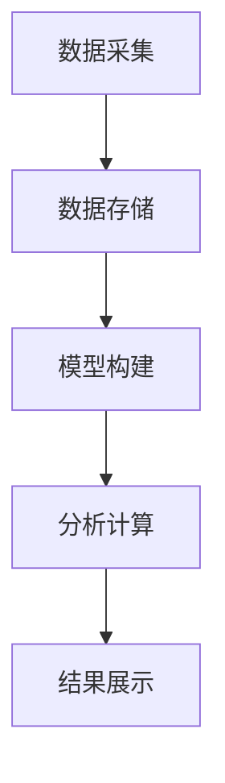
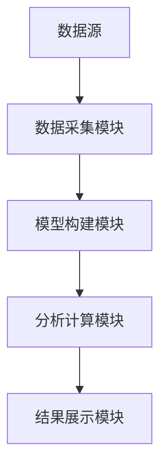
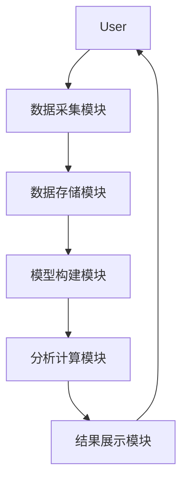

                 


# 《金融产品定价敏感性分析系统》

## 关键词：金融产品定价，敏感性分析，金融建模，数据分析，系统设计

## 摘要：  
金融产品定价是金融市场中至关重要的一环，其准确性直接影响金融机构的收益和风险控制能力。敏感性分析作为评估定价模型稳定性和可靠性的关键工具，帮助决策者理解价格波动的主要驱动因素。本文从金融产品定价的敏感性分析入手，结合数据分析和系统设计，探讨如何构建一个高效、准确的定价敏感性分析系统。文章详细介绍了敏感性分析的核心概念、算法原理、系统架构，并通过实际案例展示了系统的实现与应用。

---

## 正文：

### 第一部分: 金融产品定价敏感性分析系统概述

---

### 第1章: 金融产品定价敏感性分析的背景与基础

#### 1.1 问题背景

金融产品的定价是一个复杂的过程，涉及多个市场变量和内在因素。这些变量包括利率、汇率、市场波动、信用风险等。准确的定价不仅依赖于模型的准确性，还需要对模型的各个输入变量进行敏感性分析，以识别哪些变量对最终定价的影响最大。

**1.1.1 金融产品定价的核心问题**  
金融产品定价的核心问题是如何在不确定的市场条件下，找到影响产品价格的关键因素，并量化这些因素对价格的影响程度。例如，债券的价格对利率的变化高度敏感，而股票的价格可能受市场情绪的影响较大。

**1.1.2 敏感性分析的必要性**  
敏感性分析是评估定价模型鲁棒性的关键步骤。通过分析不同变量的变化对价格的影响，可以帮助决策者了解哪些变量是主要风险来源，并制定相应的风险管理策略。

**1.1.3 金融市场的不确定性与风险**  
金融市场充满了不确定性，价格波动可能由多种因素引发。敏感性分析帮助识别这些因素中的关键风险点，从而优化定价策略和风险管理。

#### 1.2 问题描述

**1.2.1 金融产品定价的基本流程**  
定价过程通常包括数据收集、模型选择、参数估计和结果验证等步骤。敏感性分析是模型验证的重要环节，用于评估模型的稳定性和可靠性。

**1.2.2 敏感性分析的目标与范围**  
敏感性分析的目标是确定哪些变量对定价的影响最大。分析范围通常包括模型输入变量、市场假设和外部数据等因素。

**1.2.3 相关利益方的需求与期望**  
金融机构、投资者和监管机构都对定价敏感性分析有需求。金融机构希望通过分析优化定价策略，投资者需要了解价格波动的风险，监管机构则关注模型的透明度和合规性。

#### 1.3 问题解决思路

**1.3.1 敏感性分析的定义与作用**  
敏感性分析是一种系统化的方法，用于评估模型输入变量的变化对输出结果的影响。它帮助识别关键变量，优化模型结构，并提高定价的准确性。

**1.3.2 系统化分析方法的选择**  
常见的敏感性分析方法包括单因素分析、多因素分析、蒙特卡洛模拟等。选择合适的方法取决于问题的复杂性和数据的可用性。

**1.3.3 数据驱动与模型驱动的结合**  
敏感性分析既可以基于历史数据（数据驱动）进行统计分析，也可以通过构建数学模型（模型驱动）进行模拟。两者的结合可以提高分析的准确性和全面性。

#### 1.4 系统的边界与外延

**1.4.1 系统的功能边界**  
敏感性分析系统的功能通常包括数据采集、模型构建、分析计算和结果展示。系统需要明确各个模块的功能边界，确保数据流和计算流程的清晰。

**1.4.2 与相关系统的接口关系**  
敏感性分析系统可能与数据源、定价系统和风险管理系统等其他系统接口。明确接口关系有助于系统集成和数据共享。

**1.4.3 系统的可扩展性与灵活性**  
系统设计应考虑未来的扩展需求，例如增加新的变量或分析方法。灵活性强的系统能够快速适应市场变化和业务需求。

#### 1.5 概念结构与核心要素

**1.5.1 核心概念的层次结构**  
敏感性分析系统的层次结构通常包括输入变量、模型、分析方法和输出结果。每个层次都有其独特的功能和作用。

**1.5.2 核心要素的特征与关系**  
核心要素包括数据、模型、算法和结果。数据是分析的基础，模型是分析的工具，算法是分析的方法，结果是分析的目标。这些要素相互关联，共同构成敏感性分析系统。

**1.5.3 系统的输入输出关系**  
系统的输入包括金融产品的参数、市场数据和模型参数。输出包括敏感性分析报告、关键变量识别和风险管理建议。

#### 1.6 本章小结

本章从背景和基础的角度介绍了金融产品定价敏感性分析系统的重要性。通过分析问题背景、目标和解决思路，明确了系统的核心概念和结构。

---

### 第2章: 敏感性分析的核心概念与联系

#### 2.1 敏感性分析的原理

**2.1.1 变量变化对结果的影响**  
敏感性分析的核心是研究变量变化如何影响模型输出。通过量化这种影响，可以识别关键变量。

**2.1.2 线性与非线性关系的区别**  
线性关系中，变量变化与结果变化成比例关系，而非线性关系则更为复杂，可能涉及二次项或更高阶项。

**2.1.3 单因素与多因素分析的对比**  
单因素分析仅考虑一个变量的变化，而多因素分析同时考虑多个变量的联合影响。

#### 2.2 核心概念的属性特征对比

下表对比了单因素分析和多因素分析的特征：

| 特性                | 单因素分析      | 多因素分析      |
|---------------------|-----------------|-----------------|
| 变量数量            | 单个变量        | 多个变量        |
| 分析复杂度          | 较低            | 较高            |
| 适用场景            | 简单问题        | 复杂问题        |
| 输出结果            | 明确的影响方向    | 复杂的影响关系    |

#### 2.3 实体关系图

以下是金融产品定价敏感性分析系统的实体关系图：



---

### 第3章: 敏感性分析的算法原理

#### 3.1 算法原理概述

**3.1.1 线性回归模型**  
线性回归是一种常用的敏感性分析方法，用于评估自变量对因变量的影响程度。其数学模型为：

$$ y = \beta_0 + \beta_1x_1 + \beta_2x_2 + \dots + \beta_nx_n + \epsilon $$

其中，$\beta_i$ 是自变量 $x_i$ 的回归系数，表示 $x_i$ 的变化对 $y$ 的影响程度。

**3.1.2 蒙特卡洛模拟**  
蒙特卡洛模拟是一种通过随机采样来评估变量影响的方法。其步骤如下：

1. 确定输入变量的分布。
2. 生成随机样本。
3. 计算输出结果。
4. 统计分析结果。

**3.1.3 方差分解方法**  
方差分解用于评估各个变量对输出结果方差的贡献比例。其公式为：

$$ \text{方差贡献率} = \frac{\text{变量对总方差的贡献}}{\text{总方差}} \times 100\% $$

#### 3.2 算法实现

**3.2.1 线性回归模型的数学公式**

线性回归模型的系数可以通过最小二乘法求解：

$$ \hat{\beta} = (X^T X)^{-1} X^T y $$

其中，$X$ 是设计矩阵，$y$ 是因变量向量。

**3.2.2 蒙特卡洛模拟的代码示例**

以下是一个简单的蒙特卡洛模拟的Python代码：

```python
import numpy as np

# 定义模型函数
def model(x1, x2):
    return 2 * x1 + 3 * x2 + np.random.normal(0, 1)

# 生成随机样本
n = 1000
x1 = np.random.uniform(0, 1, n)
x2 = np.random.uniform(0, 1, n)

# 计算输出结果
y = [model(x1[i], x2[i]) for i in range(n)]

# 统计分析
coefficients = np.polyfit(x1, y, 1)
print("回归系数:", coefficients)
```

#### 3.3 本章小结

本章详细介绍了敏感性分析的几种主要算法，包括线性回归、蒙特卡洛模拟和方差分解方法。通过数学公式和代码示例，展示了如何实现这些算法并应用于实际问题。

---

### 第4章: 系统分析与架构设计

#### 4.1 系统架构设计

**4.1.1 系统模块划分**  
敏感性分析系统通常包括数据采集模块、模型构建模块、分析计算模块和结果展示模块。

**4.1.2 系统架构图**



#### 4.2 接口设计

**4.2.1 系统接口设计**  
系统需要与数据源、定价系统和风险管理系统进行接口对接。例如：

- 数据接口：从数据库获取市场数据。
- 模型接口：与定价系统共享模型参数。
- 结果接口：将分析结果传递给风险管理系统。

**4.2.2 接口设计图**



#### 4.3 系统交互流程

**4.3.1 系统交互流程图**



#### 4.4 本章小结

本章从系统架构和接口设计的角度，详细描述了敏感性分析系统的组成和各模块之间的关系。通过架构图和交互图，展示了系统的整体流程和模块协作方式。

---

### 第5章: 项目实战

#### 5.1 环境安装

**5.1.1 系统环境要求**  
建议使用Python 3.8及以上版本，安装NumPy、Pandas和Matplotlib库。

**5.1.2 安装依赖**

```bash
pip install numpy pandas matplotlib
```

#### 5.2 系统核心实现

**5.2.1 线性回归模型实现**

```python
import numpy as np
import matplotlib.pyplot as plt

# 生成数据
x = np.linspace(0, 10, 20)
y = 2 * x + 1 + np.random.randn(20)

# 计算回归系数
A = np.vstack([x, np.ones(len(x))])
beta = np.linalg.lstsq(A.T, y, rcond=None)[0]

# 绘制散点图和回归线
plt.scatter(x, y)
plt.plot(x, beta[0] * x + beta[1], 'r')
plt.show()
```

**5.2.2 蒙特卡洛模拟实现**

```python
import numpy as np

def model(x1, x2):
    return 2 * x1 + 3 * x2 + np.random.normal(0, 1)

n = 1000
x1 = np.random.uniform(0, 1, n)
x2 = np.random.uniform(0, 1, n)
y = [model(x1[i], x2[i]) for i in range(n)]

coefficients = np.polyfit(x1, y, 1)
print("回归系数:", coefficients)
```

#### 5.3 代码应用解读与分析

**5.3.1 线性回归模型的解读**  
上述代码生成了20个数据点，并拟合了一条回归直线。回归系数表示了每个自变量对因变量的影响程度。例如，系数为2表示x每增加1单位，y平均增加2单位。

**5.3.2 蒙特卡洛模拟的分析**  
蒙特卡洛模拟通过生成大量随机样本，计算回归系数，从而评估变量的敏感性。代码中，x1和x2分别对y的影响系数为2和3，回归结果应接近这些值。

#### 5.4 实际案例分析

**5.4.1 案例背景**  
假设我们正在分析债券价格对利率和信用风险的敏感性。

**5.4.2 数据准备**

```python
import pandas as pd

# 生成数据
data = {
    '利率': [2, 3, 4, 5, 6],
    '信用风险': [0.1, 0.2, 0.3, 0.4, 0.5],
    '债券价格': [100, 95, 90, 85, 80]
}
df = pd.DataFrame(data)
```

**5.4.3 模型构建与分析**

```python
import numpy as np

# 定义模型函数
def bond_price_model(risk_free_rate, credit_risk):
    return 100 - 5 * risk_free_rate - 10 * credit_risk

# 生成随机样本
n = 1000
risk_free_rate = np.random.uniform(2, 6, n)
credit_risk = np.random.uniform(0.1, 0.5, n)

# 计算债券价格
prices = [bond_price_model(risk_free_rate[i], credit_risk[i]) for i in range(n)]

# 计算回归系数
X = np.column_stack((risk_free_rate, np.ones(n)))
beta = np.linalg.lstsq(X, prices, rcond=None)[0]

print("回归系数:", beta)
```

#### 5.5 本章小结

本章通过实际案例，展示了如何使用敏感性分析系统进行金融产品的定价分析。通过代码实现和案例解读，帮助读者理解系统的实际应用和操作流程。

---

### 第6章: 最佳实践

#### 6.1 小结

敏感性分析是金融产品定价中不可或缺的工具。通过系统的分析和设计，可以有效识别关键变量，优化定价策略，并降低风险。

#### 6.2 注意事项

- 确保数据的准确性和完整性。
- 选择合适的分析方法，根据问题复杂性进行调整。
- 定期更新模型，适应市场变化。

#### 6.3 拓展阅读

- 《金融工程与风险管理》
- 《数据分析方法与应用》
- 《系统设计与架构》

---

### 结语

金融产品定价敏感性分析系统是一个复杂但重要的工具。通过系统的分析和设计，可以帮助金融机构更好地应对市场波动和风险。希望本文能够为读者提供有价值的见解和实践指导。

---

**以上是《金融产品定价敏感性分析系统》的完整目录和内容概览。**

