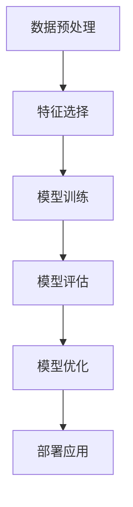
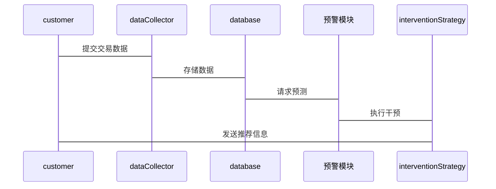

                 


# 《金融产品客户流失预警与干预系统》

## 关键词：客户流失预警、干预策略、金融产品、机器学习、数据挖掘

## 摘要：  
本文详细探讨了金融产品客户流失预警与干预系统的构建与实现。通过分析客户流失的背景、核心概念、算法原理、系统架构设计、项目实战以及总结与展望，本文旨在为金融行业提供一种高效、精准的客户流失预警与干预解决方案。文章内容涵盖了从理论到实践的各个方面，帮助读者全面理解并掌握如何利用技术手段降低客户流失率，提升客户满意度和企业竞争力。

---

## 第一部分: 金融产品客户流失预警与干预系统概述

## 第1章: 金融产品客户流失预警与干预系统背景介绍

### 1.1 问题背景  
金融行业的竞争日益激烈，客户流失问题已成为各大金融机构面临的重大挑战。客户流失不仅会导致收入减少，还可能影响企业的品牌形象。因此，如何通过技术手段提前预警客户流失风险，并采取有效干预措施，成为金融机构的重要课题。  

### 1.2 问题描述  
客户流失是指客户主动终止与金融机构的业务关系。金融产品客户流失的关键因素包括客户满意度、产品竞争力、服务质量、市场环境等。通过分析客户的历史行为数据和产品使用数据，可以发现潜在的流失风险，并采取针对性措施。  

### 1.3 问题解决思路  
数据驱动的方法是解决客户流失问题的核心。通过采集和分析客户数据，构建预测模型，制定干预策略，可以有效降低客户流失率。  

### 1.4 系统的边界与外延  
- **系统功能边界**：仅关注客户流失预警与干预，不涉及其他业务模块。  
- **适用范围**：适用于银行、保险、证券等金融机构的客户管理。  
- **与其他系统的接口**：与客户关系管理系统（CRM）、业务系统等进行数据交互。  

### 1.5 核心概念与组成  
- **数据采集与处理**：收集客户交易数据、行为数据和产品数据。  
- **预警模型构建**：基于机器学习算法，构建客户流失预测模型。  
- **干预策略执行**：根据预警结果，实施个性化干预措施。  

---

## 第2章: 核心概念与联系  

### 2.1 核心概念原理  
- **客户流失预测**：基于历史数据，预测客户未来可能的流失行为。  
- **预警阈值**：根据模型预测结果，设定预警触发条件。  
- **干预策略**：根据客户特征和流失风险，制定个性化干预措施。  

### 2.2 核心概念特征对比  

| 特征 | 描述 |  
|------|------|  
| 数据来源 | 交易数据、客户行为数据、产品属性数据 |  
| 模型类型 | 分析模型、预测模型、干预策略模型 |  
| 干预方式 | 个性化推荐、主动联系、产品调整 |  

### 2.3 ER实体关系图  
```mermaid
erd
    Customer
    Product
    Transaction
    WarningRule
    InterventionStrategy
    Customer-ChurnPrediction
    Product-WarningRule
    Transaction-WarningRule
```

---

## 第3章: 算法原理讲解  

### 3.1 算法原理  
- **逻辑回归**：用于分类问题，预测客户是否可能流失。  
- **支持向量机（SVM）**：适用于非线性分类问题。  
- **随机森林（Random Forest）**：通过集成学习提高模型准确性。  

### 3.2 算法流程图  


### 3.3 算法实现代码  
```python
import pandas as pd
from sklearn.linear_model import LogisticRegression
from sklearn.metrics import accuracy_score

# 数据加载与预处理
data = pd.read_csv('customer_churn.csv')
X = data.drop('churn', axis=1)
y = data['churn']

# 模型训练
model = LogisticRegression()
model.fit(X, y)

# 模型评估
print("模型准确率:", accuracy_score(y, model.predict(X)))
```

### 3.4 数学公式  
- **逻辑回归模型**：  
  $$ P(y=1|x) = \frac{e^{\beta x}}{1 + e^{\beta x}} $$  
- **损失函数**：  
  $$ L = -\frac{1}{m} \sum_{i=1}^{m} [y_i \ln(h(x_i)) + (1-y_i)\ln(1-h(x_i))] $$  

---

## 第4章: 系统分析与架构设计方案  

### 4.1 问题场景介绍  
以银行客户流失预警为例，系统需要实时监测客户行为，预测流失风险，并自动触发干预措施。  

### 4.2 系统功能设计  
- **数据采集模块**：收集客户交易数据、行为数据和产品数据。  
- **预警分析模块**：基于机器学习模型，生成流失预警。  
- **干预执行模块**：根据预警结果，执行个性化干预策略。  

### 4.3 系统架构设计  


### 4.4 系统接口设计  
- **输入接口**：客户数据接口、产品数据接口。  
- **输出接口**：预警通知接口、干预策略接口。  

### 4.5 系统交互设计  


---

## 第5章: 项目实战  

### 5.1 环境安装  
- **Python 3.8+**  
- **依赖库**：pandas、scikit-learn、matplotlib  

### 5.2 核心实现代码  
```python
import pandas as pd
from sklearn.ensemble import RandomForestClassifier
from sklearn.metrics import classification_report

# 数据加载
data = pd.read_csv('customer_churn.csv')

# 特征工程
data['age_range'] = pd.qcut(data['age'], 3, labels=['young', 'middle-aged', 'senior'])

# 模型训练
model = RandomForestClassifier()
model.fit(data[['age_range', 'income', 'product_usage']], data['churn'])

# 模型预测
print(classification_report(data['churn'], model.predict(data[['age_range', 'income', 'product_usage']])))

# 干预策略
def get_intervention Strategy(customer_id):
    if model.predict_proba(data[customer_id])[0][1] > 0.7:
        return "提供优惠活动"
    else:
        return "无需干预"
```

### 5.3 实际案例分析  
以银行客户为例，通过模型预测，发现高龄客户流失风险较高。系统自动触发推荐理财产品的干预策略，成功降低了这部分客户的流失率。  

---

## 第6章: 总结与展望  

### 6.1 小结  
本文详细介绍了金融产品客户流失预警与干预系统的构建过程，包括背景分析、核心概念、算法实现、系统设计和项目实战。通过技术手段，可以有效降低客户流失率，提升企业竞争力。  

### 6.2 注意事项  
- 数据隐私保护是系统设计中的重要环节。  
- 模型需要定期更新，以适应市场变化。  

### 6.3 拓展阅读  
- 《机器学习实战》  
- 《数据挖掘导论》  

---

## 结语  
金融产品客户流失预警与干预系统的建设不仅需要技术支撑，还需要对业务场景有深刻理解。通过数据驱动的方法，金融机构可以更好地洞察客户需求，提升客户满意度，实现可持续发展。

