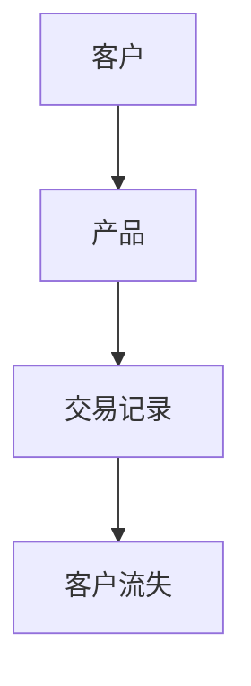
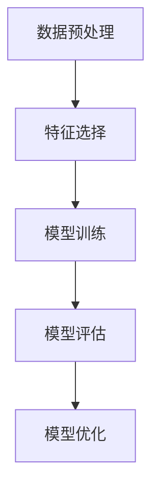
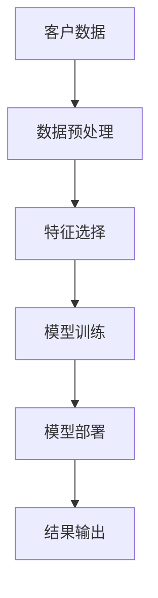
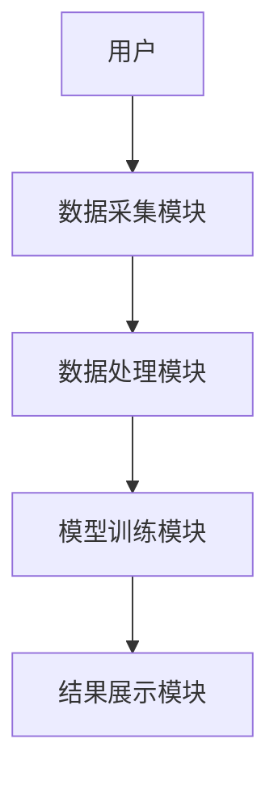

                 


# 《金融产品客户流失预警模型》

## 关键词：客户流失预警、金融产品、机器学习、数据挖掘、风险管理

## 摘要：本文系统地介绍金融产品客户流失预警模型的构建过程，从背景分析到模型实现，涵盖数据预处理、特征选择、算法选型、模型训练与评估等关键步骤，结合实际案例，深入剖析模型的应用价值与优化方向。

---

# 第1章: 问题背景与核心概念

## 1.1 客户流失问题的背景
### 1.1.1 金融行业的客户流失现状
在金融行业，客户流失是一个普遍且严重的问题。银行、证券公司、保险公司等金融机构面临着客户流失率逐年上升的趋势。客户流失不仅意味着收入的减少，还可能带来品牌声誉的损失和市场机会的丧失。

### 1.1.2 客户流失对金融机构的影响
客户流失对金融机构的影响是多方面的：
- **收入下降**：流失的客户意味着收入的减少。
- **成本增加**：获取新客户的成本远高于保留现有客户。
- **品牌声誉受损**：客户流失可能影响机构的声誉。
- **风险加剧**：流失的客户可能隐藏着未暴露的风险敞口。

### 1.1.3 建立客户流失预警模型的必要性
通过建立客户流失预警模型，金融机构可以提前识别潜在流失客户，采取针对性措施，降低客户流失率，提升客户满意度和忠诚度。

## 1.2 客户流失预警模型的定义与目标
### 1.2.1 客户流失的定义
客户流失是指客户终止与金融机构的业务关系，不再使用该机构的金融产品或服务。

### 1.2.2 预警模型的目标
客户流失预警模型的目标是：
- **预测客户流失风险**：通过分析客户行为和特征，预测客户是否可能流失。
- **识别高风险客户**：将客户分为不同的流失风险等级，优先关注高风险客户。
- **提供决策支持**：为金融机构的客户服务和营销策略提供数据支持。

### 1.2.3 模型的核心要素与边界
客户流失预警模型的核心要素包括：
- **客户特征**：如年龄、性别、收入水平、职业等。
- **行为特征**：如交易频率、交易金额、账户活跃度等。
- **产品特征**：如产品类型、产品使用情况、产品满意度等。
- **时间特征**：如客户使用产品的时间长度、最近一次交易的时间等。

## 1.3 问题解决思路与方法
### 1.3.1 数据驱动的解决方案
通过收集和分析客户的多维度数据，利用数据挖掘和机器学习技术，构建客户流失预警模型。

### 1.3.2 机器学习在客户流失预测中的应用
常用的机器学习算法包括逻辑回归、随机森林、支持向量机等。这些算法可以用于分类问题，帮助预测客户是否可能流失。

### 1.3.3 多维度特征分析的重要性
通过对客户特征的多维度分析，可以更全面地理解客户流失的原因，制定更有效的客户 retention 策略。

## 1.4 本章小结
本章从金融行业的客户流失现状出发，分析了客户流失对金融机构的影响，提出了建立客户流失预警模型的必要性，并界定了模型的核心要素和目标。

---

# 第2章: 核心概念与联系

## 2.1 客户流失预警模型的原理
### 2.1.1 数据特征提取与分析
通过数据分析，提取与客户流失相关的特征，如交易频率、产品使用情况等。

### 2.1.2 机器学习算法的应用
选择合适的机器学习算法，如逻辑回归、随机森林等，对客户流失进行预测。

### 2.1.3 模型评估与优化
通过模型评估指标（如准确率、召回率、F1分数等）对模型进行优化，提升预测效果。

## 2.2 核心概念对比分析
### 2.2.1 不同模型算法的对比
比较不同算法的优缺点，选择最适合当前数据集的算法。

### 2.2.2 数据特征的重要性排序
通过特征重要性分析，确定哪些特征对客户流失的影响最大。

### 2.2.3 模型性能的对比分析
比较不同模型在预测客户流失方面的表现，选择性能最优的模型。

## 2.3 ER实体关系图


## 2.4 本章小结
本章通过分析客户流失预警模型的原理，对比了不同算法和特征的重要性，并通过ER实体关系图展示了数据模型的架构。

---

# 第3章: 算法原理与实现

## 3.1 算法原理概述
### 3.1.1 逻辑回归算法
逻辑回归是一种常用的分类算法，适用于二分类问题。其核心思想是通过logistic函数将线性回归的结果映射到0-1区间，表示概率。

### 3.1.2 支持向量机算法
支持向量机（SVM）是一种监督学习算法，适用于小样本、高维数据的分类问题。其核心思想是通过找到一个超平面，将数据分为两类。

### 3.1.3 随机森林算法
随机森林是一种基于决策树的集成学习算法，具有高精度和良好的抗过拟合能力。

## 3.2 算法流程图


## 3.3 算法实现代码示例
```python
import pandas as pd
from sklearn.model_selection import train_test_split
from sklearn.linear_model import LogisticRegression

# 数据加载与预处理
df = pd.read_csv('customer_data.csv')
X = df.drop('churn', axis=1)
y = df['churn']

# 数据分割
X_train, X_test, y_train, y_test = train_test_split(X, y, test_size=0.2, random_state=42)

# 模型训练
model = LogisticRegression()
model.fit(X_train, y_train)

# 模型预测
y_pred = model.predict(X_test)
```

## 3.4 本章小结
本章详细介绍了客户流失预警模型中常用的算法原理，并通过流程图和代码示例展示了算法实现的步骤。

---

# 第4章: 数学模型

## 4.1 数据预处理
### 4.1.1 数据清洗
- 删除重复数据
- 处理缺失值
- 标准化/归一化

## 4.2 特征选择
### 4.2.1 特征重要性分析
使用特征重要性分析方法，确定哪些特征对客户流失的影响最大。

## 4.3 模型构建
### 4.3.1 逻辑回归模型
$$ P(y=1|x) = \frac{1}{1 + e^{-\beta x}} $$
其中，$\beta$ 是模型的系数，$x$ 是特征向量。

### 4.3.2 随机森林模型
随机森林通过集成多个决策树的预测结果，提高模型的准确性和稳定性。

## 4.4 模型评估
### 4.4.1 准确率
$$ \text{准确率} = \frac{\text{正确预测数}}{\text{总样本数}} $$

### 4.4.2 召回率
$$ \text{召回率} = \frac{\text{正确预测的流失客户数}}{\text{实际流失客户数}} $$

### 4.4.3 F1分数
$$ F1 = 2 \times \frac{\text{准确率} \times \text{召回率}}{\text{准确率} + \text{召回率}} $$

## 4.5 模型优化
### 4.5.1 参数调优
通过网格搜索（Grid Search）等方法，找到最优的模型参数。

### 4.5.2 过拟合与欠拟合
通过交叉验证等方法，平衡模型的过拟合和欠拟合问题。

## 4.6 本章小结
本章通过数学模型的构建和优化，展示了如何通过数据预处理、特征选择和模型训练，建立客户流失预警模型。

---

# 第5章: 系统分析与架构设计

## 5.1 问题场景介绍
### 5.1.1 金融机构的客户流失问题
金融机构需要通过客户流失预警模型，提前识别高风险客户，采取措施降低流失率。

## 5.2 系统功能设计
### 5.2.1 数据采集与处理
- 数据清洗
- 数据转换
- 数据存储

### 5.2.2 模型训练与部署
- 模型训练
- 模型部署
- 模型监控

## 5.3 系统架构图


## 5.4 系统接口设计
### 5.4.1 数据接口
- 数据输入接口
- 数据输出接口

### 5.4.2 模型接口
- 模型训练接口
- 模型预测接口

## 5.5 系统交互图


## 5.6 本章小结
本章通过系统分析与架构设计，展示了客户流失预警模型的实现过程，包括数据采集、处理、模型训练和部署等环节。

---

# 第6章: 项目实战

## 6.1 环境安装与配置
### 6.1.1 安装Python
```bash
python --version
```

### 6.1.2 安装依赖库
```bash
pip install pandas scikit-learn
```

## 6.2 系统核心实现源代码
```python
import pandas as pd
from sklearn.model_selection import train_test_split
from sklearn.linear_model import LogisticRegression

# 数据加载
df = pd.read_csv('customer_churn.csv')
X = df.drop('churn', axis=1)
y = df['churn']

# 数据分割
X_train, X_test, y_train, y_test = train_test_split(X, y, test_size=0.2, random_state=42)

# 模型训练
model = LogisticRegression()
model.fit(X_train, y_train)

# 预测与评估
y_pred = model.predict(X_test)
print("准确率:", accuracy_score(y_test, y_pred))
```

## 6.3 代码应用解读与分析
### 6.3.1 数据加载与预处理
- 读取CSV文件
- 删除无关特征
- 分割训练集和测试集

### 6.3.2 模型训练
- 使用逻辑回归算法训练模型
- 模型评估与优化

## 6.4 实际案例分析
### 6.4.1 数据来源与特征分析
- 数据来源：银行客户数据
- 特征：年龄、性别、收入、交易频率等

### 6.4.2 模型预测与结果分析
- 预测结果：高风险流失客户
- 采取措施：客户回访、提供优惠活动等

## 6.5 项目小结
本章通过实际案例，展示了客户流失预警模型的应用过程，包括数据处理、模型训练和结果分析。

---

# 第7章: 最佳实践

## 7.1 小结
客户流失预警模型的构建与应用，可以帮助金融机构降低客户流失率，提升客户满意度和忠诚度。

## 7.2 注意事项
- 数据质量：确保数据的准确性和完整性
- 模型优化：持续优化模型性能
- 隐私保护：遵守数据隐私保护法规

## 7.3 拓展阅读
- 《机器学习实战》
- 《数据挖掘导论》
- 《Python机器学习》

## 7.4 本章小结
本章总结了客户流失预警模型的最佳实践，提出了在实际应用中需要注意的问题，并提供了进一步学习的方向。

---

# 结语

通过本文的系统介绍，读者可以全面了解金融产品客户流失预警模型的构建过程与应用价值。从数据处理到模型训练，从系统设计到实际案例，本文为金融机构提供了有效的客户流失预警解决方案。未来，随着人工智能技术的不断发展，客户流失预警模型将更加精准和智能化，为金融机构的风险管理提供更有力的支持。

