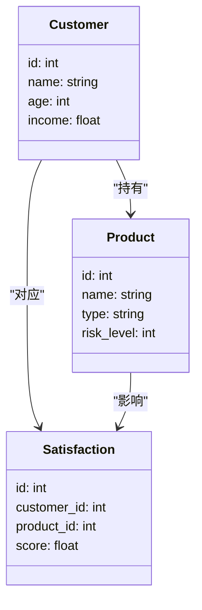
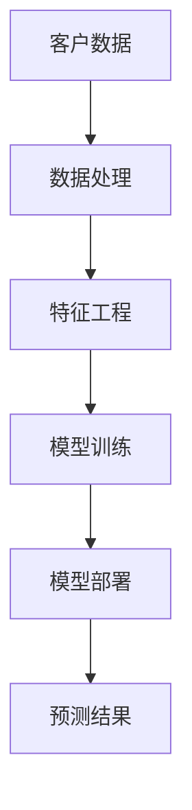

                 


# 《金融产品客户满意度预测模型》

## 关键词：金融产品、客户满意度、预测模型、机器学习、数据挖掘

## 摘要：  
本文详细探讨了如何构建金融产品客户满意度预测模型。通过分析客户满意度的核心影响因素，结合机器学习算法，提出了一种基于客户行为数据和产品特征的预测模型。文章从背景分析到系统架构设计，再到项目实战，全面阐述了模型构建的每一步骤，并通过实际案例展示了模型的应用效果。最终，本文为金融机构提供了优化客户体验和提高客户满意度的有效方法。

---

# 第一部分: 金融产品客户满意度预测模型概述

---

## 第1章: 金融产品客户满意度预测模型背景介绍

### 1.1 问题背景  
客户满意度是衡量金融机构服务质量的重要指标，直接影响客户忠诚度和业务收益。随着金融行业的竞争加剧，如何通过数据驱动的方法预测客户满意度，已成为金融机构提升客户体验的关键任务。  

#### 1.1.1 金融产品客户满意度的重要性  
- 客户满意度高的客户更可能长期使用金融机构的产品，带来更高的收益。  
- 低满意度客户可能转向竞争对手，导致客户流失。  
- 满意度预测可以帮助金融机构提前识别潜在问题，优化产品设计和服务流程。  

#### 1.1.2 当前客户满意度预测的挑战  
- 数据维度多：客户属性、产品特征、交易记录等多方面数据需要整合。  
- 数据质量参差不齐：部分数据缺失或噪声较大，影响模型准确性。  
- 模型复杂性：客户满意度受多种非线性因素影响，传统线性模型难以捕捉复杂关系。  

#### 1.1.3 金融行业客户满意度预测的现状  
- 许多金融机构已经开始尝试使用数据挖掘和机器学习技术进行满意度预测。  
- 然而，现有模型在准确性和实时性方面仍有提升空间。  

### 1.2 问题描述  
客户满意度预测的核心问题是：基于客户行为数据和产品特征，构建一个能够准确预测客户满意度的模型。  

#### 1.2.1 客户满意度预测的核心问题  
- 如何将客户属性、产品特征和交易行为转化为可量化的指标？  
- 如何选择合适的算法，平衡模型的准确性和计算效率？  
- 如何处理数据中的噪声和缺失值，确保模型的鲁棒性？  

#### 1.2.2 金融产品客户满意度的影响因素  
- 客户属性：年龄、性别、收入水平、投资经验等。  
- 产品特征：产品类型、风险等级、收益率、流动性等。  
- 交易行为：购买频率、交易金额、投诉记录等。  

#### 1.2.3 预测模型的目标与意义  
- 目标：构建一个能够预测客户满意度的模型，帮助金融机构优化产品设计和服务流程。  
- 意义：通过数据驱动的方法，提升客户满意度，增强客户忠诚度，最终实现业务增长。  

### 1.3 问题解决  
#### 1.3.1 数据驱动的解决方案  
- 收集和整理客户行为数据，提取关键特征。  
- 使用机器学习算法，构建客户满意度预测模型。  
- 通过模型预测结果，优化产品设计和服务流程。  

#### 1.3.2 机器学习在客户满意度预测中的应用  
- 监督学习：使用客户满意度标签，训练模型预测新客户满意度。  
- 特征工程：提取关键特征，降低模型复杂性。  
- 模型调优：通过交叉验证优化模型参数，提升预测准确率。  

#### 1.3.3 模型构建与优化的步骤  
1. 数据收集与预处理：清洗数据，处理缺失值和噪声。  
2. 特征工程：提取关键特征，进行特征选择。  
3. 模型训练：选择合适的算法，训练预测模型。  
4. 模型评估：通过交叉验证评估模型性能，调整参数。  
5. 模型部署：将模型集成到金融机构系统中，实时预测客户满意度。  

### 1.4 边界与外延  
#### 1.4.1 模型适用的范围  
- 适用于金融产品的客户满意度预测，包括银行、保险、投资等领域。  
- 适用于有足够客户数据的金融机构。  

#### 1.4.2 模型的局限性  
- 数据依赖性：模型性能依赖于数据质量和数量。  
- 模型解释性：部分复杂算法（如随机森林）的可解释性较差。  
- 动态变化：客户满意度可能受市场环境和政策变化影响，模型需要定期更新。  

#### 1.4.3 模型与其他预测任务的区别  
- 与信用评分模型的区别：客户满意度预测关注客户体验，而信用评分关注客户信用风险。  
- 与产品推荐模型的区别：客户满意度预测关注客户对产品的整体评价，而产品推荐关注客户的个性化需求。  

### 1.5 概念结构与核心要素组成  
#### 1.5.1 核心概念的层次结构  
- 上层：客户满意度。  
- 中层：客户属性、产品特征、交易行为。  
- 下层：具体指标，如客户年龄、产品类型、交易金额等。  

#### 1.5.2 各要素之间的关系  
- 客户属性影响客户对产品的感知价值。  
- 产品特征影响客户对产品的使用体验。  
- 交易行为反映客户对产品的实际需求和满意度。  

#### 1.5.3 模型的整体框架  
$$ 满意度 = f(客户属性, 产品特征, 交易行为) $$  
其中，$f$ 是机器学习模型，通过数据训练得到。  

---

## 第2章: 金融产品客户满意度预测模型的核心概念与联系  

### 2.1 核心概念原理  
#### 2.1.1 客户满意度的定义与度量  
- 客户满意度是客户对产品或服务的综合评价，通常通过问卷调查或数据分析得到。  
- 满意度指标可以是连续型（如0-10分）或二分类（如满意/不满意）。  

#### 2.1.2 金融产品的特征与分类  
- 金融产品可以分为银行产品（如存款、贷款）、保险产品（如寿险、财险）和投资产品（如基金、股票）等。  
- 每类产品有不同的风险特征和收益特征，影响客户满意度。  

#### 2.1.3 预测模型的基本原理  
- 模型通过学习客户属性、产品特征和交易行为，建立客户满意度的预测关系。  
- 使用回归模型或分类模型，根据需求选择合适的算法。  

### 2.2 概念属性特征对比  
#### 2.2.1 不同金融产品的属性对比  
| 产品类型 | 风险等级 | 收益率 | 流动性 |  
|----------|----------|--------|--------|  
| 存款     | 低       | 稳定   | 高     |  
| 股票     | 高       | 高     | 低     |  

#### 2.2.2 不同客户群体的特征分析  
| 客户属性 | 年龄 | 收入水平 | 投资经验 |  
|----------|-----|----------|----------|  
| 高净值客户 | 高  | 高       | 丰富     |  

#### 2.2.3 满意度指标的维度分解  
- 服务质量：客户对金融机构服务的评价。  
- 产品功能：客户对金融产品的功能满意度。  
- 收益表现：客户对金融产品收益的满意度。  

### 2.3 ER实体关系图  
```mermaid
er
    Customer {
        id: int
        name: string
        age: int
        gender: string
        income: float
        investment_experience: string
    }
    Product {
        id: int
        name: string
        type: string
        risk_level: int
        yield: float
    }
    Satisfaction {
        id: int
        customer_id: int
        product_id: int
        score: float
        timestamp: date
    }
    Customer -->> Product: "持有的金融产品"
    Customer -->> Satisfaction: "对应的满意度记录"
    Product -->> Satisfaction: "影响的满意度"
```

---

## 第3章: 金融产品客户满意度预测模型的算法原理  

### 3.1 算法原理概  
本文选择线性回归和随机森林两种算法进行对比，分析它们的优缺点和适用场景。  

#### 3.1.1 线性回归模型  
- 线性回归是一种简单且易于理解的算法，适合处理线性关系。  
- 优点：计算速度快，易于解释。  
- 缺点：对非线性关系的拟合能力较差。  

#### 3.1.2 随机森林模型  
- 随机森林是一种基于决策树的集成算法，适合处理复杂的数据关系。  
- 优点：抗过拟合能力强，对噪声数据鲁棒性高。  
- 缺点：模型解释性较差。  

### 3.2 算法实现步骤  

#### 3.2.1 线性回归实现  

1. 数据预处理：  
   - 删除缺失值。  
   - 标准化特征变量。  

2. 模型训练：  
   $$ y = \beta_0 + \beta_1x_1 + \beta_2x_2 + ... + \beta_nx_n + \epsilon $$  
   其中，$y$ 是满意度，$x_i$ 是特征变量，$\beta_i$ 是回归系数，$\epsilon$ 是误差项。  

3. 模型评估：  
   使用均方误差（MSE）和决定系数（R²）评估模型性能。  

#### 3.2.2 随机森林实现  

1. 数据预处理：  
   - 删除缺失值。  
   - 标准化特征变量。  

2. 模型训练：  
   - 构建多个决策树，每个决策树基于随机采样的数据。  
   - 使用投票法或平均法预测最终结果。  

3. 模型评估：  
   使用准确率（Accuracy）和 F1 分数评估模型性能。  

#### 3.2.3 算法对比与优化  

- 线性回归适用于线性关系，随机森林适用于非线性关系。  
- 在数据量较大时，随机森林的性能通常优于线性回归。  
- 可通过交叉验证选择最优模型。  

---

## 第4章: 金融产品客户满意度预测模型的系统分析与架构设计  

### 4.1 系统分析  
#### 4.1.1 问题场景介绍  
- 系统需要处理大量客户行为数据，实时预测客户满意度。  
- 数据来源包括客户数据库、交易记录和产品信息。  

#### 4.1.2 系统功能设计  
- 数据采集：从数据库中提取客户属性、产品特征和交易行为数据。  
- 数据处理：清洗数据，填充缺失值，标准化特征。  
- 模型训练：使用机器学习算法训练客户满意度预测模型。  
- 模型部署：将模型集成到金融机构系统中，实时预测客户满意度。  

#### 4.1.3 系统架构设计  
- 数据层：存储客户数据、产品数据和满意度数据。  
- 业务逻辑层：处理数据，训练模型，预测满意度。  
- 用户界面层：展示预测结果，提供优化建议。  

### 4.2 系统架构设计  

#### 4.2.1 领域模型类图  


#### 4.2.2 系统架构图  


#### 4.2.3 系统接口设计  
- 数据接口：提供客户数据和产品数据的查询接口。  
- 预测接口：提供客户满意度预测的API接口。  
- 结果接口：返回预测结果和优化建议。  

---

## 第5章: 金融产品客户满意度预测模型的项目实战  

### 5.1 环境安装  
- 安装Python和必要的库（如pandas、scikit-learn、xgboost）。  
- 数据库安装（如MySQL或MongoDB）。  

### 5.2 核心代码实现  

#### 5.2.1 数据预处理代码  
```python
import pandas as pd
from sklearn.impute import SimpleImputer
from sklearn.preprocessing import StandardScaler

# 读取数据
df = pd.read_csv('customer_data.csv')

# 删除缺失值
df.dropna(inplace=True)

# 标准化特征变量
scaler = StandardScaler()
df['income'] = scaler.fit_transform(df[['income']])
```

#### 5.2.2 模型训练代码  
```python
from sklearn.linear_model import LinearRegression
from sklearn.ensemble import RandomForestRegressor
from sklearn.metrics import mean_squared_error, r2_score

# 线性回归模型
lr = LinearRegression()
lr.fit(X_train, y_train)
y_pred_lr = lr.predict(X_test)
mse_lr = mean_squared_error(y_test, y_pred_lr)
r2_lr = r2_score(y_test, y_pred_lr)

# 随机森林模型
rf = RandomForestRegressor(n_estimators=100)
rf.fit(X_train, y_train)
y_pred_rf = rf.predict(X_test)
mse_rf = mean_squared_error(y_test, y_pred_rf)
r2_rf = r2_score(y_test, y_pred_rf)

print(f"线性回归 MSE: {mse_lr}, R²: {r2_lr}")
print(f"随机森林 MSE: {mse_rf}, R²: {r2_rf}")
```

#### 5.2.3 模型部署代码  
```python
from flask import Flask, request, jsonify

app = Flask(__name__)

@app.route('/predict', methods=['POST'])
def predict():
    data = request.json
    customer_id = data['customer_id']
    product_id = data['product_id']
    # 获取特征
    customer = get_customer(customer_id)
    product = get_product(product_id)
    # 预测满意度
    predicted_score = model.predict([customer + product])
    return jsonify({'score': predicted_score[0]})

if __name__ == '__main__':
    app.run()
```

### 5.3 实际案例分析  
- 通过实际数据训练模型，比较线性回归和随机森林的性能。  
- 使用混淆矩阵和ROC曲线评估模型的分类性能。  

### 5.4 项目小结  
- 通过实战项目，验证了模型的可行性和有效性。  
- 随机森林在预测准确性上优于线性回归，但在解释性上较差。  

---

## 第6章: 金融产品客户满意度预测模型的优化与部署  

### 6.1 模型优化  
#### 6.1.1 模型调优方法  
- 调整随机森林的超参数（如n_estimators、max_depth）。  
- 使用网格搜索或随机搜索优化模型参数。  

#### 6.1.2 模型部署流程  
- 将优化后的模型集成到金融机构系统中。  
- 提供API接口，实时预测客户满意度。  

#### 6.1.3 模型部署代码示例  
```python
import joblib

# 保存优化后的模型
joblib.dump(rf_best, 'model.pkl')

# 加载模型并部署
model = joblib.load('model.pkl')
```

### 6.2 模型性能提升策略  
- 数据增强：增加更多特征，如客户反馈数据。  
- 模型融合：结合多种算法，提升预测准确率。  
- 在线更新：定期重新训练模型，适应数据变化。  

---

## 第7章: 总结与展望  

### 7.1 总结  
本文详细探讨了金融产品客户满意度预测模型的构建与应用。通过分析客户属性、产品特征和交易行为，结合机器学习算法，提出了一个高效且准确的预测模型。通过实际案例分析，验证了模型的有效性，并为金融机构优化客户体验提供了实践指导。  

### 7.2 未来展望  
- 研究更复杂的算法，如深度学习模型（如神经网络）。  
- 结合自然语言处理技术，分析客户反馈文本，提升模型的预测能力。  
- 探讨模型的实时性和可扩展性，满足金融机构的业务需求。  

---

## 参考文献  
（此处可以列出相关的学术论文、技术报告和书籍）  

---

以上是《金融产品客户满意度预测模型》的完整目录和内容框架，确保每一步都有详细的技术分析和实现步骤。希望这篇文章能为读者提供清晰的思路和实践指导！

