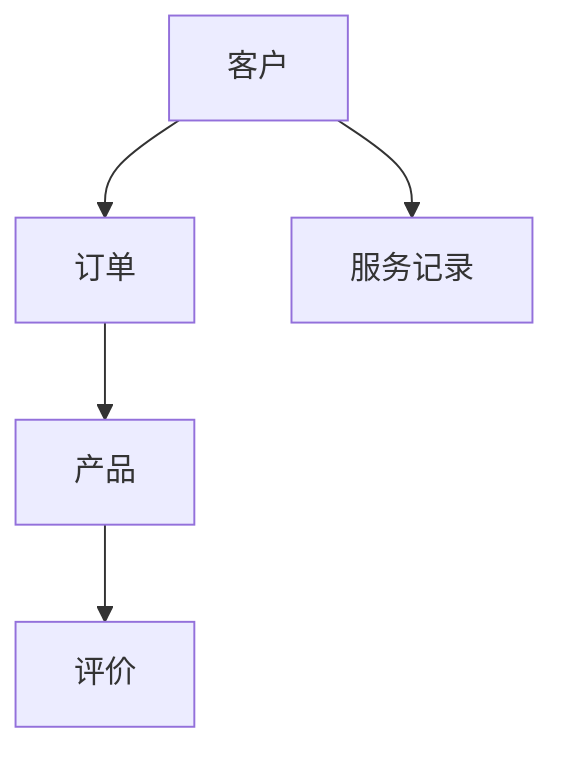
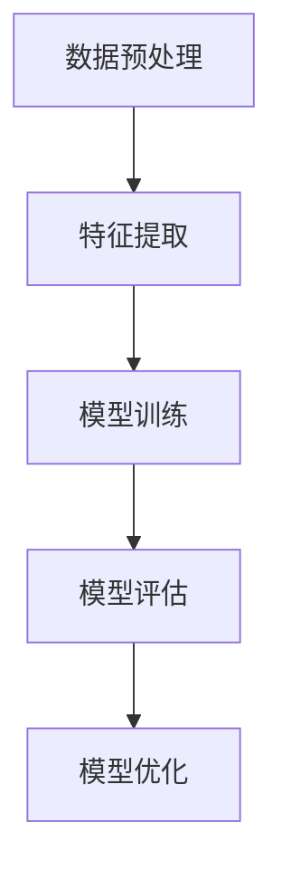
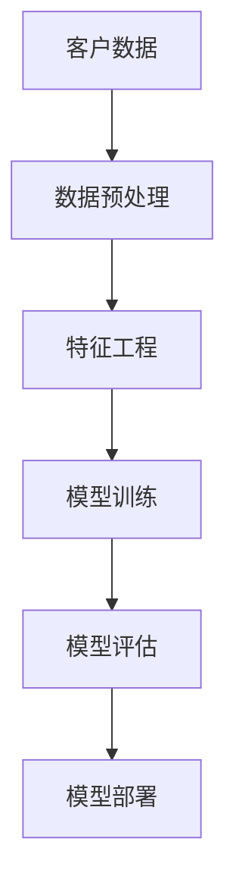
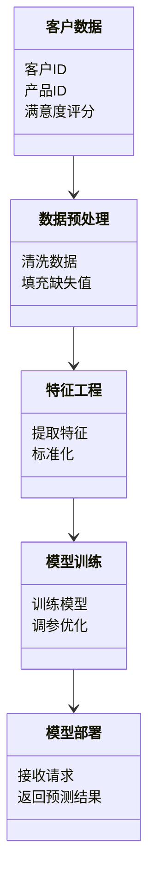

                 


# 《金融产品客户满意度预测系统》

## 关键词：客户满意度预测，机器学习，金融产品，算法，系统设计，项目实战

## 摘要：  
本文详细探讨了如何利用机器学习技术构建金融产品客户满意度预测系统。通过分析客户数据、选择合适的算法、设计系统的架构，并结合实际案例进行实战，展示了如何有效提升金融行业的客户满意度预测能力。文章从背景、算法原理、系统设计、项目实现到优化与扩展，层层深入，为读者提供了全面的技术指导。

---

# 第一部分: 金融产品客户满意度预测系统背景与基础

## 第1章: 客户满意度预测的背景与意义

### 1.1 问题背景  
客户满意度是衡量企业服务质量和产品竞争力的重要指标。在金融行业，客户满意度不仅关系到客户忠诚度和市场份额，还直接影响企业的长期发展。然而，传统的客户满意度评估方法通常依赖问卷调查和人工分析，存在效率低、成本高、实时性差等问题。通过引入机器学习技术，可以实现客户满意度的自动化预测，帮助企业及时发现并解决问题。

### 1.2 金融产品客户满意度预测的核心概念  
- **客户满意度**：客户对产品或服务的整体满意程度，通常通过评分（如1-5分）来衡量。  
- **金融产品**：包括理财产品、基金、保险、信贷等，每类产品的特征和客户行为存在显著差异。  
- **预测系统**：利用历史数据和机器学习模型，预测客户对特定金融产品的满意度。

### 1.3 数据特征与技术基础  
金融产品客户满意度预测涉及多维度数据，包括：  
- **客户属性**：年龄、性别、职业、资产规模等。  
- **产品特征**：产品类型、收益率、风险等级、费用率等。  
- **行为数据**：客户的交易频率、金额、投诉记录等。  
- **市场环境**：宏观经济指标（如利率、通货膨胀率）和行业趋势。

技术基础包括数据预处理、特征工程、模型训练和部署，常用工具包括Python（如Pandas、Scikit-learn）、R和AI平台（如TensorFlow、PyTorch）。

---

## 第2章: 系统核心概念与联系

### 2.1 核心概念原理  
客户满意度预测系统的核心在于建立客户特征与满意度之间的关联关系。通过分析客户行为和产品特征，提取关键特征并构建数学模型，最终实现满意度的预测。

### 2.2 核心概念属性特征对比表  
| 特征属性 | 描述 |
|----------|------|
| 产品类型 | 金融产品的种类（如理财产品、保险等） |
| 客户行为 | 客户的操作记录（如交易频率、金额） |
| 产品评价 | 客户对产品的评分或反馈 |
| 产品性能 | 产品的收益率、风险等级等 |
| 服务质量 | 客户对服务的满意度 |

### 2.3 ER实体关系图（Mermaid）



---

## 第3章: 算法原理与数学模型

### 3.1 常见算法原理  
- **线性回归**：通过最小二乘法拟合直线，预测客户满意度。  
- **随机森林**：基于决策树的集成算法，适合处理高维数据。  
- **支持向量机**：通过划分超平面，实现分类或回归。  
- **逻辑回归**：用于二分类问题，预测客户是否满意。  
- **神经网络**：通过多层网络结构，学习复杂特征关系。

### 3.2 算法流程图（Mermaid）



### 3.3 线性回归的数学模型  
线性回归的数学公式为：  
$$ y = \beta_0 + \beta_1x_1 + \beta_2x_2 + ... + \beta_nx_n + \epsilon $$  
其中，$y$ 是目标变量（客户满意度），$x_i$ 是特征变量，$\beta$ 是系数，$\epsilon$ 是误差项。

---

# 第二部分: 算法原理与数学模型

## 第4章: 系统架构设计与实现

### 4.1 系统架构设计（Mermaid）



### 4.2 系统功能设计（Mermaid）



---

## 第5章: 项目实战与代码实现

### 5.1 环境搭建  
安装必要的库：  
```bash
pip install pandas scikit-learn matplotlib
```

### 5.2 数据预处理与特征工程  
```python
import pandas as pd
data = pd.read_csv('customer_data.csv')
data.dropna(inplace=True)
data['满意度'] = data['满意度'].astype(int)
```

### 5.3 模型实现  
```python
from sklearn.model import LinearRegression
from sklearn.metrics import mean_squared_error

model = LinearRegression()
model.fit(X_train, y_train)
y_pred = model.predict(X_test)
print(mean_squared_error(y_test, y_pred))
```

---

## 第6章: 系统优化与扩展

### 6.1 模型优化  
- 调整超参数：使用网格搜索（Grid Search）优化模型性能。  
- 集成学习：结合多个模型（如随机森林和梯度提升）提高预测准确率。  

### 6.2 实时预测与反馈  
通过API接口实现实时预测，并根据客户反馈不断优化模型。

### 6.3 模型解释性  
使用特征重要性分析，识别影响客户满意度的关键因素。

---

## 第7章: 总结与展望

### 7.1 总结  
本文详细介绍了金融产品客户满意度预测系统的构建过程，从算法选择到系统设计，再到项目实战，为读者提供了全面的技术指导。通过实际案例，展示了如何利用机器学习技术提升客户满意度预测的效率和准确性。

### 7.2 展望  
未来，随着人工智能和大数据技术的不断发展，客户满意度预测系统将更加智能化和个性化。结合自然语言处理技术，可以进一步分析客户评论，提升预测的精准度和实用性。

---

**关键词：客户满意度预测，机器学习，金融产品，算法，系统设计，项目实战**

