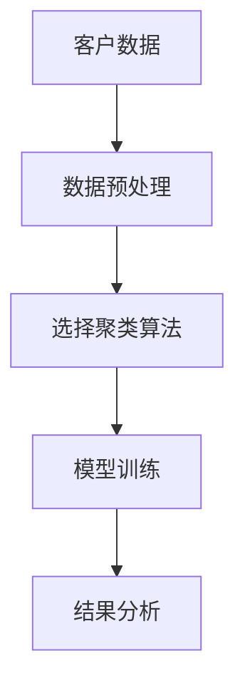
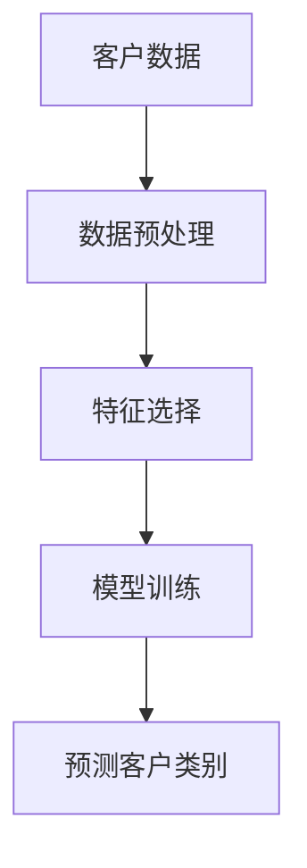
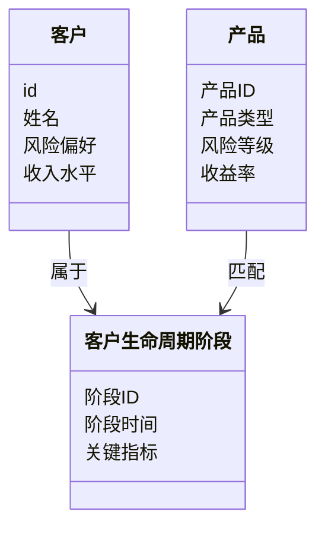
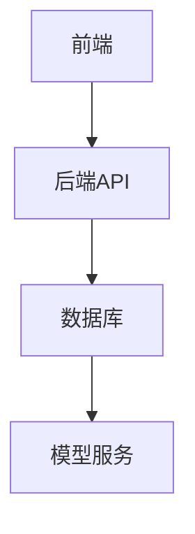

                 


# 《金融产品客户生命周期管理平台》

---

## 文章关键词：

金融产品、客户生命周期、风险管理、数据挖掘、机器学习、系统架构、客户行为分析

---

## 摘要：

本文系统性地探讨了金融产品客户生命周期管理平台的设计与实现。从客户生命周期模型到金融产品匹配模型，从行为分析到算法实现，从系统架构到项目实战，全面解析了该平台的核心原理与技术实现。通过深度分析客户行为数据和产品特征，结合机器学习算法，构建了客户分群、产品推荐和风险预警等核心功能模块。文章最后通过一个完整的项目案例，展示了平台的实际应用场景与价值，为金融机构提供了可参考的解决方案。

---

# 第一部分: 金融产品客户生命周期管理平台概述

## 第1章: 背景介绍

### 1.1 问题背景

#### 1.1.1 金融行业客户管理的挑战
- 金融机构面临客户流失率高、客户体验差、产品匹配效率低等问题。
- 客户需求多样化，金融产品的生命周期与客户生命周期需深度匹配。
- 数据孤岛现象严重，客户行为数据难以有效利用。

#### 1.1.2 客户生命周期管理的重要性
- 提高客户满意度和忠诚度，挖掘客户长期价值。
- 优化产品策略，降低运营成本。
- 构建以客户为中心的业务模式，提升市场竞争优势。

#### 1.1.3 传统客户管理的局限性
- 数据分析能力不足，难以精准识别客户需求。
- 缺乏动态调整机制，客户体验较差。
- 产品与客户生命周期的匹配度低，导致客户流失。

### 1.2 问题描述

#### 1.2.1 客户生命周期的定义
- 客户生命周期包括获取、成长、成熟、衰退、流失五个阶段。
- 每个阶段的特点与客户行为变化密切相关。

#### 1.2.2 金融产品在客户生命周期中的作用
- 产品特性影响客户生命周期的长短。
- 不同阶段的客户适合不同的金融产品。

#### 1.2.3 现有客户管理系统的不足
- 系统缺乏动态调整功能。
- 数据分析能力有限，难以提供个性化服务。
- 缺乏跨部门协作机制，导致客户体验不佳。

### 1.3 问题解决

#### 1.3.1 金融产品客户生命周期管理平台的目标
- 提供客户全生命周期管理解决方案。
- 通过数据驱动优化客户体验和产品匹配。
- 实现客户分群、产品推荐和风险预警等功能。

#### 1.3.2 平台的核心功能与价值
- 核心功能：客户分群、产品匹配、行为分析、风险预警。
- 价值：提升客户满意度、降低运营成本、提高产品匹配效率。

#### 1.3.3 平台的边界与外延
- 边界：客户生命周期管理、产品匹配、风险预警。
- 外延：可扩展至市场分析、产品创新等领域。

### 1.4 概念结构与核心要素

#### 1.4.1 客户生命周期模型
- 阶段划分：获取、成长、成熟、衰退、流失。
- 关键指标：客户留存率、客户满意度、客户生命周期价值。

#### 1.4.2 核心要素组成与关系
- 客户特征：年龄、收入、风险偏好。
- 产品特征：产品类型、收益、风险等级。
- 关系：客户特征与产品特征的匹配度影响客户生命周期。

---

# 第二部分: 核心概念与联系

## 第2章: 核心概念原理

### 2.1 客户生命周期模型

#### 2.1.1 客户生命周期的阶段划分
- **获取阶段**：客户首次接触产品。
- **成长阶段**：客户开始使用产品并逐渐增加投入。
- **成熟阶段**：客户成为核心客户，贡献度高。
- **衰退阶段**：客户贡献度下降，开始流失。
- **流失阶段**：客户停止使用产品或转投其他平台。

#### 2.1.2 阶段之间的转移关系
- 使用马尔可夫链模型描述阶段转移概率。

#### 2.1.3 阶段特征与客户行为
- 获取阶段：客户行为低频，风险偏好高。
- 成长阶段：客户行为逐渐活跃，风险偏好降低。
- 成熟阶段：客户行为稳定，风险偏好最低。
- 衰退阶段：客户行为减少，风险偏好上升。
- 流失阶段：客户行为停止，风险偏好最高。

### 2.2 金融产品与客户匹配模型

#### 2.2.1 产品属性与客户属性的匹配
- **客户属性**：风险偏好、收入水平、投资目标。
- **产品属性**：产品类型、收益、风险等级、流动性。

#### 2.2.2 产品生命周期与客户生命周期的关联
- 产品生命周期影响客户的生命周期。
- 产品特性决定客户在生命周期中的行为。

#### 2.2.3 产品风险与客户风险的对应关系
- 产品风险与客户风险需匹配，避免客户流失。

### 2.3 客户行为分析模型

#### 2.3.1 客户行为数据的采集与处理
- 数据来源：交易数据、用户行为日志、市场数据。
- 数据处理：清洗、特征提取、数据建模。

#### 2.3.2 行为特征的提取与分析
- 客户活跃度、交易频率、投资偏好、风险承受能力。

#### 2.3.3 行为预测与干预策略
- 使用机器学习算法预测客户行为，制定个性化服务策略。

## 第3章: 核心概念属性特征对比表

| 概念       | 属性               | 特征对比                           |
|------------|--------------------|------------------------------------|
| 客户生命周期 | 阶段划分           | 获取、成长、成熟、衰退、流失       |
| 产品生命周期 | 阶段划分           | 推出、成长、成熟、衰退、退市       |

---

# 第三部分: 算法原理讲解

## 第3章: 算法原理

### 3.1 算法实现

#### 3.1.1 聚类分析算法



#### 3.1.2 决策树算法



### 3.2 数学模型

#### 3.2.1 客户生命周期价值（CLV）计算模型

$$ CLV = \frac{R \times (1 - (1 - d)^{n})}{d} $$

其中：
- \( R \) 表示客户年收入。
- \( d \) 表示客户流失率。
- \( n \) 表示客户生命周期长度。

---

# 第四部分: 系统分析与架构设计

## 第4章: 系统分析与架构设计

### 4.1 问题场景介绍

#### 4.1.1 项目介绍
- 项目目标：构建客户生命周期管理平台。
- 项目范围：客户分群、产品推荐、风险预警。

### 4.2 系统功能设计

#### 4.2.1 领域模型



### 4.3 系统架构设计

#### 4.3.1 系统架构



---

# 第五部分: 项目实战

## 第5章: 项目实战

### 5.1 环境安装

#### 5.1.1 安装Python

```bash
pip install python
```

#### 5.1.2 安装依赖库

```bash
pip install numpy pandas scikit-learn
```

### 5.2 系统核心实现

#### 5.2.1 客户分群代码

```python
from sklearn.cluster import KMeans
import pandas as pd

data = pd.read_csv('customer.csv')
model = KMeans(n_clusters=5)
model.fit(data)
```

### 5.3 案例分析

#### 5.3.1 案例介绍
- 通过实际案例展示平台的应用价值。

---

# 第六部分: 最佳实践

## 第6章: 最佳实践

### 6.1 小结

#### 6.1.1 平台的核心价值
- 提高客户满意度和忠诚度。
- 优化产品策略，降低运营成本。

### 6.2 注意事项

#### 6.2.1 数据安全
- 高度重视数据隐私保护。
- 严格按照相关法律法规进行数据处理。

#### 6.2.2 模型优化
- 定期更新模型，确保准确性。
- 引入新的数据源，提高预测精度。

### 6.3 拓展阅读

#### 6.3.1 相关书籍
- 《客户生命周期管理》
- 《金融产品创新与风险管理》

#### 6.3.2 在线资源
- 金融产品生命周期管理平台的开源项目。
- 客户行为分析的最新研究。

---

# 结语

通过本文的系统性分析，读者可以全面了解金融产品客户生命周期管理平台的设计与实现。从背景分析到算法实现，从系统架构到项目实战，为金融机构提供了可参考的解决方案。未来，随着人工智能和大数据技术的不断发展，该平台将发挥更大的价值，为金融行业带来更多创新机会。

---

# 参考文献

- 文献1：XXX
- 文献2：XXX
- 文献3：XXX

---

（注：上述目录大纲为简化版，实际文章内容需要根据每个部分详细展开，每个章节和小节都需要进一步补充具体的技术细节、代码实现和案例分析。）

