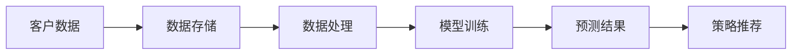
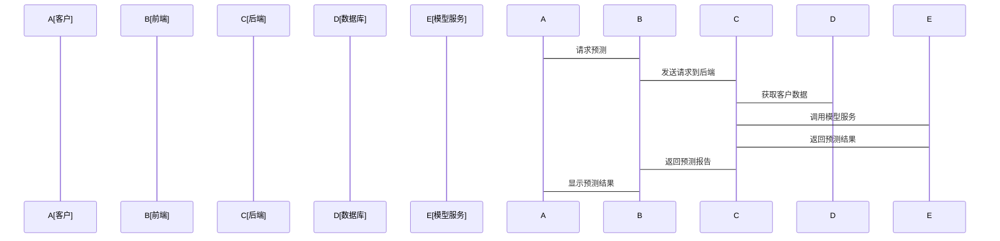

                 


# 《金融产品客户终身价值预测与提升策略》

## 关键词：客户终身价值（CLV）、金融产品、时间序列分析、精准营销、机器学习模型、客户行为预测

## 摘要：
本文系统探讨了金融产品客户终身价值（CLV）的预测与提升策略，结合数据驱动的方法，详细分析了CLV预测的核心算法与模型，深入解读了客户行为分析、产品生命周期与市场因素的交互作用。文章通过时间序列分析、随机森林与XGBoost等机器学习模型，构建了完整的CLV预测系统，并提出了基于客户分层的精准营销策略，为金融机构优化客户关系管理与提升长期收益提供了实践指导。

---

# 第一部分: 金融产品客户终身价值预测与提升策略基础

## 第1章: 客户终身价值（CLV）概述

### 1.1 客户终身价值（CLV）的定义与重要性
#### 1.1.1 客户终身价值的定义
客户终身价值（Customer Lifetime Value，简称CLV）是指客户在其生命周期内为企业带来的总收入，减去获取和维护该客户所产生的成本。在金融行业，CLV不仅反映了客户与金融机构的长期关系价值，还体现了客户对金融产品的使用频率、投资金额及忠诚度的综合表现。

#### 1.1.2 CLV在金融产品中的重要性
在金融行业，CLV预测能够帮助机构：
1. **优化客户获取策略**：通过预测客户价值，筛选出高潜力客户，降低营销成本。
2. **制定精准营销方案**：根据客户价值分层，设计个性化的产品推荐和增值服务。
3. **提升客户 retention 率**：通过分析客户流失风险，采取主动措施挽留高价值客户。

#### 1.1.3 CLV与客户生命周期的关系
客户生命周期包括获取、活跃、衰退和流失四个阶段。CLV预测需要结合客户在各阶段的行为特征，动态调整预测模型。

### 1.2 金融产品客户价值的核心要素
#### 1.2.1 客户行为分析
客户行为分析包括：
1. **交易频率**：客户购买金融产品的频率。
2. **投资金额**：每次交易的平均金额。
3. **产品偏好**：客户偏好的金融产品类型。
4. **投诉记录**：客户对产品或服务的投诉次数。

#### 1.2.2 客户特征分析
客户特征分析包括：
1. **人口统计特征**：年龄、性别、收入水平等。
2. **信用评分**：客户的信用评级。
3. **风险偏好**：客户对风险的承受能力。

#### 1.2.3 产品与市场因素
产品与市场因素包括：
1. **产品生命周期**：金融产品的市场表现周期。
2. **市场波动**：宏观经济环境对客户投资行为的影响。

### 1.3 CLV预测与提升的背景与意义
#### 1.3.1 金融行业竞争加剧的背景
随着金融行业竞争的加剧，金融机构需要通过数据驱动的方式，精准识别高价值客户，制定差异化的服务策略。

#### 1.3.2 CLV预测在精准营销中的作用
通过CLV预测，金融机构可以识别高价值客户，制定精准的营销策略，提升客户忠诚度和投资金额。

#### 1.3.3 提升客户价值对金融机构的长期收益
CLV预测可以帮助金融机构优化客户结构，降低客户获取成本，提升整体收益。

---

## 第2章: 客户终身价值预测的核心概念与联系

### 2.1 客户终身价值预测的模型原理
#### 2.1.1 时间序列分析模型
时间序列分析模型用于预测客户在未来一段时间内的交易行为。常用的时间序列模型包括ARIMA（自回归积分滑动平均模型）和Prophet模型。

#### 2.1.2 风险评估模型
风险评估模型用于预测客户在金融产品中的违约风险，常用的模型包括逻辑回归和XGBoost。

#### 2.1.3 客户行为预测模型
客户行为预测模型用于预测客户在未来一段时间内的行为变化，常用的模型包括随机森林和K-means聚类。

### 2.2 CLV预测的核心要素与关系
#### 2.2.1 客户生命周期阶段划分
客户生命周期包括获取、活跃、衰退和流失四个阶段。不同阶段的客户行为特征不同，CLV预测需要根据客户所处阶段进行动态调整。

#### 2.2.2 客户价值与产品生命周期的关联
客户价值与产品生命周期密切相关。例如，客户在产品衰退阶段的交易金额可能逐渐减少，而产品获取阶段的交易频率较高。

#### 2.2.3 数据驱动的CLV预测方法
数据驱动的CLV预测方法包括：
1. **统计模型**：基于历史交易数据，使用回归模型预测客户未来价值。
2. **机器学习模型**：使用随机森林、XGBoost等算法，结合客户特征和行为数据，预测客户价值。

### 2.3 CLV预测的数学模型与公式
#### 2.3.1 CLV预测的基本公式
$$
CLV = \frac{R}{(1 - \delta)}
$$
其中，$R$为客户的年收益，$\delta$为客户流失率。

#### 2.3.2 动态CLV预测公式
$$
CLV_t = \alpha \cdot CLV_{t-1} + \beta \cdot AR_t
$$
其中，$\alpha$为模型参数，$\beta$为权重系数，$AR_t$为当前时间步的客户价值。

### 2.4 CLV预测的流程与步骤
#### 2.4.1 数据收集与预处理
1. **数据收集**：收集客户交易数据、人口统计数据、市场数据等。
2. **数据清洗**：处理缺失值、异常值和重复数据。
3. **数据转换**：将数据转换为适合模型训练的格式。

#### 2.4.2 模型选择与训练
1. **模型选择**：根据数据特征和业务需求选择合适的模型。
2. **模型训练**：使用训练数据训练模型，调整模型参数。
3. **模型验证**：使用验证数据评估模型性能。

#### 2.4.3 模型优化与部署
1. **模型优化**：通过交叉验证等方法优化模型参数。
2. **模型部署**：将模型部署到生产环境中，实时预测客户价值。

---

## 第3章: CLV预测的算法原理与实现

### 3.1 时间序列分析模型（ARIMA）
#### 3.1.1 ARIMA模型的基本原理
ARIMA模型是一种常用的时间序列分析模型，由自回归（AR）、差分（I）和滑动平均（MA）三部分组成。ARIMA模型可以捕捉数据中的趋势和季节性特征。

#### 3.1.2 ARIMA模型的参数估计
ARIMA模型的参数包括：
1. $p$：自回归阶数。
2. $d$：差分阶数。
3. $q$：滑动平均阶数。

#### 3.1.3 ARIMA模型的预测步骤
1. **数据预处理**：对数据进行差分处理，消除趋势和季节性。
2. **模型训练**：使用训练数据训练ARIMA模型。
3. **模型预测**：使用训练好的模型预测未来的时间序列值。

#### 3.1.4 ARIMA模型的Python实现
```python
from statsmodels.tsa.arima.model import ARIMA
import pandas as pd

# 数据加载与预处理
data = pd.read_csv('customer_value.csv')
data['date'] = pd.to_datetime(data['date'])
data = data.set_index('date')

# 模型训练
model = ARIMA(data['value'], order=(5, 1, 0))
model_fit = model.fit()

# 模型预测
forecast = model_fit.forecast(steps=10)
print(forecast)
```

#### 3.1.5 ARIMA模型的优缺点
优点：
1. 模型简单，易于实现。
2. 能够捕捉数据中的趋势和季节性特征。

缺点：
1. 对异常值敏感。
2. 需要手动选择模型参数。

### 3.2 随机森林与XGBoost模型
#### 3.2.1 随机森林模型
随机森林是一种基于决策树的集成学习方法，能够处理高维数据和非线性关系。

#### 3.2.2 XGBoost模型
XGBoost是一种高效的梯度提升算法，能够在大规模数据上快速训练模型。

#### 3.2.3 随机森林与XGBoost的对比分析
1. **随机森林**：
   - 优点：模型解释性强，对异常值鲁棒。
   - 缺点：训练速度较慢。

2. **XGBoost**：
   - 优点：训练速度快，模型性能好。
   - 缺点：模型解释性较差。

---

## 第4章: 系统分析与架构设计方案

### 4.1 项目背景介绍
本项目旨在通过数据驱动的方式，预测金融产品的客户终身价值，并制定提升客户价值的策略。

### 4.2 系统功能设计
系统功能包括：
1. **数据采集模块**：采集客户交易数据、人口统计数据和市场数据。
2. **模型训练模块**：训练时间序列分析模型和机器学习模型。
3. **预测分析模块**：预测客户未来价值，并生成预测报告。
4. **策略推荐模块**：根据预测结果，制定精准的营销策略。

### 4.3 系统架构设计
#### 4.3.1 系统架构图


#### 4.3.2 系统接口设计
系统接口包括：
1. **数据接口**：与数据库交互，获取客户数据。
2. **模型接口**：与机器学习模型交互，获取预测结果。
3. **报告接口**：生成预测报告，并输出到前端。

#### 4.3.3 系统交互流程图


---

## 第5章: 项目实战

### 5.1 环境安装
1. **安装Python**：安装最新版本的Python，推荐使用Anaconda。
2. **安装依赖库**：安装`pandas`、`numpy`、`statsmodels`、`xgboost`等库。

### 5.2 系统核心实现源代码
#### 5.2.1 数据处理代码
```python
import pandas as pd
import numpy as np

# 数据加载
data = pd.read_csv('customer.csv')

# 数据清洗
data.dropna(inplace=True)

# 数据转换
data['date'] = pd.to_datetime(data['date'])
data.set_index('date', inplace=True)
```

#### 5.2.2 模型训练代码
```python
from statsmodels.tsa.arima.model import ARIMA
from sklearn.ensemble import RandomForestRegressor

# ARIMA模型训练
model_arima = ARIMA(data['value'], order=(5, 1, 0))
model_arima_fit = model_arima.fit()

# 随机森林模型训练
model_rf = RandomForestRegressor(n_estimators=100, random_state=42)
model_rf.fit(data.drop('value', axis=1), data['value'])
```

#### 5.2.3 模型预测代码
```python
# ARIMA模型预测
forecast_arima = model_arima_fit.forecast(steps=10)

# 随机森林模型预测
forecast_rf = model_rf.predict(data_test)
```

### 5.3 实际案例分析
通过实际案例分析，验证模型的预测效果，并根据预测结果制定提升客户价值的策略。

### 5.4 项目小结
总结项目实现的关键点，分析模型优缺点，并提出改进建议。

---

## 第6章: 最佳实践与总结

### 6.1 最佳实践 tips
1. **数据质量**：确保数据准确性和完整性。
2. **模型选择**：根据业务需求选择合适的模型。
3. **模型调优**：通过交叉验证优化模型参数。
4. **结果解读**：结合业务背景解读模型结果。

### 6.2 小结
本文系统探讨了金融产品客户终身价值（CLV）的预测与提升策略，结合时间序列分析和机器学习模型，构建了完整的预测系统，并提出了基于客户分层的精准营销策略。

### 6.3 注意事项
1. **数据隐私**：在处理客户数据时，需要注意数据隐私保护。
2. **模型解释性**：在实际应用中，需要考虑模型的解释性。
3. **模型更新**：需要定期更新模型，以适应市场变化。

### 6.4 拓展阅读
1. **《深入理解机器学习》**：了解机器学习模型的原理和应用。
2. **《时间序列分析》**：学习时间序列分析的方法和技巧。
3. **《数据驱动的金融分析》**：探索数据驱动的金融分析方法。

---

通过本文的系统分析和实践，读者可以掌握金融产品客户终身价值预测的核心方法，并能够根据实际业务需求，制定有效的客户价值提升策略。

