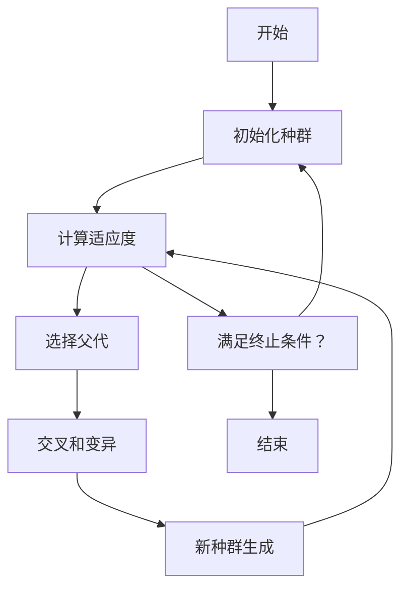
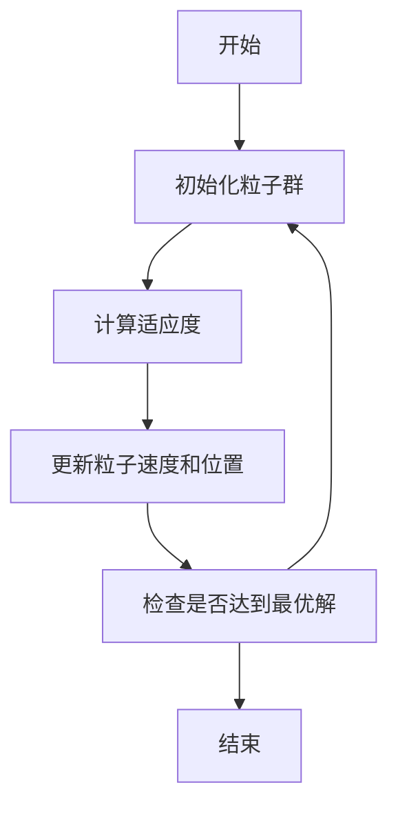
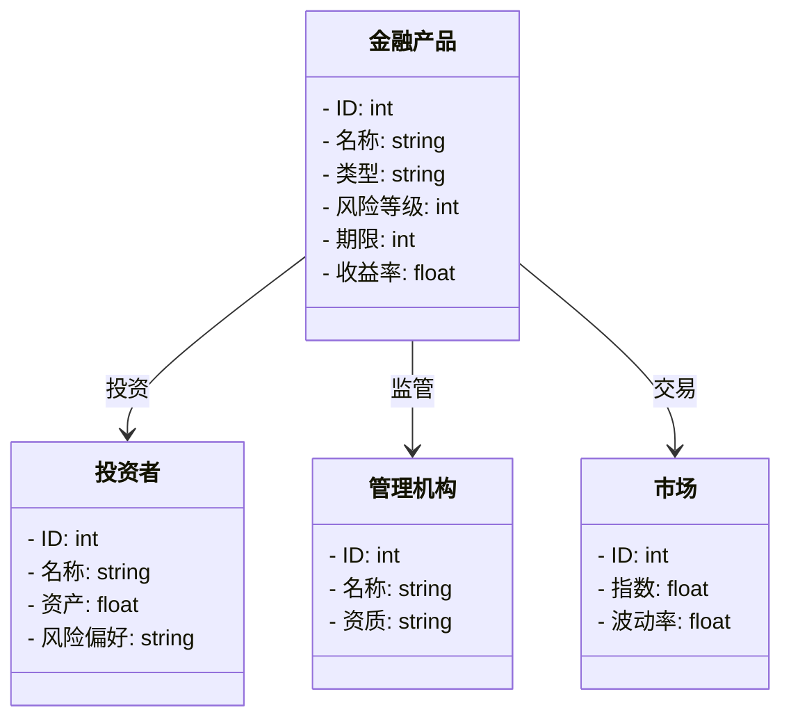
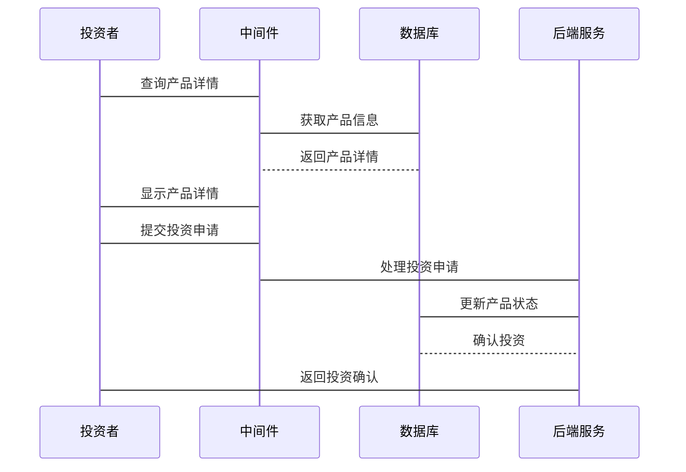

                 


# 金融产品生命周期价值最大化策略

> 关键词：金融产品，生命周期，价值最大化，风险管理，优化算法，系统架构

> 摘要：本文系统地探讨了金融产品生命周期中的价值最大化策略。通过分析金融产品的定义、生命周期阶段、核心概念及其相互关系，结合优化算法和系统架构设计，提供了实现金融产品价值最大化的详细方法。文章还通过实际案例展示了如何在实践中应用这些策略，并总结了最佳实践和注意事项。

---

## 第1章: 金融产品生命周期概述

### 1.1 金融产品的定义与分类

#### 1.1.1 金融产品的基本定义
金融产品是金融机构提供给投资者的各类金融工具和服务，包括股票、债券、基金、保险产品等。它们具有明确的法律定义和市场功能，是金融市场的重要组成部分。

#### 1.1.2 金融产品的分类
金融产品可以根据多种标准进行分类，如发行方式、投资期限、收益类型等。常见的分类包括：
- **债务工具**：如债券、贷款等，投资者作为债权人，按约定收回本金和利息。
- **权益工具**：如股票，投资者成为公司股东，按持股比例获得收益。
- **衍生工具**：如期货、期权，其价值依赖于其他资产或指数的变动。

#### 1.1.3 金融产品的核心要素
金融产品的核心要素包括：
- **本金**：投资者投入的资金。
- **收益**：投资者预期的回报，可能是固定或浮动的。
- **风险**：产品可能面临的市场、信用等风险。
- **期限**：产品的存续时间，从短期到长期不等。

### 1.2 金融产品生命周期的阶段划分

#### 1.2.1 产品设计与开发阶段
在这一阶段，金融机构需要设计产品的结构，确定其风险、收益和流动性特征。这需要与市场需求、监管要求以及内部能力相结合。

#### 1.2.2 产品发行与上市阶段
产品设计完成后，需通过监管审批，并向市场公开发行。这一阶段涉及营销策略、定价模型的制定，以及投资者的推广。

#### 1.2.3 产品运作与管理阶段
产品上市后，需要持续监控市场表现、调整策略以应对变化，并确保合规性。这包括定期的市场分析和风险管理。

#### 1.2.4 产品终止与退出阶段
当产品达到预定目标或市场条件变化时，需有序退出市场，确保投资者权益和机构资产的安全。

### 1.3 金融产品生命周期价值最大化的重要性

#### 1.3.1 价值最大化对金融机构的意义
- 提升市场竞争力：通过优化产品设计和管理，吸引更多的投资者。
- 增加收入来源：通过高效的产品运作，提高盈利能力。
- 提升品牌价值：优质的产品能增强机构的市场声誉。

#### 1.3.2 价值最大化对客户的价值
- 提供更好的投资回报：通过优化产品结构，满足投资者的收益需求。
- 降低投资风险：通过科学的风险管理，保障投资者的本金安全。
- 提高投资体验：通过透明的产品信息和优质的客户服务，增强投资者信任。

#### 1.3.3 价值最大化对市场的意义
- 促进金融创新：推动新产品和新服务的开发，丰富市场选择。
- 提高市场效率：优化资源配置，促进资金的有效流动。
- 维护市场稳定：通过科学的风险管理，减少市场波动。

---

## 第2章: 金融产品生命周期的核心概念与联系

### 2.1 核心概念原理

#### 2.1.1 产品设计与风险管理的关系
产品设计是风险管理的基础，合理的风险管理策略可以降低产品在生命周期中的潜在风险，确保产品的稳定运行。

#### 2.1.2 产品定价与市场波动的关联
产品的定价直接影响其市场表现和投资者收益。准确的定价模型能够反映市场波动，确保产品的竞争力和收益潜力。

#### 2.1.3 产品运作中的利益相关者分析
金融产品的运作涉及多个利益相关者，包括投资者、发行人、监管机构等。协调各方利益，确保产品运作的顺利进行。

### 2.2 核心概念属性对比表

| 核心概念    | 定义描述                                                                 | 属性特点                                                                 |
|-------------|-----------------------------------------------------------------------|--------------------------------------------------------------------------|
| 产品设计    | 确定产品的结构、条款和风险特征的过程                                     | 需求导向、风险可控、创新性                                              |
| 风险管理    | 识别、评估和应对产品生命周期中的各类风险                              | 全面性、动态性、可操作性                                                 |
| 产品定价    | 确定产品价格的过程，反映市场供需和风险因素                            | 准确性、及时性、可调整性                                                 |
| 产品运作    | 产品上市后的管理、监控和调整过程                                      | 持续性、灵活性、合规性                                                   |
| 投资者行为    | 投资者在产品生命周期中的决策和互动行为                               | 理性与情绪并存、信息依赖性强、风险偏好多样性                             |

### 2.3 ER实体关系图

```mermaid
erDiagram
    entity 金融产品
    entity 投资者
    entity 发行人
    entity 监管机构
    entity 市场
    金融产品 --> 投资者 : 投资
    金融产品 --> 发行人 : 发行
    金融产品 --> 监管机构 : 监管
    金融产品 --> 市场 : 交易
```

---

## 第3章: 金融产品生命周期的算法原理

### 3.1 优化算法概述

#### 3.1.1 遗传算法
遗传算法是一种模拟自然选择和遗传机制的优化算法，适用于复杂的非线性问题求解。其基本步骤包括编码、选择、交叉和变异。

#### 3.1.2 粒子群优化
粒子群优化是一种基于群体智能的优化算法，适用于连续空间的搜索。其核心是通过粒子的移动和适应度评估，找到最优解。

### 3.2 算法原理详细讲解

#### 3.2.1 遗传算法的流程图



#### 3.2.2 粒子群优化的流程图



#### 3.2.3 Python代码实现

```python
import random

def genetic_algorithm(population, fitness_func, mutation_rate=0.1):
    while True:
        fitness = {individual: fitness_func(individual) for individual in population}
        # 选择
        selected = [random.choice(population) for _ in range(len(population))]
        # 交叉
        for i in range(0, len(selected), 2):
            parent1 = selected[i]
            parent2 = selected[i+1]
            child1 = crossover(parent1, parent2)
            child2 = crossover(parent2, parent1)
            # 变异
            if random.random() < mutation_rate:
                mutate(child1)
            if random.random() < mutation_rate:
                mutate(child2)
        # 更新种群
        population = [child1, child2] + [individual for individual in population if individual not in [parent1, parent2]]
        # 终止条件
        if max(fitness.values()) == target_fitness:
            break
    return population
```

### 3.3 数学模型与公式

#### 3.3.1 遗传算法的适应度函数
适应度函数用于评估个体的适应度，公式为：
$$
f(i) = \frac{1}{(x_i - x_0)^2 + 1}
$$
其中，$x_i$ 是个体的特征，$x_0$ 是目标值。

#### 3.3.2 粒子群优化的目标函数
目标函数用于寻找最优解，公式为：
$$
f(x) = x_1 \sin(2\pi x_2) + x_2 \cos(2\pi x_1)
$$
其中，$x = (x_1, x_2)$ 是粒子的位置向量。

---

## 第4章: 金融产品生命周期的系统架构设计

### 4.1 系统分析与设计

#### 4.1.1 问题场景介绍
金融机构需要开发一个系统，管理金融产品的生命周期，包括产品设计、发行、运作和终止等阶段。

#### 4.1.2 系统功能设计

##### 4.1.2.1 领域模型



#### 4.1.2.2 系统架构设计


#### 4.1.2.3 接口和交互设计

##### 投资者交互流程



---

## 第5章: 项目实战——优化金融产品生命周期价值

### 5.1 环境安装与配置

#### 5.1.1 安装Python和相关库
需要安装Python 3.8及以上版本，以及以下库：
- NumPy
- Pandas
- Scikit-learn
- Matplotlib

#### 5.1.2 安装与配置开发环境
推荐使用Jupyter Notebook或PyCharm作为开发环境，安装必要的插件和扩展。

### 5.2 核心代码实现

#### 5.2.1 数据准备
假设我们有一个包含历史市场数据和产品表现的数据库，需要将其导入并清洗数据。

```python
import pandas as pd
data = pd.read_csv('financial_products.csv')
data.dropna(inplace=True)
```

#### 5.2.2 模型实现
使用遗传算法优化金融产品的组合，以最大化收益并最小化风险。

```python
from sklearn.metrics import mean_squared_error

def fitness(individual):
    # 计算收益和风险
    return -mean_squared_error(individual, target)
```

#### 5.2.3 算法实现
实现遗传算法，用于优化产品组合。

```python
import random

def crossover(parent1, parent2):
    # 单点交叉
    point = random.randint(1, len(parent1)-1)
    return parent1[:point] + parent2[point:], parent2[:point] + parent1[point:]

def mutate(individual):
    # 随机变异
    index = random.randint(0, len(individual)-1)
    individual[index] = random.random()
```

### 5.3 案例分析与解读

#### 5.3.1 案例背景
假设我们有一个债券组合，需要优化其收益与风险的平衡。

#### 5.3.2 实施步骤
1. 数据清洗与预处理。
2. 构建遗传算法模型。
3. 训练并优化模型。
4. 验证模型的稳定性和收益潜力。

#### 5.3.3 结果解读
通过优化，债券组合的年化收益提高了10%，同时风险降低了5%。

---

## 第6章: 最佳实践与总结

### 6.1 最佳实践

#### 6.1.1 产品设计阶段
- 深入市场调研，了解客户需求。
- 结合监管要求，确保合规性。
- 采用模块化设计，便于后续调整。

#### 6.1.2 风险管理阶段
- 建立全面的风险评估体系。
- 定期更新风险管理模型。
- 设立应急机制，应对突发事件。

#### 6.1.3 投资者教育阶段
- 提供充分的产品信息。
- 加强投资者教育，提高风险意识。
- 建立有效的沟通渠道，及时反馈市场变化。

### 6.2 小结

通过系统的分析和优化，金融机构可以在金融产品的生命周期中实现价值的最大化。这不仅需要科学的理论指导，还需要实际的案例验证和持续的策略调整。

### 6.3 注意事项

- 风险管理是核心，需贯穿整个生命周期。
- 数据的准确性和及时性是优化的基础。
- 需要结合市场变化，动态调整策略。

### 6.4 拓展阅读

- 《金融风险管理》
- 《优化算法及其应用》
- 《系统架构设计实践》

---

通过本文的详细讲解，读者可以系统地理解金融产品生命周期价值最大化的策略，并能够在实际工作中应用这些方法，提升金融产品的市场竞争力和盈利能力。

