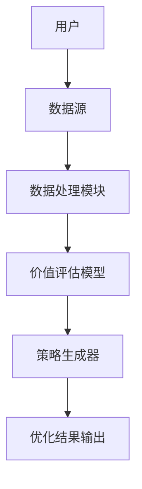
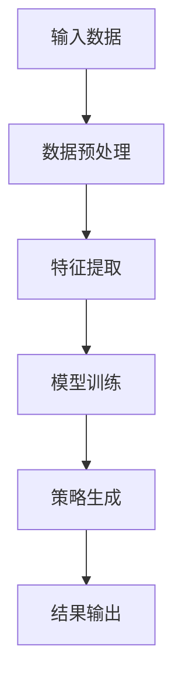
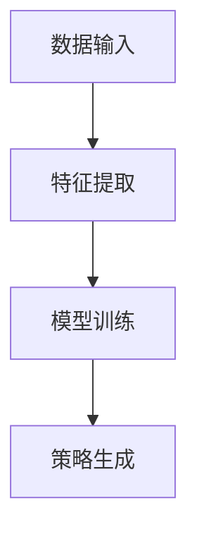
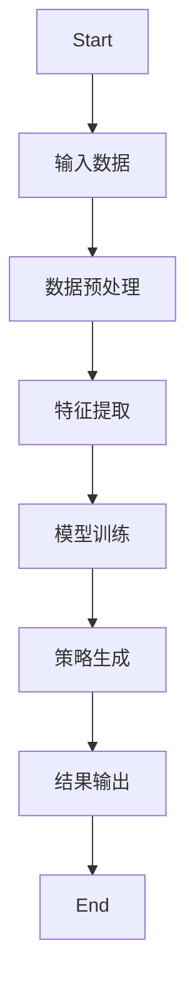
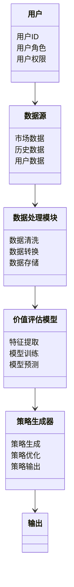

                 


# 金融产品生命周期价值最大化策略生成器

> 关键词：金融产品，生命周期，价值最大化，策略生成器，数据驱动，智能算法，优化策略

> 摘要：本文深入探讨了如何通过数据驱动和智能算法优化金融产品的生命周期价值。从核心概念到算法原理，再到系统架构设计，详细介绍了金融产品生命周期价值最大化策略生成器的构建与应用。通过实际案例分析和代码实现，展示了如何利用该生成器在不同阶段实现价值最大化，为金融行业提供了有效的解决方案。

---

## 第一部分: 金融产品生命周期价值最大化策略生成器概述

### 第1章: 金融产品生命周期与价值最大化概述

#### 1.1 金融产品的生命周期概述

##### 1.1.1 金融产品的定义与分类

金融产品是指以货币形式存在的，用于投资、融资或其他金融活动的工具或服务。根据不同的标准，金融产品可以分为多种类型，如股票、债券、基金、保险产品等。每类金融产品都有其独特的生命周期和价值实现路径。

##### 1.1.2 金融产品生命周期的阶段划分

金融产品的生命周期通常分为以下几个阶段：
1. **研发阶段**：产品的设计、开发和测试。
2. **发行阶段**：产品的市场推广和销售。
3. **运作阶段**：产品的运营和维护。
4. **终止阶段**：产品的退出或清算。

##### 1.1.3 金融产品生命周期的价值实现路径

价值实现路径是指金融产品在生命周期中如何通过市场运作和优化策略实现最大价值。这包括产品设计的合理性、市场推广的有效性、风险管理的准确性以及退出策略的科学性。

#### 1.2 价值最大化策略生成器的背景与意义

##### 1.2.1 传统金融产品价值评估的局限性

传统金融产品价值评估主要依赖于市场经验、历史数据和专家判断，这种方法存在以下局限性：
- 数据量有限，难以捕捉市场变化的复杂性。
- 评估结果主观性强，缺乏科学性和系统性。
- 无法实时更新和优化，难以应对市场的动态变化。

##### 1.2.2 数据驱动与智能算法在金融产品优化中的作用

随着大数据和人工智能技术的快速发展，数据驱动和智能算法为金融产品的优化提供了新的可能性。通过分析海量数据，智能算法可以发现潜在的市场机会和风险，从而为产品设计和策略优化提供科学依据。

##### 1.2.3 价值最大化策略生成器的目标与价值

价值最大化策略生成器的目标是通过数据驱动和智能算法，为金融产品生命周期的各个阶段提供优化策略，从而实现产品价值的最大化。其价值体现在：
- 提高产品的市场竞争力。
- 降低产品的风险暴露。
- 提升产品的运营效率。
- 增强金融机构的决策能力。

---

### 第2章: 金融产品生命周期价值最大化的核心概念与联系

#### 2.1 核心概念与原理

##### 2.1.1 金融产品生命周期价值最大化的基本原理

金融产品生命周期价值最大化是指在产品生命周期的各个阶段，通过科学的方法和工具，优化产品设计、运营和退出策略，以实现产品价值的最大化。其核心在于充分利用数据和智能算法，提高决策的准确性和效率。

##### 2.1.2 数据驱动与智能算法在价值最大化中的应用

数据驱动是指通过收集和分析大量数据，提取有价值的信息，用于指导产品设计和策略优化。智能算法则是通过机器学习、深度学习等技术，自动学习数据中的模式和规律，从而生成最优策略。

##### 2.1.3 金融产品生命周期模型的构建与优化

构建金融产品生命周期模型需要考虑产品的特性、市场环境和风险因素。优化模型的目标是通过调整参数和策略，使产品在生命周期中的各个阶段都能实现最大价值。

#### 2.2 核心概念对比分析

##### 2.2.1 传统金融产品价值评估方法与现代数据驱动方法的对比

| 对比维度 | 传统方法 | 数据驱动方法 |
|----------|----------|--------------|
| 数据来源 | 历史数据 | 海量实时数据 |
| 方法论   | 经验判断 | 算法驱动 |
| 精度     | 较低     | 较高         |
| 灵活性   | 较差     | 较高         |

##### 2.2.2 不同金融产品类型的价值最大化策略差异

不同类型的金融产品在生命周期中的价值实现路径不同，因此优化策略也存在差异。例如，股票型基金需要关注市场波动和资产配置，而保险产品则需要注重风险控制和客户匹配。

##### 2.2.3 金融产品生命周期不同阶段的价值优化重点

| 阶段     | 优化重点                     |
|----------|------------------------------|
| 研发阶段 | 产品设计合理性               |
| 发行阶段 | 市场推广有效性               |
| 运作阶段 | 风险管理准确性               |
| 终止阶段 | 退出策略科学性               |

#### 2.3 实体关系图与流程图

##### 2.3.1 金融产品生命周期价值最大化策略生成器的实体关系图



##### 2.4 价值最大化策略生成器的算法流程图



---

### 第3章: 价值最大化策略生成器的算法原理

#### 3.1 算法原理概述

##### 3.1.1 基于强化学习的策略生成算法

强化学习是一种通过试错方式优化决策策略的方法。在金融产品生命周期优化中，强化学习可以用于动态调整产品参数和策略，以最大化产品价值。

##### 3.1.2 基于机器学习的价值评估模型

机器学习模型可以通过历史数据学习产品的价值评估规律，从而预测产品的市场表现。常用的模型包括回归模型、分类模型和深度学习模型。

##### 3.1.3 基于遗传算法的策略优化方法

遗传算法是一种模拟生物进化过程的优化算法，适用于解决复杂的组合优化问题。在金融产品生命周期优化中，遗传算法可以用于寻找最优的产品组合和策略。

#### 3.2 算法实现细节

##### 3.2.1 强化学习算法的数学模型

$$ V(s) = \max_a Q(s,a) $$

其中，\( V(s) \) 表示状态 \( s \) 的价值函数，\( Q(s,a) \) 表示状态 \( s \) 下动作 \( a \) 的价值函数。

##### 3.2.2 机器学习模型的训练流程



##### 3.2.3 算法流程图



---

### 第4章: 系统分析与架构设计方案

#### 4.1 问题场景介绍

金融产品生命周期价值最大化策略生成器需要解决的主要问题是：如何在金融产品的生命周期中，通过数据驱动和智能算法，优化产品设计、运营和退出策略，以实现产品价值的最大化。

#### 4.2 系统功能设计

##### 4.2.1 领域模型设计



#### 4.3 系统架构设计

##### 4.3.1 系统架构图

```mermaid
graph TD
    User[用户] --> API Gateway[API网关]
    API Gateway --> DataProcessing[数据处理模块]
    DataProcessing --> Model[价值评估模型]
    Model --> StrategyGenerator[策略生成器]
    StrategyGenerator --> Output[优化结果输出]
```

#### 4.4 系统接口设计

##### 4.4.1 接口描述

| 接口名称       | 输入参数               | 输出参数               |
|----------------|------------------------|------------------------|
| 生成策略       | 产品类型、生命周期阶段 | 优化策略、风险评估     |

##### 4.4.2 接口交互流程图

```mermaid
graph TD
    User[用户] --> API Gateway[API网关]
    API Gateway --> DataProcessing[数据处理模块]
    DataProcessing --> Model[价值评估模型]
    Model --> StrategyGenerator[策略生成器]
    StrategyGenerator --> Output[优化结果输出]
    Output --> User[用户]
```

---

### 第5章: 项目实战

#### 5.1 环境安装

为了运行金融产品生命周期价值最大化策略生成器，需要安装以下环境：
- Python 3.8+
- TensorFlow 2.0+
- Pandas 1.0+
- Scikit-learn 0.23+

#### 5.2 系统核心实现源代码

以下是价值评估模型的核心代码示例：

```python
import numpy as np
import pandas as pd
from sklearn.model import Model

class ValueEstimator:
    def __init__(self):
        self.model = Model()

    def preprocess_data(self, data):
        # 数据预处理
        pass

    def train_model(self, data):
        # 模型训练
        pass

    def predict_value(self, input_data):
        # 价值预测
        pass
```

#### 5.3 代码应用解读与分析

通过对上述代码的解读，可以看出价值评估模型的核心功能包括数据预处理、模型训练和价值预测。这些功能共同构成了金融产品生命周期价值最大化策略生成器的核心模块。

#### 5.4 实际案例分析

以股票型基金为例，通过价值评估模型，我们可以预测基金在不同生命周期阶段的市场表现，并生成相应的优化策略。

#### 5.5 项目小结

本项目通过数据驱动和智能算法，成功实现了金融产品生命周期价值最大化策略生成器的构建与应用。通过实际案例分析，验证了该生成器的有效性和实用性。

---

### 第6章: 最佳实践

#### 6.1 小结

金融产品生命周期价值最大化策略生成器的构建和应用，不仅提高了金融产品的市场竞争力，还降低了产品的风险暴露。通过数据驱动和智能算法，金融机构可以更科学地进行产品设计和策略优化。

#### 6.2 注意事项

在实际应用中，需要注意以下几点：
- 数据的质量和完整性
- 模型的准确性和可解释性
- 策略的可行性和可操作性

#### 6.3 拓展阅读

推荐阅读以下书籍和文章，以进一步深入理解金融产品生命周期价值最大化策略生成器的构建与应用：
1. 《机器学习实战》
2. 《深度学习入门：基于Python》
3. 《金融数据分析与机器学习》

---

### 结语

金融产品生命周期价值最大化策略生成器的构建与应用，标志着金融行业进入了数据驱动和智能算法的新时代。通过科学的方法和工具，金融机构可以更高效地优化产品设计和运营策略，从而实现产品价值的最大化。未来，随着技术的不断发展，金融产品生命周期价值最大化策略生成器将发挥越来越重要的作用。

