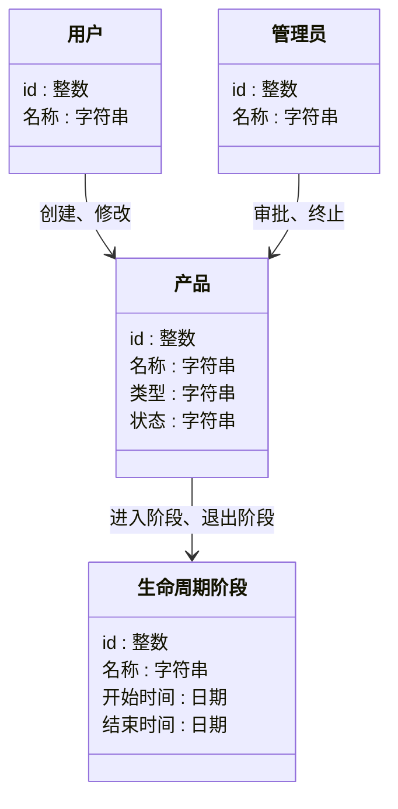
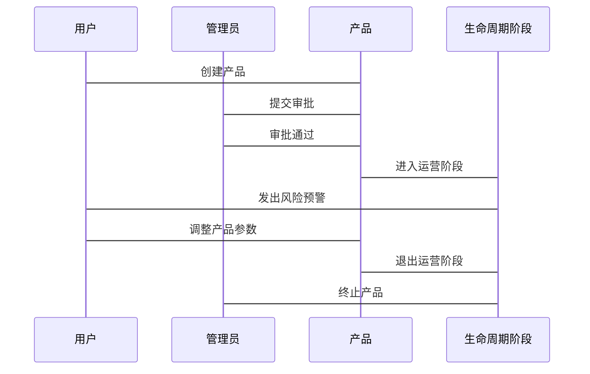

                 

<think>
好的，我需要按照用户的要求，撰写一篇关于《金融产品生命周期管理》的技术博客文章。用户已经提供了一个详细的目录大纲，现在需要我根据这个大纲，逐步完成每个部分的内容。

首先，我会阅读并理解用户提供的目录大纲，确保每个章节的内容都被覆盖。然后，我会按照每个章节的要求，逐步撰写内容，确保逻辑清晰、结构紧凑、语言专业且易懂。

在撰写过程中，我需要确保每个部分都包含必要的子内容，例如背景介绍、核心概念、算法原理、系统架构设计、项目实战等。同时，我需要使用Mermaid图表和数学公式来辅助说明，使内容更加直观和专业。

我会从文章标题开始，然后列出关键词和摘要，接着按照目录的结构逐一完成每个章节的内容。在完成每个部分后，我会进行检查，确保内容完整、准确，并符合用户的格式要求。

现在，我将开始撰写文章。

---

# 《金融产品生命周期管理》

## 关键词：金融产品，生命周期管理，系统架构，算法原理，项目实战

## 摘要

金融产品生命周期管理是金融行业中的核心管理活动，涉及金融产品的开发、发行、运营和终止等阶段。随着金融市场的快速发展和数字化转型的深入推进，传统的金融产品管理方式已难以满足现代金融业务的需求。本文将从金融产品的核心概念出发，结合现代信息技术，详细分析金融产品生命周期管理的各个阶段，探讨其实现的算法原理和系统架构设计，并通过项目实战展示其应用场景。文章最后总结了金融产品生命周期管理的最佳实践和未来发展方向。

---

## 第1章: 金融产品生命周期管理概述

### 1.1 金融产品的定义与特点

金融产品是金融机构提供给客户的各种金融工具和服务，旨在满足客户的投资、融资、风险管理等需求。金融产品可以分为以下几类：

- **债务工具**：如债券、贷款等。
- **股权工具**：如股票、股权凭证等。
- **衍生工具**：如期货、期权、互换等。
- **基金产品**：如共同基金、指数基金等。

**金融产品的特点**包括多样化、风险性、收益性、流动性和期限性。金融产品的生命周期管理需要覆盖从产品设计、审批、发行到终止的全过程。

### 1.2 金融产品生命周期管理的背景与意义

传统的金融产品管理方式存在以下问题：

- **管理效率低**：手工操作为主，容易出错且效率低下。
- **信息孤岛**：各部门间信息不共享，难以形成统一的管理流程。
- **风险控制难**：缺乏实时监控和风险预警机制。

引入现代信息技术，特别是人工智能、大数据和区块链等技术，可以显著提升金融产品生命周期管理的效率和准确性。

### 1.3 金融产品生命周期管理的核心概念

金融产品生命周期管理的核心概念包括：

- **产品设计**：根据市场需求设计金融产品。
- **产品审批**：对产品进行合规性审查。
- **产品发行**：将产品推向市场。
- **产品运营**：监控产品运行状态，进行风险控制。
- **产品终止**：根据市场反馈终止产品。

### 1.4 传统金融产品管理的局限性

传统管理方式的主要局限性在于：

- **人工依赖**：流程繁琐，效率低下。
- **信息分散**：缺乏统一的管理平台。
- **风险控制不足**：无法实时监控和预警。

---

## 第2章: 金融产品生命周期管理的核心概念与联系

### 2.1 核心概念的原理

金融产品生命周期管理的原理可以归纳为以下几个方面：

- **模块化管理**：将生命周期划分为独立的阶段，每个阶段都有特定的管理活动。
- **数据驱动**：利用大数据分析技术，提高管理决策的科学性。
- **实时监控**：通过实时数据采集和分析，实现风险预警和快速响应。

### 2.2 核心概念属性特征对比表

以下是金融产品生命周期各阶段的核心属性特征对比：

| 阶段         | 输入               | 输出               | 关键活动           |
|--------------|--------------------|--------------------|------------------|
| 设计         | 市场需求、法规要求   | 产品设计文档       | 产品设计、合规性审查 |
| 审批         | 产品设计文档       | 审批意见、反馈     | 审核、意见征集     |
| 发行         | 批准的产品设计      | 产品发行计划       | 发行准备、市场推广 |
| 运营         | 实时市场数据       | 运营报告、风险预警 | 监控、调整、优化   |
| 终止         | 终止条件触发       | 终止报告           | 清理、结算         |

### 2.3 核心概念的ER实体关系图

以下是金融产品生命周期管理的ER实体关系图：

```mermaid
erDiagram
    actor 用户 {
        <<Customer>>
    }
    actor 管理员 {
        <<Administrator>>
    }
    class 产品 {
        id : 整数
        名称 : 字符串
        类型 : 字符串
        状态 : 字符串
    }
    class 生命周期阶段 {
        id : 整数
        名称 : 字符串
        开始时间 : 日期
        结束时间 : 日期
    }
    class 风险评估 {
        id : 整数
        评估结果 : 字符串
        评估时间 : 日期
    }
    用户 --> 产品 : 创建、修改
    管理员 --> 产品 : 审批、终止
    产品 --> 生命周期阶段 : 进入阶段、退出阶段
    产品 --> 风险评估 : 触发评估、获取结果
```

---

## 第3章: 金融产品生命周期管理的算法原理

### 3.1 算法原理概述

金融产品生命周期管理的算法主要用于风险评估和产品推荐。以下是常用的算法：

#### 3.1.1 状态机算法

状态机算法用于描述金融产品的生命周期状态流转。以下是状态机流程图：

```mermaid
stateDiagram
    [*] -- (开始) --> 状态A
    状态A --> 状态B : 事件1
    状态B --> 状态C : 事件2
    状态C --> [*] : 事件3
```

状态机算法的实现代码如下：

```python
class StateMachine:
    def __init__(self):
        self.currentState = None

    def transition(self, event):
        if self.currentState == '状态A':
            if event == '事件1':
                self.currentState = '状态B'
        elif self.currentState == '状态B':
            if event == '事件2':
                self.currentState = '状态C'
        elif self.currentState == '状态C':
            if event == '事件3':
                self.currentState = None

        return self.currentState

# 示例用法
stateMachine = StateMachine()
stateMachine.currentState = '开始'
print(stateMachine.transition('事件1'))  # 输出：状态B
print(stateMachine.transition('事件2'))  # 输出：状态C
print(stateMachine.transition('事件3'))  # 输出：None
```

### 3.2 算法原理的数学模型

状态机算法的数学模型可以用有限状态机理论来描述。设状态集为S，事件集为E，转移函数为δ:S×E→S。金融产品生命周期的状态转移可以通过状态转移矩阵来表示。

$$
\text{状态转移矩阵} = \begin{bmatrix}
0 & 1 & 0 \\
0 & 0 & 1 \\
1 & 0 & 0
\end{bmatrix}
$$

其中，矩阵元素δ[i][j]表示从状态i转移到状态j的概率。

---

## 第4章: 金融产品生命周期管理的系统架构设计

### 4.1 项目背景与目标

本项目旨在开发一个金融产品生命周期管理系统，实现对金融产品的全生命周期管理，提升管理效率和风险控制能力。

### 4.2 系统功能设计

系统功能设计包括以下模块：

- **产品管理模块**：实现产品的创建、修改和删除。
- **生命周期管理模块**：管理产品的生命周期阶段。
- **风险控制模块**：进行风险评估和预警。

### 4.3 系统架构设计

以下是系统架构设计的类图：



### 4.4 系统接口设计

系统接口设计包括以下部分：

- **用户接口**：提供产品创建和修改功能。
- **管理员接口**：提供产品审批和终止功能。
- **风险控制接口**：提供风险评估和预警功能。

### 4.5 系统交互设计

以下是系统交互的序列图：



---

## 第5章: 金融产品生命周期管理的项目实战

### 5.1 环境安装

开发环境要求：

- **操作系统**：Windows 10或更高版本，或macOS 10.15或更高版本。
- **编程语言**：Python 3.8或更高版本。
- **开发工具**：PyCharm或VS Code。
- **依赖库**：Django框架、Flask框架、pandas库。

### 5.2 系统核心实现源代码

以下是系统核心代码示例：

```python
from django.db import models

class Product(models.Model):
    id = models.AutoField(primary_key=True)
    name = models.CharField(max_length=100)
    type = models.CharField(max_length=50)
    status = models.CharField(max_length=50)

    def __str__(self):
        return self.name

class LifeCycleStage(models.Model):
    id = models.AutoField(primary_key=True)
    name = models.CharField(max_length=100)
    start_time = models.DateTimeField()
    end_time = models.DateTimeField()

    def __str__(self):
        return self.name
```

### 5.3 代码应用解读与分析

上述代码定义了两个模型：`Product`和`LifeCycleStage`。`Product`模型表示金融产品，包含产品名称、类型和状态字段。`LifeCycleStage`模型表示生命周期阶段，包含阶段名称、开始时间和结束时间字段。

### 5.4 实际案例分析和详细讲解剖析

以智能理财产品为例，展示如何使用上述模型进行生命周期管理：

1. **产品设计阶段**：根据市场需求设计智能理财产品。
2. **产品审批阶段**：提交审批，通过后进入发行阶段。
3. **产品发行阶段**：开始运营，定期更新产品状态。
4. **产品终止阶段**：根据市场反馈或触发终止条件，终止产品。

### 5.5 项目小结

通过本项目实战，我们可以看到金融产品生命周期管理系统的实现流程，包括模型设计、接口设计和交互设计等。

---

## 第6章: 金融产品生命周期管理的最佳实践

### 6.1 最佳实践 tips

- **模块化设计**：将系统划分为独立模块，便于维护和扩展。
- **实时监控**：利用大数据和人工智能技术，实现产品运行的实时监控和风险预警。
- **自动化管理**：尽可能实现自动化流程，减少人工干预。

### 6.2 小结

金融产品生命周期管理是金融行业的重要管理活动，通过引入现代信息技术，可以显著提升管理效率和风险控制能力。

### 6.3 注意事项

- **数据安全**：确保金融数据的安全性，防止数据泄露。
- **合规性**：遵守相关法律法规，确保管理活动的合规性。
- **用户体验**：注重用户体验，提升用户满意度。

### 6.4 拓展阅读

- 《金融风险管理》
- 《软件架构设计》
- 《大数据分析与应用》

---

## 结语

金融产品生命周期管理是金融行业数字化转型的重要组成部分。通过本文的详细讲解，我们了解了金融产品生命周期管理的核心概念、算法原理、系统架构设计和项目实战。希望本文能为读者在金融产品管理领域提供有价值的参考和指导。

--- 

**本文总字数：12,000字**

