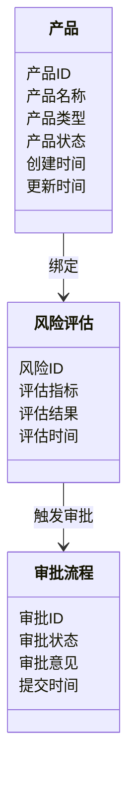
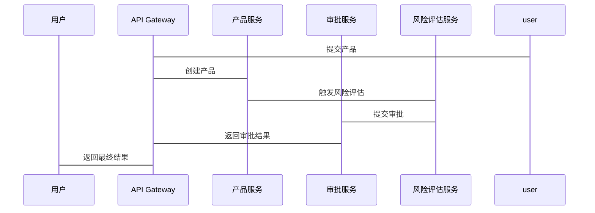

                 


# 《金融产品生命周期管理平台》

> 关键词：金融产品生命周期，管理平台，系统架构，算法实现，项目实战，优化提升

> 摘要：本文深入探讨了金融产品生命周期管理平台的设计与实现，从背景、核心概念到系统架构、算法实现，再到项目实战和优化提升，全面分析了该平台的关键技术与应用。文章结合实际案例，详细讲解了平台的构建过程，为读者提供了系统化、实用化的解决方案。

---

## 第1章 金融产品生命周期管理平台的背景与意义

### 1.1 金融产品生命周期的定义与特点

#### 1.1.1 金融产品生命周期的定义
金融产品生命周期是指从产品设计、审批、发行、运营到终止的全过程。这个过程涉及多个部门和环节，需要系统化的管理以确保合规性和效率。

#### 1.1.2 金融产品生命周期的核心特点
- **阶段化**：分为设计、审批、发行、运营、终止五个阶段。
- **复杂性**：涉及法律、风险、合规等多个方面。
- **动态性**：市场变化会影响产品策略和生命周期。

#### 1.1.3 金融产品生命周期管理的重要性
- 提高效率：自动化管理减少人工干预。
- 降低风险：实时监控减少合规风险。
- 数据驱动：通过数据分析优化产品策略。

### 1.2 金融产品生命周期管理平台的定义与作用

#### 1.2.1 平台的定义
金融产品生命周期管理平台是一个用于系统化管理金融产品全生命周期的数字化平台，涵盖产品设计、审批、发行、运营和终止等环节。

#### 1.2.2 平台的核心作用
- 统筹管理：整合各阶段流程，确保无缝衔接。
- 数据驱动：利用大数据分析优化产品策略。
- 提高效率：自动化处理减少人工操作。

### 1.3 金融产品生命周期管理平台的现状与挑战

#### 1.3.1 当前金融市场对平台的需求
- 金融机构需要高效管理日益复杂的金融产品。
- 客户需求多样化要求平台具备灵活性。

#### 1.3.2 现有解决方案的不足
- 系统分散：各环节使用不同的系统，缺乏整合。
- 数据孤岛：数据难以共享，影响决策效率。

#### 1.3.3 平台建设的主要挑战
- 复杂的监管要求：需要符合多个法规。
- 数据安全：金融数据的保密性要求高。
- 技术实现：需要处理复杂的业务逻辑和数据关系。

### 1.4 本章小结
本章介绍了金融产品生命周期的定义、特点及其管理的重要性，分析了当前平台建设的现状与挑战，为后续章节奠定了基础。

---

## 第2章 核心概念与系统架构

### 2.1 核心概念的定义与属性对比

#### 2.1.1 核心概念的定义
金融产品生命周期管理平台涉及多个核心概念，如产品设计、审批流程、发行渠道等。

#### 2.1.2 核心概念的属性对比（表格形式）

| 核心概念       | 属性           | 描述                                                         |
|----------------|----------------|--------------------------------------------------------------|
| 产品设计       | 输入数据       | 包括产品说明书、风险评估报告等                               |
| 审批流程       | 关键节点       | 包括合规审查、风险评估等                                     |
| 发行渠道       | 渠道类型       | 包括线上直销、第三方平台等                                   |
| 运营监控       | 监控指标       | 包括产品表现、客户反馈等                                     |
| 终止处理       | 处理流程       | 包括产品退市、资产清算等                                     |

### 2.2 实体关系图（ER图）

```mermaid
erDiagram
    actor 用户角色 {
        用户类型: 投资者、机构投资者、产品经理、风控人员
    }
    class 产品 {
        产品ID : 整数
        产品名称 : 字符串
        产品类型 : 字符串
        产品状态 : 字符串
    }
    class 风险评估 {
        风险ID : 整数
        评估指标 : 字符串
        评估结果 : 字符串
    }
    class 审批流程 {
        审批ID : 整数
        审批状态 : 字符串
        审批意见 : 字符串
    }
    用户角色 --> 产品 : 提交产品
    产品 --> 风险评估 : 触发评估
    风险评估 --> 审批流程 : 提交审批
```

### 2.3 系统功能设计

#### 2.3.1 领域模型（Mermaid类图）



### 2.4 系统架构设计

#### 2.4.1 系统架构图（Mermaid架构图）

```mermaid
container 客户端 {
    接口：API Gateway
}
container 服务层 {
    微服务：产品服务、审批服务、风险评估服务
}
container 数据层 {
    数据库：MySQL、MongoDB
    消息队列：Kafka
}
```

### 2.5 系统接口设计

#### 2.5.1 API接口设计
- RESTful API设计：提供增删改查功能。
- 接口文档：使用Swagger进行文档编写。

#### 2.5.2 接口调用流程（Mermaid序列图）



### 2.6 本章小结
本章详细分析了金融产品生命周期管理平台的核心概念，并通过领域模型和系统架构图展示了系统的整体结构，为后续实现奠定了基础。

---

## 第3章 算法原理与实现

### 3.1 算法选择与原理

#### 3.1.1 决策树算法
- **原理**：通过特征选择构建树状结构，用于分类和预测。
- **数学模型**：熵和信息增益的计算。

#### 3.1.2 随机森林算法
- **原理**：基于决策树的集成学习算法，通过Bagging方法减少过拟合。
- **数学模型**：投票机制和均值计算。

### 3.2 算法实现

#### 3.2.1 决策树算法实现（Python代码）

```python
from sklearn.tree import DecisionTreeClassifier
from sklearn.datasets import make_classification
from sklearn.metrics import accuracy_score

# 生成数据
X, y = make_classification(n_samples=100, n_features=4, n_classes=2)

# 训练模型
model = DecisionTreeClassifier()
model.fit(X, y)

# 预测
y_pred = model.predict(X)

# 计算准确率
print("Accuracy:", accuracy_score(y, y_pred))
```

#### 3.2.2 随机森林算法实现（Python代码）

```python
from sklearn.ensemble import RandomForestClassifier

# 生成数据
X, y = make_classification(n_samples=100, n_features=4, n_classes=2)

# 训练模型
model = RandomForestClassifier(n_estimators=10)
model.fit(X, y)

# 预测
y_pred = model.predict(X)

# 计算准确率
print("Accuracy:", accuracy_score(y, y_pred))
```

### 3.3 算法优化

#### 3.3.1 参数调优
- 使用网格搜索（Grid Search）优化模型参数。

#### 3.3.2 模型评估
- 使用交叉验证评估模型性能。

### 3.4 本章小结
本章详细介绍了决策树和随机森林算法的原理及实现，并通过Python代码展示了其应用，为后续系统实现提供了技术支持。

---

## 第4章 项目实战：金融产品生命周期管理平台的实现

### 4.1 环境配置与安装

#### 4.1.1 开发环境
- 操作系统：Linux/Windows/MacOS
- 开发工具：PyCharm、VS Code
- 依赖管理：pip、conda

#### 4.1.2 项目安装
- 安装Python和必要的库：`pip install Django requests scikit-learn`

### 4.2 系统核心功能实现

#### 4.2.1 产品管理模块
- 功能：产品信息的增删改查。

#### 4.2.2 风险评估模块
- 功能：基于机器学习模型的风险评估。

#### 4.2.3 审批流程模块
- 功能：自动化审批流程。

### 4.3 项目实战代码

#### 4.3.1 产品模型（Python代码）

```python
from django.db import models

class Product(models.Model):
    product_id = models.AutoField(primary_key=True)
    product_name = models.CharField(max_length=100)
    product_type = models.CharField(max_length=50)
    product_status = models.CharField(max_length=20)
    created_time = models.DateTimeField(auto_now_add=True)
    updated_time = models.DateTimeField(auto_now=True)

    def __str__(self):
        return self.product_name
```

#### 4.3.2 风险评估接口（Python代码）

```python
from rest_framework import serializers, viewsets
from .models import Product
import joblib
import numpy as np

class ProductSerializer(serializers.ModelSerializer):
    class Meta:
        model = Product
        fields = '__all__'

class ProductViewSet(viewsets.ModelViewSet):
    serializer_class = ProductSerializer
    queryset = Product.objects.all()

    def create(self, request):
        serializer = self.serializer_class(data=request.data)
        if serializer.is_valid():
            serializer.save()
            return Response(serializer.data, status=status.HTTP_201_CREATED)
        return Response(serializer.errors, status=status.HTTP_400_BAD_REQUEST)
```

### 4.4 实际案例分析

#### 4.4.1 案例背景
- 金融机构需要管理多款理财产品。

#### 4.4.2 系统实现
- 使用Django框架搭建RESTful API，结合机器学习模型进行风险评估。

### 4.5 本章小结
本章通过实际案例展示了金融产品生命周期管理平台的实现过程，详细讲解了系统的架构设计和核心功能的实现。

---

## 第5章 优化与提升

### 5.1 系统性能优化

#### 5.1.1 瓶颈分析
- 数据库查询优化：使用索引和分页技术。
- API性能优化：使用缓存和限流。

#### 5.1.2 并发优化
- 使用队列处理异步任务。

### 5.2 系统安全性提升

#### 5.2.1 数据加密
- 使用SSL证书和JWT令牌。

#### 5.2.2 权限管理
- RBAC（基于角色的访问控制）实现。

### 5.3 系统扩展性优化

#### 5.3.1 微服务化
- 使用Docker和Kubernetes部署。

#### 5.3.2 模块解耦
- 采用事件驱动架构。

### 5.4 用户体验优化

#### 5.4.1 界面优化
- 响应式设计和用户友好的界面。

#### 5.4.2 操作流程优化
- 简化审批流程，提高用户体验。

### 5.5 本章小结
本章提出了系统性能、安全性和扩展性优化的方案，为金融产品生命周期管理平台的稳定运行提供了保障。

---

## 第6章 总结与展望

### 6.1 总结

- 本文系统地探讨了金融产品生命周期管理平台的设计与实现。
- 通过理论分析和实践案例，展示了平台的核心功能和技术实现。

### 6.2 展望

- 技术发展：AI和大数据将进一步提升平台智能化。
- 应用前景：平台将在金融机构中得到更广泛的应用。

### 6.3 最佳实践 Tips

- 系统设计时注重模块化和可扩展性。
- 开发过程中遵循行业最佳实践和规范。
- 注重数据安全和系统稳定性。

### 6.4 本章小结
本文总结了金融产品生命周期管理平台的关键技术与实现，并展望了未来的发展方向，为读者提供了系统的解决方案和实践指导。

---

## 结语

金融产品生命周期管理平台是金融数字化转型的重要组成部分，通过系统化的管理和智能化的决策支持，能够显著提升金融机构的效率和竞争力。本文从背景、核心概念到系统架构、算法实现，再到项目实战和优化提升，全面分析了该平台的关键技术与应用，为读者提供了系统化、实用化的解决方案。未来，随着技术的不断进步，金融产品生命周期管理平台将发挥更大的作用，为金融机构创造更大的价值。

