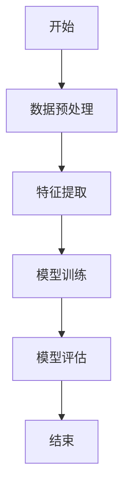
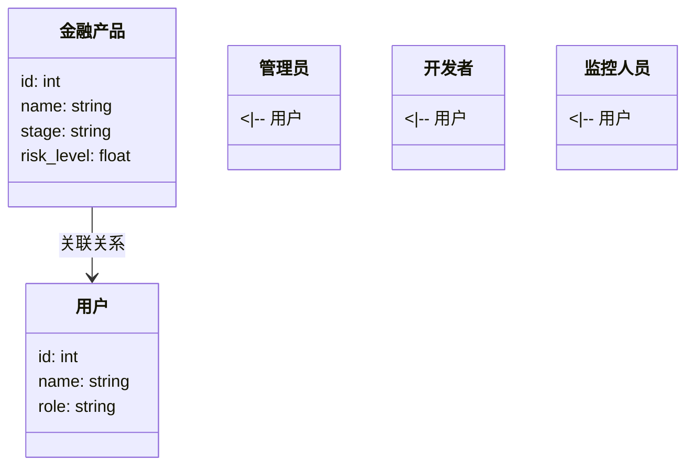
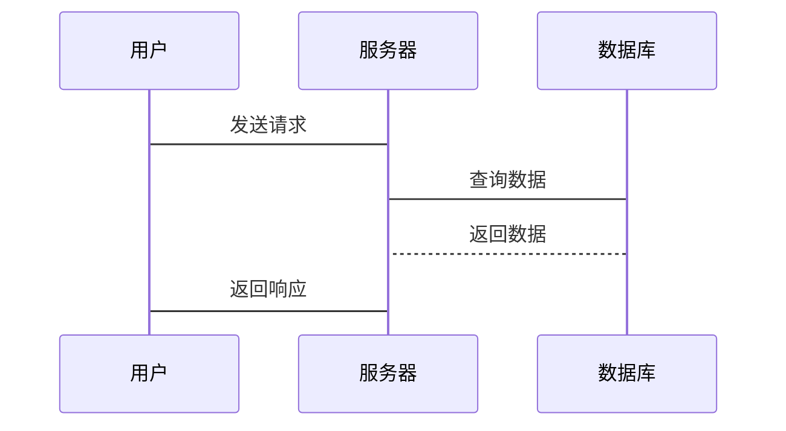

                 


# 《金融产品生命周期管理自动化平台》

> 关键词：金融产品生命周期、自动化管理、系统架构、风险评估、机器学习、平台设计

> 摘要：本文详细探讨了金融产品生命周期管理自动化平台的设计与实现，从背景分析、核心概念、算法原理、系统架构到项目实战，全面解析了如何利用技术手段优化金融产品的全生命周期管理。文章结合实际案例，通过系统化的分析和设计，提出了基于机器学习的风险评估模型，并通过Mermaid图展示了系统的整体架构和交互流程，为读者提供了从理论到实践的完整指南。

---

# 第一部分: 金融产品生命周期管理自动化平台概述

## 第1章: 金融产品生命周期管理概述

### 1.1 金融产品生命周期的概念

#### 1.1.1 金融产品的定义与分类
金融产品是金融机构向市场提供的各种金融服务或金融工具的总称，包括但不限于存款、贷款、保险、基金、股票、债券等。根据产品的性质和用途，金融产品可以分为以下几类：
- **债务类金融产品**：如债券、贷款等。
- **股权类金融产品**：如股票、基金份额等。
- **衍生类金融产品**：如期权、期货等。
- **混合类金融产品**：结合了债务和股权特性的产品，如可转换债券等。

#### 1.1.2 金融产品生命周期的阶段划分
金融产品的生命周期可以分为以下几个阶段：
1. **设计阶段**：根据市场需求和风险偏好设计产品。
2. **审批阶段**：对产品进行合规性和风险评估。
3. **发行阶段**：将产品推向市场并进行销售。
4. **监控阶段**：实时监控产品的运行情况和市场反馈。
5. **终止阶段**：根据市场反馈和监管要求终止产品。

#### 1.1.3 金融产品生命周期管理的重要性
金融产品生命周期管理是金融机构确保产品合规性、风险可控性和市场适应性的关键环节。有效的生命周期管理可以帮助金融机构快速响应市场变化，降低运营成本，提高客户满意度。

---

### 1.2 金融产品生命周期管理的挑战

#### 1.2.1 传统金融产品管理的痛点
- **人工依赖**：传统管理方式依赖大量人工操作，效率低下。
- **信息孤岛**：不同部门之间的数据难以共享，导致信息不一致。
- **风险控制不足**：缺乏实时监控和自动化预警机制，容易导致风险积累。

#### 1.2.2 数字化转型的需求
随着金融科技的快速发展，金融机构需要通过数字化手段提升管理效率和风险控制能力。

#### 1.2.3 自动化管理的必要性
自动化管理可以显著提高金融产品管理的效率和准确性，同时降低人为错误和操作成本。

---

### 1.3 金融产品生命周期管理自动化平台的背景

#### 1.3.1 自动化技术的发展
近年来，人工智能、大数据和区块链等技术的快速发展为金融行业的自动化转型提供了技术支持。

#### 1.3.2 金融行业对自动化管理的需求
金融机构需要通过自动化技术实现产品设计、审批、发行和监控的全流程自动化，以应对日益复杂的市场环境。

#### 1.3.3 平台建设的目标与意义
- **目标**：构建一个能够覆盖金融产品全生命周期的自动化管理平台。
- **意义**：通过自动化技术提升金融机构的运营效率和风险控制能力。

---

## 1.4 本章小结
本章从金融产品的定义、生命周期阶段划分以及管理的重要性三个方面介绍了金融产品生命周期管理的基本概念。同时，分析了传统管理方式的痛点和自动化管理的必要性，为后续章节的系统设计奠定了基础。

---

# 第二部分: 核心概念与联系

## 第2章: 核心概念与系统架构

### 2.1 核心概念原理

#### 2.1.1 金融产品生命周期的核心要素
- **产品设计**：需求分析、产品方案设计。
- **审批流程**：合规性审查、风险评估。
- **发行管理**：产品上线、销售管理。
- **监控与调整**：实时监控、风险预警。
- **终止处理**：产品退市、客户通知。

#### 2.1.2 自动化平台的功能模块
- **数据采集模块**：采集市场数据和产品信息。
- **流程管理模块**：定义和管理产品生命周期的各个阶段。
- **风险监控模块**：实时监控产品运行中的风险。
- **报表生成模块**：生成各类管理报表。

#### 2.1.3 平台与金融业务的结合点
- **数据驱动**：通过数据分析优化产品设计和风险控制。
- **流程自动化**：通过自动化技术减少人工干预。
- **实时监控**：通过实时数据监控确保产品安全运行。

---

### 2.2 核心概念属性特征对比表

| 概念       | 属性               | 特征                                                                 |
|------------|--------------------|----------------------------------------------------------------------|
| 金融产品   | 生命周期阶段       | 设计、审批、发行、监控、终止                                           |
| 自动化平台 | 功能模块           | 数据采集、流程管理、风险监控、报表生成                                 |

---

### 2.3 ER实体关系图

```mermaid
erDiagram
    actor 用户
    actor 管理员
    actor 开发者
    actor 监控人员
    database 金融产品数据库
    database 流程管理数据库
    database 风险监控数据库
    用户 --> 金融产品数据库 : 查询产品信息
    管理员 --> 金融产品数据库 : 管理产品信息
    开发者 --> 流程管理数据库 : 定义流程
    监控人员 --> 风险监控数据库 : 实时监控风险
```

---

## 2.4 本章小结
本章通过对比分析，明确了金融产品生命周期管理自动化平台的核心概念和系统架构。通过ER实体关系图展示了平台与金融业务的结合点，为后续章节的系统设计奠定了基础。

---

# 第三部分: 算法原理讲解

## 第3章: 算法原理与实现

### 3.1 风险评估算法

#### 3.1.1 风险评估模型的构建
风险评估模型是金融产品生命周期管理中的核心算法，主要用于评估产品在不同生命周期阶段的风险水平。

#### 3.1.2 基于机器学习的风险预测算法
风险预测算法采用监督学习方法，通过历史数据训练模型，预测未来风险。

#### 3.1.3 算法流程图



---

#### 3.1.4 算法实现代码
以下是基于Python的实现代码：

```python
import pandas as pd
from sklearn.model_selection import train_test_split
from sklearn.linear_model import LogisticRegression

# 数据预处理
data = pd.read_csv('financial_data.csv')
X = data.drop('target', axis=1)
y = data['target']

# 划分训练集和测试集
X_train, X_test, y_train, y_test = train_test_split(X, y, test_size=0.2, random_state=42)

# 模型训练
model = LogisticRegression()
model.fit(X_train, y_train)

# 模型评估
score = model.score(X_test, y_test)
print(f'模型准确率：{score}')
```

#### 3.1.5 数学模型和公式
风险评估模型采用逻辑回归算法，其数学公式如下：

$$ P(y=1|x) = \frac{e^{\beta_0 + \beta_1x_1 + \beta_2x_2 + \dots + \beta_nx_n}}{1 + e^{\beta_0 + \beta_1x_1 + \beta_2x_2 + \dots + \beta_nx_n}} $$

其中：
- $y$ 是目标变量（风险等级）。
- $x_i$ 是特征变量。
- $\beta_i$ 是模型参数。

---

## 3.2 本章小结
本章通过机器学习算法实现了金融产品风险评估模型，并通过Python代码展示了算法的实现过程。通过数学公式和流程图，详细解析了算法的原理和实现步骤。

---

# 第四部分: 系统分析与架构设计

## 第4章: 系统分析与架构设计

### 4.1 问题场景介绍
金融产品生命周期管理自动化平台需要解决以下问题：
- 如何实现产品设计、审批、发行和监控的全流程自动化。
- 如何实时监控产品运行中的风险。
- 如何生成各类管理报表。

### 4.2 项目介绍
本项目旨在构建一个能够覆盖金融产品全生命周期的自动化管理平台，通过技术手段提升金融机构的管理效率和风险控制能力。

---

### 4.3 系统功能设计

#### 4.3.1 领域模型类图



---

### 4.4 系统架构设计

#### 4.4.1 系统架构图

```mermaid
client -> server: 用户请求
server --> database: 数据查询
server --> process: 业务逻辑处理
server --> database: 更新数据
server -> client: 返回结果
```

---

### 4.5 系统接口设计
系统接口设计采用RESTful API风格，支持以下操作：
- GET /products：获取所有金融产品信息。
- POST /products：创建新的金融产品。
- PUT /products/{id}：更新指定金融产品的信息。
- DELETE /products/{id}：删除指定金融产品。

---

### 4.6 系统交互流程图



---

## 4.7 本章小结
本章通过系统分析和架构设计，明确了金融产品生命周期管理自动化平台的实现方案。通过类图、架构图和交互流程图，详细展示了系统的整体架构和各部分之间的交互关系。

---

# 第五部分: 项目实战

## 第5章: 项目实战

### 5.1 环境安装

#### 5.1.1 安装Python和相关库
```bash
pip install numpy pandas scikit-learn matplotlib
```

#### 5.1.2 安装数据库
选择MySQL或PostgreSQL作为数据库。

---

### 5.2 系统核心实现源代码

#### 5.2.1 数据采集模块
```python
import pymysql

# 数据库连接配置
config = {
    'host': 'localhost',
    'port': 3306,
    'user': 'root',
    'password': 'password',
    'database': 'financial_products'
}

# 连接数据库
conn = pymysql.connect(**config)
cursor = conn.cursor()

# 查询数据
cursor.execute('SELECT * FROM products')
results = cursor.fetchall()

# 关闭连接
cursor.close()
conn.close()
```

#### 5.2.2 风险监控模块
```python
import pandas as pd
from sklearn.linear_model import LogisticRegression

# 加载数据
data = pd.read_csv('financial_data.csv')

# 划分训练集和测试集
X_train, X_test, y_train, y_test = train_test_split(data.drop('target', axis=1), data['target'], test_size=0.2, random_state=42)

# 模型训练
model = LogisticRegression()
model.fit(X_train, y_train)

# 预测风险
predictions = model.predict(X_test)
print('预测结果:', predictions)
```

---

### 5.3 代码应用解读与分析
- 数据采集模块通过数据库连接获取金融产品信息。
- 风险监控模块利用机器学习算法对产品风险进行预测和评估。

---

### 5.4 实际案例分析
以某银行的基金产品为例，通过平台实现产品设计、审批、发行和监控的全流程管理。

---

### 5.5 项目小结
本章通过实际案例展示了金融产品生命周期管理自动化平台的实现过程，详细解读了核心模块的代码实现和应用。

---

# 第六部分: 最佳实践

## 第6章: 最佳实践

### 6.1 小结
本篇文章详细探讨了金融产品生命周期管理自动化平台的设计与实现，从背景分析、核心概念、算法原理、系统架构到项目实战，为读者提供了从理论到实践的完整指南。

---

### 6.2 注意事项
- 数据安全：确保平台的数据安全和合规性。
- 系统性能：优化系统性能，确保平台的高效运行。
- 风险控制：加强风险监控，确保产品安全运行。

---

### 6.3 拓展阅读
- 《金融风险管理》
- 《自动化系统设计与实现》
- 《机器学习在金融领域的应用》

---

# 结语
金融产品生命周期管理自动化平台是金融科技发展的重要方向，通过技术手段优化金融产品的全生命周期管理，能够显著提升金融机构的运营效率和风险控制能力。希望本文能够为读者提供有价值的参考和启发。

