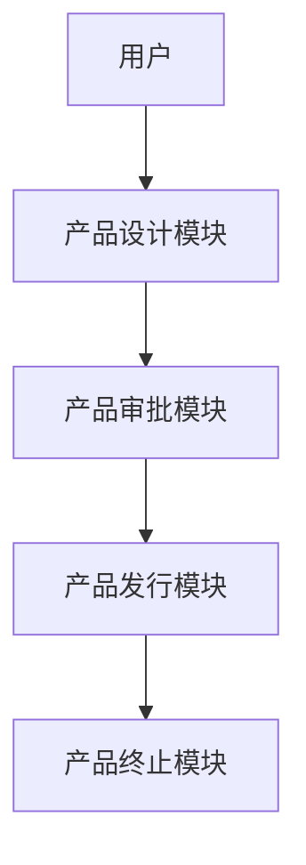
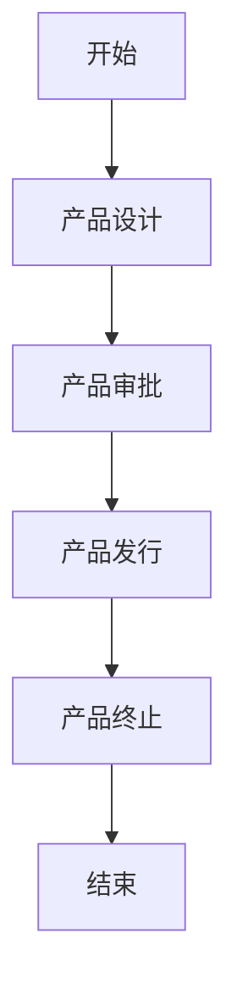

                 


# 金融产品生命周期管理自动化系统

## 关键词：金融产品生命周期、自动化系统、系统架构、算法实现、项目实战

## 摘要：本文详细探讨了金融产品生命周期管理自动化系统的构建与实现。从系统背景和目标出发，分析了金融产品生命周期管理的核心概念，详细讲解了系统架构设计、算法实现、项目实战等关键部分。文章通过丰富的图表和代码示例，系统地阐述了如何利用技术手段实现金融产品的全生命周期自动化管理，帮助金融机构提高效率、降低成本并提升客户体验。

---

# 第1章: 金融产品生命周期管理概述

## 1.1 金融产品生命周期的基本概念

### 1.1.1 金融产品的定义与分类

金融产品是指金融机构向客户提供的各种服务和工具，帮助客户进行投资、融资、风险管理等活动。根据功能和用途，金融产品可以分为以下几类：

- **债务工具**：如债券、贷款等，发行人通过债务融资，投资者获得固定收益。
- **股权工具**：如股票，投资者通过持有股权分享企业收益。
- **衍生品**：如期货、期权，用于对冲或投机价格波动风险。
- **基金产品**：如共同基金、ETF，通过集合投资分散风险。

### 1.1.2 金融产品生命周期的阶段划分

金融产品的生命周期通常包括以下几个阶段：

1. **设计阶段**：确定产品目标、风险偏好、收益结构等。
2. **审批阶段**：由内部或外部机构审核产品合规性。
3. **发行阶段**：向市场推广并销售产品。
4. **运行阶段**：监控产品表现，进行必要的调整。
5. **终止阶段**：根据市场或产品策略终止产品。

### 1.1.3 金融产品生命周期管理的重要性

有效管理金融产品的生命周期可以帮助金融机构：

- **提高效率**：自动化管理减少人工干预，加快产品上线速度。
- **降低风险**：实时监控产品表现，及时发现并处理问题。
- **优化成本**：通过自动化流程减少重复性工作，降低成本。

## 1.2 金融产品生命周期管理的背景与问题

### 1.2.1 传统金融产品管理的痛点

传统金融产品管理存在以下问题：

- **效率低**：手工处理流程耗时长，容易出错。
- **成本高**：需要大量人力投入，增加了运营成本。
- **风险高**：缺乏实时监控，难以及时应对市场变化。

### 1.2.2 数字化转型的必要性

随着金融科技的发展，金融机构逐渐意识到数字化转型的重要性：

- **提升客户体验**：通过自动化服务，客户可以更快地获得产品信息和服务。
- **增强竞争力**：数字化管理能够提高金融机构的市场反应速度和创新能力。
- **降低运营成本**：自动化系统可以减少人工干预，降低运营成本。

### 1.2.3 自动化管理的市场需求

市场需求推动了金融产品生命周期管理的自动化：

- **客户期望**：客户希望获得更快、更透明的服务。
- **监管要求**：日益严格的监管要求需要更高效的管理方式。
- **技术进步**：云计算、人工智能等技术为自动化管理提供了支持。

## 1.3 金融产品生命周期管理自动化的目标

### 1.3.1 提高管理效率

自动化系统通过集成各阶段的管理流程，减少人工操作，提高整体效率。

### 1.3.2 降低运营成本

自动化管理可以减少重复性工作，降低人力和时间成本。

### 1.3.3 提升客户体验

通过自动化服务，客户可以更快地获得产品信息和相关服务，提升满意度。

## 1.4 本章小结

本章介绍了金融产品生命周期的基本概念、管理背景及自动化的目标，为后续章节奠定了基础。通过自动化管理，金融机构可以更高效地管理产品，降低运营成本，并提升客户体验。

---

# 第2章: 金融产品生命周期管理系统的架构设计

## 2.1 系统核心模块的功能概述

### 2.1.1 产品设计模块

产品设计模块负责产品的构思和设计，包括：

- **需求分析**：根据市场和客户需求，确定产品的目标和功能。
- **产品定义**：明确产品的核心功能、收益结构、风险特征等。
- **模块化设计**：将产品分解为可管理的模块，便于后续开发和维护。

### 2.1.2 产品审批模块

产品审批模块负责对产品进行合规性审查：

- **合规检查**：确保产品符合相关法律法规和监管要求。
- **风险评估**：评估产品的市场风险、信用风险等。
- **审批流程**：通过多级审批，确保产品符合机构内部政策。

### 2.1.3 产品发行模块

产品发行模块负责产品的市场推广和销售：

- **市场推广**：制定营销策略，推广产品。
- **销售管理**：管理销售流程，记录销售数据。
- **客户管理**：维护客户信息，提供售后服务。

### 2.1.4 产品终止模块

产品终止模块负责产品的退市和清算：

- **终止条件判断**：根据产品策略或市场变化，判断产品是否需要终止。
- **清算流程**：处理产品的清算，确保资金安全。
- **终止后的处理**：更新系统数据，记录终止原因。

## 2.2 系统的实体关系分析

### 2.2.1 实体关系图（ER图）

以下是系统的实体关系图：

```mermaid
erDiagram
    actor 用户角色 {
        +id: string
        +角色类型: string
    }
    actor 产品类型 {
        +id: string
        +产品名称: string
    }
    actor 产品生命周期阶段 {
        +id: string
        +阶段名称: string
    }
    用户角色 --> 产品生命周期阶段 : 参与
    用户角色 --> 产品类型 : 管理
```

### 2.2.2 系统架构图

以下是系统的架构图：



## 2.3 系统的流程分析

### 2.3.1 产品设计流程

1. 用户提出产品需求。
2. 产品设计模块根据需求进行设计。
3. 设计完成后，进入审批阶段。

### 2.3.2 产品审批流程

1. 产品审批模块对产品进行合规检查和风险评估。
2. 审批通过后，进入发行阶段。

### 2.3.3 产品发行流程

1. 产品发行模块制定营销策略并推广产品。
2. 客户购买产品，系统记录销售数据。

### 2.3.4 产品终止流程

1. 当产品达到终止条件时，进入终止模块。
2. 系统执行清算流程，终止产品。

## 2.4 本章小结

本章详细介绍了金融产品生命周期管理系统的架构设计，包括核心模块的功能、实体关系和系统流程。通过合理的架构设计，系统能够高效地管理产品生命周期，确保各阶段的顺利衔接。

---

# 第3章: 金融产品生命周期管理系统的算法实现

## 3.1 系统的核心算法概述

### 3.1.1 工作流引擎算法

工作流引擎用于自动化处理产品生命周期中的流程：

- **流程定义**：定义各阶段的流程和条件。
- **流程执行**：根据当前状态和条件，自动推进流程。
- **流程监控**：实时监控流程执行情况，及时处理异常。

### 3.1.2 产品状态转移算法

产品状态转移算法用于管理产品的生命周期状态：

- **状态机模型**：定义产品的各个状态及其转移条件。
- **状态转移**：根据当前状态和触发条件，转移产品状态。
- **状态监控**：实时监控产品状态变化，记录日志。

### 3.1.3 风险评估算法

风险评估算法用于评估产品的市场和信用风险：

- **风险指标计算**：计算产品的风险指标，如VaR、CVaR等。
- **风险评估模型**：基于历史数据和市场数据，评估产品风险。
- **风险预警**：当风险超过阈值时，触发预警机制。

## 3.2 工作流引擎的实现

### 3.2.1 工作流引擎的流程图

以下是工作流引擎的流程图：



### 3.2.2 工作流引擎的核心代码

以下是工作流引擎的核心代码：

```python
class WorkflowEngine:
    def __init__(self):
        self.current_stage = "开始"
        self.stages = {
            "开始": "产品设计",
            "产品设计": "产品审批",
            "产品审批": "产品发行",
            "产品发行": "产品终止",
            "产品终止": "结束"
        }

    def advance_stage(self):
        if self.current_stage == "结束":
            return
        self.current_stage = self.stages[self.current_stage]
        print(f"阶段已推进到：{self.current_stage}")

    def get_current_stage(self):
        return self.current_stage
```

## 3.3 状态转移算法的数学模型

### 3.3.1 状态机模型

状态机模型可以表示为：

$$
\text{状态转移} = \text{条件满足} \rightarrow \text{状态变化}
$$

### 3.3.2 状态转移的条件

状态转移的条件可以用逻辑表达式表示：

$$
\text{条件} = (\text{当前状态} \land \text{触发条件}) \rightarrow \text{新状态}
$$

### 3.3.3 状态转移的实现代码

以下是状态转移算法的实现代码：

```python
class StateMachine:
    def __init__(self):
        self.current_state = "开始"
        self.transitions = {
            "开始": {"条件1": "产品设计"},
            "产品设计": {"条件2": "产品审批"},
            "产品审批": {"条件3": "产品发行"},
            "产品发行": {"条件4": "产品终止"},
            "产品终止": {}
        }

    def transition(self, condition):
        if self.current_state in self.transitions:
            if condition in self.transitions[self.current_state]:
                self.current_state = self.transitions[self.current_state][condition]
                return True
        return False

    def get_current_state(self):
        return self.current_state
```

## 3.4 本章小结

本章详细介绍了金融产品生命周期管理系统的算法实现，包括工作流引擎和状态转移算法。通过合理的算法设计，系统能够自动化处理产品生命周期中的各种流程和状态变化。

---

# 第4章: 金融产品生命周期管理系统的项目实战

## 4.1 系统环境安装

### 4.1.1 安装Python

安装Python的命令：

```bash
sudo apt-get install python3
```

### 4.1.2 安装依赖库

安装依赖库的命令：

```bash
pip install -r requirements.txt
```

## 4.2 系统核心实现源代码

### 4.2.1 产品设计模块代码

```python
class ProductDesign:
    def __init__(self):
        self.product_id = ""
        self.product_name = ""
        self.description = ""
```

### 4.2.2 产品审批模块代码

```python
class ProductApproval:
    def __init__(self):
        self.product_id = ""
        self.approval_status = "待审批"
```

### 4.2.3 产品发行模块代码

```python
class ProductIssuance:
    def __init__(self):
        self.product_id = ""
        self.sales_volume = 0
```

### 4.2.4 产品终止模块代码

```python
class ProductTermination:
    def __init__(self):
        self.product_id = ""
        self.termination_reason = ""
```

## 4.3 代码应用解读与分析

### 4.3.1 产品设计模块

产品设计模块负责产品的构思和设计，包括需求分析和产品定义。代码中定义了产品的ID、名称和描述。

### 4.3.2 产品审批模块

产品审批模块负责对产品进行合规检查和风险评估。代码中定义了产品的ID和审批状态。

### 4.3.3 产品发行模块

产品发行模块负责产品的市场推广和销售。代码中定义了产品的ID和销售量。

### 4.3.4 产品终止模块

产品终止模块负责产品的退市和清算。代码中定义了产品的ID和终止原因。

## 4.4 实际案例分析

### 4.4.1 案例背景

假设某银行需要推出一款新的理财产品，从设计到终止的全生命周期管理。

### 4.4.2 案例实现

1. **产品设计**：设计理财产品，包括收益结构、风险等级等。
2. **产品审批**：提交审批，确保产品符合监管要求。
3. **产品发行**：推广产品，记录销售数据。
4. **产品终止**：当产品达到终止条件时，执行清算。

### 4.4.3 案例分析

通过自动化系统，银行可以高效地管理理财产品，减少人工干预，降低运营成本。

## 4.5 项目小结

本章通过实际案例分析，展示了金融产品生命周期管理系统的实现过程。通过代码实现和案例分析，读者可以更好地理解系统的实际应用。

---

# 第5章: 金融产品生命周期管理系统的最佳实践

## 5.1 系统设计的注意事项

### 5.1.1 系统的可扩展性

系统设计应具有良好的可扩展性，以便未来的产品开发和功能扩展。

### 5.1.2 系统的安全性

系统需要具备高安全性，防止数据泄露和恶意攻击。

### 5.1.3 系统的稳定性

系统应具备高稳定性，确保长时间运行无故障。

## 5.2 项目实施中的注意事项

### 5.2.1 需求分析

在项目实施前，需进行充分的需求分析，确保系统功能满足实际需求。

### 5.2.2 测试

在系统上线前，需进行充分的测试，确保系统功能正常。

### 5.2.3 培训

对系统使用人员进行培训，确保他们能够熟练使用系统。

## 5.3 系统维护与优化

### 5.3.1 系统维护

定期维护系统，修复漏洞，优化性能。

### 5.3.2 系统优化

根据使用情况，优化系统架构和功能，提高系统效率。

## 5.4 拓展阅读

### 5.4.1 金融产品生命周期管理的最新技术

阅读相关技术文献，了解最新的技术发展。

### 5.4.2 金融产品生命周期管理的行业最佳实践

参考行业最佳实践，优化系统设计和实施过程。

---

# 第6章: 总结与展望

## 6.1 本章小结

本章总结了金融产品生命周期管理自动化系统的构建与实现，通过系统的架构设计、算法实现和项目实战，展示了如何利用技术手段实现金融产品的全生命周期管理。

## 6.2 未来展望

随着人工智能和大数据技术的发展，金融产品生命周期管理将更加智能化和自动化。未来的研究方向包括：

- **智能化管理**：利用AI技术，实现智能决策和自动化管理。
- **大数据分析**：通过大数据分析，优化产品设计和风险管理。
- **区块链技术**：利用区块链技术，提高系统的透明度和安全性。

---

# 附录: 术语表

- **金融产品生命周期**：金融产品的设计、审批、发行、运行和终止的全过程。
- **自动化系统**：通过技术手段实现流程自动化，减少人工干预。
- **工作流引擎**：用于自动化处理流程的软件组件。
- **状态机模型**：描述系统在不同状态之间的转移过程。
- **风险评估**：评估金融产品的市场和信用风险。

---

通过以上内容，本文系统地介绍了金融产品生命周期管理自动化系统的构建与实现，从理论到实践，为金融机构提供了重要的参考和指导。

