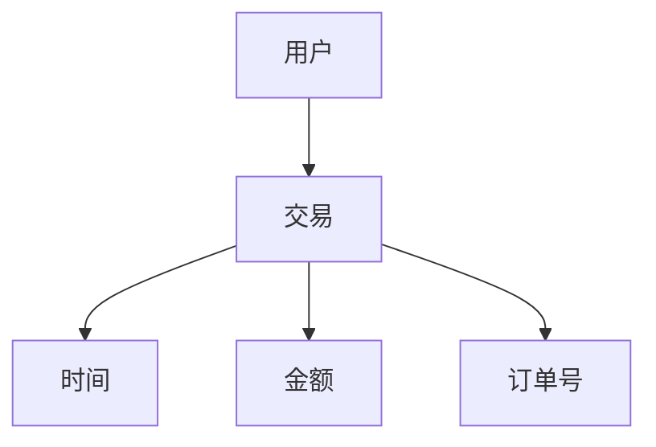

                 


# 《金融大数据实时异常检测平台》

---

## 关键词：金融大数据、实时异常检测、机器学习、时间序列分析、系统架构、数据安全、高效算法

---

## 摘要：  
本文详细探讨了金融大数据实时异常检测平台的设计与实现。从背景到技术原理，从算法实现到系统架构，再到实际项目案例，系统性地分析了实时异常检测的核心概念、关键算法和工程实践。文章结合理论与实践，深入剖析了金融领域实时异常检测的挑战与解决方案，并通过具体的代码实现和案例分析，帮助读者全面理解如何构建高效可靠的金融大数据实时异常检测系统。

---

# 第1章: 金融大数据与实时异常检测概述

## 1.1 金融大数据的背景与特点

### 1.1.1 金融数据的多样性与复杂性  
金融数据具有时间性、连续性、关联性和高价值性等特点，涵盖交易数据、市场数据、用户行为数据等多种类型。

### 1.1.2 大数据在金融领域的应用价值  
通过大数据技术，金融行业可以实现风险控制、智能投资、客户画像、反欺诈等场景的优化。

### 1.1.3 金融大数据的挑战与机遇  
挑战包括数据量大、数据类型多样、实时性要求高等；机遇则体现在通过数据驱动提升金融业务的效率和精准度。

---

## 1.2 实时异常检测的定义与重要性

### 1.2.1 异常检测的定义与分类  
异常检测是通过分析数据，识别偏离预期的行为或事件。在金融领域，异常检测可以分为交易异常、市场异常、用户行为异常等。

### 1.2.2 实时异常检测的核心价值  
实时检测可以快速发现并处理异常事件，帮助金融机构避免损失、防范风险、提升用户体验。

### 1.2.3 异常检测在金融领域的应用场景  
包括反欺诈、风险管理、市场监控、交易监控等。

---

## 1.3 金融大数据实时异常检测的边界与外延

### 1.3.1 异常检测的边界条件  
包括时间范围、数据范围、业务范围等。

### 1.3.2 外延与相关概念的区分  
异常检测与数据挖掘、机器学习、实时计算等技术的关联与区别。

### 1.3.3 核心要素与组成结构  
包括数据源、算法模型、计算引擎、结果展示等核心要素。

---

## 1.4 本章小结  
本章从金融大数据和实时异常检测的背景出发，阐述了实时异常检测的核心价值和应用场景，并明确了其边界和外延。

---

# 第2章: 金融大数据实时异常检测的核心概念

## 2.1 数据特征分析

### 2.1.1 时间序列数据的特征  
金融数据通常具有时间序列特性，包括趋势性、周期性、随机性等。

### 2.1.2 异常数据的特征  
异常数据通常是偏离均值、方差较大、或与其他数据点显著不同的点。

### 2.1.3 数据分布与统计特征  
通过统计方法（如均值、标准差、偏度等）分析数据分布特征，为异常检测提供基础。

---

## 2.2 异常检测方法对比

### 2.2.1 基于统计的方法  
- **Z-Score方法**：通过计算数据点与均值的偏离程度，判断是否为异常。  
- **马尔可夫链模型**：通过状态转移概率判断数据序列的异常性。

### 2.2.2 基于机器学习的方法  
- **Isolation Forest**：通过随机森林算法，识别数据中的异常点。  
- **One-Class SVM**：通过支持向量机，学习正常数据的分布，识别异常点。  

### 2.2.3 基于深度学习的方法  
- **LSTM网络**：用于时间序列数据的异常检测。  
- **Autoencoder**：通过自编码器重构数据，判断重构误差是否异常。

---

## 2.3 系统架构与实体关系

### 2.3.1 实体关系图（ER图）  


---

## 2.4 本章小结  
本章通过分析金融数据的特征，对比了多种异常检测方法，明确了系统的实体关系和架构设计。

---

# 第3章: 异常检测算法原理

## 3.1 基于统计的异常检测算法

### 3.1.1 马尔可夫链模型  
通过状态转移概率判断数据序列的异常性。  
$$P(A|B) = \frac{P(B|A)P(A)}{P(B)}$$  

### 3.1.2 Z-Score方法  
通过计算数据点与均值的偏离程度。  
$$Z = \frac{x - \mu}{\sigma}$$  

### 3.1.3 LOF算法  
通过局部密度对比判断异常点。  
$$LOF(x) = \frac{d(x, k NN) }{d(k NN, x)}$$  

---

## 3.2 基于机器学习的异常检测算法

### 3.2.1 Isolation Forest算法  
通过随机森林算法，隔离异常点。  
代码示例：
```python
from sklearn.ensemble import IsolationForest
model = IsolationForest(contamination=0.05)
model.fit(X)
```

### 3.2.2 One-Class SVM算法  
通过支持向量机，学习正常数据的分布。  
代码示例：
```python
from sklearn.svm import OneClassSVM
model = OneClassSVM(nu=0.05)
model.fit(X)
```

---

## 3.3 时间序列异常检测算法

### 3.3.1 ARIMA模型  
通过时间序列建模，预测并识别异常。  
$$ARIMA(p, d, q)$$  

### 3.3.2 LSTM网络  
通过深度学习模型，捕捉时间序列的复杂模式。  
代码示例：
```python
import keras
from keras.layers import LSTM, Dense
model = keras.Sequential()
model.add(LSTM(64, input_shape=(timesteps, features)))
model.add(Dense(1))
model.compile(loss='mean_squared_error', optimizer='adam')
```

---

## 3.4 本章小结  
本章详细介绍了多种异常检测算法的原理与实现，重点分析了统计方法、机器学习方法和深度学习方法的区别与联系。

---

# 第4章: 系统架构与设计

## 4.1 问题场景介绍

### 4.1.1 金融交易实时监控  
实时检测交易中的异常行为，如欺诈交易、大额交易等。

### 4.1.2 市场波动监控  
实时监控市场波动，识别异常价格波动。

### 4.1.3 用户行为分析  
识别用户行为中的异常，如异常登录、异常交易等。

---

## 4.2 系统功能设计

### 4.2.1 数据采集模块  
负责采集交易数据、市场数据、用户行为数据等。

### 4.2.2 数据预处理模块  
包括数据清洗、特征提取、数据标准化等。

### 4.2.3 模型训练模块  
基于历史数据训练异常检测模型。

### 4.2.4 实时检测模块  
基于当前数据，实时判断是否存在异常。

### 4.2.5 结果展示模块  
将检测结果可视化，提供预警和报告。

---

## 4.3 系统架构设计

### 4.3.1 分层架构  
- 数据层：存储原始数据和特征数据。  
- 服务层：提供数据处理和模型调用的服务。  
- 展示层：提供用户交互和结果展示的界面。

### 4.3.2 微服务架构  
- 数据采集服务、数据处理服务、模型服务、检测服务、展示服务。

---

## 4.4 本章小结  
本章通过分析系统架构，明确了各模块的功能与交互关系。

---

# 第5章: 项目实战

## 5.1 环境搭建

### 5.1.1 技术选型  
- 数据库：MySQL、Hadoop  
- 计算框架：Spark、Flink  
- 开发语言：Python、Java  
- 模型训练：TensorFlow、Scikit-learn

### 5.1.2 环境配置  
安装必要的软件和依赖库，配置开发环境。

---

## 5.2 核心实现

### 5.2.1 数据采集与预处理  
代码示例：
```python
import pandas as pd
data = pd.read_csv('transaction.csv')
data = data.dropna().astype('float32')
```

### 5.2.2 模型训练与部署  
代码示例：
```python
from sklearn.ensemble import IsolationForest
model = IsolationForest(contamination=0.05)
model.fit(X_train)
```

---

## 5.3 案例分析

### 5.3.1 交易异常检测  
通过模型识别欺诈交易，减少损失。

### 5.3.2 市场波动监控  
实时监控市场价格波动，识别异常价格。

### 5.3.3 用户行为分析  
识别异常登录行为，防范账户被盗。

---

## 5.4 本章小结  
本章通过实际项目案例，详细介绍了系统的搭建与实现过程。

---

# 第6章: 最佳实践与总结

## 6.1 最佳实践

### 6.1.1 数据质量的重要性  
确保数据的完整性和准确性，避免因数据问题导致误判。

### 6.1.2 模型优化技巧  
通过数据增强、参数调优、模型融合等方式提升检测效果。

### 6.1.3 系统性能优化  
通过分布式计算、缓存优化、流处理技术提升系统的实时性和稳定性。

---

## 6.2 小结与展望

### 6.2.1 本章小结  
总结全文内容，重申实时异常检测的重要性和实现价值。

### 6.2.2 未来展望  
随着人工智能和大数据技术的发展，实时异常检测将更加智能化、自动化。

---

## 6.3 注意事项

### 6.3.1 数据隐私与安全  
确保金融数据的安全性，遵守相关法律法规。

### 6.3.2 模型的可解释性  
在金融领域，模型的可解释性至关重要，尤其是在风险控制场景。

---

## 6.4 拓展阅读

### 6.4.1 时间序列分析的高级方法  
如Prophet模型、GARCH模型等。

### 6.4.2 深度学习在金融领域的应用  
如使用Transformer模型进行时间序列分析。

---

# 结语

金融大数据实时异常检测平台的建设是一个复杂而重要的任务，需要结合先进的技术手段和丰富的业务经验。通过本文的系统性分析和实践分享，希望能为读者提供有价值的参考，帮助他们更好地理解和实现金融领域的实时异常检测系统。

