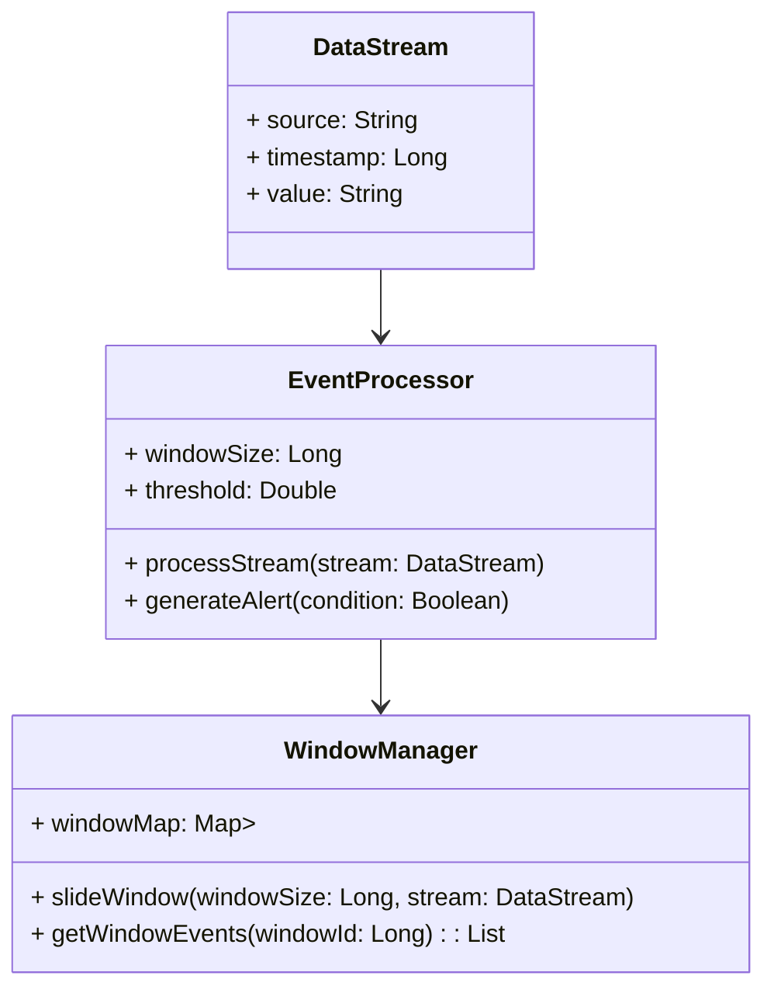
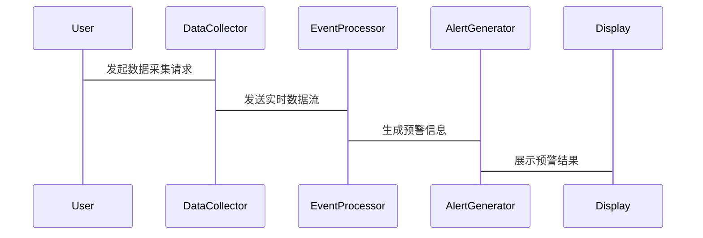
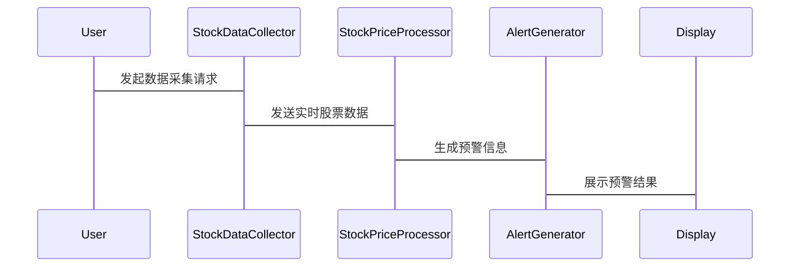

                 


# 《金融大数据实时流处理架构设计》

## 关键词：金融大数据，实时流处理，架构设计，Flink，Kafka，事件时间

## 摘要：  
本文深入探讨金融大数据实时流处理的架构设计，从核心概念、技术原理、系统架构到项目实战，全面解析如何高效处理金融领域的实时数据流。通过分析金融大数据的特点和实时流处理的重要性，结合具体案例，详细阐述了基于Flink和Kafka的实时流处理架构，为金融行业提供可参考的解决方案。

---

# 第1章: 金融大数据与实时流处理概述

## 1.1 金融大数据的现状与挑战
### 1.1.1 金融行业数据的特点
- 数据量大：金融行业每天产生的交易数据、市场数据、用户行为数据等呈指数级增长。
- 数据类型多样：包括结构化数据（如交易记录）、半结构化数据（如JSON格式的市场报告）和非结构化数据（如文本形式的新闻）。
- 数据实时性强：金融市场的高频交易、实时行情等要求数据处理必须低延迟。
- 数据安全性高：金融数据涉及用户隐私和交易安全，必须严格遵守数据保护法规（如GDPR）。

### 1.1.2 大数据技术在金融领域的应用
- **风险管理**：实时监控市场波动、交易行为，预测风险事件。
- **交易优化**：通过实时数据分析优化交易策略，提升交易效率。
- **客户行为分析**：实时分析客户行为，提供个性化服务。
- **反欺诈检测**：实时检测异常交易行为，防范欺诈风险。

### 1.1.3 金融大数据的挑战与机遇
- **挑战**：数据量大、类型多样、处理实时性强、数据安全要求高。
- **机遇**：通过大数据技术实现精准营销、智能风控、高效交易等，提升金融机构的核心竞争力。

## 1.2 实时流处理的重要性
### 1.2.1 实时流处理的定义
实时流处理是指对连续不断地数据流进行实时处理，确保数据在产生后尽可能快地被处理并产生结果。与批量处理不同，实时流处理注重处理的实时性和响应速度。

### 1.2.2 金融领域对实时流处理的需求
- **高频交易**：高频交易需要毫秒级的响应速度，实时流处理是其核心支撑。
- **实时监控**：实时监控市场波动、交易行为，及时发现异常情况。
- **实时预警**：基于实时数据流，对潜在风险进行预警，避免损失扩大。

### 1.2.3 实时流处理的优势与应用场景
- **优势**：
  - 实时性：数据生成后立即处理，减少延迟。
  - 高效性：能够处理大规模数据流，提升处理效率。
  - 可扩展性：支持海量数据处理，适用于金融市场的高并发场景。
- **应用场景**：
  - 实时股票价格监控
  - 交易行为分析
  - 风险预警
  - 市场情绪分析

## 1.3 金融大数据实时流处理的技术发展
### 1.3.1 大数据技术的演进
- **传统数据处理**：基于关系型数据库的批量处理，无法满足实时性要求。
- **大数据技术的兴起**：Hadoop、Spark等技术的出现，解决了海量数据存储和处理的问题。
- **实时流处理技术的发展**：Flink、Kafka、Storm等实时流处理框架的出现，推动了实时流处理技术的成熟。

### 1.3.2 实时流处理技术的发展历程
- **早期阶段**：基于消息队列（如Kafka）的简单流处理，主要用于数据传输和存储。
- **成熟阶段**：引入流处理框架（如Flink、Storm），实现复杂的流处理逻辑，支持窗口、状态管理等功能。
- **智能化阶段**：结合机器学习、人工智能技术，实现智能风控、智能交易等高级应用。

### 1.3.3 当前主流的实时流处理框架
- **Flink**：支持事件时间、处理时间、截止时间等多种时间语义，适合复杂场景。
- **Kafka**：作为分布式流处理平台，广泛应用于实时数据传输。
- **Storm**：适合需要高吞吐量和低延迟的实时流处理场景。
- **Spark Streaming**：基于微批处理的流处理框架，适合对延迟要求不苛刻的场景。

## 1.4 本章小结
本章介绍了金融大数据的特点、应用场景以及实时流处理的重要性。通过对比传统数据处理和实时流处理的技术发展，分析了当前主流的实时流处理框架及其适用场景，为后续的架构设计奠定了基础。

---

# 第2章: 金融大数据实时流处理的核心概念

## 2.1 流处理的基本概念
### 2.1.1 流处理的定义与特点
- **定义**：流处理是指对实时产生的数据流进行持续处理，生成实时结果或更新状态。
- **特点**：
  - 实时性：数据生成后立即处理。
  - 连续性：数据流是连续的，处理过程也是连续的。
  - 高效性：处理速度高，支持大规模数据流。

### 2.1.2 金融实时流处理的需求
- **实时性**：金融交易、市场监控需要毫秒级的响应。
- **准确性**：处理结果必须准确无误，避免因错误决策导致的损失。
- **可扩展性**：金融数据量大，需要支持高并发和大规模数据流处理。

### 2.1.3 流处理与批量处理的对比
| 对比维度       | 流处理                           | 批量处理                           |
|----------------|----------------------------------|------------------------------------|
| 数据来源       | 实时数据流                      | 批次数据                            |
| 处理时间       | 实时处理                        | 批次处理，周期性执行                |
| 延迟           | 低延迟，秒级或毫秒级            | 较高延迟，分钟级或小时级            |
| 数据量         | 数据量小，但实时性要求高         | 数据量大，但处理周期较长            |
| 适用场景       | 高频交易、实时监控              | 报告生成、数据分析                  |

## 2.2 金融实时流处理的关键特性
### 2.2.1 实时性与低延迟
- 实时性是金融实时流处理的核心要求，必须保证数据从产生到处理完成的时间尽可能短。
- 低延迟是实现实时性的关键，需要优化系统架构和处理流程，减少不必要的中间环节。

### 2.2.2 可扩展性与高吞吐量
- 可扩展性：系统能够根据数据量的增加动态扩展处理能力，支持大规模数据流。
- 高吞吐量：系统能够处理每秒数百万条数据，满足金融市场的高并发需求。

### 2.2.3 容错性与可靠性
- 容错性：系统在节点故障时能够自动恢复，保证数据不丢失，处理不中断。
- 可靠性：保证处理结果的准确性，避免因系统故障导致的错误决策。

## 2.3 金融流处理的窗口机制
### 2.3.1 时间窗口的定义
- **事件时间**：数据生成的时间，由数据本身携带的时间戳。
- **处理时间**：数据被处理的时间，由处理节点的时间戳决定。
- **截止时间**：数据必须在某个时间点之前处理完成的最后期限。

### 2.3.2 滑动窗口与滚动窗口的区别
- **滑动窗口**：窗口向前滑动时，旧数据被丢弃，新数据进入窗口。适用于需要处理固定时间段的数据。
- **滚动窗口**：窗口向前滑动时，旧数据仍然保留在窗口中，窗口大小固定。适用于需要处理最新数据的场景。

### 2.3.3 会话窗口的应用场景
- **会话窗口**：基于事件时间的窗口，适用于需要处理连续事件的场景，如实时交易监控。

## 2.4 本章小结
本章详细讲解了流处理的基本概念、关键特性以及窗口机制，重点分析了金融实时流处理的核心要素，为后续的系统架构设计奠定了理论基础。

---

# 第3章: 金融实时流处理的算法原理

## 3.1 流处理的模型与算法
### 3.1.1 流处理的基本模型
- **事件驱动模型**：基于事件的时间戳，按顺序处理数据流。
- **时间戳排序**：将数据流中的事件按时间戳排序，确保处理顺序的正确性。

### 3.1.2 基于滑动窗口的流处理算法
- **滑动窗口算法**：适用于固定时间窗口的实时处理，通过队列结构维护窗口内的数据。
- **滑动窗口实现**：使用双指针或队列结构，动态维护窗口内的数据范围。

### 3.1.3 基于事件驱动的流处理算法
- **事件驱动算法**：根据事件的时间戳，动态调整处理窗口，确保处理顺序的正确性。

## 3.2 流处理的数学模型与公式
### 3.2.1 时间窗口的数学表达式
- 时间窗口的开始时间：$start\_time = event\_time - window\_size$
- 时间窗口的结束时间：$end\_time = event\_time$

### 3.2.2 流处理的吞吐量计算公式
- 吞吐量（TPS）：$TPS = \frac{\text{处理的数据量}}{\text{时间}}$
- 延迟计算公式：$delay = \text{处理完成时间} - \text{事件时间}$

### 3.2.3 延迟的计算与优化公式
- 平均延迟：$\text{平均延迟} = \frac{\sum \text{delay}}{\text{处理的事件数}}$
- 延迟优化公式：通过并行化处理、优化数据结构等方法，减少处理时间，降低延迟。

## 3.3 实际案例分析
### 3.3.1 股票价格实时监控的流处理算法
- **案例背景**：实时监控股票价格波动，触发预警机制。
- **算法实现**：
  1. 收集股票价格数据，获取事件时间戳。
  2. 按照时间窗口（如5分钟）进行滑动窗口处理。
  3. 计算窗口内的价格波动幅度，触发预警条件。

### 3.3.2 交易欺诈检测的流处理案例
- **案例背景**：实时检测异常交易行为，预防欺诈。
- **算法实现**：
  1. 收集交易数据，获取事件时间戳。
  2. 使用滑动窗口或会话窗口，分析交易行为的异常性。
  3. 基于机器学习模型，实时预测欺诈风险。

## 3.4 本章小结
本章通过数学模型和实际案例，详细讲解了流处理的算法原理，分析了不同窗口机制在金融实时流处理中的应用，为后续的系统架构设计提供了理论支持。

---

# 第4章: 金融实时流处理系统的架构设计

## 4.1 系统架构模式
### 4.1.1 基于消息队列的架构
- **架构特点**：通过消息队列（如Kafka）实现数据的可靠传输，后端处理节点异步处理数据。
- **优点**：高可用性、可扩展性，支持大规模数据流。
- **缺点**：消息队列仅负责数据传输，不处理业务逻辑，需要额外的处理节点。

### 4.1.2 基于微服务的架构
- **架构特点**：将系统划分为多个微服务，每个服务负责特定的业务逻辑，通过API进行通信。
- **优点**：模块化设计，易于扩展和维护。
- **缺点**：服务间通信开销较大，可能影响处理延迟。

### 4.1.3 基于服务器端流处理的架构
- **架构特点**：服务器端直接处理数据流，无需依赖消息队列。
- **优点**：处理速度快，延迟低。
- **缺点**：扩展性差，难以处理大规模数据流。

## 4.2 系统功能设计
### 4.2.1 领域模型设计（Mermaid类图）


### 4.2.2 系统功能模块划分
- **数据采集模块**：负责实时采集金融数据，如股票价格、交易记录等。
- **数据处理模块**：对数据流进行实时处理，生成预警信息或分析结果。
- **结果展示模块**：将处理结果实时展示给用户，如交易员、风控人员等。

### 4.2.3 系统交互流程设计（Mermaid序列图）


## 4.3 系统架构实现
### 4.3.1 基于Kafka的流处理架构
- **架构特点**：Kafka作为消息队列，接收实时数据流，后端Flink任务消费数据并进行处理。
- **优点**：高吞吐量、低延迟，支持大规模数据流。
- **实现步骤**：
  1. 配置Kafka生产者，实时发送金融数据。
  2. Flink任务消费Kafka主题中的数据，进行实时处理。
  3. 处理结果写入数据库或发送给下游系统。

### 4.3.2 基于Flink的流处理架构
- **架构特点**：Flink作为流处理引擎，支持事件时间、窗口机制等功能。
- **优点**：低延迟、高吞吐量，支持复杂流处理逻辑。
- **实现步骤**：
  1. 配置Flink任务，定义处理逻辑。
  2. Flink任务消费Kafka或文件系统的数据流。
  3. 处理结果输出到目标系统（如数据库、消息队列）。

### 4.3.3 基于Storm的流处理架构
- **架构特点**：Storm适用于需要高吞吐量和低延迟的实时流处理场景。
- **优点**：支持多种语言，容错机制完善。
- **实现步骤**：
  1. 配置Storm集群，部署流处理拓扑。
  2. 拓扑消费实时数据流，进行处理。
  3. 处理结果输出到下游系统。

## 4.4 本章小结
本章通过分析不同的系统架构模式，详细讲解了基于Kafka、Flink和Storm的实时流处理架构，并通过Mermaid图表展示了系统的功能模块和交互流程，为实际项目提供了参考。

---

# 第5章: 金融实时流处理项目实战

## 5.1 项目背景
### 5.1.1 项目介绍
- **项目名称**：实时股票价格监控系统
- **项目目标**：实时监控股票价格波动，触发预警机制。
- **项目需求**：
  - 实时采集股票价格数据。
  - 实时计算价格波动幅度。
  - 生成预警信息并展示。

### 5.1.2 项目环境
- **操作系统**：Linux
- **编程语言**：Java/Python
- **开发工具**：IntelliJ IDEA/PyCharm
- **依赖管理**：Maven/PIP

## 5.2 系统核心实现
### 5.2.1 数据采集模块
```java
public class StockDataCollector {
    public static void main(String[] args) {
        // 实现Kafka生产者，发送股票价格数据
    }
}
```

### 5.2.2 数据处理模块
```java
public class StockPriceProcessor {
    public static void main(String[] args) {
        // 使用Flink消费Kafka数据，计算价格波动幅度
    }
}
```

### 5.2.3 预警生成模块
```java
public class AlertGenerator {
    public static void main(String[] args) {
        // 根据价格波动幅度生成预警信息
    }
}
```

### 5.2.4 系统交互流程


## 5.3 代码应用解读与分析
### 5.3.1 数据采集模块
```java
// Kafka生产者代码
Properties props = new Properties();
props.put("bootstrap.servers", "localhost:9092");
props.put("key.serializer", "org.apache.kafka.clients.producers.ByteArraySerializer");
props.put("value.serializer", "org.apache.kafka.clients.producers.ByteArraySerializer");

Producer<String, String> producer = new KafkaProducer<>(props);
for (String stockData : stockDataList) {
    producer.send(new ProducerRecord<>("stock-topic", stockData));
}
```

### 5.3.2 数据处理模块
```java
// Flink流处理代码
StreamExecutionEnvironment env = StreamExecutionEnvironment.getExecutionEnvironment();
env.setStreamTimeCharacteristic(TimeCharacteristic.EventTime);

DataStream<String> stockDataStream = env.addSource(new StockDataSource());
stockDataStream
    .map(new StockPriceParser())
    .keyBy(stock -> stock.getId())
    .window(Slide over 5 minutes)
    .reduce((a, b) -> a + b)
    .sink(new AlertSink());
```

### 5.3.3 预警生成模块
```java
// 预警生成代码
public class AlertGenerator {
    public static void main(String[] args) throws InterruptedException {
        // 监听预警队列
        while (true) {
            // 获取队列中的预警信息
            String alert = alertQueue.poll();
            if (alert != null) {
                System.out.println("预警信息：" + alert);
            }
        }
    }
}
```

## 5.4 项目实战小结
通过本章的项目实战，详细讲解了实时股票价格监控系统的实现过程，从数据采集到流处理，再到预警生成和展示，完整展示了实时流处理系统的设计与实现。通过实际代码和系统交互图，读者可以更好地理解实时流处理的技术细节。

---

# 第6章: 金融实时流处理系统的优化与扩展

## 6.1 系统性能优化
### 6.1.1 硬件优化
- **使用高性能硬件**：如多核CPU、大内存、高速存储设备。
- **分布式部署**：通过集群部署提升系统的处理能力。

### 6.1.2 软件优化
- **优化处理逻辑**：减少不必要的计算，降低处理延迟。
- **使用高效的数据结构**：如队列、堆等，提升数据处理效率。
- **并行化处理**：充分利用多核CPU，提升处理吞吐量。

## 6.2 系统容错机制
### 6.2.1 数据持久化
- **日志文件**：将处理后的数据持久化到日志文件中，防止数据丢失。
- **数据库备份**：定期备份数据库，确保数据安全。

### 6.2.2 容错设计
- **冗余部署**：通过冗余节点实现系统的高可用性。
- **故障恢复**：通过自动重试机制，快速恢复故障节点。

## 6.3 系统安全性
### 6.3.1 数据加密
- **数据传输加密**：使用SSL/TLS协议加密数据传输，防止数据被截获。
- **数据存储加密**：对敏感数据进行加密存储，防止数据泄露。

### 6.3.2 访问控制
- **身份认证**：通过用户名密码、OAuth等方式实现身份认证。
- **权限控制**：根据用户角色分配不同的访问权限，防止越权访问。

## 6.4 系统可扩展性
### 6.4.1 模块化设计
- **模块化开发**：将系统划分为多个模块，每个模块负责特定功能，便于扩展和维护。
- **接口标准化**：通过标准化接口实现模块间的通信，提升系统的可扩展性。

### 6.4.2 系统升级
- **版本控制**：通过版本控制工具（如Git）管理代码，确保系统升级的可追溯性。
- **灰度发布**：通过灰度发布的方式逐步 rollout 新版本，降低系统升级的风险。

## 6.5 本章小结
本章从性能优化、容错机制、安全性以及可扩展性等方面，详细讲解了金融实时流处理系统的优化与扩展方法，为系统的长期运行和维护提供了指导。

---

# 第7章: 金融实时流处理系统的小结与展望

## 7.1 本章小结
本文从金融大数据的特点出发，深入探讨了实时流处理的重要性，详细讲解了流处理的核心概念、算法原理以及系统架构设计。通过实际案例分析和项目实战，展示了如何基于Flink和Kafka实现金融实时流处理系统。同时，本章还分析了系统的优化与扩展方法，为金融实时流处理系统的实际应用提供了参考。

## 7.2 注意事项
- **数据安全**：金融数据涉及用户隐私和交易安全，必须严格遵守相关法律法规。
- **系统监控**：实时监控系统运行状态，及时发现和处理异常情况。
- **容错机制**：确保系统在节点故障时能够自动恢复，避免数据丢失和处理中断。

## 7.3 拓展阅读
- **实时流处理框架**：深入学习Flink、Kafka、Storm等实时流处理框架的原理和使用方法。
- **金融大数据技术**：学习金融大数据相关的技术，如分布式计算、数据可视化等。
- **机器学习在金融中的应用**：探索机器学习在金融实时流处理中的应用，如智能风控、智能交易等。

## 7.4 本章结束语
金融实时流处理是一个复杂的系统工程，需要结合先进的技术框架和丰富的实战经验。随着金融市场的不断发展和技术的进步，实时流处理技术也将不断优化和创新，为金融行业的发展提供更强大的技术支持。

--- 

# END

