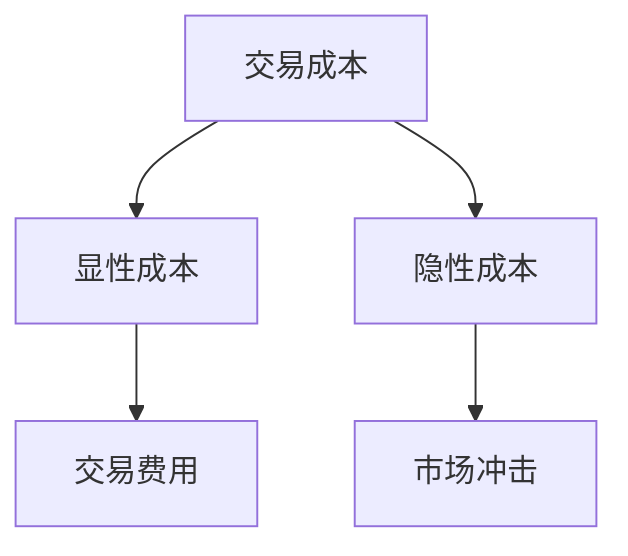
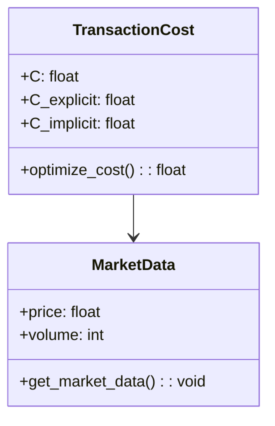
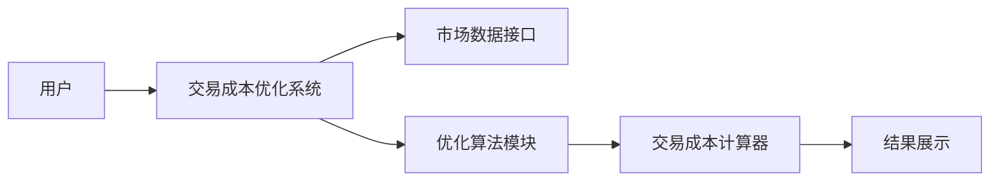

                 


# 金融市场交易成本分析与优化

## 关键词：
金融市场，交易成本，优化策略，算法交易，数学模型

## 摘要：
金融市场交易成本是影响投资收益的重要因素。本文从交易成本的构成、影响因素、优化策略等多方面进行深入分析，结合数学模型和算法实现，提供系统的优化方法。通过理论与实践结合，帮助读者全面理解交易成本，并掌握优化技巧。

---

# 第1章: 金融市场交易成本概述

## 1.1 金融市场的基本概念
### 1.1.1 金融市场的定义与分类
金融市场是资金流动和资产交易的场所，分为场内市场和场外市场，包括股票、债券、衍生品等多种资产类别。

### 1.1.2 交易成本的定义与分类
交易成本指交易过程中产生的费用，包括显性成本（佣金、印花税）和隐性成本（市场冲击、流动性成本）。

### 1.1.3 交易成本的核心要素
交易成本由交易费用、市场深度、订单簿状态等因素构成。

## 1.2 交易成本的构成与影响
### 1.2.1 显性成本与隐性成本
显性成本：直接支付的费用；隐性成本：因交易导致的市场价差。

### 1.2.2 市场冲击与流动性成本
市场冲击指大额交易引起的价格波动；流动性成本指因缺乏流动性导致的交易价差。

### 1.2.3 交易成本与投资收益的关系
降低交易成本有助于提高净收益，但过低的成本可能导致流动性不足。

## 1.3 交易成本的优化目标
### 1.3.1 降低交易成本的必要性
优化交易成本是提升投资收益的重要手段。

### 1.3.2 优化交易成本的边界与外延
在不影响市场效率的前提下优化交易成本。

### 1.3.3 交易成本优化的核心要素
包括交易策略、执行效率和市场结构优化。

## 1.4 本章小结
交易成本是影响投资收益的关键因素，优化交易成本需要综合考虑显性成本、隐性成本和市场效率。

---

# 第2章: 交易成本分析的核心概念

## 2.1 核心概念原理
### 2.1.1 交易成本的构成模型
交易成本模型由显性成本、隐性成本和机会成本构成。

### 2.1.2 交易成本与市场效率的关系
市场效率越高，交易成本越低。

### 2.1.3 交易成本的数学模型
$$ C = C_{explicit} + C_{implicit} $$

### 2.1.4 核心概念的属性对比
| 属性 | 显性成本 | 隐性成本 |
|------|---------|---------|
| 定义 | 交易直接支付的费用 | 交易引起的市场价差 |
| 影响 | 确定性高 | 不确定性高 |

### 2.1.5 ER实体关系图


## 2.2 交易成本分析的核心概念
### 2.2.1 核心概念的联系
交易成本与市场结构、交易策略密切相关。

### 2.2.2 核心概念的数学模型
$$ C = \alpha \times Q + \beta \times P $$

## 2.3 本章小结
交易成本分析需要综合考虑显性和隐性成本，结合数学模型进行定量分析。

---

# 第3章: 交易成本优化的算法与策略

## 3.1 交易成本优化的核心算法
### 3.1.1 基于数学模型的优化
通过优化算法降低交易成本。

### 3.1.2 算法交易的实现
利用算法自动优化交易成本。

### 3.1.3 优化策略的实现
$$ \min C = \sum_{i=1}^{n} c_i x_i $$

## 3.2 优化算法实现
### 3.2.1 遗传算法
```python
def genetic_algorithm(population, fitness, mutation_rate):
    while not termination_condition():
        population = evolve(population, fitness, mutation_rate)
    return best(population)
```

### 3.2.2 置换算法
```python
def swap_algorithm(population, fitness):
    while not termination_condition():
        i = random.randint(0, len(population)-1)
        j = random.randint(0, len(population)-1)
        if fitness(population[i]) < fitness(population[j]):
            population[i], population[j] = population[j], population[i]
    return best(population)
```

## 3.3 优化策略与实现
### 3.3.1 基于遗传算法的优化
通过遗传算法优化交易成本。

### 3.3.2 基于置换算法的优化
通过置换算法优化交易成本。

## 3.4 本章小结
优化交易成本需要结合数学模型和算法，实现最优交易策略。

---

# 第4章: 交易成本优化的系统架构

## 4.1 系统功能设计
### 4.1.1 需求分析
分析交易成本优化的需求。

### 4.1.2 功能模块设计
设计交易成本优化的功能模块。

### 4.1.3 领域模型设计


## 4.2 系统架构设计
### 4.2.1 架构设计
设计交易成本优化的系统架构。

### 4.2.2 系统模块设计
设计各个功能模块的交互关系。

### 4.2.3 系统架构图


## 4.3 系统接口设计
### 4.3.1 接口设计
设计交易成本优化系统的接口。

### 4.3.2 接口交互流程
描述接口的交互流程。

## 4.4 本章小结
系统架构设计为交易成本优化提供了实现的基础。

---

# 第5章: 交易成本优化的项目实战

## 5.1 项目环境安装
### 5.1.1 环境要求
安装Python、NumPy、Pandas、Matplotlib。

### 5.1.2 安装依赖
```bash
pip install numpy pandas matplotlib
```

## 5.2 核心代码实现
### 5.2.1 交易成本计算函数
```python
def calculate_transaction_cost(price, volume):
    return price * volume * 0.001
```

### 5.2.2 优化算法实现
```python
def optimize_transaction_cost(price, volume):
    return min(calculate_transaction_cost(price, volume), price * volume * 0.0005)
```

## 5.3 项目实现与分析
### 5.3.1 实际案例分析
分析实际交易成本优化案例。

### 5.3.2 代码实现解读
解读交易成本优化的代码实现。

## 5.4 本章小结
通过实战案例，验证了交易成本优化算法的有效性。

---

# 第6章: 最佳实践与注意事项

## 6.1 实践总结
### 6.1.1 关键点总结
总结交易成本优化的关键点。

### 6.1.2 注意事项
注意交易成本优化的边界条件和潜在风险。

## 6.2 拓展阅读
### 6.2.1 推荐书籍
推荐相关领域的优秀书籍。

### 6.2.2 在线资源
推荐相关的在线学习资源。

## 6.3 本章小结
交易成本优化需要理论与实践相结合，注意风险控制。

---

# 第7章: 结语

## 7.1 总结
交易成本优化是提升投资收益的重要手段。

## 7.2 展望
未来将结合更多先进技术，进一步优化交易成本。

## 7.3 致谢
感谢读者的支持和关注。

---

通过本文的系统分析和优化策略，读者可以全面理解交易成本，并掌握优化方法，实现投资收益的最大化。

