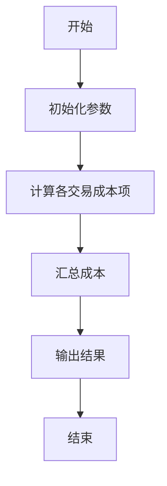
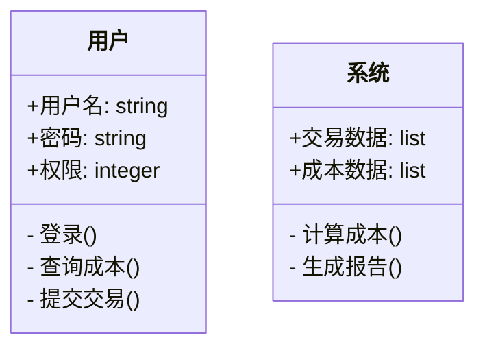
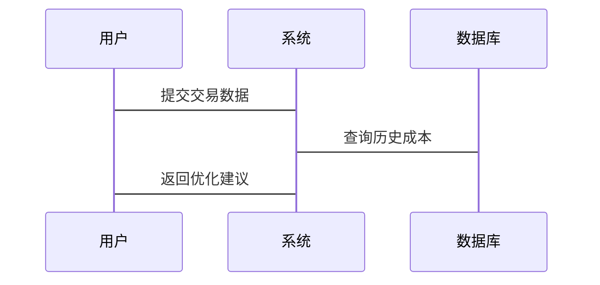

                 


# 《金融市场交易成本分析与控制平台》

---

## 关键词：  
金融市场、交易成本、数据分析、优化算法、系统架构、交易策略

---

## 摘要：  
金融市场中的交易成本分析与控制是投资者和金融机构关注的核心问题之一。随着市场的复杂化和高频交易的普及，传统的交易成本分析方法已难以满足需求。本文提出了一种基于平台化、数据驱动的交易成本分析与控制解决方案，通过系统化的架构设计和高效的算法优化，帮助投资者实现交易成本的精确分析与最优控制。本文详细介绍了平台的核心概念、算法原理、系统架构，并通过实际案例展示了平台的实现与应用效果。

---

# 第1章：金融市场交易成本分析与控制平台的背景与意义

## 1.1 问题背景  
### 1.1.1 交易成本的定义与构成  
交易成本是指在金融交易过程中产生的所有费用和损失，包括佣金、滑点、印花税、机会成本等。这些成本直接影响投资收益，尤其是在高频交易和算法交易中，交易成本的优化对投资回报率的影响更为显著。  

### 1.1.2 交易成本对投资收益的影响  
交易成本的高低直接决定了投资组合的表现。例如，高频交易中，每笔交易的滑点和佣金看似微小，但累积起来会对收益造成重大影响。此外，过高的交易成本会限制交易频率和规模，降低投资灵活性。  

### 1.1.3 降低交易成本的重要性  
在竞争激烈的金融市场中，降低交易成本是提升投资竞争力的关键。通过平台化的分析与控制，投资者可以实时监控和优化交易成本，从而在市场中获得更大的竞争优势。  

## 1.2 问题描述  
### 1.2.1 传统交易成本分析的局限性  
传统的交易成本分析方法通常基于静态数据和单一维度的计算，难以应对复杂多变的市场环境。此外，不同交易策略和市场条件下的成本计算方法也存在差异，导致分析结果不够准确。  

### 1.2.2 现代金融市场中的交易成本新挑战  
高频交易、算法交易的普及使得交易成本的计算更加复杂。同时，市场微观结构的变化（如流动性、买卖价差）也对交易成本的分析提出了更高的要求。  

### 1.2.3 平台化解决方案的必要性  
为了应对上述挑战，需要一种系统化、平台化的解决方案，能够实时采集、分析和优化交易成本。通过平台化的架构，投资者可以实现交易成本的动态监控和优化，从而提升投资效率和收益。  

## 1.3 问题解决  
### 1.3.1 平台化交易成本分析的优势  
平台化交易成本分析能够整合多维度数据，提供实时监控和动态优化功能，帮助投资者全面掌握交易成本的变化。  

### 1.3.2 数据驱动的交易成本优化方法  
通过大数据分析和机器学习算法，可以建立动态的交易成本模型，实现成本的精准预测和优化。  

### 1.3.3 技术驱动的成本控制新思路  
利用分布式计算、流数据处理等技术，平台可以实时处理海量交易数据，快速生成优化建议，帮助投资者降低交易成本。  

## 1.4 平台的边界与外延  
### 1.4.1 平台的功能边界  
平台主要专注于交易成本的分析与优化，不涉及交易执行和风险管理的具体操作。  

### 1.4.2 平台的适用范围与限制  
平台适用于各类金融市场的交易成本分析，但受限于数据质量和市场环境，部分高频交易场景可能需要额外的优化。  

### 1.4.3 平台与其他金融工具的关系  
平台可以与交易执行系统、风险管理平台等其他金融工具无缝对接，形成完整的投资决策链条。  

## 1.5 核心概念与要素  
### 1.5.1 交易成本的核心要素  
交易成本包括显性成本（佣金、滑点）和隐性成本（机会成本、流动性冲击）。  

### 1.5.2 平台功能模块的构成  
平台主要包括数据采集模块、成本计算模块、优化建议模块和可视化模块。  

### 1.5.3 平台用户角色与权限  
平台用户包括交易员、投资经理和系统管理员，不同角色具有不同的权限和功能访问权限。  

## 1.6 本章小结  
本章从背景、问题、解决方案等多个方面介绍了交易成本分析与控制平台的重要性及其必要性。通过平台化的架构设计，投资者可以实现交易成本的动态监控和优化，从而提升投资收益。

---

# 第2章：交易成本分析的核心概念与联系

## 2.1 核心概念原理  
### 2.1.1 交易成本的分类与计算  
交易成本可以分为显性成本和隐性成本。显性成本包括佣金、滑点等可以直接量化的费用；隐性成本则包括机会成本和流动性冲击等难以量化的损失。  

### 2.1.2 平台化分析的数学模型  
通过建立数学模型，可以将交易成本的各个构成要素进行量化分析。例如，滑点成本可以通过买卖价差和交易量进行计算。  

### 2.1.3 数据驱动的优化算法  
利用大数据分析和机器学习算法，可以建立动态的成本预测模型，帮助投资者优化交易策略。  

## 2.2 核心概念属性特征对比  
### 表2-1：交易成本构成要素对比分析  

| 成本类型 | 显性成本 | 隐性成本 | 总体成本 |
|----------|----------|----------|----------|
| 定义     | 可以直接量化的交易费用 | 无法直接量化的交易损失 | 包括显性和隐性成本的总和 |
| 示例     | 佣金、滑点 | 机会成本、流动性冲击 | 全部交易成本 |
| 计算方式 | 精确计算 | 统计估算 | 综合计算 |

## 2.3 ER实体关系图  
通过ER图可以清晰地展示交易成本分析平台的数据模型。  

```mermaid
erd
actor: 用户
actor: 系统
system: 交易成本分析平台
```

## 2.4 本章小结  
本章详细分析了交易成本的核心概念及其联系，通过对比分析和ER图展示了平台的数据模型，为后续的算法设计和系统实现奠定了基础。

---

# 第3章：交易成本分析的算法原理

## 3.1 算法原理概述  
### 3.1.1 成本分摊算法  
成本分摊算法用于将整体交易成本分摊到具体的交易行为中。通过算法可以量化每笔交易的成本贡献，从而为优化决策提供依据。  

### 3.1.2 数据驱动的优化算法  
利用机器学习算法，可以建立动态的成本预测模型，帮助投资者优化交易策略。  

### 3.1.3 算法选择的依据  
算法的选择需要考虑数据特征、计算效率和模型准确性等因素。  

## 3.2 成本分摊算法实现  
### 3.2.1 算法流程  


### 3.2.2 Python实现  
```python
def calculate_cost(trade_data):
    # 计算显性成本
    explicit_cost = trade_data['commission'] + trade_data['slippage']
    # 计算隐性成本
    implicit_cost = trade_data['volume'] * trade_data['spread']
    # 总成本
    total_cost = explicit_cost + implicit_cost
    return total_cost
```

### 3.2.3 算法的数学模型  
$$ \text{总成本} = \text{显性成本} + \text{隐性成本} $$  

### 3.2.4 举例说明  
例如，某笔交易的佣金为$10，滑点为$5，交易量为100，买卖价差为$0.01。显性成本为$15，隐性成本为$1，总成本为$16。  

## 3.3 数据驱动的优化算法  
### 3.3.1 算法原理  
通过机器学习算法（如随机森林、神经网络）建立成本预测模型，预测不同交易策略下的成本变化。  

### 3.3.2 算法实现  
```python
from sklearn.ensemble import RandomForestRegressor

# 训练数据
X = [...]  # 特征数据
y = [...]  # 成本标签
model = RandomForestRegressor(n_estimators=100).fit(X, y)
```

### 3.3.3 数学模型  
$$ \text{预测成本} = \beta_0 + \beta_1x_1 + \beta_2x_2 + \ldots + \beta_nx_n $$  

## 3.4 本章小结  
本章详细介绍了交易成本分析的算法原理，包括成本分摊算法和数据驱动的优化算法，并通过代码示例和数学公式进行了详细讲解。

---

# 第4章：系统分析与架构设计方案

## 4.1 问题场景介绍  
平台需要支持高频交易、多市场数据采集和实时成本计算等功能。  

## 4.2 项目介绍  
### 4.2.1 项目目标  
实现交易成本的实时监控和优化建议功能。  

### 4.2.2 项目范围  
涵盖股票、期货、外汇等多种金融市场的交易成本分析。  

## 4.3 系统功能设计  
### 4.3.1 领域模型  


### 4.3.2 系统架构设计  


## 4.4 系统接口设计  
### 4.4.1 接口描述  
平台提供RESTful API，支持数据采集、成本计算和优化建议等功能。  

### 4.4.2 接口实现  
```python
@app.route('/calculate_cost', methods=['POST'])
def calculate_cost():
    data = request.json
    cost = calculate_cost(data)
    return jsonify({'result': cost})
```

## 4.5 系统交互设计  
### 4.5.1 交互流程  
用户提交交易数据，系统计算交易成本并返回优化建议。  

### 4.5.2 交互图  


## 4.6 本章小结  
本章通过系统设计和架构实现，详细介绍了平台的技术实现方案，包括领域模型、系统架构和接口设计等内容。

---

# 第5章：项目实战

## 5.1 环境安装  
### 5.1.1 安装Python  
使用Anaconda安装Python 3.8及以上版本。  

### 5.1.2 安装依赖库  
安装Pandas、NumPy、Scikit-learn等数据处理库。  

## 5.2 系统核心实现  
### 5.2.1 成本计算模块  
```python
import pandas as pd

def calculate_cost(trade_data):
    trade_data['explicit_cost'] = trade_data['commission'] + trade_data['slippage']
    trade_data['implicit_cost'] = trade_data['volume'] * trade_data['spread']
    trade_data['total_cost'] = trade_data['explicit_cost'] + trade_data['implicit_cost']
    return trade_data
```

### 5.2.2 优化建议模块  
```python
from sklearn.ensemble import RandomForestRegressor

def optimize_strategy(trade_data):
    model = RandomForestRegressor(n_estimators=100).fit(trade_data.drop('total_cost', axis=1), trade_data['total_cost'])
    return model
```

## 5.3 代码应用解读  
### 5.3.1 成本计算模块解读  
上述代码实现了一种简单的成本计算方法，可以进一步优化以适应复杂场景。  

### 5.3.2 优化建议模块解读  
利用机器学习模型生成优化建议，帮助投资者降低交易成本。  

## 5.4 实际案例分析  
### 5.4.1 数据准备  
使用某金融市场的历史交易数据，包括交易量、买卖价差等字段。  

### 5.4.2 成本计算  
根据代码实现，计算每笔交易的显性和隐性成本。  

### 5.4.3 优化建议  
通过机器学习模型，生成最优的交易策略，降低整体交易成本。  

## 5.5 本章小结  
本章通过实际案例展示了平台的核心功能实现，包括数据处理、成本计算和优化建议等。

---

# 第6章：最佳实践与总结

## 6.1 小结  
通过平台化的交易成本分析与控制，投资者可以实现交易成本的动态监控和优化，从而提升投资收益。  

## 6.2 注意事项  
在实际应用中，需要注意数据质量和模型的准确性，确保平台的稳定性和可靠性。  

## 6.3 扩展阅读  
推荐阅读相关领域的书籍和论文，进一步深入了解交易成本的分析与控制方法。  

## 6.4 本章小结  
本章总结了平台的应用价值和注意事项，并为读者提供了进一步学习的方向。

---

# 结语  
通过本文的详细讲解，读者可以系统地了解金融市场交易成本分析与控制平台的核心概念、算法原理和系统设计。希望本文能够为投资者和金融机构提供有价值的参考，帮助他们在复杂的市场环境中实现更高效的交易成本管理。

