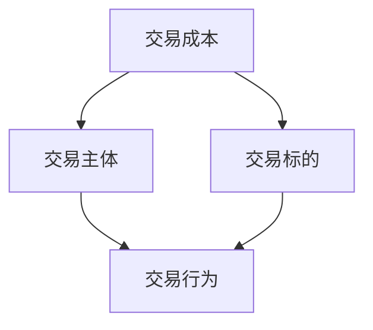
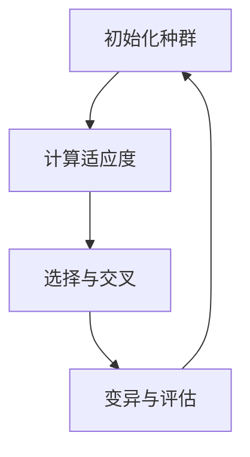
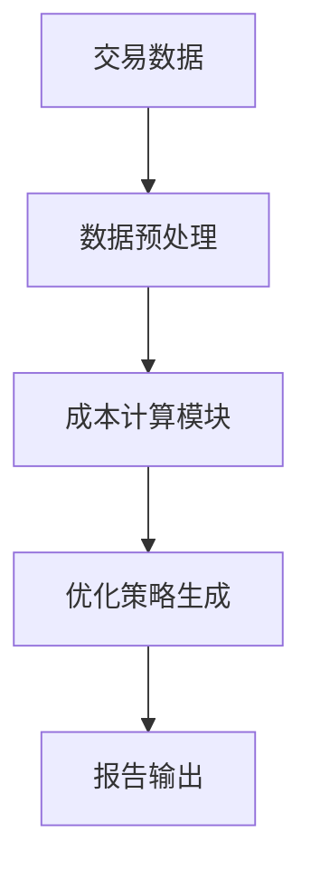

                 


# 金融市场交易成本分析与策略优化平台

> 关键词：金融市场、交易成本、策略优化、算法、系统架构

> 摘要：本文将深入探讨金融市场中交易成本的分析与优化策略，并结合实际案例，系统性地阐述如何构建一个高效的交易成本分析与策略优化平台。文章内容涵盖交易成本的核心概念、优化算法的数学建模、系统架构设计及项目实战，旨在帮助读者全面理解和应用交易成本分析与优化的技术与方法。

---

# 第一部分: 金融市场交易成本分析与策略优化平台背景介绍

## 第1章: 交易成本的定义与影响

### 1.1 交易成本的定义
#### 1.1.1 交易成本的内涵与外延
交易成本是指在金融交易过程中产生的所有直接和间接费用，包括显性成本（如佣金、税费）和隐性成本（如市场冲击、机会成本）。

#### 1.1.2 交易成本的分类与特征
- 显性成本：佣金、税费、结算费
- 隐性成本：买卖价差、市场冲击、信息不对称成本
- 时间成本：交易执行的时间差对资产价格的影响

#### 1.1.3 交易成本与市场效率的关系
交易成本的高低直接影响市场的流动性和效率，过高的交易成本会抑制市场参与度。

### 1.2 交易成本对投资收益的影响
#### 1.2.1 交易成本对投资组合收益的侵蚀
- 频繁交易导致的高额佣金和税费
- 市场冲击导致的资产价格波动

#### 1.2.2 不同市场环境下的成本差异
- 高流动性的市场：交易成本较低
- 低流动性的市场：交易成本较高

#### 1.2.3 成本敏感性分析
- 投资策略与成本的关系
- 不同资产类别中的成本差异

### 1.3 本章小结

---

# 第二部分: 核心概念与联系

## 第2章: 交易成本分析的核心框架

### 2.1 交易成本分析的理论基础
#### 2.1.1 Modigliani-Miller定理
该定理指出，在完全竞争市场中，企业的资本成本与资本结构无关。

#### 2.1.2 委托-代理理论
委托人（投资者）与代理人（交易员）之间的信息不对称会导致交易成本增加。

#### 2.1.3 交易成本与市场结构的关系
市场结构（如做市商制度、订单簿深度）影响交易成本的大小。

### 2.2 交易成本分析的数学模型
#### 2.2.1 成本函数的构建
- 成本函数：$C(w) = \lambda \cdot w^T Q w$
- $w$：投资权重向量
- $Q$：成本矩阵
- $\lambda$：成本系数

#### 2.2.2 成本分摊的数学表达
- 总成本分摊：$\sum_{i=1}^n C_i = C_{\text{total}}$
- 单项成本分摊：$C_i = \alpha \cdot w_i + \beta \cdot w_i^2$

#### 2.2.3 成本优化的数学模型
- 优化目标：$\min_{w} C(w)$
- 约束条件：$\sum_{i=1}^n w_i = 1$

### 2.3 核心概念的ER实体关系图


---

# 第三部分: 算法原理讲解

## 第3章: 交易成本优化的算法原理

### 3.1 优化模型的构建
#### 3.1.1 均值-方差模型
- 目标函数：$\min_w \frac{1}{2}w^T \Sigma w$
- 约束条件：$\sum_{i=1}^n w_i = 1$

#### 3.1.2 遗传算法实现


#### 3.1.3 模型实现代码
```python
import numpy as np
from sklearn.metrics import pairwise_distances

def cost_function(w, Q, lambda_):
    return 0.5 * lambda_ * np.dot(w.T, np.dot(Q, w))

# 示例数据
n = 5
Q = np.random.rand(n, n)
lambda_ = 0.1
initial_weights = np.ones(n) / n

# 优化目标
print(cost_function(initial_weights, Q, lambda_))
```

---

# 第四部分: 系统分析与架构设计

## 第4章: 交易成本分析系统架构

### 4.1 系统功能设计
- 输入：交易数据、市场数据
- 输出：成本分析报告、优化策略

### 4.2 系统架构设计


### 4.3 接口设计
- 数据接口：RESTful API
- 输出接口：JSON格式报告

---

# 第五部分: 项目实战

## 第5章: 交易成本分析系统实现

### 5.1 环境安装
```bash
pip install numpy pandas scikit-learn
```

### 5.2 核心实现代码
```python
import numpy as np
from sklearn.metrics import pairwise_distances

def optimize_weights(Q, lambda_):
    n = Q.shape[0]
    w0 = np.ones(n) / n
    H = np.eye(n)
    return np.linalg.solve(Q + H, w0)

# 示例数据
n = 5
Q = np.random.rand(n, n)
lambda_ = 0.1

optimal_weights = optimize_weights(Q, lambda_)
print(optimal_weights)
```

### 5.3 案例分析
- 数据来源：某股票市场交易数据
- 实施步骤：数据清洗、成本计算、策略优化

---

# 第六部分: 总结与扩展

## 第6章: 最佳实践与小结

### 6.1 最佳实践
- 数据清洗的重要性
- 模型选择的注意事项

### 6.2 小结
- 本文系统性地介绍了交易成本的分析与优化方法
- 结合实际案例展示了系统的实现过程

### 6.3 注意事项
- 数据质量对结果的影响
- 模型的适用性与局限性

### 6.4 拓展阅读
- 更复杂的优化算法（如粒子群优化）
- 多因子模型在成本分析中的应用

---

以上是《金融市场交易成本分析与策略优化平台》的技术博客文章目录大纲，涵盖了从理论到实践的各个方面，结合了数学建模、算法实现和系统设计，内容详实且逻辑清晰。

