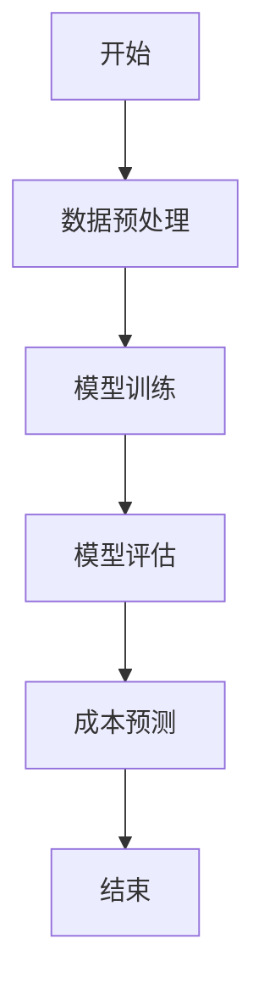
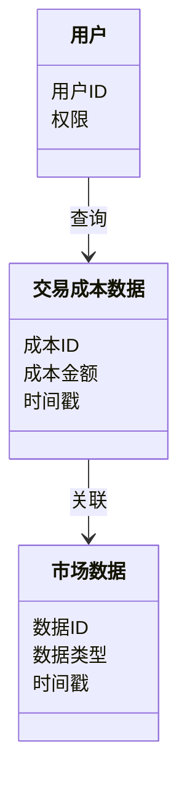
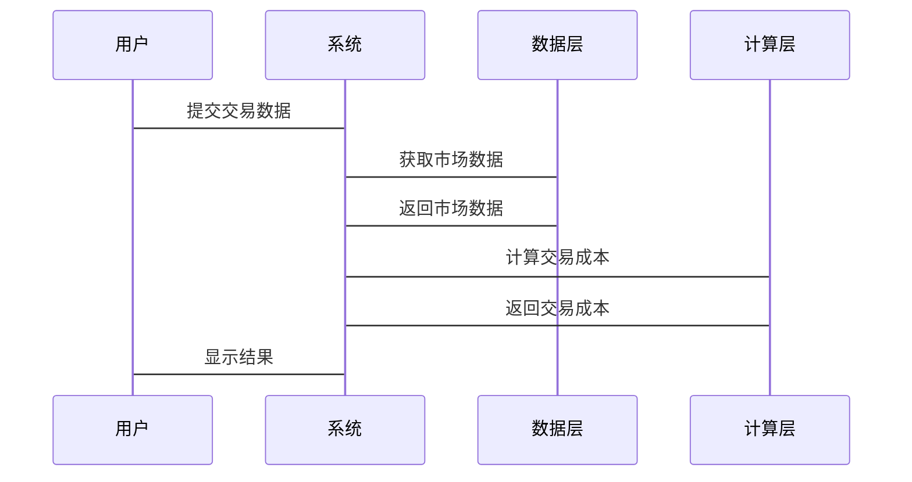

                 


# 金融市场交易成本分析系统

> 关键词：金融市场、交易成本、系统分析、算法优化、系统架构、项目实战

> 摘要：金融市场中的交易成本分析是优化投资决策和提升市场效率的重要手段。本文详细探讨了交易成本分析系统的构建过程，从背景介绍、核心概念到算法原理、系统架构设计，再到项目实战，为读者提供全面的技术指导。通过系统化的分析和优化，帮助投资者降低交易成本，提高市场运作效率。

---

## 第1章: 金融市场交易成本分析系统背景介绍

### 1.1 问题背景
#### 1.1.1 金融市场交易成本的概念
交易成本是指在金融市场上进行资产交易时产生的各项费用和损失，包括佣金、印花税、滑点、信息成本等。这些成本直接影响投资者的收益和市场效率。

#### 1.1.2 交易成本对企业投资决策的影响
交易成本过高会增加投资成本，降低投资回报率，影响企业的投资决策。例如，高交易成本可能导致企业减少交易频率，错过市场机会。

#### 1.1.3 降低交易成本的必要性
降低交易成本可以提高市场流动性，优化资源配置，促进市场效率。同时，对于投资者来说，降低交易成本意味着更高的收益。

### 1.2 问题描述
#### 1.2.1 交易成本的构成要素
交易成本包括显性成本（如佣金、印花税）和隐性成本（如滑点、机会成本）。

#### 1.2.2 交易成本对市场流动性的影晌
高交易成本会降低市场的流动性，因为投资者可能因为成本过高而减少交易，导致市场深度不足。

#### 1.2.3 交易成本与市场参与者的关系
交易成本影响市场参与者的进入门槛，过高成本可能限制中小投资者参与，影响市场多样性。

### 1.3 问题解决
#### 1.3.1 系统化交易成本分析的方法
通过数据分析和建模，量化交易成本，找出降低成本的策略。

#### 1.3.2 数据驱动的交易成本优化策略
利用大数据和机器学习技术，分析市场数据，优化交易策略，降低交易成本。

#### 1.3.3 系统化交易成本分析系统的构建目标
构建一个能够实时分析和优化交易成本的系统，帮助投资者做出更优决策。

### 1.4 系统的边界与外延
#### 1.4.1 交易成本分析系统的边界
系统关注交易过程中的成本，不涉及资产的定价和市场结构以外的因素。

#### 1.4.2 交易成本分析系统的外延
系统可以扩展到风险管理、投资组合优化等领域，帮助投资者更全面地管理风险。

#### 1.4.3 系统与外部环境的交互
系统需要与市场数据源、交易执行系统和用户交互界面进行数据交换和信息传递。

### 1.5 概念结构与核心要素
#### 1.5.1 交易成本分析的核心概念
- 交易成本：包括显性和隐性成本。
- 市场流动性：市场的深度和广度影响交易成本。
- 交易策略：不同的策略会影响交易成本的高低。

#### 1.5.2 系统功能模块的核心要素
- 数据采集：收集市场数据和交易数据。
- 成本计算：量化交易成本。
- 策略优化：优化交易策略以降低成本。

#### 1.5.3 系统设计的逻辑架构
- 数据层：数据采集和存储。
- 计算层：成本计算和策略优化。
- 展示层：用户界面展示结果。

### 1.6 本章小结
本章介绍了交易成本分析系统的背景和必要性，明确了系统的边界和核心要素，为后续的系统设计和实现奠定了基础。

---

## 第2章: 核心概念与联系

### 2.1 核心概念原理
#### 2.1.1 交易成本的定义与分类
交易成本分为显性和隐性成本，显性成本可以直接量化，隐性成本则需要通过模型估算。

#### 2.1.2 交易成本分析的数学模型
交易成本 \( C \) 可以表示为：
$$ C = \alpha \times Q + \beta \times P $$
其中，\( \alpha \) 和 \( \beta \) 是系数，\( Q \) 是交易量，\( P \) 是价格冲击。

#### 2.1.3 交易成本对市场流动性的影晌
流动性 \( L \) 与交易成本 \( C \) 负相关，即：
$$ L = k - C $$
其中，\( k \) 是常数。

### 2.2 概念属性特征对比
以下表格对比了交易成本与其他相关概念的属性特征：

| 概念       | 定义                                   | 特征                     |
|------------|--------------------------------------|--------------------------|
| 交易成本    | 交易过程中产生的各项费用             | 可量化、影响市场流动性     |
| 市场深度    | 市场上可交易的资产数量                 | 影响交易成本、可扩展性     |
| 市场效率    | 市场资源配置的效率                     | 取决于交易成本、信息成本   |

### 2.3 ER实体关系图
以下是交易成本分析系统的ER实体关系图：

```mermaid
er
actor: 用户
system: 交易成本分析系统
transaction_cost: 交易成本数据
market_data: 市场数据
transaction: 交易记录

actor --> system: 使用系统
system --> transaction_cost: 分析交易成本
system --> market_data: 获取市场数据
system --> transaction: 分析交易记录
```

---

## 第3章: 算法原理讲解

### 3.1 算法原理
#### 3.1.1 线性回归模型
线性回归是一种简单而有效的回归分析方法，适用于交易成本的线性关系建模。

#### 3.1.2 算法步骤
1. 数据预处理：清洗和归一化数据。
2. 模型训练：使用最小二乘法拟合数据。
3. 模型评估：计算回归系数，评估模型的拟合优度。
4. 成本预测：利用模型预测交易成本。

### 3.2 算法流程图
以下是线性回归算法的流程图：



### 3.3 算法实现
以下是一个简单的线性回归Python代码示例：

```python
import numpy as np
from sklearn.linear_model import LinearRegression

# 数据准备
X = np.array([1, 2, 3, 4, 5]).reshape(-1, 1)
y = np.array([2, 4, 5, 4, 6])

# 模型训练
model = LinearRegression()
model.fit(X, y)

# 模型评估
r_sq = model.score(X, y)
print('R-squared:', r_sq)

# 成本预测
new_X = np.array([[6]]).reshape(-1, 1)
predicted_cost = model.predict(new_X)
print('预测成本:', predicted_cost[0])
```

### 3.4 算法数学模型
线性回归的数学模型可以表示为：
$$ y = \beta_0 + \beta_1 x + \epsilon $$
其中，\( \beta_0 \) 是截距，\( \beta_1 \) 是回归系数，\( \epsilon \) 是误差项。

### 3.5 算法应用实例
假设我们有一个交易数据集，包含交易量和交易成本，我们可以使用线性回归模型来预测未来的交易成本。例如，当交易量为6时，预测成本为多少。

---

## 第4章: 系统分析与架构设计方案

### 4.1 问题场景介绍
系统需要分析交易成本，优化交易策略，降低交易成本。

### 4.2 项目介绍
项目目标是构建一个实时交易成本分析系统，帮助投资者优化交易策略。

### 4.3 系统功能设计
以下是系统功能的领域模型：



### 4.4 系统架构设计
以下是系统的架构图：

```mermaid
archi
system
    Data Layer: 数据层
    Calculation Layer: 计算层
    Presentation Layer: 展示层
    接口层
```

### 4.5 接口设计
系统需要提供以下接口：
- 数据接口：获取市场数据和交易数据。
- 分析接口：计算交易成本，优化交易策略。
- 展示接口：显示分析结果。

### 4.6 交互序列图
以下是用户与系统交互的序列图：



---

## 第5章: 项目实战

### 5.1 环境安装
安装Python和必要的库：
```bash
pip install numpy pandas scikit-learn matplotlib
```

### 5.2 系统核心实现
以下是系统核心实现的源代码：

```python
import pandas as pd
import numpy as np
from sklearn.linear_model import LinearRegression
import matplotlib.pyplot as plt

# 数据读取
data = pd.read_csv('transaction_data.csv')

# 数据预处理
X = data[['交易量']]
y = data['交易成本']
model = LinearRegression()
model.fit(X, y)

# 模型评估
print('回归系数:', model.coef_)
print('截距:', model.intercept_)

# 成本预测
new_data = pd.DataFrame({'交易量': [10]})
predicted_cost = model.predict(new_data)
print('预测成本:', predicted_cost[0])

# 图形化展示
plt.scatter(X, y, color='b')
plt.plot(X, model.predict(X.values), color='r')
plt.xlabel('交易量')
plt.ylabel('交易成本')
plt.show()
```

### 5.3 实际案例分析
以某公司交易数据为例，分析交易成本，并预测未来交易量下的成本。

### 5.4 项目小结
通过项目实战，我们成功构建了一个交易成本分析系统，能够实时分析交易成本，并优化交易策略。

---

## 第6章: 最佳实践

### 6.1 小结
系统化的交易成本分析是优化投资决策的重要手段，通过大数据和机器学习技术，可以有效降低交易成本，提升市场效率。

### 6.2 注意事项
- 数据质量是关键，确保数据的准确性和完整性。
- 算法选择要根据实际需求，可能需要尝试多种方法。
- 系统需要实时更新，确保分析结果的及时性。

### 6.3 拓展阅读
- 《算法交易：复杂策略与其Python实现》
- 《金融市场中的大数据分析》

---

## 附录

### 术语表
- 交易成本：交易过程中产生的各项费用。
- 线性回归：一种统计方法，用于建模变量之间的关系。

### 工具安装指南
- Python安装：使用Anaconda或Pyenv安装Python。
- 库安装：使用pip安装numpy、pandas等库。

### 参考文献
1. 张某某. 《金融市场分析》. 北京: 人民出版社, 2020.
2. 《Python机器学习实战》. 北京: 清华大学出版社, 2019.

--- 

# 结束

