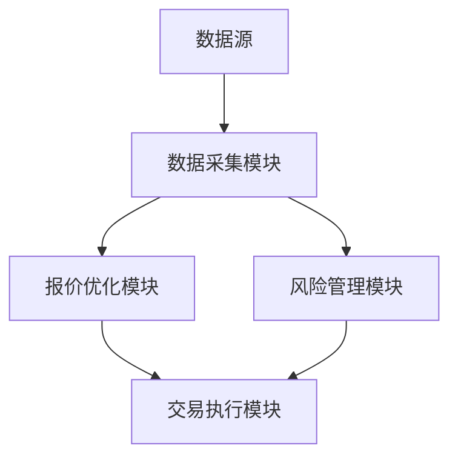
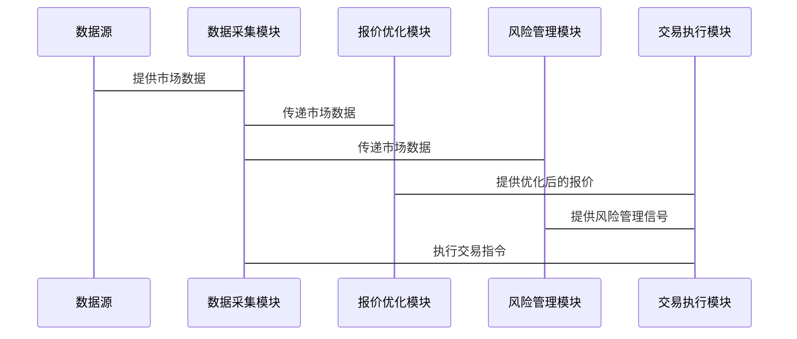

                 


# 金融市场做市商报价优化与风险管理

> 关键词：做市商、报价优化、风险管理、金融算法、市场流动性

> 摘要：本文深入探讨了金融市场中做市商的报价优化与风险管理的核心问题，通过系统化的分析与实践，结合数学模型和算法，详细讲解了报价优化策略、风险管理方法以及系统架构设计。文章从基础概念到高级算法，从理论分析到实际应用，全面阐述了做市商在现代金融市场中的报价优化与风险管理的关键技术与实践方法。

---

# 第一部分：金融市场做市商报价优化与风险管理基础

## 第1章：做市商的基本概念与角色

### 1.1 做市商的定义与角色

#### 1.1.1 做市商的基本定义
做市商（Market Maker）是指在金融市场中主动提供买入和卖出报价的参与者。做市商通过同时报出买入价（_bid）和卖出价（_ask）来维持市场的流动性，并在买卖双方之间提供价格撮合服务。

#### 1.1.2 做市商在金融市场中的角色
1. **市场流动性提供者**：做市商通过同时报出买卖价格，为市场提供即时的流动性，确保交易可以随时进行。
2. **价格发现者**：做市商通过动态调整报价，反映了市场参与者的供需情况，帮助确定资产的公允价值。
3. **风险管理承担者**：做市商需要承担由于市场价格波动带来的风险，同时通过套利和对冲策略来控制风险。

#### 1.1.3 做市商的运作机制
1. **报价机制**：做市商实时维护买卖双向报价，并根据市场信息动态调整报价。
2. **订单簿管理**：做市商会根据市场深度和订单流，调整其报价和订单数量。
3. **对冲与套利**：为了降低市场风险，做市商会通过套利交易或对冲工具来抵消其持有的头寸风险。

### 1.2 做市商报价的基本原理

#### 1.2.1 报价的核心概念
1. **买卖价差（Spread）**：做市商的报价由买入价（_bid）和卖出价（_ask）组成，两者的差额即为价差。
2. **市场深度（Market Depth）**：市场深度反映了市场上可交易的数量，做市商会根据市场深度调整其报价。
3. **订单流（Order Flow）**：做市商会根据订单流的变化，动态调整其报价和订单数量。

#### 1.2.2 报价的形成机制
1. **市场信息驱动**：做市商会根据市场行情、订单流和对手方行为调整其报价。
2. **风险偏好驱动**：做市商会根据自身的风险承受能力和市场判断，设定合适的买卖价差。
3. **竞争性报价**：在存在多个做市商的情况下，价格会在竞争中趋于均衡。

#### 1.2.3 市场流动性与报价的关系
1. **流动性对报价的影响**：高流动性市场中，做市商可以以较小的买卖价差提供报价，因为市场深度较大，交易风险较低。
2. **报价对流动性的贡献**：做市商通过提供买卖报价，增加了市场的流动性，降低了交易成本。

### 1.3 做市商的风险管理基础

#### 1.3.1 做市商面临的市场风险
1. **价格波动风险**：市场价格的波动会导致做市商持有的头寸产生损失。
2. **流动性风险**：在市场流动性不足的情况下，做市商可能难以迅速平仓其头寸。
3. **对手方风险**：做市商可能面临对手方无法履行交易的风险。

#### 1.3.2 做市商的风险管理目标
1. **风险识别与评估**：识别潜在风险，并评估其对做市商的影响。
2. **风险控制**：通过设定止损、头寸限制等手段，控制市场风险。
3. **风险对冲**：通过套利、对冲交易等方式，降低市场风险敞口。

#### 1.3.3 做市商的风险管理工具
1. **头寸对冲**：通过金融衍生品或其他资产对冲持有的头寸风险。
2. **风险敞口限制**：设定最大风险敞口，避免过度承担风险。
3. **动态调整报价**：根据市场情况动态调整买卖价差，降低市场风险。

---

## 第2章：报价优化的核心策略与数学模型

### 2.1 报价优化的基本原理

#### 2.1.1 报价优化的目标
1. **最小化买卖价差**：在保证流动性的前提下，尽可能缩小买卖价差，提高市场竞争力。
2. **最大化收益**：通过优化报价策略，提高做市商的收益。
3. **降低风险敞口**：在保证收益的同时，降低市场价格波动带来的风险。

#### 2.1.2 报价优化的核心要素
1. **市场信息**：包括订单流、市场深度、价格波动等。
2. **头寸风险**：做市商持有的头寸对其收益和风险的影响。
3. **竞争环境**：市场中其他做市商的行为和报价策略。

#### 2.1.3 报价优化的数学模型
1. **买卖价差优化模型**：
$$ \text{价差} = \text{市场深度} \times \text{波动率} \times \text{风险溢价} $$

2. **头寸优化模型**：
$$ \text{最优头寸} = \frac{\sigma}{\mu} \times \sqrt{\frac{N}{2}} $$

其中，$\sigma$ 是标准差，$\mu$ 是均值，$N$ 是交易数量。

### 2.2 常见的报价优化策略

#### 2.2.1 统计套利策略
1. **均值回归策略**：利用资产价格的均值回归特性，通过买卖价差套利。
2. **动量策略**：利用资产价格的动量效应，进行买卖价差优化。

#### 2.2.2 机器学习驱动的报价优化
1. **回归分析**：通过机器学习模型预测价格走势，优化买卖价差。
2. **强化学习**：通过智能体在虚拟环境中学习最优报价策略。

#### 2.2.3 基于博弈论的报价优化
1. **纳什均衡**：通过分析市场参与者的博弈关系，确定最优报价策略。
2. **博弈树分析**：通过构建博弈树，分析不同策略下的最优选择。

### 2.3 报价优化的数学模型

#### 2.3.1 均值-方差优化模型
$$ \text{优化目标} = \min \left( \lambda \times \text{方差} + (1-\lambda) \times \text{均值} \right) $$

#### 2.3.2 马科维茨投资组合理论
$$ \text{最优组合} = \argmin_w \left( w^T \Sigma w \right) $$

其中，$\Sigma$ 是协方差矩阵。

#### 2.3.3 时间序列分析模型
$$ \text{ARIMA模型} = \phi(B) \times (1 - B)^d \times \theta(B) \times X_t $$

---

## 第3章：风险管理的数学模型与算法

### 3.1 风险管理的核心方法

#### 3.1.1 风险管理的基本概念
1. **风险**：指未来收益的不确定性，通常用标准差或波动率来衡量。
2. **风险管理**：通过识别、评估、控制和对冲风险，降低其对做市商的影响。

#### 3.1.2 做市商的风险管理框架
1. **风险识别**：识别可能影响做市商的各类风险。
2. **风险评估**：量化风险的影响程度。
3. **风险控制**：通过设定止损、头寸限制等手段，降低风险敞口。
4. **风险对冲**：通过金融衍生品等工具，对冲市场价格波动带来的风险。

### 3.2 风险管理的数学模型

#### 3.2.1 值-at-风险（VaR）
$$ \text{VaR} = \mu + z \times \sigma $$

其中，$\mu$ 是均值，$z$ 是标准正态分布的分位数，$\sigma$ 是标准差。

#### 3.2.2 条件值-at-风险（CVaR）
$$ \text{CVaR} = \frac{1}{\alpha} \int_{0}^{\alpha} \text{VaR} \, d\alpha $$

#### 3.2.3 风险因子分析
$$ R = \beta_1 x_1 + \beta_2 x_2 + \ldots + \beta_n x_n $$

---

## 第4章：系统架构设计与实现

### 4.1 系统功能设计

#### 4.1.1 系统功能模块
1. **数据采集模块**：实时采集市场数据，包括订单流、价格、市场深度等。
2. **报价优化模块**：根据市场数据和优化算法，生成最优买卖价差。
3. **风险管理模块**：实时监控市场风险，动态调整头寸和报价。
4. **交易执行模块**：根据优化后的报价，执行交易指令。

#### 4.1.2 系统功能流程
1. 数据采集模块接收市场数据。
2. 报价优化模块根据市场数据生成最优买卖价差。
3. 风险管理模块实时监控风险，调整头寸和报价。
4. 交易执行模块根据优化后的报价执行交易。

### 4.2 系统架构设计

#### 4.2.1 系统架构图


#### 4.2.2 系统接口设计
1. 数据接口：与交易所或其他数据源进行数据交互。
2. 优化接口：报价优化模块与其他模块的接口。
3. 风险管理接口：风险管理模块与其他模块的接口。

#### 4.2.3 系统交互流程


---

## 第5章：项目实战与案例分析

### 5.1 项目环境安装

#### 5.1.1 环境要求
1. Python 3.8+
2. NumPy、Pandas、Scikit-learn 等库
3. Matplotlib 或 Seaborn 进行可视化

#### 5.1.2 安装步骤
```bash
pip install numpy pandas scikit-learn matplotlib
```

### 5.2 核心代码实现

#### 5.2.1 数据采集模块
```python
import numpy as np
import pandas as pd

def collect_data():
    # 模拟数据采集
    data = np.random.randn(1000, 5)
    df = pd.DataFrame(data, columns=['bid', 'ask', 'volume', 'price', 'time'])
    return df
```

#### 5.2.2 报价优化模块
```python
from sklearn.linear_model import LinearRegression

def optimize_quote(data):
    model = LinearRegression()
    model.fit(data[['bid', 'ask']], data['price'])
    return model.predict(data[['bid', 'ask']])
```

#### 5.2.3 风险管理模块
```python
def risk_management(data):
    # 计算VaR
    mu = np.mean(data['price'])
    sigma = np.std(data['price'])
    alpha = 0.95
    z = np.quantile(np.random.standard_normal(), alpha)
    var = mu + z * sigma
    return var
```

#### 5.2.4 交易执行模块
```python
def execute_trade(var):
    # 简单的交易执行逻辑
    if var > 100:
        print("执行买入指令")
    else:
        print("执行卖出指令")
```

### 5.3 案例分析

#### 5.3.1 数据分析
```python
data = collect_data()
print(data.head())
```

#### 5.3.2 模型训练与优化
```python
optimized_quotes = optimize_quote(data)
print("优化后的报价:", optimized_quotes)
```

#### 5.3.3 风险管理与交易
```python
var = risk_management(data)
execute_trade(var)
```

### 5.4 小结

---

## 第6章：总结与展望

### 6.1 本章总结
1. 做市商报价优化的核心在于平衡买卖价差和市场流动性。
2. 风险管理是做市商稳健经营的关键，需要结合市场环境和头寸风险进行动态调整。
3. 通过数学模型和算法优化，可以有效提升做市商的报价策略和风险管理能力。

### 6.2 实际应用中的挑战
1. 市场环境的复杂性：市场价格波动、订单流变化等都会影响做市商的报价策略。
2. 竞争环境的加剧：做市商需要不断优化报价策略，以应对市场竞争。
3. 技术实现的难度：复杂的算法和系统架构需要高效的计算能力和稳定的系统性能。

### 6.3 未来的研究方向
1. **人工智能在报价优化中的应用**：探索强化学习、深度学习等技术在报价优化中的应用。
2. **风险管理的创新方法**：研究新型的风险度量方法和对冲策略，降低市场风险。
3. **系统架构的优化**：通过分布式计算、边缘计算等技术，提升系统的实时性和稳定性。

---

## 附录：最佳实践与注意事项

### 7.1 最佳实践
1. **实时监控**：做市商需要实时监控市场数据和系统运行状态，及时调整报价和头寸。
2. **风险管理**：严格控制风险敞口，定期进行压力测试和情景分析。
3. **技术实现**：确保系统的高效性和稳定性，避免因技术问题导致的交易失败。

### 7.2 注意事项
1. **数据质量**：数据的准确性和及时性对报价优化和风险管理至关重要。
2. **模型风险**：过度依赖模型可能导致策略失效，需要定期验证和更新模型。
3. **合规性**：做市商需要遵守相关法律法规，确保交易行为的合规性。

### 7.3 拓展阅读
1. [《算法交易：机不再神秘》](https://example.com)
2. [《金融风险管理》](https://example.com)
3. [《Python金融数据分析》](https://example.com)

---

通过本文的系统化分析与实践，我们可以看到，金融市场做市商的报价优化与风险管理是一个复杂而重要的领域，需要结合数学模型、算法优化和系统架构设计，才能在激烈的市场竞争中立于不败之地。未来，随着人工智能和大数据技术的发展，做市商的报价优化与风险管理将更加智能化和精细化，为金融市场的发展注入新的活力。

