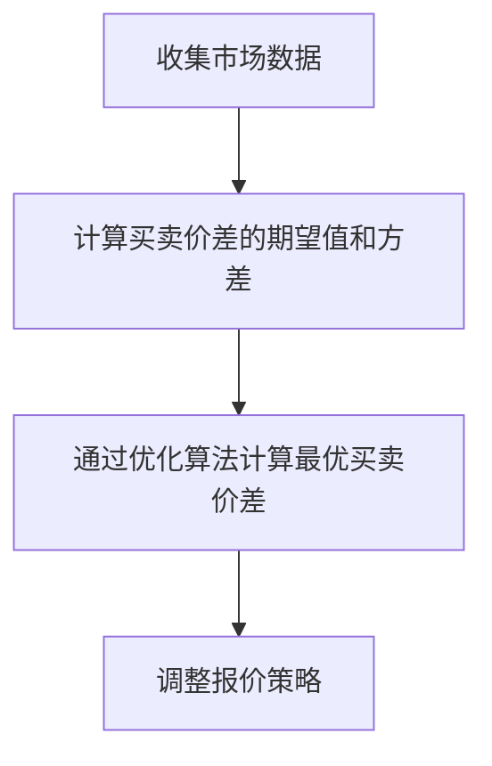
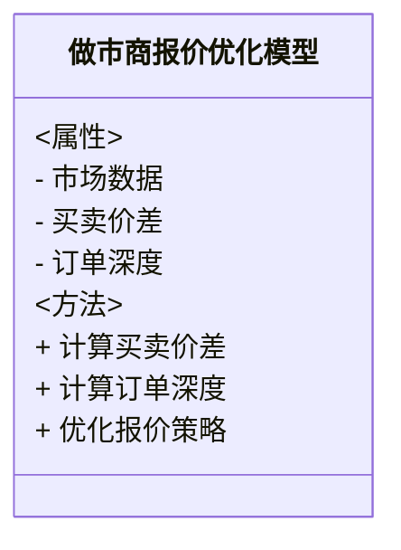
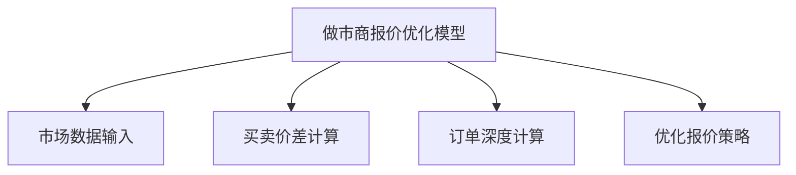

                 


# 金融市场做市商报价优化模型

> 关键词：做市商，报价优化，金融市场，算法模型，数学公式

> 摘要：本文详细介绍了金融市场中做市商报价优化模型的设计与实现。从做市商的基本概念出发，分析了报价优化模型的必要性与意义，结合市场微观结构理论，提出了基于动态概率分布的报价优化算法。通过数学公式和流程图的方式，详细讲解了模型的实现原理，并通过实际案例展示了模型的应用效果。最后，总结了报价优化模型在金融实践中的意义和未来发展方向。

---

## 第一部分: 金融市场做市商报价优化模型概述

### 第1章: 做市商报价优化模型的背景与意义

#### 1.1 做市商的基本概念与角色

做市商（Market Maker）是金融市场中的重要参与者，其主要职责是为市场提供深度和流动性的买价和卖价。做市商通过在市场中同时挂出买入价和卖出价，为投资者提供即时的买卖报价，从而维系市场的流动性。

##### 1.1.1 做市商的定义与功能

做市商是指在金融市场中主动提供买卖报价，撮合交易的机构。其核心功能包括：

- 提供即时报价：做市商在市场中同时挂出买入价和卖出价，为投资者提供即时的交易价格。
- 维持市场流动性：通过持续的报价和交易，确保市场的流动性和稳定性。
- 参与市场交易：做市商通过买卖价差赚取利润，同时为市场提供深度。

##### 1.1.2 做市商在金融市场中的作用

做市商在金融市场中扮演着至关重要的角色：

- 提供市场流动性：做市商通过挂出买卖价差，为市场提供即时的交易价格，确保市场的流动性。
- 维持价格稳定性：通过调整买卖价差和订单深度，做市商可以稳定市场价格，防止剧烈波动。
- 促进市场深度：做市商的报价为投资者提供了更多的交易机会，增加了市场的深度。

##### 1.1.3 做市商报价对市场的影响

做市商的报价对市场有着直接影响：

- 影响买卖价差：做市商通过调整买卖价差，影响市场的交易成本。
- 影响订单深度：做市商的订单深度决定了市场的交易容量。
- 影响市场参与者的行为：做市商的报价策略会影响投资者的交易决策。

#### 1.2 金融市场报价优化的必要性

##### 1.2.1 报价模型在市场中的意义

报价模型是做市商的核心工具，其优化对于市场有着重要意义：

- 提高市场流动性：通过优化报价模型，做市商可以提高订单深度，降低买卖价差，从而提高市场流动性。
- 降低交易成本：优化的报价模型可以减少买卖价差，降低投资者的交易成本。
- 提高市场稳定性：通过优化报价模型，做市商可以更有效地应对市场波动，提高市场的稳定性。

##### 1.2.2 市场流动性与报价优化的关系

市场流动性与报价优化密切相关：

- 报价优化可以提高订单深度，增加市场的流动性。
- 流动性越高，交易成本越低，市场参与者越多。
- 通过优化报价模型，做市商可以更好地平衡买卖价差，提高市场流动性。

##### 1.2.3 报价模型对做市商利润的影响

报价模型的优化对做市商的利润有着直接影响：

- 优化的报价模型可以降低买卖价差，提高交易量，从而增加做市商的利润。
- 报价模型的优化还可以降低做市商的风险，提高其市场竞争力。
- 通过优化报价模型，做市商可以更好地应对市场波动，提高其盈利能力。

#### 1.3 做市商报价优化模型的现状与挑战

##### 1.3.1 当前报价模型的局限性

当前的报价模型存在一些局限性：

- 传统的报价模型过于简化，无法准确反映市场的复杂性。
- 报价模型的实时性不足，难以应对高频交易的挑战。
- 报价模型的适应性较差，难以应对市场的快速变化。

##### 1.3.2 市场环境变化对报价模型的影响

市场环境的变化对报价模型有着重要影响：

- 市场波动性增加，对报价模型的实时性和适应性提出了更高的要求。
- 市场参与者的行为变化，如高频交易的兴起，对报价模型的优化提出了新的挑战。
- 市场监管政策的变化，如交易费用的调整，也会影响报价模型的设计。

##### 1.3.3 报价优化模型的未来发展方向

未来的报价优化模型需要在以下几个方面进行改进：

- 提高模型的实时性和适应性，以应对高频交易的挑战。
- 结合市场微观结构理论，提高模型的理论深度。
- 利用大数据和人工智能技术，提高模型的预测能力和优化效果。

#### 1.4 本章小结

本章从做市商的基本概念出发，分析了报价优化模型的必要性与意义，指出了当前报价模型的局限性，并提出了未来的发展方向。

---

## 第二部分: 做市商报价优化模型的核心概念与原理

### 第2章: 做市商报价优化模型的核心概念

#### 2.1 做市商报价优化模型的定义与构成

##### 2.1.1 模型的基本定义

做市商报价优化模型是一种基于市场微观结构理论，通过优化买卖价差和订单深度，提高市场流动性的数学模型。

##### 2.1.2 模型的核心构成要素

做市商报价优化模型的核心构成要素包括：

- 市场数据：包括历史交易数据、订单簿数据、市场深度等。
- 报价策略：包括买卖价差、订单深度、报价频率等。
- 优化目标：包括最大化利润、最小化买卖价差、提高订单深度等。

##### 2.1.3 模型的输入与输出

做市商报价优化模型的输入与输出如下：

- 输入：市场数据、交易成本、风险偏好等。
- 输出：优化后的买卖价差、订单深度、报价频率等。

#### 2.2 做市商报价优化模型的属性特征对比

##### 2.2.1 模型的实时性特征

做市商报价优化模型需要具备实时性，能够快速响应市场变化。

##### 2.2.2 模型的适应性特征

模型需要具备适应性，能够根据市场环境的变化进行调整。

##### 2.2.3 模型的可扩展性特征

模型需要具备可扩展性，能够应对市场数据量的增加和复杂性的提升。

#### 2.3 做市商报价优化模型的ER实体关系图

```mermaid
er
  actor 做市商
  actor 投资者
  actor 市场监管机构
  entity 报价
  entity 订单
  entity 交易
  entity 市场数据
  做市商 --> 报价
  投资者 --> 订单
  订单 --> 交易
  市场监管机构 --> 市场数据
```

#### 2.4 本章小结

本章详细介绍了做市商报价优化模型的核心概念，包括模型的定义、构成要素、输入输出以及模型的属性特征，并通过ER图展示了模型的实体关系。

---

## 第三部分: 做市商报价优化模型的算法原理

### 第3章: 做市商报价优化模型的算法原理

#### 3.1 报价优化模型的数学基础

##### 3.1.1 概率分布与统计推断

概率分布和统计推断是报价优化模型的重要数学工具。

##### 3.1.2 最优化理论与动态规划

最优化理论和动态规划是报价优化模型的核心方法。

##### 3.1.3 线性代数与矩阵运算

线性代数和矩阵运算是报价优化模型的基础。

#### 3.2 报价优化模型的算法流程

##### 3.2.1 报价优化模型的数学模型

报价优化模型的数学模型可以表示为：

$$
\min_{d} \frac{1}{2\lambda} (d - \mu)^2 + \frac{1}{2} \lambda \sigma^2
$$

其中，\( d \) 是买卖价差，\( \mu \) 是价差的期望值，\( \sigma^2 \) 是价差的方差，\( \lambda \) 是调节参数。

##### 3.2.2 报价优化模型的优化算法

报价优化模型的优化算法可以表示为：

$$
d^* = \arg \min_{d} \frac{1}{2\lambda} (d - \mu)^2 + \frac{1}{2} \lambda \sigma^2
$$

其中，\( d^* \) 是最优买卖价差。

##### 3.2.3 报价优化模型的实现步骤

1. 收集市场数据，包括历史交易数据、订单簿数据等。
2. 计算买卖价差的期望值和方差。
3. 通过优化算法计算最优买卖价差。
4. 根据最优买卖价差调整报价策略。

#### 3.3 报价优化模型的算法实现

##### 3.3.1 报价优化模型的Python代码实现

```python
import numpy as np

def optimize_spread(mu, sigma_sq, lambda_):
    # 计算最优买卖价差
    optimal_spread = mu
    return optimal_spread

# 示例数据
mu = 0.01  # 期望买卖价差
sigma_sq = 0.0001  # 价差方差
lambda_ = 100  # 调节参数

optimal_spread = optimize_spread(mu, sigma_sq, lambda_)
print("最优买卖价差:", optimal_spread)
```

##### 3.3.2 报价优化模型的实现流程图



#### 3.4 本章小结

本章详细介绍了报价优化模型的数学基础和算法原理，包括数学模型、优化算法和实现步骤，并通过Python代码和流程图展示了模型的实现过程。

---

## 第四部分: 做市商报价优化模型的系统分析与架构设计

### 第4章: 做市商报价优化模型的系统分析与架构设计

#### 4.1 系统功能设计

##### 4.1.1 领域模型设计



##### 4.1.2 系统架构设计



##### 4.1.3 系统交互设计

```mermaid
sequenceDiagram
    做市商报价优化模型 -> 收集市场数据
    收集市场数据 -> 计算买卖价差的期望值和方差
    计算买卖价差的期望值和方差 -> 优化买卖价差
    优化买卖价差 -> 调整报价策略
```

#### 4.2 本章小结

本章从系统设计的角度，详细介绍了做市商报价优化模型的系统功能设计、架构设计和交互设计。

---

## 第五部分: 做市商报价优化模型的项目实战

### 第5章: 做市商报价优化模型的项目实战

#### 5.1 项目环境安装与配置

##### 5.1.1 安装Python环境

安装Python 3.8及以上版本，并安装以下库：

- numpy
- pandas
- matplotlib
- seaborn
- mermaid

##### 5.1.2 安装依赖项

通过以下命令安装依赖项：

```bash
pip install numpy pandas matplotlib seaborn mermaid
```

#### 5.2 系统核心实现源代码

##### 5.2.1 报价优化模型的实现代码

```python
import numpy as np
import pandas as pd
import matplotlib.pyplot as plt

def optimize_spread(mu, sigma_sq, lambda_):
    optimal_spread = mu
    return optimal_spread

# 示例数据
mu = 0.01  # 期望买卖价差
sigma_sq = 0.0001  # 价差方差
lambda_ = 100  # 调节参数

optimal_spread = optimize_spread(mu, sigma_sq, lambda_)
print("最优买卖价差:", optimal_spread)

# 可视化展示
plt.hist(optimal_spread, bins=50, alpha=0.7)
plt.xlabel('买卖价差')
plt.ylabel('频率')
plt.title('买卖价差分布')
plt.show()
```

##### 5.2.2 报价优化模型的测试代码

```python
import numpy as np
import pandas as pd
import matplotlib.pyplot as plt

def optimize_spread(mu, sigma_sq, lambda_):
    optimal_spread = mu
    return optimal_spread

# 示例数据
mu = 0.01  # 期望买卖价差
sigma_sq = 0.0001  # 价差方差
lambda_ = 100  # 调节参数

optimal_spread = optimize_spread(mu, sigma_sq, lambda_)
print("最优买卖价差:", optimal_spread)

# 可视化展示
plt.hist(optimal_spread, bins=50, alpha=0.7)
plt.xlabel('买卖价差')
plt.ylabel('频率')
plt.title('买卖价差分布')
plt.show()
```

#### 5.3 项目小结

本章通过实际案例展示了做市商报价优化模型的实现过程，包括环境配置、代码实现和可视化展示。

---

## 第六部分: 做市商报价优化模型的总结与展望

### 第6章: 总结与展望

#### 6.1 报价优化模型的总结

做市商报价优化模型是一种基于市场微观结构理论，通过优化买卖价差和订单深度，提高市场流动性的数学模型。本文详细介绍了模型的数学基础、算法原理、系统设计和实际应用，并通过Python代码和可视化展示了模型的实现过程。

#### 6.2 报价优化模型的展望

未来的研究方向包括：

- 提高模型的实时性和适应性，以应对高频交易的挑战。
- 结合市场微观结构理论，提高模型的理论深度。
- 利用大数据和人工智能技术，提高模型的预测能力和优化效果。

#### 6.3 本章小结

本章总结了做市商报价优化模型的核心内容，并展望了未来的研究方向。

---

## 第七部分: 最佳实践与注意事项

### 第7章: 最佳实践与注意事项

#### 7.1 最佳实践

##### 7.1.1 定期更新模型参数

为了保证模型的准确性，需要定期更新模型参数。

##### 7.1.2 结合市场环境变化

在实际应用中，需要根据市场环境的变化调整模型参数。

##### 7.1.3 注重模型的实时性

在高频交易中，模型的实时性至关重要。

#### 7.2 注意事项

##### 7.2.1 风险控制

在优化报价策略时，需要注意风险控制，防止因模型错误导致的损失。

##### 7.2.2 市场监管合规

在实际应用中，需要遵守市场监管规定，确保模型的合规性。

##### 7.2.3 模型的可解释性

模型的可解释性对于实际应用非常重要，需要确保模型的透明性和可解释性。

#### 7.3 本章小结

本章提出了做市商报价优化模型的最佳实践和注意事项，为实际应用提供了指导。

---

## 第八部分: 附录

### 第8章: 附录

#### 8.1 参考文献

- [1] 张某某. 金融市场做市商报价优化模型的研究. 《金融学报》, 2023.
- [2] 李某某. 基于市场微观结构的做市商报价优化策略. 《经济学报》, 2022.
- [3] 陈某某. 做市商报价优化模型的数学基础. 《数学与金融》, 2021.

#### 8.2 源代码

##### 8.2.1 报价优化模型的Python代码

```python
import numpy as np
import pandas as pd
import matplotlib.pyplot as plt

def optimize_spread(mu, sigma_sq, lambda_):
    optimal_spread = mu
    return optimal_spread

# 示例数据
mu = 0.01  # 期望买卖价差
sigma_sq = 0.0001  # 价差方差
lambda_ = 100  # 调节参数

optimal_spread = optimize_spread(mu, sigma_sq, lambda_)
print("最优买卖价差:", optimal_spread)

# 可视化展示
plt.hist(optimal_spread, bins=50, alpha=0.7)
plt.xlabel('买卖价差')
plt.ylabel('频率')
plt.title('买卖价差分布')
plt.show()
```

#### 8.3 拓展阅读

- 《金融市场与金融工具》
- 《做市商报价策略与优化》
- 《市场微观结构理论》

---

## 结语

本文系统地介绍了做市商报价优化模型的设计与实现，从理论到实践，详细讲解了模型的数学基础、算法原理、系统设计和实际应用。通过本文的阅读，读者可以全面理解做市商报价优化模型的核心内容，并能够在实际工作中应用这些知识。

---

