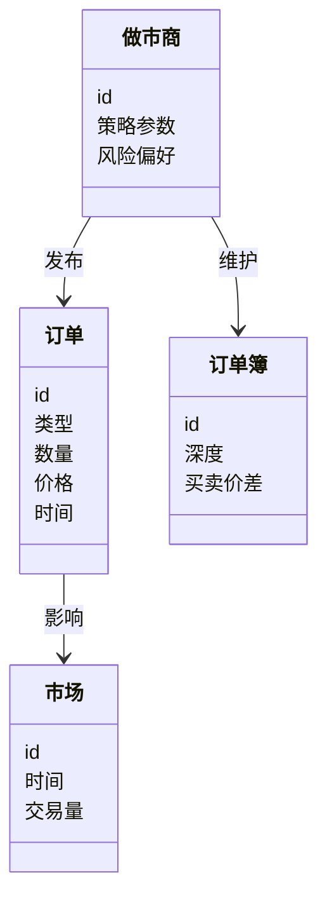

                 


# 《金融市场做市商策略优化模型》

---

## 关键词：
- 金融市场
- 做市商
- 策略优化
- 算法模型
- 风险管理

---

## 摘要：
本文详细探讨了金融市场中做市商策略优化模型的设计与实现。通过分析市场微观结构、定价模型和风险管理，提出了一个基于动态定价和风险控制的优化算法。结合系统架构设计和实际案例分析，本文展示了如何通过技术手段提升做市商的市场参与度和盈利能力。

---

# 第一章: 金融市场做市商策略优化模型背景介绍

## 1.1 做市商的定义与角色

### 1.1.1 做市商的定义

做市商（Market Maker）是金融市场中的重要参与者，负责提供流动性，即在市场中持续买入和卖出特定金融资产，以维持市场的稳定性和效率。做市商通过发布买卖报价，撮合交易，并从中赚取买卖价差或佣金。

### 1.1.2 做市商在金融市场中的角色

1. **流动性提供者**：做市商通过维持订单簿中的买价和卖价，确保市场的流动性，使得投资者能够在任何时候以合理的价格进行交易。
2. **价格发现者**：做市商通过分析市场信息和参与者行为，主动调整报价，影响市场价格的形成。
3. **风险管理承担者**：做市商需要承担市场风险，包括价格波动风险、信用风险和操作风险。

### 1.1.3 做市商与市场流动性

做市商的存在直接影响市场的流动性。高流动性意味着买卖价差小、成交速度快，而低流动性可能导致交易成本增加、市场波动加剧。做市商通过优化策略，可以在维持市场流动性的同时，降低自身的风险暴露。

## 1.2 做市商策略优化的背景与意义

### 1.2.1 金融市场环境的复杂性

现代金融市场环境复杂多变，受到宏观经济因素、政策变化、技术进步和市场参与者行为等多种因素的影响。做市商需要在瞬息万变的市场中做出快速决策，以应对各种不确定性。

### 1.2.2 做市商策略优化的必要性

随着金融市场的日益复杂化和竞争的加剧，传统的做市商策略往往难以应对市场变化。通过优化策略，做市商可以更好地捕捉市场机会，降低风险，提高盈利能力。

### 1.2.3 策略优化对市场的影响

做市商策略优化不仅有利于做市商本身，还能对整个市场产生积极影响。优化的策略有助于提高市场流动性，降低交易成本，促进价格发现的效率。

## 1.3 做市商策略优化的核心问题

### 1.3.1 市场微观结构分析

市场微观结构分析是做市商策略优化的基础。通过对订单簿深度、买卖价差、市场冲击等微观结构特征的分析，做市商可以更好地理解市场行为，制定更有效的策略。

### 1.3.2 做市商决策模型

做市商的决策模型需要考虑多个因素，包括市场深度、价格走势、交易成本和风险偏好等。优化模型的目标是在这些因素之间找到平衡，最大化利润同时控制风险。

### 1.3.3 风险与收益的平衡

做市商在优化策略时，需要在风险和收益之间找到平衡点。过高的风险可能导致重大损失，而过度保守的策略则可能错失市场机会。优化模型需要在两者之间找到最佳平衡。

## 1.4 本章小结

本章介绍了做市商的定义和角色，分析了策略优化的背景和意义，并提出了优化的核心问题。这些内容为后续章节的模型构建和算法设计奠定了基础。

---

# 第二章: 做市商策略优化模型的核心概念与联系

## 2.1 做市商策略优化模型的核心原理

### 2.1.1 做市商的订单簿管理

订单簿管理是做市商策略优化的核心内容之一。通过分析订单簿的深度和分布，做市商可以优化买卖价差，调整订单量，以应对市场变化。

### 2.1.2 价格形成机制

价格形成机制是做市商策略优化的关键。通过对市场供需关系、参与者行为和宏观经济因素的分析，做市商可以制定动态价格模型，实时调整报价。

### 2.1.3 风险控制模型

风险控制是做市商策略优化的重要组成部分。通过建立风险评估指标和控制阈值，做市商可以在市场波动中保持稳定，避免重大损失。

## 2.2 做市商策略优化的数学模型

### 2.2.1 市场微观结构模型

市场微观结构模型是优化模型的基础。通过分析订单簿数据和交易行为，可以构建数学模型，模拟市场动态。

### 2.2.2 做市商定价模型

定价模型是优化策略的核心。通过分析市场深度、买卖价差和市场冲击，定价模型可以计算出最优报价，以最大化利润和流动性。

### 2.2.3 风险调整收益模型

风险调整收益模型是优化策略的重要部分。通过引入风险调整因子，可以将风险因素纳入收益计算，实现风险和收益的平衡。

## 2.3 做市商策略优化的ER实体关系图

以下是做市商策略优化模型的ER实体关系图，展示了各个核心概念之间的关系：

```mermaid
erd
    entity 做市商 {
        id
        策略参数
        风险偏好
    }
    entity 订单 {
        id
        类型
        数量
        价格
        时间
    }
    entity 订单簿 {
        id
        深度
        买卖价差
    }
    entity 市场 {
        id
        时间
        交易量
    }
    做市商 --> 订单: 发布
    做市商 --> 订单簿: 维护
    订单 --> 市场: 影响
```

## 2.4 本章小结

本章详细阐述了做市商策略优化模型的核心概念和联系，包括订单簿管理、价格形成机制和风险控制模型，并通过ER实体关系图展示了各概念之间的关系。

---

# 第三章: 做市商策略优化算法的实现

## 3.1 动态定价模型算法

### 3.1.1 算法原理

动态定价模型是一种基于市场实时数据的定价算法。通过分析订单簿深度、买卖价差和市场趋势，动态定价模型可以实时调整报价，以最大化收益和流动性。

### 3.1.2 算法实现代码

以下是动态定价模型的实现代码：

```python
def dynamic_pricing(order_book_depth, current_price):
    # 计算订单簿深度加权平均
    weighted_depth = sum(order_book_depth * price for order_book_depth, price in zip(order_book_depth, current_price))
    # 计算最优价格
    optimal_price = current_price + weighted_depth * 0.1
    return optimal_price
```

### 3.1.3 算法流程图

以下是动态定价模型的流程图：


## 3.2 风险控制模型算法

### 3.2.1 算法原理

风险控制模型是一种基于风险评估的控制算法。通过分析市场波动性和做市商的头寸风险，风险控制模型可以动态调整风险敞口，确保在市场波动中保持稳定。

### 3.2.2 算法实现代码

以下是风险控制模型的实现代码：

```python
def risk_control(risk_exposure, risk_threshold):
    if risk_exposure > risk_threshold:
        return "减少头寸"
    else:
        return "保持头寸"
```

### 3.2.3 算法流程图

以下是风险控制模型的流程图：


## 3.3 本章小结

本章详细介绍了动态定价模型和风险控制模型的算法实现，包括算法原理、实现代码和流程图。这些算法为做市商策略优化提供了技术支持。

---

# 第四章: 做市商策略优化模型的系统分析与架构设计

## 4.1 项目背景介绍

本项目旨在开发一个基于做市商策略优化模型的交易系统，通过优化策略提高做市商的市场参与度和盈利能力。

## 4.2 系统功能设计

### 4.2.1 订单簿管理

订单簿管理模块负责维护订单簿，包括订单的发布、撤单和成交处理。

### 4.2.2 定价模型

定价模型模块负责根据市场数据和策略参数计算最优报价。

### 4.2.3 风险控制

风险控制模块负责实时监控市场风险，动态调整风险敞口。

## 4.3 系统架构设计

以下是系统架构设计的类图：



## 4.4 本章小结

本章介绍了项目的背景，详细描述了系统的功能设计和架构设计，为后续的实现和测试奠定了基础。

---

# 第五章: 做市商策略优化模型的项目实战

## 5.1 环境安装

### 5.1.1 安装Python和相关库

安装Python和Pandas、NumPy、Matplotlib等库。

## 5.2 系统核心实现

### 5.2.1 动态定价模型实现

实现动态定价模型，包括订单簿深度计算和价格调整。

### 5.2.2 风险控制模型实现

实现风险控制模型，包括风险敞口计算和控制指令生成。

## 5.3 代码应用解读与分析

### 5.3.1 动态定价模型代码

```python
import pandas as pd

def dynamic_pricing(order_book_depth, current_price):
    weighted_depth = sum(order_book_depth * price for order_book_depth, price in zip(order_book_depth, current_price))
    optimal_price = current_price + weighted_depth * 0.1
    return optimal_price
```

### 5.3.2 风险控制模型代码

```python
def risk_control(risk_exposure, risk_threshold):
    if risk_exposure > risk_threshold:
        return "减少头寸"
    else:
        return "保持头寸"
```

## 5.4 实际案例分析

### 5.4.1 数据准备

准备订单簿深度和当前价格数据。

### 5.4.2 模型应用

应用动态定价模型和风险控制模型，计算最优报价和风险控制指令。

## 5.5 本章小结

本章通过实际案例分析，展示了做市商策略优化模型的应用过程，包括环境安装、代码实现和结果分析。

---

# 第六章: 做市商策略优化模型的最佳实践和小结

## 6.1 模型的优势与劣势

### 6.1.1 优势

1. **高效性**：优化模型能够快速响应市场变化，提高交易效率。
2. **准确性**：基于数学模型的定价和风险控制，提高了报价的准确性。
3. **稳定性**：通过风险控制模型，确保在市场波动中保持稳定。

### 6.1.2 劣势

1. **计算复杂性**：复杂的模型需要大量的计算资源。
2. **数据依赖性**：模型的准确性依赖于高质量的数据。
3. **市场环境变化**：模型的优化效果受到市场环境变化的影响。

## 6.2 应用中的注意事项

### 6.2.1 数据质量

确保数据的准确性和及时性，避免因数据问题导致模型失效。

### 6.2.2 市场环境变化

定期更新模型参数，适应市场环境的变化。

### 6.2.3 风险管理

加强风险管理，避免因模型失效导致的重大损失。

## 6.3 未来研究方向

### 6.3.1 基于机器学习的策略优化

探索机器学习技术在做市商策略优化中的应用，提高模型的智能化水平。

### 6.3.2 大数据分析

利用大数据技术，分析更多的市场数据，提高模型的预测能力。

## 6.4 本章小结

本章总结了模型的优势和劣势，提出了应用中的注意事项，并展望了未来的研究方向。

---

# 结语

通过本篇文章的详细探讨，我们了解了金融市场做市商策略优化模型的设计与实现。从背景介绍到算法实现，从系统设计到项目实战，我们全面分析了优化模型的各个方面。未来，随着技术的进步和市场的变化，做市商策略优化模型将不断发展，为金融市场提供更高效、更稳定的交易支持。

