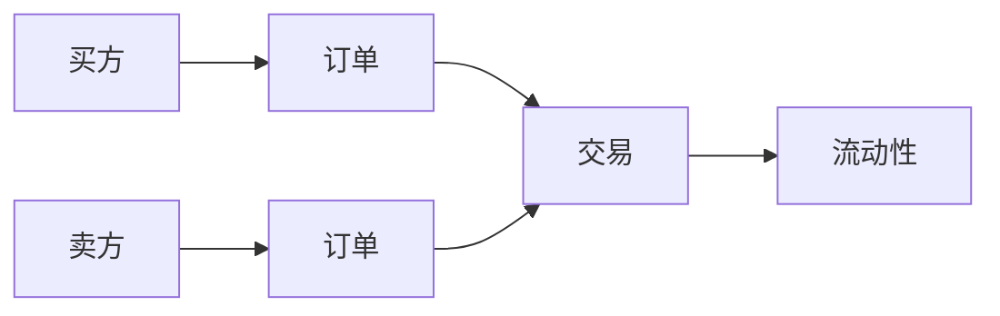
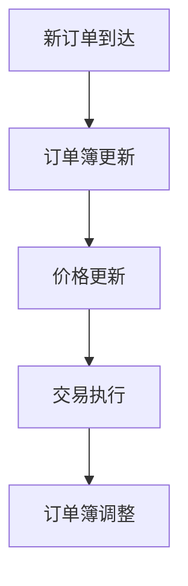
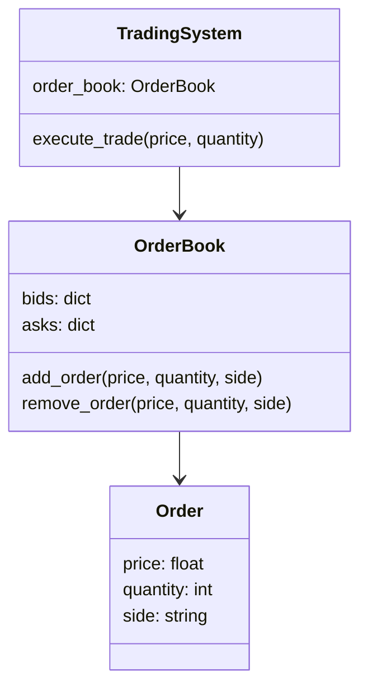
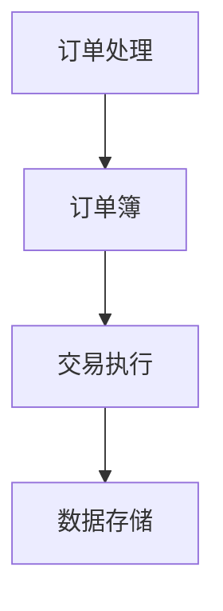
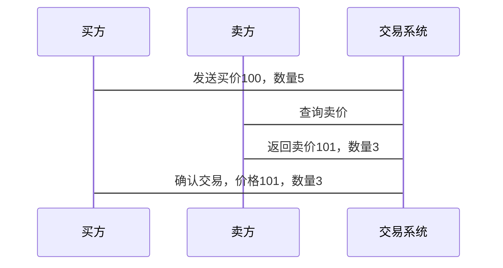

                 


# 金融市场微观结构分析

## 关键词：金融市场，微观结构，订单簿模型，交易算法，系统架构

## 摘要：金融市场微观结构分析是研究市场运作机制的核心领域，涵盖交易者行为、价格形成机制和市场效率。本文通过详细分析订单、交易和流动性等核心要素，结合算法原理和系统架构设计，深入探讨金融市场微观结构的内在逻辑和实际应用。

---

# 第1章: 金融市场微观结构的基本概念

## 1.1 金融市场的定义与参与者
### 1.1.1 金融市场的定义
金融市场是资金供需双方进行交易的场所，包括股票、债券、外汇等各类金融工具的交易市场。

### 1.1.2 市场参与者
- 买方：投资者、机构投资者
- 卖方：发行人、公司
- 交易商：做市商、经纪商
- 中间商：交易所、清算机构

### 1.1.3 金融市场的功能与作用
- 资金融通
- 价格发现
- 风险管理

## 1.2 价格形成机制
### 1.2.1 价格的决定因素
- 供需关系
- 市场情绪
- 新闻事件

### 1.2.2 市场供需与价格的关系
- 买方需求增加导致价格上涨
- 卖方供给增加导致价格下降

### 1.2.3 市场微观结构对价格的影响
- 市场深度影响价格稳定性
- 市场广度影响价格发现效率

## 1.3 金融市场微观结构的重要性
### 1.3.1 微观结构对市场效率的影响
- 流动性影响交易成本
- 市场深度影响订单执行质量

### 1.3.2 微观结构对市场稳定性的贡献
- 做市商提供流动性支持
- 订单簿反映市场供需动态

### 1.3.3 微观结构对投资者行为的影响
- 市场信息影响投资决策
- 市场结构影响交易策略

## 1.4 本书的

---

# 第2章: 核心概念与联系

## 2.1 核心概念：订单、交易与流动性
### 2.1.1 订单的定义与类型
- 市价单：立即成交的价格
- 限价单：指定价格成交
- 成交量：订单的数量

### 2.1.2 交易的定义与类型
- 即时交易：T+0
- 定期交易：T+1

### 2.1.3 流动性的定义与测量
- 流动性：买卖订单的数量和价格稳定性
- 流动性测量：买卖价差、订单深度

## 2.2 核心概念的联系
### 2.2.1 订单、交易与流动性的关系
- 订单数量影响流动性
- 交易频率影响市场深度

### 2.2.2 实体关系图


---

# 第3章: 算法原理

## 3.1 订单簿模型
### 3.1.1 模型定义
订单簿记录所有未成交的订单，反映市场供需情况。

### 3.1.2 模型工作流程


### 3.1.3 Python实现
```python
# 订单簿数据结构
class OrderBook:
    def __init__(self):
        self.bids = {}  # 买方订单，价格: 数量
        self.asks = {}  # 卖方订单，价格: 数量

    def add_order(self, price, quantity, side):
        if side == 'bid':
            self.bids[price] = self.bids.get(price, 0) + quantity
        else:
            self.asks[price] = self.asks.get(price, 0) + quantity

    def remove_order(self, price, quantity, side):
        if side == 'bid':
            self.bids[price] -= quantity
            if self.bids[price] == 0:
                del self.bids[price]
        else:
            self.asks[price] -= quantity
            if self.asks[price] == 0:
                del self.asks[price]

    def get_best_bid(self):
        return max(self.bids.keys()) if self.bids else None

    def get_best_ask(self):
        return min(self.asks.keys()) if self.asks else None
```

## 3.2 算法原理的数学模型
### 3.2.1 订单到达的随机过程
- 泊松过程描述订单到达频率
- $ \lambda $ 为平均到达率

### 3.2.2 价格变化的马尔可夫链模型
- 状态转移概率表示价格变化
- $ P_{i,j} $ 为从状态i转移到j的概率

---

# 第4章: 系统分析与架构设计

## 4.1 系统功能设计
### 4.1.1 领域模型


### 4.1.2 系统架构图


### 4.1.3 接口设计
- `add_order(price, quantity, side)`
- `remove_order(price, quantity, side)`
- `execute_trade(price, quantity)`

### 4.1.4 交互序列图


---

# 第5章: 项目实战

## 5.1 环境安装
- Python 3.8+
- 安装依赖：pandas, numpy

## 5.2 核心实现
```python
# 简单订单簿实现
class SimpleOrderBook:
    def __init__(self):
        self.bids = {}
        self.asks = {}

    def add_order(self, price, quantity, side):
        if side == 'bid':
            self.bids[price] = self.bids.get(price, 0) + quantity
        else:
            self.asks[price] = self.asks.get(price, 0) + quantity

    def remove_order(self, price, quantity, side):
        if side == 'bid':
            self.bids[price] -= quantity
            if self.bids[price] == 0:
                del self.bids[price]
        else:
            self.asks[price] -= quantity
            if self.asks[price] == 0:
                del self.asks[price]

    def get_best_bid(self):
        return max(self.bids.keys()) if self.bids else None

    def get_best_ask(self):
        return min(self.asks.keys()) if self.asks else None
```

### 代码解读
- `add_order` 和 `remove_order` 方法管理订单簿
- `get_best_bid` 和 `get_best_ask` 返回最佳价格

## 5.3 案例分析
### 案例1：订单簿初始化
```python
book = SimpleOrderBook()
book.add_order(100, 5, 'bid')
book.add_order(101, 3, 'ask')
print(book.get_best_bid())  # 输出：100
print(book.get_best_ask())  # 输出：101
```

### 案例2：订单处理
```python
book.remove_order(100, 5, 'bid')
print(book.bids)  # 输出：{}
```

## 5.4 项目小结
- 通过简单实现理解订单簿核心功能
- 为后续复杂系统开发奠定基础

---

# 第6章: 最佳实践

## 6.1 小结
- 金融市场微观结构分析是理解市场运作的关键
- 订单、交易和流动性是核心要素

## 6.2 注意事项
- 数据质量影响分析结果
- 模型选择需考虑实际情况
- 系统设计需确保高效性和稳定性

## 6.3 拓展阅读
- 《金融市场中的微观结构》
- 《算法交易：量化投资入门》

---

# 结语

金融市场微观结构分析是复杂而有趣的领域，通过深入理解订单、交易和流动性，我们可以更好地把握市场动态。希望本书能为读者提供有价值的见解和实践指导。

