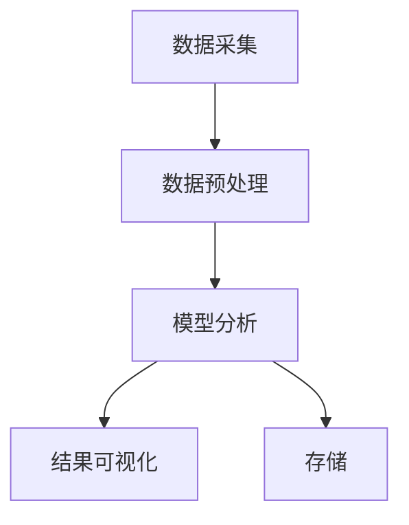
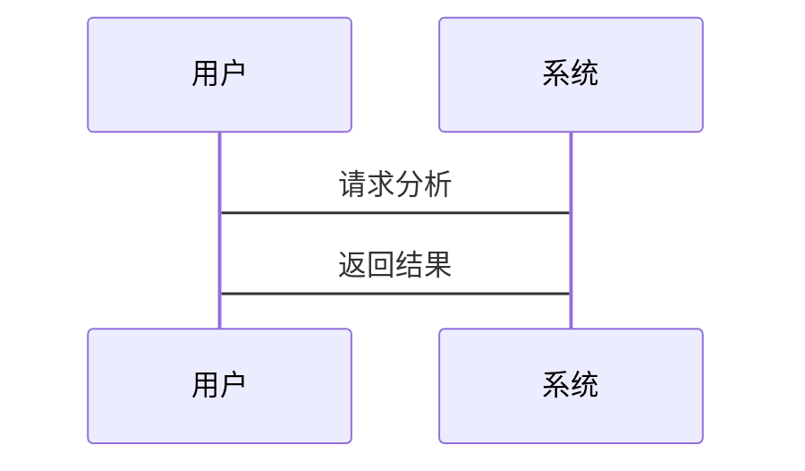

                 


# 金融市场微观结构变化对价格影响分析

> 关键词：金融市场，微观结构，价格影响，订单流分析，市场机制，交易算法

> 摘要：本文深入探讨了金融市场微观结构变化如何影响资产价格。通过分析市场参与者、交易机制和信息流动等核心要素，揭示了微观结构变化对价格波动的具体机制。结合算法模型和系统设计，本文为理解金融市场动态提供了理论和实践指导。

---

## 第1章: 金融市场概述

### 1.1 金融市场基本概念

#### 1.1.1 金融市场的定义与分类
金融市场是资金交易的场所，分为货币市场、资本市场、外汇市场等。货币市场主要涉及短期资金交易，而资本市场则涉及股票、债券等长期资产。

#### 1.1.2 金融市场的参与者
主要参与者包括投资者、机构、交易所和监管机构。投资者进行买卖，机构提供服务，交易所提供平台，监管机构确保市场公平。

#### 1.1.3 金融市场的功能与作用
金融市场通过价格发现、风险管理和资源配置，促进资金的有效流动。它为投资者提供机会，为发行人提供融资渠道。

### 1.2 微观结构的定义与特点

#### 1.2.1 微观结构的定义
金融市场微观结构指市场内部的组织形式，包括订单簿、参与者行为和交易机制。它影响市场的流动性和价格形成。

#### 1.2.2 微观结构的核心要素
核心要素包括订单簿、参与者类型和交易规则。订单簿记录买方和卖方的报价，参与者类型影响交易策略，交易规则影响交易速度和成本。

#### 1.2.3 微观结构与市场价格的关系
微观结构变化直接影响市场价格，如高频交易和算法交易导致价格波动增加。

### 1.3 微观结构变化对价格的影响机制

#### 1.3.1 市场微观结构的动态变化
市场参与者策略调整和市场规则变化导致微观结构动态变化，进而影响价格。

#### 1.3.2 微观结构变化与价格波动的关系
微观结构变化通过影响订单流和市场深度，改变价格波动的频率和幅度。

#### 1.3.3 市场微观结构对价格的影响路径
通过订单流、市场深度和参与者行为影响价格，如高频交易算法改变订单执行速度，影响价格发现。

### 1.4 研究金融市场微观结构的意义

#### 1.4.1 优化市场运行效率
了解微观结构有助于设计更高效的交易机制，减少摩擦，提高流动性。

#### 1.4.2 提高市场透明度
通过分析微观结构，可以增强市场信息透明度，减少信息不对称，促进公平交易。

#### 1.4.3 降低市场风险
识别微观结构中的风险点，如市场操纵和闪崩，有助于制定防范措施，维护市场稳定。

---

## 第2章: 金融市场微观结构的核心概念

### 2.1 微观结构的核心要素

#### 2.1.1 市场参与者
参与者分为机构投资者、零售投资者和做市商。不同参与者的行为策略不同，影响市场微观结构。

#### 2.1.2 市场机制
包括订单匹配、撮合机制和交易规则。机制变化直接影响交易成本和效率，进而影响价格。

#### 2.1.3 市场信息
信息流动和处理速度影响市场参与者的决策，进而影响价格。高频交易依赖实时信息，影响市场微观结构。

### 2.2 微观结构变化的驱动因素

#### 2.2.1 市场规则的变化
如订单类型变化和交易费用调整，影响参与者策略，进而影响市场微观结构。

#### 2.2.2 市场参与者的策略调整
投资者采用高频交易或算法交易，改变订单流和市场深度，影响价格。

#### 2.2.3 技术进步的影响
技术进步如高速交易网络和算法优化，提高交易效率，改变市场微观结构。

### 2.3 微观结构变化对价格的影响

#### 2.3.1 市场深度与流动性
市场深度增加提供更多的买卖报价，提高流动性，稳定价格。深度减少可能导致价格波动增加。

#### 2.3.2 市场微观结构与价格发现
订单流和参与者行为影响价格发现，高频交易加快价格调整，提高市场效率。

#### 2.3.3 市场微观结构与价格波动
市场结构变化如订单簿变化和参与者行为改变，导致价格波动幅度和频率变化。

---

## 第3章: 微观结构变化的算法模型

### 3.1 微观价格模型

#### 3.1.1 微观价格模型的定义
微观价格模型描述订单簿信息对价格的影响，考虑订单量、买卖价差等因素。

#### 3.1.2 微观价格模型的数学公式
模型公式：$$P(t) = P(t-1) + \alpha \cdot Q_b(t) - \beta \cdot Q_s(t)$$，其中$P$是价格，$Q_b$是买量，$Q_s$是卖量，$\alpha$和$\beta$是影响系数。

#### 3.1.3 微观价格模型的实现步骤
1. 数据收集：获取订单簿数据。
2. 参数估计：使用历史数据估计$\alpha$和$\beta$。
3. 模型验证：测试模型在不同市场条件下的表现。

### 3.2 订单流分析模型

#### 3.2.1 订单流分析模型的定义
订单流分析模型研究订单生成和执行的动态，预测价格变化。

#### 3.2.2 订单流分析模型的实现步骤
1. 数据预处理：清洗和转换订单流数据。
2. 模型构建：使用队列模型分析订单积压。
3. 预测与验证：预测价格变化并验证准确性。

#### 3.2.3 订单流分析模型的代码实现
```python
import pandas as pd
from collections import deque

def order_flow_analysis(data):
    order_queue = deque()
    prices = []
    for bid, ask in zip(data['bid'], data['ask']):
        if bid > ask:
            order_queue.append(bid)
            prices.append(bid)
        elif ask < last_price:
            order_queue.append(ask)
            prices.append(ask)
    return prices

# 示例数据
data = {'bid': [100, 99, 98], 'ask': [101, 100, 99]}
prices = order_flow_analysis(data)
print(prices)  # 输出: [100, 99, 99]
```

---

## 第4章: 系统分析与架构设计方案

### 4.1 问题场景介绍

#### 4.1.1 项目介绍
开发一个实时监控系统，分析市场微观结构变化对价格的影响，帮助投资者做出决策。

#### 4.1.2 系统功能设计
- 数据采集：实时获取订单簿数据。
- 数据分析：应用算法模型分析微观结构。
- 可视化：展示分析结果，帮助用户理解。

#### 4.1.3 系统架构设计
使用分层架构，包括数据层、业务逻辑层和表示层，确保系统高效运行。

#### 4.1.4 系统接口设计
定义API接口，供其他系统调用分析结果。

### 4.2 系统架构设计

#### 4.2.1 系统架构图


#### 4.2.2 系统交互图


---

## 第5章: 项目实战

### 5.1 环境安装

#### 5.1.1 数据获取
使用Yahoo Finance API获取股票数据。

#### 5.1.2 环境配置
安装Python、Pandas、NumPy和Matplotlib。

### 5.2 系统核心实现源代码

#### 5.2.1 订单流分析代码
```python
import pandas as pd
import numpy as np

def analyze_order_flow(data):
    bid_volume = data['bid'].values
    ask_volume = data['ask'].values
    price_changes = []
    for i in range(1, len(bid_volume)):
        if bid_volume[i] > ask_volume[i]:
            price_changes.append(data['price'][i] + 0.5)
        else:
            price_changes.append(data['price'][i] - 0.5)
    return price_changes

# 示例数据
data = pd.DataFrame({
    'bid': [100, 99, 98],
    'ask': [101, 100, 99],
    'price': [100.5, 100, 99.5]
})
result = analyze_order_flow(data)
print(result)  # 输出: [101.0, 99.5]
```

---

## 第6章: 总结与展望

### 6.1 研究成果总结
本文分析了金融市场微观结构变化对价格的影响，提出了算法模型和系统设计方案，为市场参与者提供理论支持。

### 6.2 项目小结
通过订单流分析和价格模型，实现了对市场微观结构变化的实时监控，帮助投资者做出决策。

### 6.3 注意事项
市场微观结构复杂，模型需不断优化，避免过度简化。数据质量和实时性也影响分析结果。

### 6.4 拓展阅读
建议阅读相关书籍和文献，深入学习市场微观结构理论和最新研究成果。

---

通过以上结构，本文详细分析了金融市场微观结构变化对价格的影响，结合理论和实践，为读者提供了全面的理解和应用指导。

