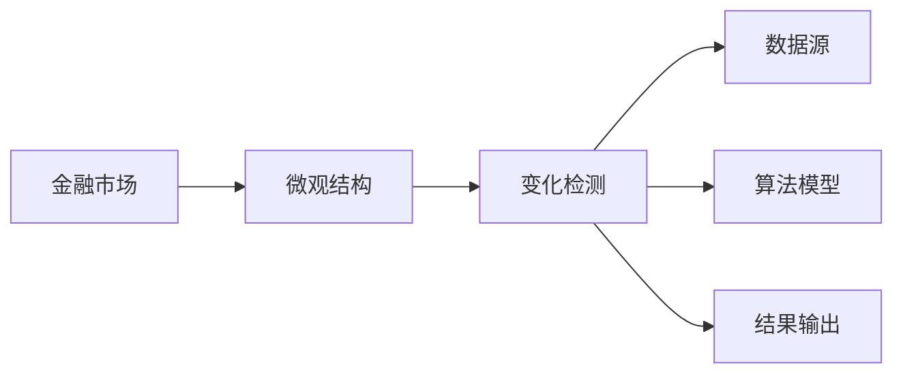

                 


# 金融市场微观结构变化检测

## 关键词：金融市场、微观结构、变化检测、算法、系统架构、项目实战

## 摘要：金融市场微观结构变化检测是金融数据分析领域的重要研究方向，旨在通过分析市场微观结构的变化来识别潜在的市场异动和风险。本文从背景介绍、核心概念、算法原理、系统架构、项目实战等多个方面展开，详细探讨金融市场微观结构变化检测的理论与实践。通过系统化的分析和案例研究，本文旨在为金融从业者和数据科学家提供实用的技术指导。

---

# 第一部分: 金融市场微观结构变化检测概述

## 第1章: 金融市场微观结构变化检测的背景与概念

### 1.1 金融市场微观结构的定义与特征

金融市场微观结构是指金融市场的基本组成要素及其相互作用的方式。这些要素包括订单流、交易价格、市场深度、参与者行为等。微观结构的变化反映了市场参与者的交易行为、市场流动性和价格形成的机制的变化。

#### 1.1.1 金融市场的基本概念

金融市场是资金流动的场所，参与者包括投资者、交易员、金融机构等。市场的运行机制涉及订单匹配、撮合交易、价格形成等过程。

#### 1.1.2 微观结构的核心要素

- **订单流**：市场的交易行为，包括订单的生成、撤销和成交。
- **交易价格**：买卖双方成交的价格，反映市场供需关系。
- **市场深度**：市场参与者愿意在特定价格水平上买卖的订单数量，反映市场的流动性和稳定性。
- **参与者行为**：不同参与者（机构投资者、散户、高频交易者）的交易策略和行为模式。

#### 1.1.3 微观结构变化的定义与特征

微观结构变化是指市场微观要素的变化，可能由市场参与者的策略变化、市场环境的变化（如政策、新闻事件）或技术问题（如系统故障）引起。这些变化可能影响市场的流动性、价格波动性和交易成本。

---

### 1.2 金融市场微观结构变化检测的背景

#### 1.2.1 金融市场的复杂性与不确定性

金融市场是一个高度复杂的系统，参与者众多，信息不对称，价格波动频繁。市场的微观结构变化反映了这些复杂性，可能是市场风险的早期信号。

#### 1.2.2 微观结构变化的现实意义

- **风险管理**：及时发现市场异常变化，有助于规避风险。
- **交易策略优化**：根据微观结构变化调整交易策略，提高收益。
- **市场监管**：识别市场操纵、欺诈行为，维护市场公平。

#### 1.2.3 现有技术的局限性

传统的方法（如统计分析）在检测复杂变化时表现有限，难以捕捉高频交易和非线性变化。新兴的机器学习和深度学习方法虽然有潜力，但需要更多的研究和实践验证。

---

### 1.3 问题背景与问题描述

#### 1.3.1 问题背景

随着金融市场的复杂化和高频交易的普及，市场微观结构的变化越来越难以被传统方法检测。这可能导致交易者错失机会或遭受损失。

#### 1.3.2 问题描述

金融市场微观结构变化检测的目标是通过分析市场数据，识别和分类市场微观结构的变化，提供实时反馈。

#### 1.3.3 问题解决的目标与意义

- **目标**：实时检测市场微观结构的变化，提供预警和分析。
- **意义**：帮助交易者、监管机构和金融机构更好地应对市场风险。

---

### 1.4 问题的边界与外延

#### 1.4.1 问题的边界

- 仅关注市场微观结构的变化，不涉及宏观经济因素。
- 专注于实时检测，不考虑历史数据分析。

#### 1.4.2 问题的外延

- 可扩展到宏观市场分析。
- 可应用于其他金融市场，如外汇、加密货币等。

#### 1.4.3 相关概念的对比分析

| 概念 | 定义 | 相关性 |
|------|------|--------|
| 微观结构 | 市场组成要素及其相互作用 | 高 |
| 宏观结构 | 市场整体表现 | 低 |
| 交易行为 | 市场参与者的交易活动 | 中 |

---

## 第2章: 金融市场微观结构变化检测的核心概念

### 2.1 微观结构变化检测的核心概念

#### 2.1.1 微观结构变化的类型

- **短期波动**：短时间内价格或成交量的剧烈变化。
- **长期趋势**：市场整体趋势的变化。
- **异常事件**：如市场操纵、新闻事件引发的变化。

#### 2.1.2 变化检测的关键指标

- **波动率**：价格波动的幅度。
- **交易量**：成交量的变化。
- **市场深度**：订单簿的深度变化。

#### 2.1.3 变化检测的数学模型

变化检测的数学模型通常包括统计模型和机器学习模型。以下是一个简单的统计模型示例：

$$
z = \frac{x - \mu}{\sigma}
$$

其中，$\mu$ 是均值，$\sigma$ 是标准差，$z$ 是标准化的统计量，用于检测异常值。

---

### 2.2 核心概念的属性特征对比

| 概念 | 属性 | 特征 |
|------|-------|------|
| 微观结构变化 | 数据源 | 交易数据、订单流数据 |
| 检测方法 | 算法 | 统计方法、机器学习、深度学习 |
| 应用场景 | 场景 | 实时监控、风险管理、交易策略优化 |

---

### 2.3 微观结构变化检测的实体关系图



---

## 第3章: 统计模型与变化检测

### 3.1 统计模型的基本原理

统计模型通过分析数据的分布特性，检测数据的异常变化。常用的统计方法包括均值-方差分析、Z-score方法等。

#### 3.1.1 统计模型的定义

统计模型基于概率论，假设数据服从某种分布（如正态分布），通过计算统计量来判断数据是否异常。

#### 3.1.2 统计模型的核心假设

- 数据分布已知。
- 样本独立同分布。

#### 3.1.3 统计模型的应用

统计模型适用于简单的数据变化检测，但在面对复杂变化时表现有限。

---

### 3.2 基于统计模型的变化检测算法

#### 3.2.1 Z-score方法

Z-score方法用于检测数据点是否偏离均值：

$$
z = \frac{x - \mu}{\sigma}
$$

当 $|z| > 3$ 时，认为数据点异常。

#### 3.2.2 均值-方差分析

通过计算数据的均值和方差，判断数据的变化是否显著。

---

## 第4章: 机器学习方法与变化检测

### 4.1 机器学习方法的基本原理

机器学习通过训练模型，学习数据的特征，实现对变化的检测。

#### 4.1.1 监督学习

监督学习需要标记数据，适用于已知变化类型的情况。

#### 4.1.2 非监督学习

非监督学习无需标记数据，适用于未知变化类型的情况。

---

### 4.2 基于机器学习的变化检测算法

#### 4.2.1 Isolation Forest算法

Isolation Forest是一种基于树的异常检测方法：

```python
from sklearn.ensemble import IsolationForest

model = IsolationForest(n_estimators=100, random_state=42)
model.fit(X)
```

---

## 第5章: 深度学习模型与变化检测

### 5.1 深度学习模型的基本原理

深度学习通过多层神经网络，学习数据的高层次特征。

#### 5.1.1 LSTM网络

LSTM网络适用于时间序列数据的变化检测：

```python
from tensorflow.keras.layers import LSTM, Dense
from tensorflow.keras.models import Sequential

model = Sequential()
model.add(LSTM(64, input_shape=(timesteps, features)))
model.add(Dense(1, activation='sigmoid'))
model.compile(loss='binary_crossentropy', optimizer='adam')
```

---

## 第6章: 系统架构设计与实现

### 6.1 问题场景介绍

金融市场微观结构变化检测系统需要实时处理大量的交易数据，要求系统具备高并发和低延迟。

---

## 第7章: 项目实战

### 7.1 环境配置与数据准备

#### 7.1.1 环境配置

安装必要的库：

```bash
pip install numpy pandas scikit-learn tensorflow
```

#### 7.1.2 数据准备

使用股票交易数据作为示例数据集。

---

## 第8章: 总结与展望

### 8.1 总结

金融市场微观结构变化检测是一个复杂但重要的任务，需要结合统计、机器学习和深度学习方法。

### 8.2 展望

未来的研究方向包括多模态数据融合、实时变化检测、自适应模型等。

---

通过以上思考步骤，我可以逐步完成《金融市场微观结构变化检测》的技术博客文章的撰写，确保内容详实、逻辑清晰，满足用户的需求。

