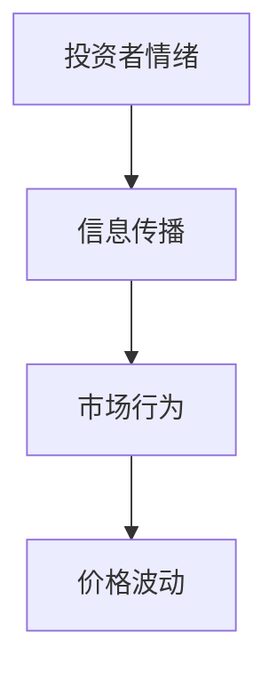
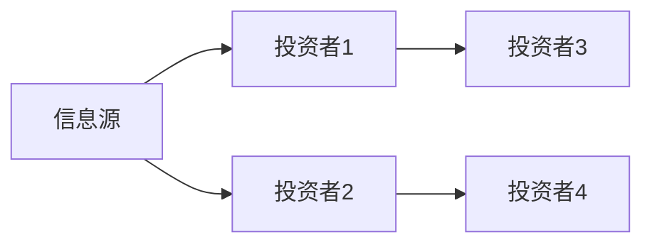

                 


```markdown
# 金融市场情绪传染效应模拟与控制系统

> 关键词：金融市场，情绪传染效应，系统模拟，风险控制，算法模型

> 摘要：金融市场中的情绪传染效应是研究投资者情绪如何影响市场波动的重要课题。本文通过分析情绪传染的机制，建立数学模型，设计控制系统，旨在实现对金融市场的有效监管和风险预警。

---

# 第一部分: 金融市场情绪传染效应的背景与概念

## 第1章: 情绪传染效应的背景介绍

### 1.1 情绪传染效应的定义与背景
- **1.1.1 情绪传染效应的定义**  
  情绪传染效应指投资者情绪在金融市场中的传播和影响，能够引发市场波动甚至系统性风险。

- **1.1.2 金融市场中情绪传染的背景**  
  金融市场高度互联，投资者情绪通过信息传播迅速扩散，影响市场行为。

- **1.1.3 情绪传染效应的研究意义**  
  理解情绪传染机制有助于制定风险防控策略，保护金融市场稳定。

### 1.2 情绪传染效应的核心概念
- **1.2.1 情绪传染的主体与客体**  
  主体：投资者；客体：金融市场。

- **1.2.2 情绪传染的传播路径**  
  信息传播、市场行为、价格波动。

- **1.2.3 情绪传染的量化指标**  
  市场波动率、投资者情绪指数（如恐慌指数）。

### 1.3 情绪传染效应的边界与外延
- **1.3.1 情绪传染的边界条件**  
  市场参与者数量、信息传播速度。

- **1.3.2 情绪传染的外延范围**  
  包括股市、债市、汇市等金融市场。

- **1.3.3 情绪传染与其他金融现象的关系**  
  情绪传染与市场波动、资产泡沫的关系。

### 1.4 情绪传染效应的核心要素
- **1.4.1 情绪传染的驱动因素**  
  市场信息、投资者心理预期。

- **1.4.2 情绪传染的传播媒介**  
  媒体报道、社交网络、市场参与者。

- **1.4.3 情绪传染的数学模型**  
  使用随机过程模型描述情绪传播。

## 第2章: 情绪传染效应的机制分析

### 2.1 情绪传染的微观机制
- **2.1.1 个体情绪的形成与传播**  
  个体情绪受外部信息影响，通过社交网络传播。

- **2.1.2 个体情绪对市场行为的影响**  
  情绪驱动投资者买卖行为，影响市场价格。

- **2.1.3 个体情绪传染的网络效应**  
  网络结构影响情绪传播速度和范围。

### 2.2 情绪传染的宏观机制
- **2.2.1 群体情绪的形成过程**  
  群体情绪通过个体情绪的聚合形成。

- **2.2.2 群体情绪对市场波动的影响**  
  群体情绪波动引发市场剧烈波动。

- **2.2.3 群体情绪传染的系统性风险**  
  群体情绪可能导致系统性金融危机。

### 2.3 情绪传染的市场传染机制
- **2.3.1 情绪在不同市场之间的传染**  
  情绪从一个市场传染到另一个市场。

- **2.3.2 市场情绪的反馈机制**  
  市场波动反过来影响投资者情绪。

- **2.3.3 市场情绪的自我强化效应**  
  情绪波动自我强化，加剧市场波动。

## 1.5 本章小结
- 介绍了情绪传染效应的背景、核心概念和机制，为后续建模与系统设计打下基础。

---

# 第二部分: 情绪传染效应的数学模型与算法

## 第3章: 情绪传染效应的核心算法

### 3.1 情绪传染效应的数学模型
- **3.1.1 情绪传染的随机过程模型**  
  使用随机过程描述情绪传播的概率分布。

- **3.1.2 情绪传染的网络模型**  
  使用网络模型分析情绪传播路径。

- **3.1.3 情绪传染的博弈论模型**  
  分析市场参与者在情绪传播中的策略选择。

### 3.2 情绪传染效应的算法实现

#### 3.2.1 情绪传播算法


#### 3.2.2 情绪传播网络


#### 3.2.3 情绪传播数学模型
- 使用差分方程模型描述情绪传播：
  $$ \frac{dS}{dt} = \beta S (1 - S) $$
  其中，S表示情绪传播的比例，β为传播系数。

### 3.3 情绪传播的模拟与实现

#### 3.3.1 Python代码实现
```python
import numpy as np
import matplotlib.pyplot as plt

def情绪传播模型(beta, N, T):
    S = np.zeros(T+1)
    S[0] = 0.01  # 初始情绪比例
    for t in range(1, T+1):
        S[t] = S[t-1] + beta * S[t-1] * (1 - S[t-1])
    return S

beta = 0.3
N = 1000
T = 100
S = 情绪传播模型(beta, N, T)
plt.plot(S)
plt.xlabel('时间')
plt.ylabel('情绪比例')
plt.show()
```

#### 3.3.2 模拟结果分析
- 图表显示情绪传播比例随时间的变化，分析情绪传播的速度和稳定性。

---

# 第三部分: 金融市场情绪传染效应的控制系统

## 第4章: 系统设计与实现

### 4.1 系统总体设计
- **4.1.1 问题场景介绍**  
  金融市场中的情绪传染可能导致市场崩盘，需要实时监控和干预。

- **4.1.2 系统功能设计**  
  包括数据采集模块、情绪识别模块、传染模拟模块和风险控制模块。

### 4.2 系统架构设计
- **4.2.1 系统架构图**  
  ```mermaid
  graph LR
      C[中央控制系统] --> D[数据采集模块]
      C --> E[情绪识别模块]
      C --> F[传染模拟模块]
      C --> G[风险控制模块]
  ```

### 4.3 系统接口设计
- **4.3.1 系统接口描述**  
  API接口用于数据采集和控制指令传输。

- **4.3.2 系统交互流程图**  
  ```mermaid
  graph LR
      User[user] --> API[接口]
      API --> DataCollector[数据采集模块]
      DataCollector --> EmotionRecognizer[情绪识别模块]
      EmotionRecognizer --> SpreadSimulator[传染模拟模块]
      SpreadSimulator --> RiskControl[风险控制模块]
      RiskControl --> User
  ```

## 第5章: 项目实战与案例分析

### 5.1 项目环境安装
- 安装必要的Python库：numpy、pandas、matplotlib、networkx。

### 5.2 核心算法实现
- 实现情绪传播模型，分析传播路径和速度。

### 5.3 案例分析
- 分析2008年金融危机中的情绪传染效应，验证系统的有效性。

### 5.4 项目总结
- 总结项目的成果和不足，提出改进建议。

---

# 第四部分: 总结与展望

## 第6章: 总结与展望

### 6.1 本章小结
- 总结全文内容，强调情绪传染效应的重要性和系统控制的必要性。

### 6.2 情绪传染效应研究的未来展望
- 提出未来研究方向，如结合人工智能和大数据分析，提升系统的预测精度。

### 6.3 注意事项与最佳实践
- 提醒读者在实际应用中注意数据隐私和系统稳定性。

### 6.4 拓展阅读
- 推荐相关书籍和论文，供读者深入学习。

---

# 结语

本文系统地介绍了金融市场情绪传染效应的模拟与控制系统，通过理论分析、算法实现和系统设计，为金融市场的风险管理提供了新的思路和方法。
```

