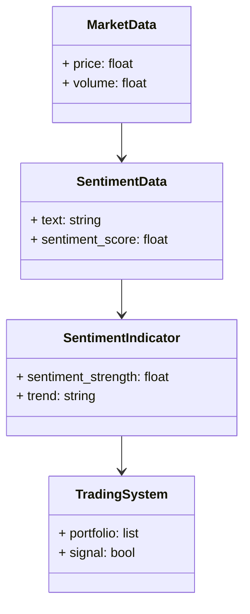
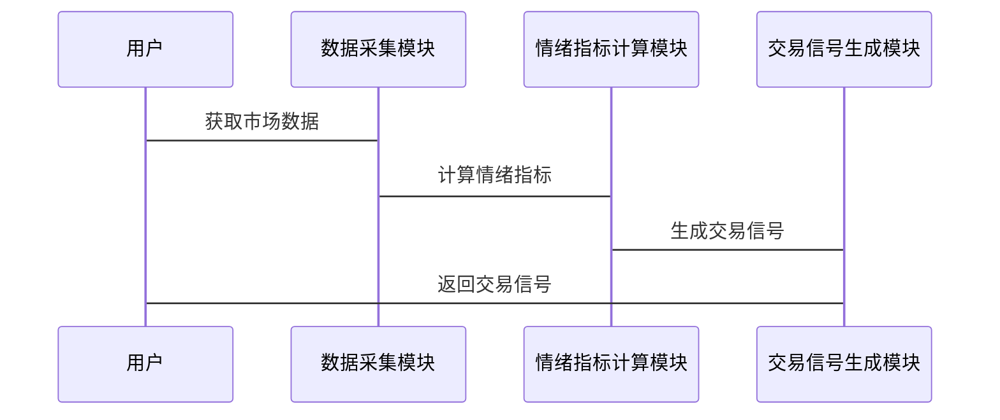

                 


# 金融市场情绪指标开发

---

## 关键词：金融市场、情绪指标、技术分析、自然语言处理、机器学习、统计学

---

## 摘要：金融市场情绪指标是一种基于市场参与者行为数据，通过统计学、自然语言处理和机器学习等技术手段，量化市场情绪强度的指标。本文从情绪指标的核心概念、算法原理、系统架构设计到项目实战，全面解析情绪指标的开发过程，帮助读者理解情绪指标在金融市场中的应用价值和开发实现方法。

---

# 第1章: 金融市场情绪指标概述

## 1.1 情绪指标的基本概念

### 1.1.1 什么是金融市场情绪指标

金融市场情绪指标是通过分析市场参与者的行为数据（如交易量、价格波动、新闻文本等），量化市场情绪强度的指标。情绪指标反映了市场参与者的乐观、悲观、恐慌等情绪状态，可以帮助投资者预测市场走势。

### 1.1.2 情绪指标的分类与特点

情绪指标可以分为以下几类：

1. **基于交易数据的情绪指标**：如成交量、买卖价差等。
2. **基于价格数据的情绪指标**：如波动率、VIX指数等。
3. **基于新闻数据的情绪指标**：如新闻情感分析、关键词提取等。

特点：
- **滞后性**：情绪指标通常是对市场走势的滞后反映。
- **波动性**：情绪指标受市场参与者心理行为影响，具有较高的波动性。
- **辅助性**：情绪指标通常与其他技术指标结合使用，提供额外的市场信息。

### 1.1.3 情绪指标在金融分析中的作用

情绪指标可以帮助投资者：
- **预测市场拐点**：通过情绪指标的超买超卖信号，预测市场的顶部和底部。
- **优化投资策略**：结合情绪指标和传统技术指标，制定更有效的交易策略。
- **风险控制**：通过情绪指标提前发现市场恐慌或过度乐观的情况，进行风险控制。

## 1.2 金融市场情绪指标的背景与意义

### 1.2.1 传统技术分析的局限性

传统技术分析（如K线图、均线、MACD等）虽然在一定程度上可以帮助投资者预测市场走势，但其主要基于价格和交易量的历史数据，忽略了市场参与者情绪这一重要因素。情绪指标的引入弥补了这一不足。

### 1.2.2 情绪指标的引入与发展趋势

随着大数据和人工智能技术的发展，情绪指标的开发和应用越来越受到重视。特别是在量化交易领域，情绪指标可以帮助算法交易模型更准确地捕捉市场情绪变化。

### 1.2.3 情绪指标与市场参与者的心理行为

市场参与者的心理行为直接影响市场走势。例如：
- 当市场情绪过于乐观时，可能会引发市场回调。
- 当市场情绪过于恐慌时，可能会引发市场反弹。

## 1.3 情绪指标的核心概念与联系

### 1.3.1 情绪指标的构成要素

情绪指标的构成要素包括：
- **数据源**：交易数据、新闻数据、社交媒体数据等。
- **计算方法**：统计学方法、自然语言处理方法、机器学习方法等。
- **情绪强度**：量化市场情绪的强度，通常以数值形式表示。

### 1.3.2 情绪指标与市场走势的关系

情绪指标与市场走势之间存在一定的相关性。例如：
- 当情绪指标显示市场情绪过于乐观时，市场可能会出现回调。
- 当情绪指标显示市场情绪过于悲观时，市场可能会出现反弹。

### 1.3.3 情绪指标与其他技术指标的对比

以下是一些常见技术指标与情绪指标的对比：

| 技术指标 | 情绪指标 |
|----------|----------|
| 均线（MA）| 情绪强度 |
| MACD     | 情绪波动 |
| RSI      | 情绪超买超卖 |

## 1.4 本章小结

本章从情绪指标的基本概念、分类、作用、背景与意义等方面进行了详细阐述，为后续章节的分析奠定了基础。

---

# 第2章: 情绪指标的核心概念与联系

## 2.1 情绪指标的构成要素

### 2.1.1 数据源：市场参与者的行为数据

情绪指标的开发需要收集市场参与者的行为数据，包括：
- **交易数据**：如成交量、成交价、买卖价差等。
- **新闻数据**：如新闻标题、新闻内容、关键词等。
- **社交媒体数据**：如微博、Twitter、Reddit等平台的帖子。

### 2.1.2 计算方法：情绪强度的量化

情绪强度的量化方法包括：
- **统计学方法**：如均值、标准差、协方差等。
- **自然语言处理方法**：如情感分析、关键词提取等。
- **机器学习方法**：如支持向量机、神经网络等。

### 2.1.3 指标特征：周期性与滞后性

情绪指标具有周期性，通常与市场周期同步。同时，情绪指标具有滞后性，即市场情绪的变化通常滞后于市场走势的变化。

## 2.2 情绪指标与市场行为的关系

### 2.2.1 情绪指标的波动与市场走势的关联

情绪指标的波动通常与市场走势的波动密切相关。例如：
- 当情绪指标急剧上升时，市场可能处于超买状态，价格可能会下跌。
- 当情绪指标急剧下降时，市场可能处于超卖状态，价格可能会上涨。

### 2.2.2 情绪指标的领先性与滞后性

情绪指标的领先性是指情绪指标的变化可以预测未来市场走势的变化。例如：
- 当情绪指标显示市场情绪过于乐观时，未来市场可能会出现回调。

情绪指标的滞后性是指情绪指标的变化通常滞后于市场走势的变化。例如：
- 当市场已经出现回调时，情绪指标才开始显示市场情绪过于乐观。

### 2.2.3 情绪指标的适用场景

情绪指标适用于以下场景：
- **市场拐点预测**：通过情绪指标的超买超卖信号，预测市场拐点。
- **风险控制**：通过情绪指标提前发现市场恐慌或过度乐观的情况，进行风险控制。
- **投资策略优化**：结合情绪指标和传统技术指标，优化投资策略。

## 2.3 情绪指标与其他技术指标的对比

### 2.3.1 均值-方差模型的对比

均值-方差模型是一种传统的资产定价模型，其核心是通过资产的期望收益和风险（方差）来优化投资组合。情绪指标则通过量化市场情绪来辅助投资决策。

### 2.3.2 随机游走模型的对比

随机游走模型认为市场价格的变化是随机的，无法通过技术分析预测市场走势。情绪指标则认为市场情绪的变化可以影响市场走势，从而提供额外的市场信息。

### 2.3.3 动量策略的对比

动量策略是基于价格趋势的投资策略，通常通过动量指标（如RSI、MACD等）来实现。情绪指标则通过量化市场情绪，为动量策略提供额外的信息。

## 2.4 情绪指标的实体关系图

以下是一个情绪指标的实体关系图：


---

# 第3章: 情绪指标的算法原理与数学模型

## 3.1 情绪指标的计算方法

### 3.1.1 基于统计学的计算方法

基于统计学的计算方法包括：
- **均值法**：计算市场情绪的平均值。
- **标准差法**：计算市场情绪的波动性。
- **协方差法**：计算不同资产之间情绪的相关性。

### 3.1.2 基于自然语言处理的计算方法

基于自然语言处理的计算方法包括：
- **情感分析**：对新闻、社交媒体等文本数据进行情感分析，量化市场情绪。
- **关键词提取**：提取与市场情绪相关的关键词，计算关键词的出现频率。

### 3.1.3 基于机器学习的计算方法

基于机器学习的计算方法包括：
- **支持向量机（SVM）**：用于分类市场情绪。
- **神经网络**：用于深度学习市场情绪。

## 3.2 情绪指标的数学模型

### 3.2.1 情绪强度的量化公式

情绪强度的量化公式可以表示为：

$$
\text{情绪强度} = \frac{\sum_{i=1}^{n} w_i \cdot s_i}{\sum_{i=1}^{n} w_i}
$$

其中，$w_i$ 是第 $i$ 个数据的权重，$s_i$ 是第 $i$ 个数据的情绪评分。

### 3.2.2 情绪指标与市场走势的关系

情绪指标与市场走势的关系可以通过回归分析来量化。例如：

$$
y = \beta_0 + \beta_1 x + \epsilon
$$

其中，$y$ 是市场走势，$x$ 是情绪指标，$\beta_1$ 是情绪指标对市场走势的影响系数。

### 3.2.3 情绪指标的数学模型应用

以下是一个基于均值-方差模型的情绪指标应用示例：

$$
\min_{w} \quad w^T \Sigma w
$$

$$
\text{s.t.} \quad w^T \mu = 1
$$

其中，$w$ 是投资组合权重，$\Sigma$ 是市场情绪波动矩阵，$\mu$ 是市场情绪期望收益向量。

---

# 第4章: 情绪指标的系统分析与架构设计

## 4.1 系统分析

### 4.1.1 问题场景介绍

假设我们开发一个基于情绪指标的量化交易系统，需要实时采集市场数据，计算情绪指标，并根据情绪指标生成交易信号。

### 4.1.2 项目介绍

本项目旨在开发一个实时情绪指标计算系统，帮助投资者根据市场情绪进行交易决策。

## 4.2 系统功能设计

### 4.2.1 领域模型

以下是一个领域模型的类图：



### 4.2.2 系统架构设计

以下是一个系统架构设计的架构图：


### 4.2.3 系统接口设计

系统接口设计包括：
- 数据接口：提供市场数据接口。
- 情绪指标接口：提供情绪指标计算接口。
- 交易信号接口：提供交易信号生成接口。

### 4.2.4 系统交互设计

以下是一个系统交互的序列图：



---

# 第5章: 情绪指标的项目实战

## 5.1 环境安装

### 5.1.1 开发环境

开发环境包括：
- Python 3.8+
- Jupyter Notebook
- Pandas、NumPy、Matplotlib等Python库。

### 5.1.2 数据源

数据源包括：
- 交易数据：如Yahoo Finance API。
- 新闻数据：如新闻API（如NewsAPI）。
- 社交媒体数据：如Twitter API。

## 5.2 系统核心实现源代码

以下是一个基于Python的情绪指标计算示例代码：

```python
import pandas as pd
import numpy as np
from textblob import TextBlob
import requests

# 数据采集
def get_market_data(ticker):
    url = f"https://api.example.com/stock/{ticker}"
    response = requests.get(url)
    data = response.json()
    return pd.DataFrame(data)

# 情绪指标计算
def calculate_sentiment_strength(ticker):
    market_data = get_market_data(ticker)
    text_data = market_data['news']
    sentiment_scores = []
    for text in text_data:
        blob = TextBlob(text)
        sentiment = blob.sentiment.polarity
        sentiment_scores.append(sentiment)
    sentiment_strength = np.mean(sentiment_scores)
    return sentiment_strength

# 交易信号生成
def generate_trading_signal(ticker):
    sentiment = calculate_sentiment_strength(ticker)
    if sentiment > 0.5:
        return "买入"
    elif sentiment < -0.5:
        return "卖出"
    else:
        return "观望"

# 示例应用
ticker = "AAPL"
signal = generate_trading_signal(ticker)
print(f"交易信号：{signal}")
```

## 5.3 代码应用解读与分析

### 5.3.1 数据采集模块

数据采集模块通过API获取市场数据，包括交易数据和新闻数据。

### 5.3.2 情绪指标计算模块

情绪指标计算模块使用自然语言处理技术对新闻数据进行情感分析，计算市场情绪强度。

### 5.3.3 交易信号生成模块

交易信号生成模块根据情绪指标计算结果，生成买入、卖出或观望的交易信号。

## 5.4 实际案例分析

以下是一个实际案例分析：

假设我们选择苹果公司（AAPL）作为标的资产，使用上述代码计算情绪指标并生成交易信号。

1. 数据采集：获取AAPL的交易数据和新闻数据。
2. 情绪指标计算：计算AAPL的新闻数据情绪强度。
3. 交易信号生成：根据情绪强度生成交易信号。

### 5.4.1 情绪指标计算结果

假设AAPL的新闻数据情绪强度为0.6，表示市场情绪较为乐观。

### 5.4.2 交易信号生成结果

由于情绪强度为0.6，大于0.5，生成买入信号。

## 5.5 项目小结

本章通过实际案例分析，展示了情绪指标的开发和应用过程，帮助读者理解情绪指标在实际交易中的应用。

---

# 第6章: 情绪指标开发的注意事项与拓展阅读

## 6.1 注意事项

### 6.1.1 数据质量

情绪指标的准确性依赖于数据质量。建议选择可靠的数据源，并进行数据清洗。

### 6.1.2 模型选择

情绪指标的计算方法有多种，建议根据实际需求选择合适的模型。

### 6.1.3 模型调优

情绪指标模型需要根据市场变化进行调优，以提高模型的准确性和稳定性。

## 6.2 拓展阅读

### 6.2.1 相关书籍

- 《算法交易：数学与代码》
- 《金融时间序列分析》

### 6.2.2 相关论文

- "LSTM-based stock market prediction using news sentiment"（基于LSTM的情绪分析股票市场预测）

---

# 结语

金融市场情绪指标的开发是一个复杂而有趣的过程，涉及多学科知识和技术。通过本文的分析，读者可以深入了解情绪指标的核心概念、算法原理、系统架构设计和项目实战，为后续的研究和应用奠定基础。

