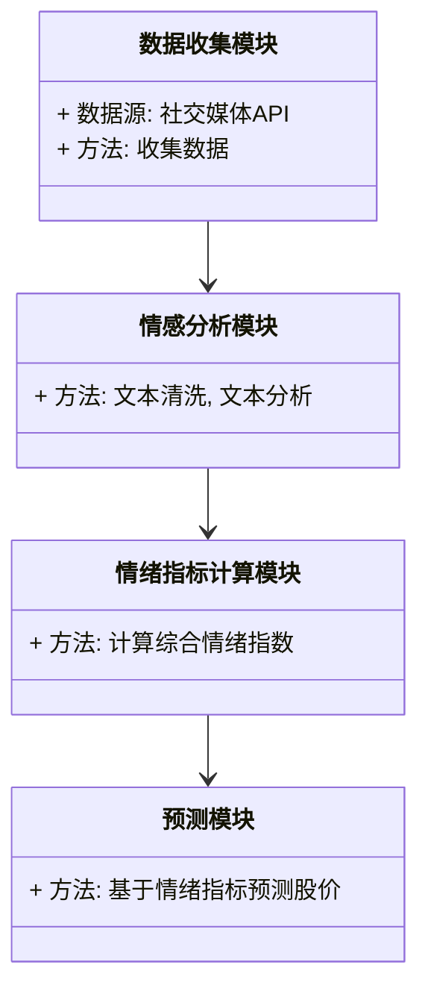
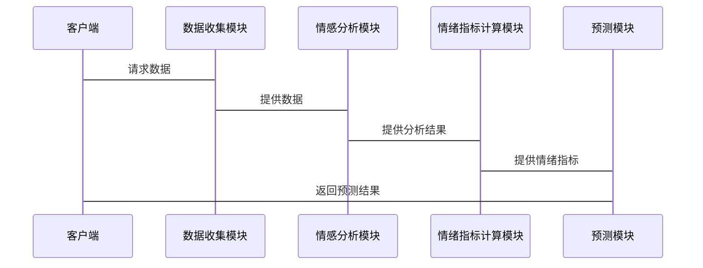

                 


# 金融市场情绪指标开发与应用

> 关键词：金融市场情绪指标、投资者情绪分析、市场预测、风险管理、量化交易

> 摘要：金融市场情绪指标是量化交易和投资决策中的关键工具，用于捕捉和分析投资者情绪，从而预测市场趋势和风险。本文详细探讨了情绪指标的开发方法、应用场景以及实际案例，帮助读者理解如何利用情绪指标在金融市场中做出更明智的投资决策。

---

## 第1章 金融市场情绪指标概述

### 1.1 情绪指标的背景与重要性

金融市场中的投资者行为深受情绪影响，从贪婪到恐惧，情绪波动往往导致价格偏离基本面。情绪指标通过量化这些情绪变化，帮助交易员和投资者捕捉市场趋势。

#### 1.1.1 金融市场中的情绪因素
- 投资者心理：贪婪、恐惧等情绪如何影响决策。
- 市场行为：情绪如何通过交易量和价格波动体现。

#### 1.1.2 情绪指标在投资决策中的作用
- 预测市场趋势：情绪指标如何揭示潜在的价格波动。
- 风险管理：通过情绪指标识别市场拐点。

#### 1.1.3 情绪指标与其他市场指标的区别
- 技术指标：如RSI、MACD等。
- 基本面指标：如PE、ROE等。
- 情绪指标的独特性：捕捉市场情绪而非价格本身。

### 1.2 情绪指标的核心概念

#### 1.2.1 情绪指标的定义
情绪指标是量化投资者情绪的指标，通常基于市场数据、新闻和社交媒体等多源信息。

#### 1.2.2 情绪指标的主要类型
- 基于交易数据：如VIX指数。
- 基于新闻和社交媒体：如Twitter情感分析。
- 基于市场数据：如Put-Call比率。

#### 1.2.3 情绪指标的量化方法
- 数据收集：社交媒体文本、新闻标题、市场数据。
- 数据处理：文本清洗、情感分析。
- 指标构建：计算综合情绪指数。

### 1.3 情绪指标的应用场景

#### 1.3.1 个股分析
- 通过情绪指标评估个股的市场情绪，辅助投资决策。

#### 1.3.2 行业分析
- 分析整个行业的市场情绪，识别行业趋势。

#### 1.3.3 市场整体情绪分析
- 通过情绪指标判断整体市场的情绪状态，预测市场走势。

## 第2章 情绪指标的理论基础

### 2.1 情绪指标的理论框架

#### 2.1.1 投资者情绪的多维度分析
- 投资者情绪受多种因素影响，如市场环境、经济数据、公司新闻等。
- 不同投资者群体的情绪差异，如机构投资者 vs. 零散投资者。

#### 2.1.2 市场情绪与资产价格的关系
- 情绪高涨可能导致资产泡沫。
- 情绪低落可能导致市场抛售。

#### 2.1.3 情绪指标的构建逻辑
- 数据来源：社交媒体、新闻、市场数据。
- 数据处理：情感分析、数据清洗。
- 数据建模：统计模型、机器学习模型。

### 2.2 情绪指标的数学模型

#### 2.2.1 情绪指标的计算公式
- 示例：综合情绪指数（CMI）的计算公式：
  $$ CMI = \alpha \times TextSentiment + \beta \times MarketVolume + \gamma \times NewsCount $$
  其中，$\alpha + \beta + \gamma = 1$。

#### 2.2.2 情绪指标的时间序列分析
- 使用ARIMA模型分析情绪指标的时间序列特性。

#### 2.2.3 情绪指标的标准化处理
- 将情绪指标标准化到0-1区间，便于比较和分析。

### 2.3 情绪指标的特征分析

#### 2.3.1 情绪指标的波动性
- 情绪指标的短期波动性较高，长期趋势相对平稳。

#### 2.3.2 情绪指标的相关性
- 与其他市场指标的相关性分析，如与VIX指数的相关性。

#### 2.3.3 情绪指标的滞后性
- 情绪指标往往滞后于实际市场变化，需考虑时差因素。

## 第3章 情绪指标的数据收集与处理

### 3.1 数据来源

#### 3.1.1 市场数据
- 股价、成交量、订单簿数据等。

#### 3.1.2 交易数据
- 买价、卖价、成交笔数等。

#### 3.1.3 新闻数据
- 财经新闻、公司公告等。

#### 3.1.4 社交媒体数据
- Twitter、Reddit等平台的用户评论和互动。

### 3.2 数据预处理

#### 3.2.1 数据清洗
- 去除噪音数据，如重复数据、无效数据。

#### 3.2.2 数据标准化
- 标准化处理，如归一化。

#### 3.2.3 数据特征提取
- 提取文本中的关键词，分析文本的情感倾向。

### 3.3 数据分析与可视化

#### 3.3.1 数据可视化工具
- 使用Matplotlib、Seaborn等工具绘制情绪变化图表。

#### 3.3.2 数据的时间序列分析
- 使用Python进行时间序列数据分析。

#### 3.3.3 数据的统计分析
- 计算均值、标准差等统计指标。

## 第4章 情绪指标的算法实现

### 4.1 情绪指标的算法选择

#### 4.1.1 机器学习算法
- 支持向量机（SVM）、随机森林（Random Forest）等。

#### 4.1.2 深度学习算法
- LSTM网络用于时间序列分析。

#### 4.1.3 时间序列分析算法
- ARIMA模型。

### 4.2 情绪指标的模型构建

#### 4.2.1 模型设计
- 设计模型的输入层、隐藏层和输出层。

#### 4.2.2 模型训练
- 使用训练数据训练模型参数。

#### 4.2.3 模型评估
- 使用测试数据评估模型性能，计算准确率、召回率等指标。

### 4.3 情绪指标的优化与调优

#### 4.3.1 参数优化
- 调整模型参数，如学习率、批量大小等。

#### 4.3.2 模型调优
- 使用交叉验证优化模型结构。

#### 4.3.3 模型的鲁棒性测试
- 测试模型在不同市场条件下的表现。

## 第5章 情绪指标的应用场景

### 5.1 个股分析

#### 5.1.1 个股情绪分析
- 使用情绪指标分析特定股票的情绪变化。

#### 5.1.2 投资决策支持
- 基于情绪指标制定买入或卖出策略。

### 5.2 行业分析

#### 5.2.1 行业情绪分析
- 分析整个行业的市场情绪。

#### 5.2.2 行业趋势预测
- 基于情绪指标预测行业发展趋势。

### 5.3 市场整体情绪分析

#### 5.3.1 市场情绪监测
- 监测整个市场的整体情绪状态。

#### 5.3.2 市场拐点预测
- 基于情绪指标预测市场的顶部或底部。

## 第6章 项目实战：情绪指标开发与应用

### 6.1 项目背景

#### 6.1.1 项目介绍
- 开发一个基于社交媒体数据的情绪指标，应用于股票市场预测。

### 6.2 系统功能设计

#### 6.2.1 功能模块
- 数据收集模块：收集社交媒体数据。
- 情感分析模块：分析数据情感倾向。
- 情绪指标计算模块：计算综合情绪指数。
- 预测模块：基于情绪指标预测股价。

#### 6.2.2 领域模型（Mermaid 类图）


### 6.3 系统架构设计

#### 6.3.1 系统架构（Mermaid 架构图）
```mermaid
container 服务器端 {
    component 数据收集模块
    component 情感分析模块
    component 情绪指标计算模块
}
container 客户端 {
    component 预测模块
}
服务器端 --> 客户端
```

### 6.4 系统接口设计

#### 6.4.1 接口定义
- 数据收集模块提供API接口，供其他模块调用数据。

### 6.5 系统交互设计

#### 6.5.1 交互流程（Mermaid 序列图）


## 第7章 总结与展望

### 7.1 本章小结

#### 7.1.1 核心内容回顾
- 情绪指标在金融市场中的重要性。
- 情绪指标的开发方法和应用场景。

#### 7.1.2 实践意义
- 情绪指标为投资者提供新的决策工具。

### 7.2 未来展望

#### 7.2.1 情绪指标的优化方向
- 提高模型的准确性和鲁棒性。

#### 7.2.2 情绪指标的扩展应用
- 应用于更多金融产品，如外汇、加密货币等。

#### 7.2.3 情绪指标与人工智能的结合
- 使用更先进的AI技术优化情绪指标。

### 7.3 最佳实践 Tips

#### 7.3.1 情绪指标的使用建议
- 结合其他指标使用，提高准确性。

#### 7.3.2 数据质量的重要性
- 数据来源和质量直接影响情绪指标的准确性。

#### 7.3.3 模型调优建议
- 定期更新模型参数，适应市场变化。

---

以上为《金融市场情绪指标开发与应用》的技术博客文章的大纲和详细内容，涵盖了从理论到实践的各个方面，适合技术背景的读者深入了解和应用情绪指标。

