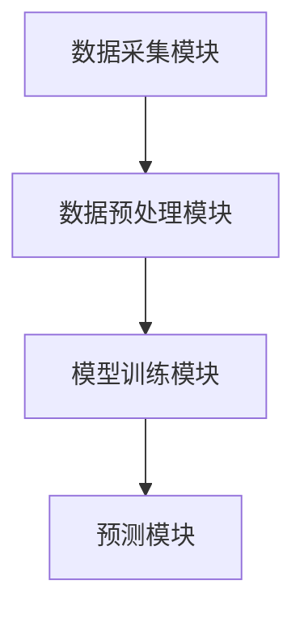
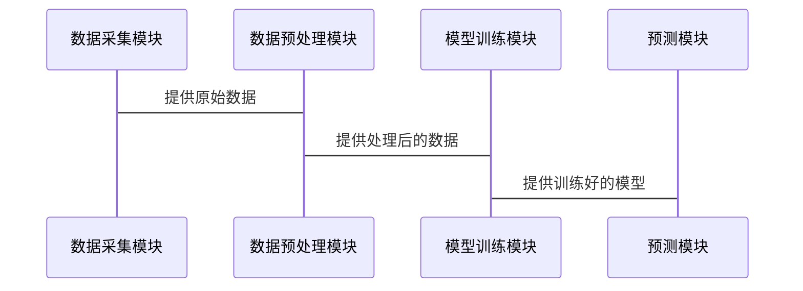

                 


# 金融市场情绪指标预测模型

## 关键词
金融市场、情绪指标、LSTM、机器学习、预测模型

## 摘要
金融市场情绪指标预测模型是一种利用机器学习技术，特别是长短期记忆网络（LSTM），来分析和预测金融市场情绪变化的模型。该模型通过处理和分析大量的金融数据，提取市场情绪特征，进而预测未来市场走势。本文详细介绍了情绪指标预测模型的背景、核心概念、算法原理、系统架构设计、项目实战以及最佳实践，为读者提供了从理论到实践的全面指导。

---

## 第1章: 金融市场情绪指标预测模型的背景与意义

### 1.1 问题背景与描述

金融市场是一个高度动态和复杂的系统，受多种因素影响，包括经济指标、政策变化、市场情绪等。投资者和分析师需要准确预测市场走势，以便做出明智的投资决策。然而，市场情绪的变化往往是非线性的，难以通过传统的方法捕捉和预测。

金融市场情绪指标预测模型的目标是通过分析市场情绪数据，预测未来市场走势。这种模型可以帮助投资者更好地理解市场情绪，从而做出更明智的投资决策。

### 1.2 问题解决与边界

#### 1.2.1 情绪指标预测的核心问题
- 如何准确捕捉和量化市场情绪？
- 如何构建有效的预测模型，捕捉市场情绪的变化趋势？

#### 1.2.2 模型的边界与适用场景
- 数据范围：模型适用于历史数据充足、市场情绪波动明显的市场环境。
- 时间范围：模型适用于短期市场预测，长期预测效果有限。

#### 1.2.3 情绪指标预测的局限性
- 市场情绪受多种因素影响，模型无法完全捕捉所有变量。
- 市场情绪的变化具有不可预测性，模型预测存在误差。

---

## 第2章: 金融市场情绪指标的核心概念与联系

### 2.1 情绪指标的定义与特征

#### 2.1.1 情绪指标的定义
情绪指标是衡量市场参与者情绪状态的量化指标，通常通过新闻、社交媒体、市场交易数据等来源进行计算。

#### 2.1.2 不同情绪指标的特征对比

| 情绪指标 | 数据来源 | 计算方法 | 特点 |
|----------|----------|----------|------|
| VIX指数 | 市场波动性 | 基于标普500指数波动率计算 | 反映市场恐慌程度 |
| 情绪指数 | 社交媒体、新闻 | 自然语言处理 | 反映市场乐观或悲观情绪 |
| 交易量 | 市场交易数据 | 交易量大小 | 反映市场活跃度 |

#### 2.1.3 情绪指标与市场行为的关系
市场情绪直接影响投资者的决策，从而影响市场走势。例如，乐观情绪可能导致股价上涨，而悲观情绪可能导致股价下跌。

### 2.2 情绪指标预测模型的核心要素

#### 2.2.1 数据来源与处理
- 数据来源：社交媒体、新闻、市场交易数据等。
- 数据处理：清洗、归一化、特征提取等。

#### 2.2.2 模型输入与输出
- 输入：情绪指标数据、市场数据。
- 输出：未来市场情绪预测结果。

#### 2.2.3 模型评估指标
- 准确率、召回率、F1分数等。

---

## 第3章: 情绪指标预测模型的算法原理

### 3.1 算法选择与原理

#### 3.1.1 常见算法对比
- 线性回归：简单但难以捕捉非线性关系。
- 支持向量机：适用于分类问题，但对时间序列预测效果有限。
- LSTM：适合捕捉时间序列中的长期依赖关系。

#### 3.1.2 LSTM网络的原理
LSTM（长短期记忆网络）是一种特殊的循环神经网络（RNN），能够有效捕捉时间序列中的长期依赖关系。

#### 3.1.3 模型的优势与适用性
- 优势：能够捕捉市场情绪的变化趋势。
- 适用性：适用于金融市场时间序列数据的预测。

### 3.2 LSTM网络的数学模型

#### 3.2.1 LSTM的基本结构
LSTM由三个门控（输入门、遗忘门、输出门）和一个记忆单元组成。

#### 3.2.2 门控机制的数学公式
- 遗忘门：$f_t = \sigma(W_f \cdot [h_{t-1}, x_t] + b_f)$
- 输入门：$i_t = \sigma(W_i \cdot [h_{t-1}, x_t] + b_i)$
- 输出门：$o_t = \sigma(W_o \cdot [h_{t-1}, x_t] + b_o)$
- 记忆单元：$c_t = f_t \cdot c_{t-1} + i_t \cdot tanh(W_c \cdot [h_{t-1}, x_t] + b_c)$
- 隐藏层：$h_t = o_t \cdot tanh(c_t)$

#### 3.2.3 模型训练的优化方法
- 梯度下降：Adam优化器。
- 模型训练：使用训练数据进行反向传播，更新模型参数。

---

## 第4章: 情绪指标预测模型的系统架构设计

### 4.1 系统功能设计

#### 4.1.1 数据采集模块
- 功能：采集社交媒体、新闻数据等情绪数据。
- 实现：使用爬虫技术采集数据。

#### 4.1.2 数据预处理模块
- 功能：清洗、归一化、特征提取。
- 实现：使用Python的pandas库进行数据处理。

#### 4.1.3 模型训练与预测模块
- 功能：训练LSTM模型，预测未来市场情绪。
- 实现：使用Keras框架构建模型。

### 4.2 系统架构图



### 4.3 系统接口设计



---

## 第5章: 情绪指标预测模型的项目实战

### 5.1 环境搭建与数据获取

#### 5.1.1 Python环境安装
- 安装Python：从官网下载安装。
- 安装依赖库：`pip install numpy, pandas, keras, tensorflow`.

#### 5.1.2 数据获取
- 数据来源：社交媒体数据、新闻数据。
- 数据清洗：去除噪声数据，归一化处理。

### 5.2 核心代码实现

#### 5.2.1 数据预处理代码

```python
import pandas as pd
import numpy as np

# 数据加载
data = pd.read_csv('market_emotion.csv')

# 数据清洗
data.dropna(inplace=True)
data = data.iloc[:100]

# 特征提取
features = data[['VIX', '交易量']]
labels = data['情绪指数']

# 数据归一化
from sklearn.preprocessing import MinMaxScaler
scaler = MinMaxScaler()
features_scaled = scaler.fit_transform(features)
```

#### 5.2.2 模型训练代码

```python
from keras.models import Sequential
from keras.layers import LSTM, Dense

# 模型构建
model = Sequential()
model.add(LSTM(64, input_shape=(1, 2)))
model.add(Dense(1))
model.compile(loss='mean_squared_error', optimizer='adam')

# 训练模型
model.fit(features_scaled, labels, epochs=10, batch_size=32)
```

#### 5.2.3 预测与评估代码

```python
# 模型预测
predictions = model.predict(features_scaled)

# 模型评估
from sklearn.metrics import mean_squared_error
mse = mean_squared_error(labels, predictions)
print('均方误差:', mse)
```

### 5.3 项目小结

通过上述步骤，我们成功构建了一个基于LSTM的情绪指标预测模型。模型在训练数据上表现良好，但在实际应用中可能需要进一步优化。

---

## 第6章: 情绪指标预测模型的最佳实践与优化

### 6.1 模型调优与优化

#### 6.1.1 参数调整
- 调整LSTM的隐藏层大小、学习率等参数。
- 使用交叉验证选择最优参数。

#### 6.1.2 模型优化策略
- 增加模型层数，提高模型复杂度。
- 使用早停法防止过拟合。

### 6.2 情绪指标预测的注意事项

#### 6.2.1 数据质量的重要性
- 数据的准确性和完整性直接影响模型性能。

#### 6.2.2 模型的实时性与稳定性
- 情绪指标预测需要实时更新，确保模型的稳定性。

### 6.3 未来展望

随着人工智能技术的发展，情绪指标预测模型将更加精准和智能化。未来的研究方向包括更复杂的情感分析算法、多模态数据融合等。

---

## 第7章: 总结

通过本文的介绍，读者可以全面了解金融市场情绪指标预测模型的背景、核心概念、算法原理、系统架构设计、项目实战以及最佳实践。希望本文能够为读者在金融市场情绪预测领域提供有价值的参考和指导。

