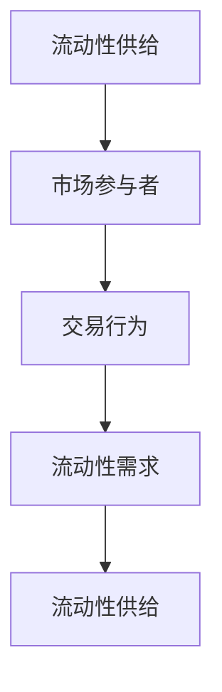

                 


# 《金融市场流动性供给预测模型》

---

## 关键词：金融市场，流动性供给，预测模型，时间序列分析，机器学习，金融风险管理

---

## 摘要： 

金融市场流动性供给预测模型旨在通过对市场数据的分析和建模，预测未来市场的流动性供给情况，从而帮助投资者和监管机构做出更明智的决策。本文将从流动性供给的基本概念入手，结合时间序列分析和机器学习等技术，详细阐述流动性供给预测模型的构建过程，并通过实际案例展示其应用价值。

---

# 第一部分: 金融市场流动性供给预测模型概述

## 第1章: 金融市场流动性概述

### 1.1 金融市场的流动性定义与特点
#### 1.1.1 流动性的定义
流动性是指资产能够迅速转换为现金而不导致重大损失的能力。在金融市场中，流动性供给指的是市场参与者提供资金或资产以满足交易需求的能力。

#### 1.1.2 流动性的主要特点
- **可转换性**：资产可以快速变现。
- **稳定性**：市场的流动性波动较小，说明市场稳定。
- **价格敏感性**：流动性高的资产价格波动较小。

#### 1.1.3 流动性与市场效率的关系
流动性高的市场通常更高效，交易成本更低，市场参与者更容易进出市场。

---

## 第2章: 流动性供给预测模型的背景与意义

### 2.1 金融市场波动的挑战
#### 2.1.1 金融危机的案例分析
金融危机（如2008年全球金融危机）表明，流动性供给的突然减少会导致市场崩盘。

#### 2.1.2 流动性危机的影响
流动性危机可能导致市场流动性枯竭，资产价格大幅下跌，甚至引发系统性风险。

#### 2.1.3 流动性预测的必要性
准确预测流动性供给可以帮助投资者和监管机构提前采取措施，避免流动性危机。

---

## 第3章: 流动性供给预测模型的核心概念

### 3.1 流动性供给预测模型的定义与分类
#### 3.1.1 模型的定义
流动性供给预测模型是通过历史数据和市场行为分析，预测未来市场流动性供给的数学模型。

#### 3.1.2 模型的分类
- **基于时间序列的模型**：如ARIMA、GARCH等。
- **基于机器学习的模型**：如随机森林、神经网络等。

### 3.2 流动性供给预测模型的关键属性
| 属性               | 描述                                   |
|--------------------|--------------------------------------|
| 数据驱动性         | 模型依赖历史数据进行训练和预测         |
| 时间序列特性       | 模型关注时间依赖性，适合处理时间序列数据 |
| 预测精度           | 模型的预测能力直接影响实际应用效果     |

### 3.3 流动性供给预测模型的实体关系图


---

# 第二部分: 流动性供给预测模型的算法原理

## 第4章: 时间序列分析在流动性供给预测中的应用

### 4.1 时间序列分析的基本原理
时间序列分析是一种统计方法，通过分析历史数据的时间依赖性，预测未来的市场走势。

### 4.2 ARIMA模型的原理与实现
#### 4.2.1 ARIMA模型的定义
ARIMA（Auto-Regressive Integrated Moving Average）模型是一种常用的时间序列预测模型，由自回归部分、差分部分和移动平均部分组成。

#### 4.2.2 ARIMA模型的数学公式
$$ ARIMA(p, d, q) = y_t = \phi_1 y_{t-1} + \phi_2 y_{t-2} + \dots + \phi_p y_{t-p} + \theta_1 \epsilon_{t-1} + \theta_2 \epsilon_{t-2} + \dots + \theta_q \epsilon_{t-q} + \epsilon_t $$

#### 4.2.3 ARIMA模型的实现步骤
1. 数据预处理：检查数据的平稳性，进行差分处理。
2. 模型参数选择：通过AIC或BIC准则选择最优参数。
3. 模型训练：使用历史数据训练ARIMA模型。
4. 模型预测：基于训练好的模型预测未来的流动性供给。

### 4.3 基于机器学习的流动性预测模型
#### 4.3.1 随机森林模型
随机森林是一种基于树的集成学习方法，适合处理高维数据和非线性关系。

#### 4.3.2 神经网络模型
神经网络模型（如LSTM）能够捕捉时间序列中的复杂模式，适合处理长序列依赖性。

---

## 第5章: 流动性供给预测系统的架构设计

### 5.1 系统功能设计
- 数据采集模块：获取市场交易数据。
- 数据处理模块：清洗和预处理数据。
- 模型训练模块：训练预测模型。
- 结果展示模块：可视化预测结果。

### 5.2 系统架构图


### 5.3 接口设计
- 数据接口：与数据源对接，获取实时数据。
- 模型接口：与其他系统或用户接口交互，提供预测结果。

---

# 第三部分: 流动性供给预测模型的项目实战

## 第6章: 项目实战

### 6.1 环境安装
- 安装Python和相关库（如pandas、numpy、sklearn、keras）。

### 6.2 数据处理与建模
#### 6.2.1 数据预处理
```python
import pandas as pd
data = pd.read_csv('market_data.csv')
data.head()
```

#### 6.2.2 模型训练
```python
from sklearn.model_selection import train_test_split
from sklearn.ensemble import RandomForestRegressor

X = data.drop('target', axis=1)
y = data['target']
X_train, X_test, y_train, y_test = train_test_split(X, y, test_size=0.2)
model = RandomForestRegressor().fit(X_train, y_train)
```

#### 6.2.3 模型预测与评估
```python
y_pred = model.predict(X_test)
print(model.score(X_test, y_test))
```

### 6.3 案例分析
通过对实际市场数据的分析，展示模型的预测能力，并进行结果解读。

### 6.4 项目小结
总结项目实施过程中的经验教训，提出改进建议。

---

# 第四部分: 最佳实践与总结

## 第7章: 最佳实践

### 7.1 小结
流动性供给预测模型在金融市场中具有重要的应用价值，时间序列分析和机器学习技术为模型构建提供了有力工具。

### 7.2 注意事项
- 数据质量是模型预测准确性的关键。
- 模型选择应结合具体应用场景和数据特征。
- 需要定期更新模型，以适应市场变化。

### 7.3 拓展阅读
推荐相关书籍和论文，供读者进一步学习。

---

# 《金融市场流动性供给预测模型》

---

通过以上目录和内容设计，我们可以系统地学习和应用流动性供给预测模型，为金融市场风险管理提供有力支持。

