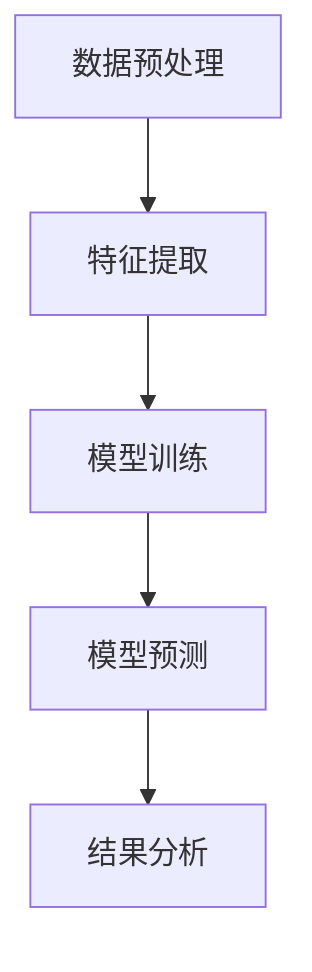
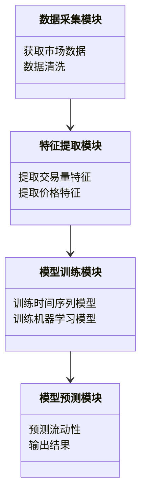
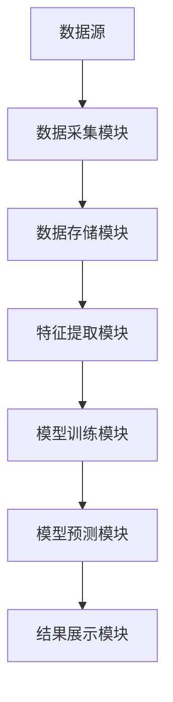
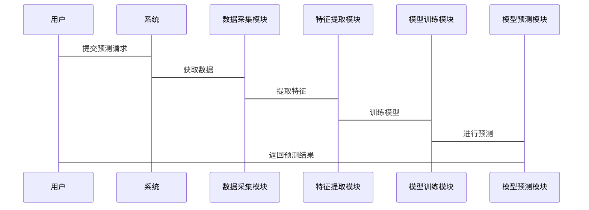

                 


# 金融市场流动性预测模型

> 关键词：金融市场流动性预测模型，时间序列分析，机器学习，深度学习，算法实现，系统设计，金融市场分析

> 摘要：金融市场流动性预测模型是金融市场研究中的重要课题，旨在通过对市场数据的分析和建模，预测市场流动性变化，为投资者和市场参与者提供决策支持。本文系统地介绍流动性预测的核心概念、算法原理、系统设计、项目实战及最佳实践，帮助读者全面理解并掌握流动性预测模型的构建与应用。

---

# 第一部分: 金融市场流动性预测模型概述

# 第1章: 金融市场流动性预测概述

## 1.1 金融市场流动性预测的重要性

### 1.1.1 什么是金融市场流动性

金融市场流动性是指金融资产在市场中以合理价格迅速转换为现金的能力。流动性高的资产意味着可以在短时间内以接近市价的价格卖出，而流动性低的资产则可能需要较长时间和较大折扣才能变现。

### 1.1.2 流动性预测的定义与目标

流动性预测是指通过分析历史市场数据，利用数学模型和算法，预测未来市场流动性的变化趋势。其目标是帮助投资者、交易员和市场管理者提前了解市场流动性风险，优化交易策略，降低市场波动对投资组合的影响。

### 1.1.3 流动性预测的现实意义

- **风险管理**：流动性预测能够帮助市场参与者识别潜在的流动性风险，避免因市场流动性不足导致的损失。
- **交易决策**：通过预测市场流动性变化，投资者可以优化买卖时机，降低交易成本。
- **市场稳定性**：流动性预测有助于市场管理者制定相关政策，维护市场的稳定运行。

## 1.2 金融市场流动性预测的核心问题

### 1.2.1 流动性预测的主要挑战

- 数据噪声大：金融市场数据受到多种因素影响，如市场情绪、宏观经济指标等，导致数据具有高度噪声。
- 非线性关系：流动性与价格、交易量之间的关系往往复杂且非线性，难以用简单的线性模型描述。
- 时间依赖性：流动性具有较强的时间依赖性，需要考虑时间序列的变化趋势。

### 1.2.2 流动性预测的关键指标

- 成交量：反映市场参与者对资产的需求程度。
- 报价深度：衡量市场在特定价格水平上的买方和卖方订单数量。
- 波动性：市场波动性与流动性密切相关，高波动性通常意味着较低的流动性。

### 1.2.3 流动性预测的边界与外延

流动性预测的边界包括数据范围、时间范围和市场范围。其外延涉及对市场参与者的预测、对政策变化的适应以及对市场结构变化的预测。

## 1.3 金融市场流动性预测的背景与现状

### 1.3.1 金融市场流动性预测的历史发展

- **早期研究**：20世纪80年代，学者们开始关注市场流动性与价格波动的关系。
- **现代发展**：随着计算机技术的发展，学者们开始尝试使用统计模型和机器学习算法进行流动性预测。

### 1.3.2 当前市场的流动性特征

- **高频交易**：高频交易使得市场流动性呈现出短时间内的剧烈波动。
- **算法交易**：算法交易进一步加剧了市场的流动性波动，但也为流动性预测提供了更多的数据和工具。

### 1.3.3 金融科技对流动性预测的影响

- **大数据技术**：大数据技术的应用使得我们可以从海量数据中提取有用的特征，提高流动性预测的准确性。
- **人工智能**：人工智能技术的发展为流动性预测提供了更强大的工具，特别是深度学习模型在处理复杂数据关系方面表现出色。

## 1.4 本书内容与结构

### 1.4.1 本书的核心内容

- **核心概念**：介绍流动性预测的基本概念和核心指标。
- **算法原理**：详细讲解时间序列分析、机器学习和深度学习算法在流动性预测中的应用。
- **系统设计**：从系统架构、数据处理到模型实现，全面介绍流动性预测系统的构建过程。
- **项目实战**：通过实际案例展示如何从数据获取、特征工程到模型实现，完成一个完整的流动性预测项目。
- **总结与展望**：总结本书的主要内容，并展望未来的研究方向。

### 1.4.2 本书的章节安排

- 第一部分：概述流动性预测的核心概念和理论基础。
- 第二部分：详细讲解流动性预测的算法原理。
- 第三部分：介绍流动性预测系统的架构设计。
- 第四部分：通过项目实战展示流动性预测的具体实现。
- 第五部分：总结本书内容，并展望未来的研究方向。

### 1.4.3 本书的阅读方法

建议读者按照章节顺序阅读，从基础概念入手，逐步深入算法实现和系统设计，最后通过项目实战巩固所学内容。

---

# 第2章: 金融市场流动性预测的核心概念与联系

## 2.1 金融市场流动性预测的核心概念

### 2.1.1 市场流动性

市场流动性是指市场中某资产在特定时间段内以合理价格迅速成交的能力。它包括深度、广度和价格稳定性等多个维度。

### 2.1.2 交易量与价格波动

交易量是衡量市场活跃程度的重要指标，交易量的增加通常伴随着价格的波动。然而，交易量与价格波动之间的关系并非线性，且受到市场情绪和市场结构的影响。

### 2.1.3 时间序列分析

时间序列分析是一种统计方法，用于分析随时间变化的数据序列。它在流动性预测中被广泛应用于识别数据中的趋势、周期性和其他模式。

## 2.2 核心概念之间的关系

### 2.2.1 流动性与价格波动的关系

流动性与价格波动之间存在复杂的关系。高流动性通常意味着价格波动较小，而低流动性可能导致价格波动加剧。然而，这种关系在不同市场条件下可能表现出不同的特征。

### 2.2.2 交易量与市场深度的关系

交易量与市场深度密切相关。高交易量通常意味着市场深度较大，能够支持更多的交易而不引起价格的大幅波动。

### 2.2.3 时间序列与预测模型的关系

时间序列分析是流动性预测的核心方法之一。通过分析历史流动性数据，可以利用时间序列模型预测未来的流动性变化。

## 2.3 金融市场流动性预测的ER实体关系图


---

# 第3章: 金融市场流动性预测的算法原理

## 3.1 时间序列分析方法

### 3.1.1 ARIMA模型

ARIMA（自回归积分滑动平均模型）是一种广泛应用于时间序列预测的模型。它通过结合自回归和滑动平均成分，能够有效捕捉数据中的趋势和周期性。

### 3.1.2 GARCH模型

GARCH（广义自回归条件异方差模型）用于建模时间序列中的波动性。它特别适用于金融市场的波动性预测。

### 3.1.3 LSTM网络

LSTM（长短期记忆网络）是一种深度学习模型，能够有效捕捉时间序列中的长距离依赖关系，适用于复杂的非线性时间序列预测。

## 3.2 机器学习算法

### 3.2.1 支持向量回归

支持向量回归（SVR）是一种基于支持向量机的回归算法，能够有效地处理非线性关系。

### 3.2.2 随机森林

随机森林是一种基于决策树的集成学习方法，能够通过投票或平均的方式提高预测的准确性。

### 3.2.3 XGBoost

XGBoost（极端梯度提升）是一种基于决策树的提升算法，具有高效性和高准确性的特点。

## 3.3 深度学习算法

### 3.3.1 卷积神经网络（CNN）

卷积神经网络主要用于图像识别等领域，但在时间序列数据的特征提取中也表现出色。

### 3.3.2 循环神经网络（RNN）

循环神经网络通过处理序列数据中的时间依赖关系，能够有效地捕捉数据中的模式。

### 3.3.3 Transformer模型

Transformer模型通过自注意力机制，能够捕捉数据中的全局关系，适用于长序列的预测。

## 3.4 算法流程图



---

# 第4章: 金融市场流动性预测的数学模型与公式

## 4.1 时间序列模型

### 4.1.1 ARIMA模型

ARIMA模型的数学公式为：

$$
y_t = \phi_1 y_{t-1} + \phi_2 y_{t-2} + \dots + \phi_p y_{t-p} + \theta_1 \epsilon_{t-1} + \theta_2 \epsilon_{t-2} + \dots + \theta_q \epsilon_{t-q} + \epsilon_t
$$

其中，$y_t$ 是 t 时刻的观测值，$\phi_i$ 是自回归系数，$\theta_j$ 是滑动平均系数，$\epsilon_t$ 是白噪声。

## 4.2 GARCH模型

GARCH模型的数学公式为：

$$
\sigma_t^2 = \alpha_0 + \alpha_1 r_{t-1}^2 + \alpha_2 \sigma_{t-1}^2
$$

其中，$\sigma_t^2$ 是 t 时刻的波动率，$\alpha_0$ 是常数项，$\alpha_1$ 和 $\alpha_2$ 是参数，$r_{t-1}$ 是 t-1 时刻的收益率。

## 4.3 LSTM网络

LSTM网络的结构包括输入门、遗忘门和输出门。其输入门的公式为：

$$
i_t = \sigma(W_i x_t + U_i h_{t-1} + b_i)
$$

遗忘门的公式为：

$$
f_t = \sigma(W_f x_t + U_f h_{t-1} + b_f)
$$

细胞状态更新公式为：

$$
c_t = f_t \cdot c_{t-1} + i_t \cdot tanh(W_c x_t + U_c h_{t-1} + b_c)
$$

输出门的公式为：

$$
o_t = \sigma(W_o x_t + U_o h_{t-1} + b_o)
$$

最终的隐藏状态为：

$$
h_t = o_t \cdot tanh(c_t)
$$

---

# 第5章: 金融市场流动性预测的系统设计

## 5.1 问题场景介绍

流动性预测系统需要解决的主要问题是：如何通过历史市场数据，预测未来市场的流动性变化，为投资者和市场参与者提供决策支持。

## 5.2 系统功能设计

### 5.2.1 领域模型



### 5.2.2 系统架构设计



### 5.2.3 接口设计

- 数据接口：提供与数据源的接口，用于获取市场数据。
- 模型接口：提供与模型训练和预测的接口，用于调用模型进行预测。
- 结果接口：提供结果展示的接口，用于将预测结果呈现给用户。

### 5.2.4 交互设计



---

# 第6章: 金融市场流动性预测的项目实战

## 6.1 环境安装

### 6.1.1 安装Python

```bash
# 安装Python
# 使用虚拟环境管理依赖
python -m venv env
source env/bin/activate
```

### 6.1.2 安装依赖库

```bash
# 安装Pandas、NumPy、Scikit-learn、TensorFlow、Keras等库
pip install pandas numpy scikit-learn tensorflow keras
```

## 6.2 数据获取与预处理

### 6.2.1 数据获取

```python
import pandas as pd
import numpy as np

# 获取股票数据
data = pd.read_csv('stock_data.csv')
```

### 6.2.2 数据清洗

```python
# 删除缺失值
data.dropna(inplace=True)
# 标准化数据
from sklearn.preprocessing import StandardScaler
scaler = StandardScaler()
data_scaled = scaler.fit_transform(data)
```

## 6.3 特征工程

### 6.3.1 特征提取

```python
# 提取收盘价
close_prices = data['Close'].values
# 提取交易量
volumes = data['Volume'].values
```

### 6.3.2 数据分割

```python
# 划分训练集和测试集
train_data = close_prices[:int(len(close_prices)*0.8)]
test_data = close_prices[int(len(close_prices)*0.8):]
```

## 6.4 模型实现

### 6.4.1 时间序列模型

```python
from keras.models import Sequential
from keras.layers import LSTM, Dense

# 构建LSTM模型
model = Sequential()
model.add(LSTM(50, input_shape=(timesteps, features)))
model.add(Dense(1))
model.compile(loss='mean_squared_error', optimizer='adam')
```

### 6.4.2 机器学习模型

```python
from sklearn.ensemble import RandomForestRegressor

# 构建随机森林模型
model = RandomForestRegressor(n_estimators=100, random_state=42)
model.fit(X_train, y_train)
```

## 6.5 结果分析

### 6.5.1 模型评估

```python
from sklearn.metrics import mean_squared_error

# 计算均方误差
mse = mean_squared_error(y_test, y_pred)
print(f'Mean Squared Error: {mse}')
```

### 6.5.2 结果可视化

```python
import matplotlib.pyplot as plt

plt.plot(y_test, label='实际值')
plt.plot(y_pred, label='预测值')
plt.legend()
plt.show()
```

---

# 第7章: 总结与展望

## 7.1 本书总结

### 7.1.1 核心内容回顾

- 介绍了金融市场流动性预测的核心概念和理论基础。
- 详细讲解了时间序列分析、机器学习和深度学习算法在流动性预测中的应用。
- 展示了如何通过系统设计和项目实战构建一个完整的流动性预测系统。

### 7.1.2 实战经验总结

- 数据预处理和特征工程是流动性预测的关键步骤。
- 不同算法在不同数据集上的表现差异较大，需要根据实际情况选择合适的算法。

## 7.2 未来研究方向

### 7.2.1 算法优化

- 结合多种算法进行集成学习，提高预测准确率。
- 研究更复杂的深度学习模型，如Transformer模型。

### 7.2.2 数据源扩展

- 引入更多的市场数据，如新闻数据、社交媒体数据等，提高预测的准确性。
- 研究跨市场的流动性预测，探索全球市场的流动性互动关系。

### 7.2.3 应用场景拓展

- 将流动性预测应用于更广泛的金融领域，如风险管理、投资组合优化等。
- 研究流动性预测在量化交易中的应用，优化交易策略。

## 7.3 最佳实践 Tips

- 在进行流动性预测时，一定要注意数据的代表性和完整性。
- 确保模型的可解释性，避免使用过于复杂的模型。
- 定期更新模型，适应市场的变化。

## 7.4 小结

金融市场流动性预测是一个复杂但重要的课题。通过系统的理论学习和实践应用，我们可以更好地理解市场流动性变化的规律，为投资决策提供有力支持。

---

通过以上章节的详细讲解，读者可以全面掌握金融市场流动性预测模型的构建与应用，为实际投资和市场研究提供有力的理论和实践指导。

