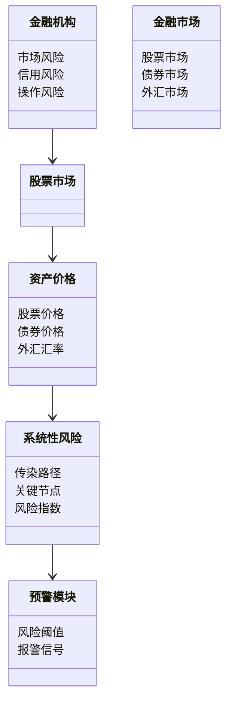
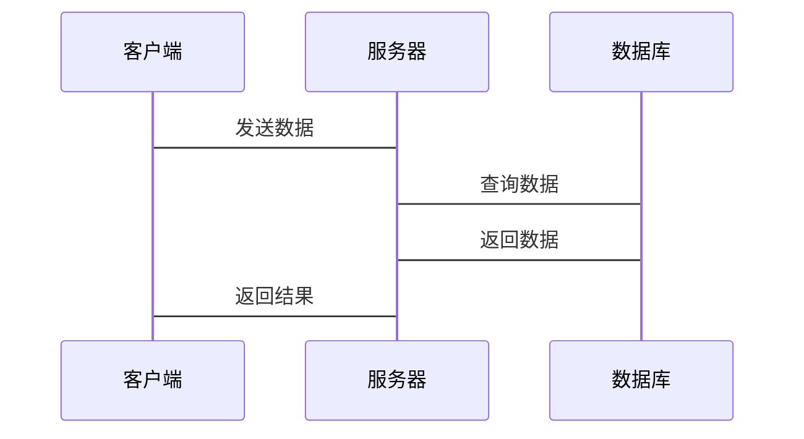

                 


```markdown
# 金融市场系统性风险传导模拟与预警

> 关键词：系统性风险、金融传导、预警机制、网络模型、数学建模、风险管理、金融稳定性

> 摘要：系统性风险是金融市场中的一个复杂而重要的概念，其传导机制和预警方法对于维护金融稳定具有重要意义。本文将从系统性风险的基本概念出发，分析其传导的核心要素和数学模型，详细介绍基于网络模型的系统性风险传播算法，并通过实际案例进行模拟与预警。文章旨在为金融风险管理提供理论支持和实践指导。

---

## 第一部分：系统性风险的基本概念

### 第1章：系统性风险的定义与特征

#### 1.1 系统性风险的定义
系统性风险是指由于市场整体环境的变化，导致整个金融系统发生系统性崩溃的可能性。这种风险通常由系统性因素引起，如经济衰退、政策变化或金融危机等。

#### 1.2 系统性风险的特征
- **广泛性**：影响整个金融系统，而非单一机构或资产。
- **传染性**：风险从一个机构或市场传导到另一个机构或市场。
- **不可分割性**：系统性风险无法通过分散投资完全消除。
- **高度相关性**：金融机构之间的高度关联性加剧了系统性风险的传播。

#### 1.3 系统性风险与非系统性风险的区别
- **系统性风险**：影响整个金融系统的风险，如市场波动、经济衰退。
- **非系统性风险**：影响单一机构或资产的风险，可通过分散投资降低。

### 第2章：系统性风险的来源与影响

#### 2.1 系统性风险的主要来源
- **金融机构的杠杆率过高**：过度杠杆化增加了金融系统的脆弱性。
- **金融市场之间的高度关联**：金融创新和全球化导致机构之间的相互依赖性增强。
- **宏观经济因素**：如经济衰退、通货膨胀、政策变化等。

#### 2.2 系统性风险对金融市场的冲击
- **资产价格波动**：系统性风险可能导致资产价格的剧烈波动。
- **流动性危机**：风险传导可能导致市场流动性枯竭，引发金融危机。
- **信用危机**：金融机构之间的信任缺失导致信用危机，进一步加剧系统性风险。

#### 2.3 系统性风险与金融危机的关系
系统性风险是金融危机的根源之一，金融危机往往由系统性风险的积累和爆发引起。例如，2008年全球金融危机就是系统性风险积累的结果。

---

## 第二部分：系统性风险传导的核心概念与联系

### 第3章：系统性风险传导的核心要素

#### 3.1 系统性风险传导的构成要素
- **金融机构**：银行、保险公司、证券公司等金融机构是系统性风险传导的主要载体。
- **金融市场**：股票市场、债券市场、外汇市场等是系统性风险传导的媒介。
- **资产价格**：资产价格的波动是系统性风险传导的重要表现形式。

#### 3.2 系统性风险传导的属性对比
以下是系统性风险与个体风险的对比：

| 属性         | 系统性风险             | 个体风险             |
|--------------|------------------------|----------------------|
| 影响范围       | 整个金融系统           | 单一机构或资产       |
| 传染性       | 高                    | 低                  |
| 可控性       | 困难，需要系统性措施    | 可以通过分散投资降低|

#### 3.3 系统性风险传导的ER实体关系图

```mermaid
er
actor 系统性风险, 系统性风险传导
```

---

## 第三部分：系统性风险传导的算法原理与数学模型

### 第4章：系统性风险传导的网络模型

#### 4.1 网络模型的构建
系统性风险传导可以通过网络模型来模拟，其中节点代表金融机构，边代表金融机构之间的关联性。以下是一个简单的网络模型：


#### 4.2 网络模型的分析
通过分析网络模型，可以识别出系统中的关键节点，这些节点是系统性风险传导的核心机构。

#### 4.3 网络模型的算法实现
以下是基于网络模型的系统性风险传导算法的Python代码实现：

```python
import networkx as nx

def systemic_risk_transmission(G):
    # 计算每个节点的度数
    degrees = nx.degree(G)
    # 识别关键节点
    critical_nodes = [node for node, degree in degrees.items() if degree > 2]
    return critical_nodes

# 创建一个示例网络
G = nx.Graph()
G.add_edges_from([('A', 'B'), ('B', 'C'), ('C', 'D')])
print(systemic_risk_transmission(G))
```

### 第5章：系统性风险传导的数学模型

#### 5.1 系统性风险传导的线性模型
线性模型假设系统性风险的传导是线性的，可以通过回归分析来建模：

$$ R_i = \beta R_j + \epsilon $$

其中，\( R_i \) 表示机构i的系统性风险，\( R_j \) 表示机构j的系统性风险，\( \beta \) 是回归系数，\( \epsilon \) 是误差项。

#### 5.2 系统性风险传导的非线性模型
非线性模型假设系统性风险的传导是非线性的，可以通过多元回归或神经网络来建模：

$$ R_i = f(R_j, R_k) + \epsilon $$

其中，\( f \) 是非线性函数，\( R_j \) 和 \( R_k \) 是相关机构的系统性风险，\( \epsilon \) 是误差项。

#### 5.3 系统性风险传导的混合模型
混合模型结合了线性和非线性模型的优点，可以根据具体情况选择合适的模型：

$$ R_i = \alpha R_j + f(R_k) + \epsilon $$

其中，\( \alpha \) 是线性系数，\( f \) 是非线性函数，\( \epsilon \) 是误差项。

---

## 第四部分：系统性风险传导的系统分析与架构设计

### 第6章：系统性风险传导的系统分析

#### 6.1 问题场景介绍
在金融市场中，系统性风险的传导可能导致金融危机，因此需要建立有效的预警机制。

### 第7章：系统功能设计

#### 7.1 领域模型类图



### 第8章：系统架构设计

#### 8.1 系统架构图


### 第9章：系统接口设计

#### 9.1 系统接口
- **输入接口**：接收金融市场数据和金融机构数据。
- **输出接口**：输出系统性风险指数和预警信号。

### 第10章：系统交互流程

#### 10.1 系统交互序列图



---

## 第五部分：项目实战

### 第11章：环境配置与核心代码实现

#### 11.1 环境配置
- **Python环境**：建议使用Python 3.8及以上版本。
- **依赖库**：安装networkx和numpy库。

#### 11.2 核心代码实现
以下是系统性风险传导模拟的Python代码：

```python
import networkx as nx
import numpy as np

def systemic_risk_transmission(G):
    # 计算每个节点的度数
    degrees = nx.degree(G)
    # 识别关键节点
    critical_nodes = [node for node, degree in degrees.items() if degree > 2]
    return critical_nodes

# 创建一个示例网络
G = nx.Graph()
G.add_edges_from([('A', 'B'), ('B', 'C'), ('C', 'D')])
print(systemic_risk_transmission(G))
```

---

## 第六部分：最佳实践与未来展望

### 第13章：小结
本文详细介绍了系统性风险的基本概念、传导机制和预警方法，通过网络模型和数学模型对系统性风险的传导进行了模拟，并提出了系统的架构设计和实现方案。

### 第14章：注意事项与未来展望
在实际应用中，需要注意数据的准确性和模型的适用性。未来的研究方向可以包括更复杂的网络模型和更精确的数学模型，以提高系统性风险预警的准确性。

---

通过以上步骤，您可以撰写一篇结构清晰、内容丰富的技术博客文章，帮助读者深入理解金融市场系统性风险的传导机制和预警方法。
```

