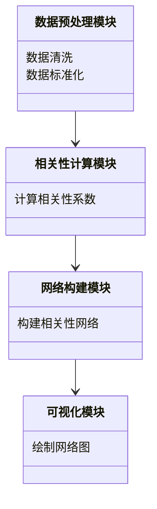

                 


# 金融市场跨资产相关性网络分析

## 关键词
金融市场、资产相关性、网络分析、社区检测、数据可视化、投资组合优化、风险控制

## 摘要
金融市场中的跨资产相关性网络分析是一项复杂而重要的任务，旨在通过研究不同资产之间的相关性，构建网络结构，识别资产之间的潜在关系和风险。本文详细介绍了跨资产相关性网络分析的核心概念、算法原理、系统架构设计、项目实战及最佳实践。通过对相关性网络的构建和分析，可以帮助投资者更好地理解市场动态，优化投资组合，降低风险。

---

## 第1章：背景介绍

### 1.1 问题背景
金融市场中的资产相关性是投资者关注的核心问题之一。随着市场的全球化和资产多样化的趋势，投资者需要了解不同资产之间的相互关系，以便更好地进行投资决策。然而，传统的单资产分析方法难以捕捉资产之间的复杂关系，因此，跨资产相关性网络分析应运而生。

### 1.2 问题描述
跨资产相关性网络分析的目标是通过构建资产相关性网络，识别资产之间的强相关性、弱相关性和潜在风险。本文将从以下几个方面展开：

1. 资产相关性的定义和计算方法。
2. 资产相关性网络的构建步骤。
3. 资产相关性网络的属性分析。

### 1.3 问题解决
通过构建资产相关性网络，投资者可以直观地看到资产之间的关系，从而更好地进行投资组合优化和风险控制。

### 1.4 边界与外延
跨资产相关性网络分析的边界包括：
- 数据范围：仅限于可量化的资产数据。
- 时间范围：仅限于特定时间段内的数据。
- 资产类型：仅限于可比较的资产类别。

跨资产相关性网络分析的外延包括：
- 多资产类别：股票、债券、基金、商品等。
- 多时间尺度：短期、中期、长期。

### 1.5 概念结构与核心要素组成
跨资产相关性网络分析的核心要素包括：
- 数据获取：获取多资产的历史价格数据。
- 数据预处理：处理缺失值、异常值等。
- 相关性计算：使用相关系数矩阵计算资产之间的相关性。
- 网络构建：基于相关性矩阵构建资产相关性网络。
- 网络属性分析：分析网络的度、聚类系数、社区结构等。

---

## 第2章：核心概念与联系

### 2.1 核心概念原理
跨资产相关性网络分析的核心概念包括：
- 相关性系数：用于衡量资产之间的相关性。
- 网络构建：将资产视为节点，相关性系数视为边的权重。
- 社区检测：识别资产网络中的社区结构。

### 2.2 概念属性对比
以下是资产相关性网络和传统相关性分析的对比表格：

| 对比维度         | 资产相关性网络分析           | 传统相关性分析       |
|------------------|----------------------------|--------------------|
| 数据维度         | 多资产、多时间维度           | 单资产或少量资产     |
| 分析目标         | 发现资产之间的复杂关系       | 发现资产之间的线性关系 |
| 可视化方式       | 网络图                        | 相关性矩阵          |

### 2.3 ER实体关系图
以下是资产相关性网络的ER实体关系图：

```mermaid
erd
classDiagram
    class 资产 {
        id
        名称
        类型
    }
    class 相关性 {
        资产A
        资产B
        相关性系数
    }
    资产 --|{n}--> 相关性
```

---

## 第3章：算法原理讲解

### 3.1 相关性计算
相关性计算是跨资产相关性网络分析的基础。常用的相关性计算方法包括：
- Pearson相关系数：衡量资产之间线性相关性。
- Spearman相关系数：衡量资产之间秩相关性。

Pearson相关系数的公式为：
$$ r = \frac{\sum (x_i - \bar{x})(y_i - \bar{y})}{\sqrt{\sum (x_i - \bar{x})^2 \sum (y_i - \bar{y})^2}} $$

### 3.2 网络构建
基于相关性矩阵构建资产相关性网络，可以通过以下步骤：
1. 计算资产之间的相关性系数。
2. 根据相关性系数阈值筛选边。
3. 使用图论算法构建网络。

### 3.3 社区检测
社区检测是发现资产网络中社区结构的重要步骤。常用算法包括：
- 基于度的社区检测算法。
- 基于模块度优化的社区检测算法。

模块度优化算法的公式为：
$$ Q = \sum_{i,j} (A_{ij} - p_{ij}) \cdot s_i s_j $$

---

## 第4章：系统分析与架构设计方案

### 4.1 问题场景
- 数据获取：从金融数据源获取多资产的历史价格数据。
- 数据预处理：清洗数据，处理缺失值和异常值。
- 系统功能设计：数据预处理模块、相关性计算模块、网络构建模块、可视化模块。

### 4.2 系统功能设计
以下是系统功能的类图：



### 4.3 系统架构设计
以下是系统的架构图：


---

## 第5章：项目实战

### 5.1 环境安装
- 安装Python：`python --version`
- 安装相关库：`pip install numpy pandas networkx matplotlib`

### 5.2 核心代码实现
以下是相关性计算和网络构建的核心代码：

```python
import numpy as np
import pandas as pd
import networkx as nx
import matplotlib.pyplot as plt

# 数据加载
data = pd.read_csv('assets.csv')

# 数据预处理
data = data.dropna().drop_duplicates()

# 计算相关性矩阵
correlation_matrix = data.corr()

# 构建网络
G = nx.from_numpy_matrix(correlation_matrix.values)
```

### 5.3 案例分析
以下是一个实际案例分析：

假设我们有三支股票：A、B、C。相关性矩阵如下：

|     | A    | B    | C    |
|-----|------|------|------|
| A   | 1.00 | 0.80 | 0.60 |
| B   | 0.80 | 1.00 | 0.70 |
| C   | 0.60 | 0.70 | 1.00 |

构建网络后，A和B之间相关性最高，形成一个社区，C与A和B的相关性较低，形成另一个社区。

### 5.4 代码解读与分析
上述代码展示了如何使用Python库构建资产相关性网络。`networkx`库用于构建网络，`matplotlib`用于可视化。

### 5.5 项目小结
通过实际案例分析，我们发现相关性网络分析能够有效地识别资产之间的相关性，帮助投资者优化投资组合。

---

## 第6章：数学模型与公式

### 6.1 相关性计算的数学模型
Pearson相关系数的公式为：
$$ r_{xy} = \frac{\sum (x_i - \bar{x})(y_i - \bar{y})}{\sqrt{\sum (x_i - \bar{x})^2 \sum (y_i - \bar{y})^2}} $$

### 6.2 社区检测的数学模型
模块度优化算法的公式为：
$$ Q = \sum_{i,j} (A_{ij} - p_{ij}) \cdot s_i s_j $$

其中，$A_{ij}$是边的存在性，$p_{ij}$是随机图中边存在的概率，$s_i$和$s_j$是节点i和j的社区标签。

---

## 第7章：最佳实践与小结

### 7.1 最佳实践
- 数据质量：确保数据的完整性和准确性。
- 模型选择：根据实际情况选择合适的算法。
- 可视化：通过图表直观展示结果。

### 7.2 小结
跨资产相关性网络分析是一项复杂但重要的任务，通过构建相关性网络，可以帮助投资者更好地理解市场动态，优化投资组合，降低风险。

### 7.3 注意事项
- 数据来源：确保数据的可靠性和有效性。
- 模型局限性：相关性网络分析不能完全替代其他分析方法。

### 7.4 拓展阅读
- 《Financial Network Analysis》
- 《Network Science》

---

## 结语
跨资产相关性网络分析是金融市场分析的重要工具，通过本文的学习，读者可以掌握相关性网络分析的核心概念、算法原理和系统架构设计，并能够通过实际案例分析和项目实战提升自己的技能。

---

希望这篇文章能够为您提供有价值的信息和启示！

