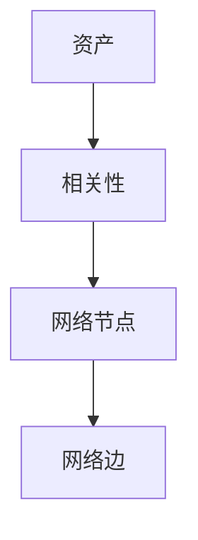
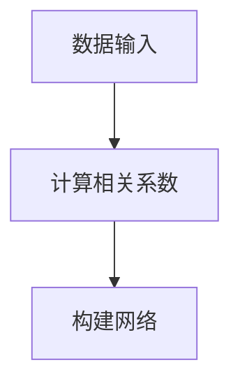
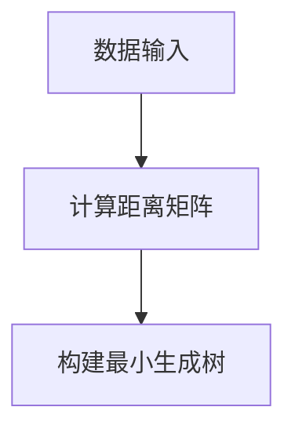
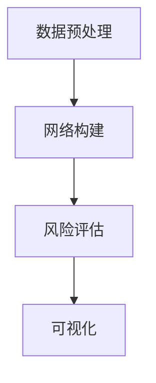
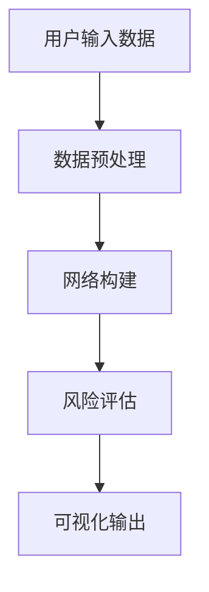

                 


```markdown
# 金融市场跨资产相关性网络分析与应用

> 关键词：金融市场、资产相关性、网络分析、系统架构、项目实战

> 摘要：本文深入探讨了金融市场中跨资产相关性网络分析的核心概念、算法原理、系统架构及实际应用。通过网络分析的方法，结合金融资产的相关性，构建资产相关性网络模型，并分析其在网络中的属性特征。本文详细介绍了几种常用的网络构建算法，并通过系统架构设计和项目实战，展示了如何将资产相关性网络分析应用于金融风险管理和投资组合优化中。最后，本文给出了最佳实践建议，帮助读者更好地理解和应用跨资产相关性网络分析。

---

# 第一部分: 金融市场跨资产相关性网络分析基础

## 第1章: 金融市场跨资产相关性概述

### 1.1 金融市场的基本概念
#### 1.1.1 金融市场的定义与分类
金融市场是指资金的融通市场，包括股票市场、债券市场、外汇市场等。根据交易对象的不同，金融市场可以分为货币市场、资本市场、外汇市场和衍生品市场。

#### 1.1.2 资产的定义与类型
资产是指企业或个人拥有的、能够带来未来经济利益的资源。常见的资产类型包括金融资产（如股票、债券、基金）和实物资产（如房地产、黄金）。

#### 1.1.3 资产相关性的基本概念
资产相关性是指不同资产价格变动之间的相关性。相关性可以通过协方差和相关系数来衡量。

### 1.2 跨资产相关性的背景与意义
#### 1.2.1 金融市场中资产相关性的研究背景
随着全球化的发展，金融市场的资产种类越来越多，不同资产之间的相关性也在增加。研究资产相关性有助于理解市场风险和投资机会。

#### 1.2.2 跨资产相关性在网络分析中的重要性
通过网络分析，可以将资产相关性可视化，帮助投资者更好地理解市场结构和风险传导机制。

#### 1.2.3 跨资产相关性在网络分析中的应用领域
资产相关性网络分析广泛应用于金融风险预警、投资组合优化、市场结构分析等领域。

### 1.3 网络分析的基本概念
#### 1.3.1 网络分析的定义与特点
网络分析是一种通过图论方法研究复杂系统中各元素之间关系的分析方法。其特点是直观、可视化、易于发现系统中的结构特征。

#### 1.3.2 网络分析在金融领域的应用
在网络分析中，节点可以代表资产、公司或投资者，边可以代表资产之间的相关性或交易关系。

#### 1.3.3 跨资产相关性网络分析的定义与目标
跨资产相关性网络分析是通过构建资产相关性网络，研究资产之间相关性的网络结构特征，揭示市场中的潜在风险和机会。

### 1.4 本章小结
本章介绍了金融市场的基本概念、资产相关性的定义与类型，以及网络分析的基本概念和在金融领域的应用。通过这些基础概念的介绍，为后续的跨资产相关性网络分析奠定了理论基础。

---

## 第2章: 跨资产相关性网络分析的核心概念与联系

### 2.1 网络分析的基本原理
#### 2.1.1 网络分析的数学基础
网络分析主要基于图论，图论中的图由节点（顶点）和边（边）组成。节点之间的关系可以通过边的权重来表示。

#### 2.1.2 网络分析的核心概念
- **节点**：代表资产或投资者。
- **边**：代表资产之间的相关性。
- **权重**：表示资产之间相关性的强度。

#### 2.1.3 网络分析与资产相关性的关系
资产相关性可以通过网络分析的边权重来表示，从而构建资产相关性网络。

### 2.2 资产相关性网络的构建原理
#### 2.2.1 资产相关性的定义与计算
资产相关性可以通过协方差或相关系数来衡量。相关系数的取值范围在-1到1之间，表示资产之间的正相关或负相关。

#### 2.2.2 网络节点与边的定义
- **节点**：代表具体的资产。
- **边**：代表资产之间的相关性关系。

#### 2.2.3 网络权重的计算方法
网络权重可以通过相关系数或协方差来计算，权重越大表示资产之间的相关性越强。

### 2.3 资产相关性网络的属性特征对比
#### 2.3.1 资产相关性的属性特征
- **正相关**：资产价格走势一致。
- **负相关**：资产价格走势相反。

#### 2.3.2 网络分析的属性特征
- **度数**：节点的度数表示该资产与其他资产的相关性数量。
- **中心度**：节点的中心度表示该资产在网络中的重要性。

#### 2.3.3 资产相关性网络的综合特征
资产相关性网络的综合特征包括网络的连通性、社区结构和核心节点等。

### 2.4 资产相关性网络的ER实体关系图


### 2.5 本章小结
本章详细介绍了资产相关性网络分析的核心概念，包括网络分析的基本原理、资产相关性网络的构建原理以及网络的属性特征。通过ER实体关系图，展示了资产相关性网络分析的概念模型。

---

## 第3章: 跨资产相关性网络分析的算法原理

### 3.1 网络分析算法概述
#### 3.1.1 常见的网络分析算法
- **相关系数法**：通过计算资产之间的相关系数构建网络。
- **最小生成树算法**：通过构建最小生成树来发现资产之间的最优相关性关系。

#### 3.1.2 网络分析算法的选择依据
根据数据特征和分析目标选择合适的算法。

#### 3.1.3 网络分析算法的优缺点对比
- **相关系数法**：简单易懂，但无法捕捉非线性关系。
- **最小生成树算法**：能够捕捉最优相关性关系，但计算复杂度较高。

### 3.2 资产相关性网络构建的算法
#### 3.2.1 基于相关系数的网络构建算法

计算相关系数的公式为：
$$r_{ij} = \frac{\sum_{t=1}^{n}(x_{it} - \bar{x_i})(y_{jt} - \bar{y_j})}{\sqrt{\sum_{t=1}^{n}(x_{it} - \bar{x_i})^2} \sqrt{\sum_{t=1}^{n}(y_{jt} - \bar{y_j})^2}}$$
其中，$r_{ij}$表示资产$i$和资产$j$之间的相关系数。

#### 3.2.2 基于最小生成树的网络构建算法

最小生成树算法用于在多个资产中找到最小的连接路径，构建资产之间的最优相关性网络。

### 3.3 网络分析算法的数学模型
#### 3.3.1 相关系数的数学模型
$$r_{ij} = \frac{\sum_{t=1}^{n}(x_{it} - \bar{x_i})(y_{jt} - \bar{y_j})}{\sqrt{\sum_{t=1}^{n}(x_{it} - \bar{x_i})^2} \sqrt{\sum_{t=1}^{n}(y_{jt} - \bar{y_j})^2}}$$

#### 3.3.2 最小生成树的数学模型
最小生成树的目标是最小化网络的总权重，同时保持网络的连通性。

### 3.4 算法实现与代码示例
#### 3.4.1 相关系数法的Python代码实现
```python
import numpy as np

def calculate_correlation_matrix(data):
    n_assets = data.shape[1]
    correlation_matrix = np.zeros((n_assets, n_assets))
    for i in range(n_assets):
        for j in range(n_assets):
            correlation_matrix[i, j] = np.corrcoef(data[:, i], data[:, j])[0, 1]
    return correlation_matrix
```

#### 3.4.2 最小生成树算法的Python代码实现
```python
import numpy as np
import networkx as nx

def minimal_spanning_tree(data):
    n_assets = data.shape[1]
    correlation_matrix = calculate_correlation_matrix(data)
    G = nx.Graph()
    G.add_nodes_from(range(n_assets))
    for i in range(n_assets):
        for j in range(i+1, n_assets):
            G.add_edge(i, j, weight=abs(correlation_matrix[i, j]))
    mst = nx.minimal_spanning_tree(G)
    return mst
```

### 3.5 本章小结
本章介绍了几种常用的网络分析算法，包括相关系数法和最小生成树算法。通过数学公式和Python代码示例，详细讲解了这些算法的实现过程。这些算法为后续的系统架构设计和项目实战提供了理论基础。

---

## 第4章: 跨资产相关性网络分析的系统架构设计

### 4.1 系统分析与设计
#### 4.1.1 问题场景介绍
本文设计了一个基于资产相关性网络分析的金融风险管理系统，旨在通过网络分析的方法，帮助投资者识别市场中的潜在风险和机会。

#### 4.1.2 系统功能设计
- **数据预处理**：清洗和标准化金融数据。
- **网络构建**：基于相关系数或最小生成树算法构建资产相关性网络。
- **风险评估**：通过网络分析识别高风险资产和风险传导路径。
- **可视化**：将资产相关性网络可视化，帮助用户更好地理解市场结构。

#### 4.1.3 系统架构设计


### 4.2 系统架构详细设计
#### 4.2.1 数据预处理模块
数据预处理模块负责清洗和标准化金融数据，确保数据质量。

#### 4.2.2 网络构建模块
网络构建模块基于相关系数或最小生成树算法，构建资产相关性网络。

#### 4.2.3 风险评估模块
风险评估模块通过分析网络的结构特征，识别高风险资产和风险传导路径。

#### 4.2.4 可视化模块
可视化模块将资产相关性网络以图形形式展示，帮助用户更好地理解市场结构。

### 4.3 系统接口设计
#### 4.3.1 数据接口
数据接口负责与外部数据源交互，获取金融数据。

#### 4.3.2 用户接口
用户接口提供友好的操作界面，用户可以通过界面进行数据输入、网络构建和风险评估。

### 4.4 系统交互流程


### 4.5 本章小结
本章详细介绍了基于资产相关性网络分析的金融风险管理系统的系统架构设计，包括功能模块设计、接口设计和系统交互流程。通过系统的整体设计，为后续的项目实战奠定了基础。

---

## 第5章: 跨资产相关性网络分析的项目实战

### 5.1 项目环境安装与配置
#### 5.1.1 环境安装
- 安装Python
- 安装必要的Python库（如numpy、pandas、networkx、matplotlib）

#### 5.1.2 数据获取
从金融数据源获取股票价格数据，例如从Yahoo Finance获取。

### 5.2 项目核心实现
#### 5.2.1 数据预处理
```python
import pandas as pd

def data_preprocessing(data):
    # 删除缺失值
    data.dropna(inplace=True)
    # 标准化数据
    normalized_data = (data - data.mean()) / data.std()
    return normalized_data
```

#### 5.2.2 资产相关性网络构建
```python
import numpy as np
import networkx as nx
import matplotlib.pyplot as plt

def build_asset_correlation_network(data):
    n_assets = data.shape[1]
    correlation_matrix = calculate_correlation_matrix(data)
    G = nx.Graph()
    G.add_nodes_from(range(n_assets))
    for i in range(n_assets):
        for j in range(i+1, n_assets):
            G.add_edge(i, j, weight=abs(correlation_matrix[i, j]))
    return G

def visualize_network(G):
    nx.draw(G, with_labels=True, edge_weight='weight')
    plt.show()
```

#### 5.2.3 风险评估与可视化
```python
def risk_assessment(G):
    # 识别高风险资产
    risk_assets = [node for node in G.nodes() if G.degree(node) < 2]
    return risk_assets

# 示例运行
data = pd.read_csv('stock_prices.csv')
normalized_data = data_preprocessing(data)
G = build_asset_correlation_network(normalized_data)
risk_assets = risk_assessment(G)
print("高风险资产:", risk_assets)
visualize_network(G)
```

### 5.3 项目实战案例分析
#### 5.3.1 数据来源与预处理
从Yahoo Finance获取股票价格数据，并进行数据清洗和标准化。

#### 5.3.2 资产相关性网络构建
基于标准化后的数据，计算资产之间的相关系数，并构建资产相关性网络。

#### 5.3.3 风险评估与可视化
通过网络分析，识别高风险资产，并将资产相关性网络可视化。

### 5.4 项目小结
本章通过实际案例分析，详细展示了如何将资产相关性网络分析应用于金融风险管理和投资组合优化中。通过项目的实际运行，验证了系统架构设计的可行性和有效性。

---

## 第6章: 跨资产相关性网络分析的最佳实践

### 6.1 小结
本章总结了全文的主要内容，包括金融市场跨资产相关性网络分析的核心概念、算法原理、系统架构设计和项目实战。

### 6.2 注意事项
- 数据质量对网络分析结果的影响至关重要，需确保数据的准确性和完整性。
- 网络分析算法的选择应根据具体问题和数据特征进行调整。
- 网络分析结果应结合实际情况进行解释，避免误用。

### 6.3 拓展阅读
- 《Network Science》：理解网络科学的基本概念和理论。
- 《Financial Networks》：深入学习金融网络分析的理论与应用。

### 6.4 本章小结
本章通过总结全文内容，提出了在实际应用中需要注意的问题，并给出了拓展阅读的建议。通过这些内容，读者可以更好地理解和应用金融市场跨资产相关性网络分析。

---

## 第7章: 总结与展望

### 7.1 总结
本文系统地介绍了金融市场跨资产相关性网络分析的核心概念、算法原理、系统架构设计和项目实战。通过理论与实践的结合，展示了如何利用网络分析的方法，研究资产相关性网络的结构特征，并应用于金融风险管理。

### 7.2 展望
未来的研究可以进一步探索资产相关性网络分析的其他应用领域，例如金融监管、投资组合优化等。同时，也可以研究更复杂的网络分析算法，以提高分析结果的准确性和实用性。

### 7.3 本章小结
本章总结了全文的主要内容，并对未来的研究方向进行了展望。通过这些内容，读者可以更好地理解金融市场跨资产相关性网络分析的重要性和应用前景。

---

# 结语

金融市场跨资产相关性网络分析是一种新兴的金融分析方法，通过网络分析的方法，可以帮助投资者更好地理解市场结构和风险传导机制。本文通过系统的理论分析和实际案例，展示了如何将网络分析应用于金融风险管理中。未来，随着网络分析技术的不断发展，资产相关性网络分析将在金融领域发挥更重要的作用。
```

