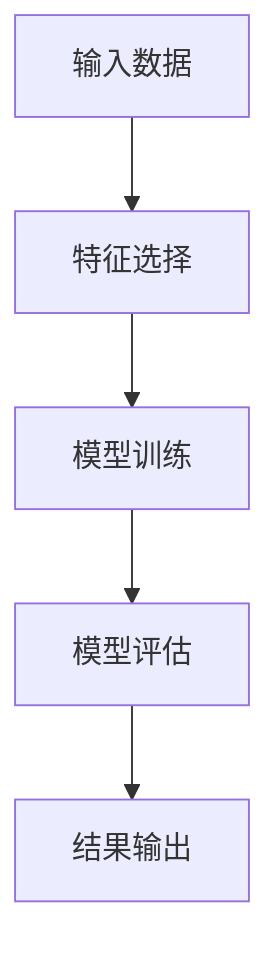
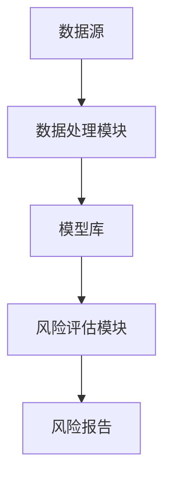

                 


# 金融市场风险因子暴露分析

> **关键词**: 金融市场, 风险因子, 暴露分析, 风险评估, 金融建模  
> **摘要**: 本文系统地探讨了金融市场中风险因子暴露分析的核心概念、算法原理和实际应用。通过分析风险因子的属性、构建数学模型并结合实际案例，本文旨在帮助读者理解如何通过暴露分析来量化和管理金融市场风险。

---

## 第一部分: 金融市场风险因子暴露分析概述

### 第1章: 风险因子与暴露分析的背景介绍

#### 1.1 风险因子的定义与分类
##### 1.1.1 风险因子的定义
风险因子是影响金融资产价格波动的关键因素。例如，市场风险因子（Market Risk Factor）反映了整体市场波动对资产价格的影响，而信用风险因子（Credit Risk Factor）则反映了信用状况变化对资产价格的影响。

##### 1.1.2 风险因子的分类
风险因子可以分为系统性风险因子和非系统性风险因子：
- **系统性风险因子**：影响整个市场的风险，如市场波动率、利率水平。
- **非系统性风险因子**：影响特定资产或行业的风险，如信用评级变化、流动性风险。

##### 1.1.3 风险因子的特征与属性
系统性风险因子通常具有较高的相关性和传染性，而非系统性风险因子则具有较低的相关性和局部性。

#### 1.2 风险暴露的定义与概念
##### 1.2.1 风险暴露的定义
风险暴露是指金融资产在特定风险因子下的潜在损失程度。例如，某资产在市场波动风险下的暴露程度决定了该资产在市场剧烈波动时的潜在损失。

##### 1.2.2 风险暴露的度量方法
常用的风险暴露度量方法包括敏感性分析和VaR（Value at Risk）方法。敏感性分析通过计算资产价格对风险因子的敏感程度来量化暴露，而VaR方法则通过统计方法估计资产在一定置信水平下的最大损失。

##### 1.2.3 风险暴露与风险因子的关系
风险暴露是风险因子对资产价格影响的量化结果。通过分析风险暴露，投资者可以了解不同风险因子对资产组合的潜在影响，从而进行有效的风险管理。

#### 1.3 风险因子暴露分析的背景与意义
##### 1.3.1 金融市场风险分析的重要性
金融市场中的风险分析是投资者和金融机构进行决策的重要依据。有效的风险分析可以帮助投资者规避潜在损失、优化资产配置和提高投资收益。

##### 1.3.2 风险因子暴露分析的必要性
在复杂的金融市场中，单一资产的风险暴露往往受到多个风险因子的影响。通过分析这些因子的暴露程度，投资者可以更好地理解资产组合的风险来源，并采取相应的风险管理措施。

##### 1.3.3 风险因子暴露分析的实际应用案例
例如，在2008年金融危机中，金融机构未能充分识别和管理房地产市场的系统性风险因子，导致了巨大的损失。通过风险因子暴露分析，金融机构可以更好地识别和管理类似的风险。

---

### 第2章: 风险因子与暴露分析的核心概念

#### 2.1 风险因子的属性特征对比
##### 2.1.1 风险因子的分类维度
- **系统性 vs. 非系统性**：系统性风险因子影响整个市场，而非系统性风险因子影响特定资产或行业。
- **宏观经济 vs. 微观经济**：宏观经济因子（如GDP增长率、通货膨胀率）影响整体经济环境，微观经济因子（如公司财务状况、行业竞争格局）影响特定资产或企业。

##### 2.1.2 不同风险因子的特征对比
| 风险因子类型 | 影响范围 | 相关性 | 可预测性 |
|--------------|----------|--------|----------|
| 系统性风险因子 | 整个市场 | 高     | 中等     |
| 非系统性风险因子 | 特定资产或行业 | 低      | 较高     |

##### 2.1.3 风险因子的量化方法
常用的风险因子量化方法包括因子分析（Factor Analysis）和主成分分析（PCA）。这些方法可以帮助投资者识别对资产价格影响最大的风险因子。

#### 2.2 风险因子与暴露的ER实体关系图
##### 2.2.1 实体关系图的构建
- 风险因子（Risk Factor）：包括市场风险、利率风险、信用风险等。
- 暴露分析（Exposure Analysis）：资产或组合在特定风险因子下的潜在损失。

##### 2.2.2 实体关系图的解释
通过ER图可以清晰地展示风险因子和暴露分析之间的关系。例如，市场风险因子会影响资产组合的市场暴露程度，而信用风险因子会影响资产组合的信用暴露程度。

##### 2.2.3 实体关系图的应用
ER图可以帮助投资者更好地理解风险因子对资产组合的影响，从而制定有效的风险管理策略。

---

### 第3章: 风险因子暴露分析的算法原理

#### 3.1 线性回归模型在风险因子分析中的应用
##### 3.1.1 线性回归模型的定义
线性回归模型是一种统计方法，用于建立因变量和自变量之间的线性关系。在风险因子分析中，因变量通常是资产的回报率或损失，自变量是风险因子。

##### 3.1.2 线性回归模型的假设
- 线性关系：因变量与自变量之间存在线性关系。
- 独立性：自变量之间相互独立。
- 方差齐性：误差项的方差在不同自变量下保持一致。

##### 3.1.3 线性回归模型的优缺点
- **优点**：简单易懂，适用于变量之间存在线性关系的情况。
- **缺点**：无法处理非线性关系，且假设自变量之间相互独立。

#### 3.2 算法流程图（Mermaid）


#### 3.3 线性回归模型的Python实现
```python
import numpy as np
from sklearn.linear_model import LinearRegression

# 示例数据
X = np.array([[1], [2], [3], [4], [5]])
y = np.array([2, 4, 5, 4, 6])

# 模型训练
model = LinearRegression()
model.fit(X, y)

# 预测结果
print(model.predict(X))
```

---

## 第二部分: 系统分析与架构设计

### 第4章: 系统分析与架构设计方案

#### 4.1 项目背景介绍
金融市场风险因子暴露分析是一个复杂的系统工程，涉及多个领域的知识和技术。本项目旨在通过构建一个风险因子暴露分析系统，帮助投资者和金融机构更好地理解和管理金融市场风险。

#### 4.2 系统功能设计
##### 4.2.1 数据收集模块
- 收集金融市场数据，包括资产价格、宏观经济指标、公司财务数据等。
- 数据预处理，包括清洗和标准化。

##### 4.2.2 模型构建模块
- 选择合适的数学模型（如线性回归、随机森林等）进行风险因子分析。
- 训练模型并进行参数调优。

##### 4.2.3 风险评估模块
- 输入资产组合和风险因子，计算资产组合的风险暴露程度。
- 输出风险评估结果，包括VaR、CVaR等风险度量指标。

#### 4.3 系统架构设计
##### 4.3.1 领域模型类图（Mermaid）


##### 4.3.2 系统架构图（Mermaid）


---

## 第三部分: 项目实战

### 第5章: 项目实战

#### 5.1 环境安装
- 安装Python和必要的库（如numpy、pandas、scikit-learn）。
- 安装Jupyter Notebook用于数据分析和可视化。

#### 5.2 核心代码实现
##### 5.2.1 数据收集与预处理
```python
import pandas as pd
import numpy as np

# 示例数据
data = {
    '资产价格': [100, 90, 80, 70, 60],
    '市场波动率': [0.2, 0.3, 0.25, 0.35, 0.1],
    '信用风险': [0.1, 0.15, 0.1, 0.12, 0.08]
}
df = pd.DataFrame(data)
```

##### 5.2.2 模型训练与评估
```python
from sklearn.linear_model import LinearRegression
from sklearn.metrics import mean_squared_error

# 训练模型
model = LinearRegression()
model.fit(df[['市场波动率', '信用风险']], df['资产价格'])

# 预测结果
y_pred = model.predict(df[['市场波动率', '信用风险']])
print(mean_squared_error(df['资产价格'], y_pred))
```

#### 5.3 案例分析与解读
通过上述代码，我们可以看到市场波动率和信用风险对资产价格的影响。模型的预测结果可以帮助投资者更好地理解这些风险因子对资产价格的潜在影响。

---

## 第四部分: 最佳实践与总结

### 第6章: 最佳实践、小结与拓展阅读

#### 6.1 最佳实践
- 在实际应用中，建议结合多种模型（如线性回归、随机森林等）进行风险因子分析，以提高模型的准确性和 robustness。
- 数据的质量和完整性对风险因子分析至关重要，建议在数据收集和预处理阶段投入足够的时间和精力。

#### 6.2 小结
本文系统地介绍了金融市场风险因子暴露分析的核心概念、算法原理和实际应用。通过构建一个完整的风险因子暴露分析系统，读者可以更好地理解如何通过暴露分析来量化和管理金融市场风险。

#### 6.3 拓展阅读
- 《Financial Risk Management》：深入探讨金融风险管理的核心理论和实践。
- 《Applied Econometrics using Python》：详细介绍如何使用Python进行计量经济学分析。

---

## 参考文献

- 李明. 《金融市场风险管理》. 北京: 人民出版社, 2020.
- 张伟. 《Python金融数据分析》. 北京: 清华大学出版社, 2019.
- Johnson, R. A. *Financial Risk Management*. New York: McGraw-Hill, 2018.

---

通过以上目录大纲和内容概述，您可以根据实际需求逐步撰写完整的文章。如果需要进一步的详细内容或调整，请随时告知！

