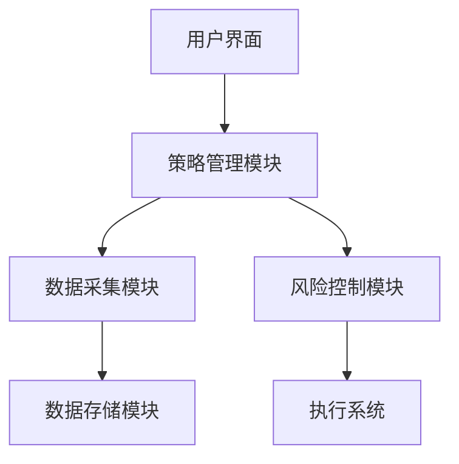
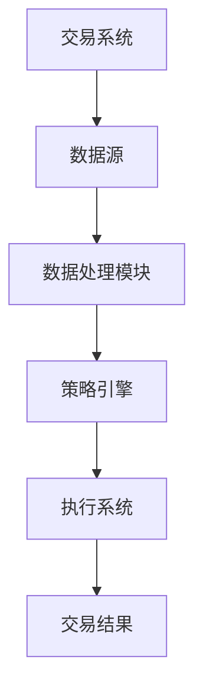
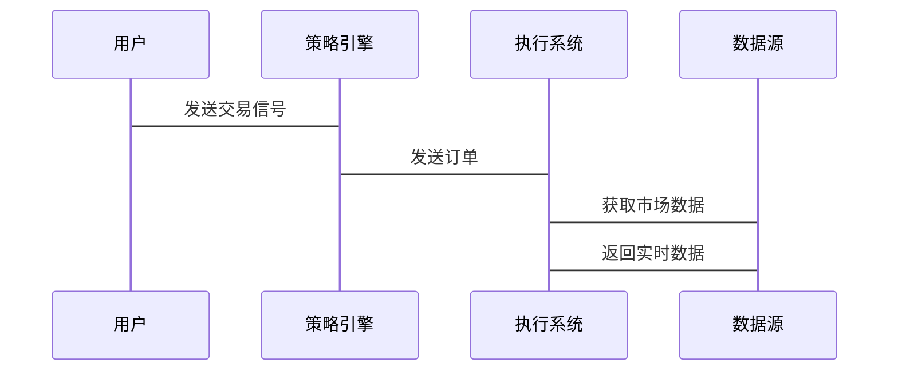

                 


# 金融市场高频交易策略开发

## 关键词  
高频交易, 算法交易, 低延迟, 统计套利, 机器学习, 系统架构设计

## 摘要  
金融市场高频交易策略开发是一项复杂的系统工程，涉及金融学、计算机科学和数学等多个领域。本文将从高频交易的基本概念入手，深入探讨其核心技术基础，详细讲解统计套利和机器学习在高频交易中的应用，分析高频交易系统的架构设计，并通过实战案例展示高频交易策略的实现过程。最后，本文将总结高频交易的最佳实践和未来发展方向。

---

# 目录  

1. [高频交易概述](#高频交易概述)  
   1.1 [高频交易的定义与背景](#高频交易的定义与背景)  
   1.2 [高频交易的核心技术基础](#高频交易的核心技术基础)  

2. [高频交易算法与策略开发](#高频交易算法与策略开发)  
   2.1 [统计套利策略](#统计套利策略)  
   2.2 [机器学习在高频交易中的应用](#机器学习在高频交易中的应用)  

3. [高频交易系统架构设计](#高频交易系统架构设计)  
   3.1 [系统功能设计](#系统功能设计)  
   3.2 [系统架构设计](#系统架构设计)  

4. [高频交易项目实战](#高频交易项目实战)  
   4.1 [统计套利策略实现](#统计套利策略实现)  
   4.2 [机器学习策略实现](#机器学习策略实现)  

5. [高频交易的最佳实践](#高频交易的最佳实践)  
   5.1 [风险管理与控制](#风险管理与控制)  
   5.2 [性能优化与系统稳定性](#性能优化与系统稳定性)  

---

## 第1章 高频交易概述  

### 1.1 高频交易的定义与背景  

#### 1.1.1 高频交易的定义与特点  
高频交易（High-Frequency Trading, HFT）是指在极短时间内进行大量交易的策略，其特点包括：  
- **高速性**：交易系统必须在毫秒级别完成数据处理和决策。  
- **高频性**：短时间内执行大量交易，捕捉短期价格波动。  
- **自动化**：依赖算法和自动化系统执行交易。  

#### 1.1.2 高频交易的历史发展  
高频交易起源于20世纪末的美国金融市场，随着技术的进步，高频交易逐渐成为主流交易方式之一。  

#### 1.1.3 高频交易的应用场景  
- **股票市场**：通过算法捕捉短期价格波动。  
- **期货与期权市场**：利用套利机会进行高频交易。  
- **外汇市场**：通过高频交易实现汇率波动的套利。  

#### 1.1.4 高频交易对金融市场的意义  
高频交易通过提高市场流动性和降低交易成本，为市场参与者提供了更多的交易机会，但也带来了市场不稳定的潜在风险。  

---

### 1.2 高频交易的核心技术基础  

#### 1.2.1 高速数据处理技术  
高频交易依赖于快速的数据处理能力，包括：  
- 数据源与数据获取：从交易所API获取实时市场数据。  
- 数据流处理：对实时数据进行清洗、转换和分析。  

#### 1.2.2 算法交易基础  
- 简单算法交易策略：如均值回归、动量策略等。  
- 算法优化：通过回测和优化算法提高策略的有效性。  

#### 1.2.3 低延迟技术  
- 网络延迟优化：使用低延迟网络和硬件加速技术。  
- 硬件加速：如FPGA加速交易系统。  

---

## 第2章 高频交易算法与策略开发  

### 2.1 统计套利策略  

#### 2.1.1 统计套利的原理  
统计套利是一种基于统计学的套利策略，常见策略包括：  
- **均值回归策略**：假设价格会回归到均值，通过买卖价差获利。  
- **配对交易**：通过相关资产的价差变化进行套利。  

#### 2.1.2 统计套利的数学模型  
均值回归策略的数学模型如下：  
$$ r_t = \alpha + \beta r_{t-1} + \epsilon_t $$  
其中，$r_t$ 表示当前资产收益，$\beta$ 是回归系数，$\epsilon_t$ 是误差项。  

#### 2.1.3 统计套利的实现  
- 数据预处理：清洗和转换数据。  
- 策略回测：通过历史数据验证策略的有效性。  
- 优化与风险控制：调整参数以提高策略表现。  

---

### 2.2 机器学习在高频交易中的应用  

#### 2.2.1 机器学习的基本原理  
- 监督学习：通过标签数据训练模型，预测未来价格。  
- 无监督学习：发现数据中的隐藏模式。  

#### 2.2.2 机器学习在高频交易中的应用  
- **市场预测**：利用机器学习模型预测短期价格走势。  
- **交易信号生成**：通过模型输出交易信号。  

#### 2.2.3 机器学习模型的实现  
- 数据特征提取：如技术指标、市场情绪等。  
- 模型训练：使用神经网络或支持向量机进行训练。  
- 模型优化：调整超参数以提高预测精度。  

---

## 第3章 高频交易系统架构设计  

### 3.1 系统功能设计  

#### 3.1.1 功能模块  
- 数据采集模块：实时获取市场数据。  
- 策略执行模块：根据策略生成交易信号。  
- 风险控制模块：监控和管理交易风险。  

#### 3.1.2 系统架构图  


### 3.2 系统架构设计  

#### 3.2.1 系统架构图  


#### 3.2.2 系统接口设计  
- 数据接口：与交易所API对接，获取实时数据。  
- 策略接口：策略模块与执行系统之间的通信接口。  

#### 3.2.3 系统交互序列图  


---

## 第4章 高频交易项目实战  

### 4.1 统计套利策略实现  

#### 4.1.1 环境配置  
- 安装Python和相关库：如Pandas、NumPy、Scikit-learn。  

#### 4.1.2 核心代码实现  
```python
import pandas as pd
import numpy as np
from sklearn.linear_model import LinearRegression

# 数据预处理
data = pd.read_csv('data.csv')
data = data.dropna()

# 训练模型
model = LinearRegression()
X = data[['open', 'high', 'low', 'close']]
y = data['close']
model.fit(X, y)

# 预测价格
predicted_price = model.predict(X)
```

#### 4.1.3 策略回测  
使用历史数据对策略进行回测，计算收益和风险指标（如夏普比率）。  

#### 4.1.4 优化与分析  
通过参数优化和敏感性分析，提高策略的收益和稳定性。  

### 4.2 机器学习策略实现  

#### 4.2.1 数据特征提取  
提取技术指标（如RSI、MACD）和市场情绪指标。  

#### 4.2.2 模型训练与优化  
使用神经网络模型训练交易信号，并通过网格搜索优化模型参数。  

#### 4.2.3 策略实现与回测  
编写代码实现交易策略，并通过回测验证模型的预测能力。  

---

## 第5章 高频交易的最佳实践  

### 5.1 风险管理与控制  
- 设置止损和止盈机制，避免重大损失。  
- 监控市场波动，及时调整交易策略。  

### 5.2 性能优化与系统稳定性  
- 使用分布式系统提高数据处理能力。  
- 定期优化算法，提升系统运行效率。  

---

## 总结  
金融市场高频交易策略开发是一项复杂但充满挑战的工程，需要结合金融知识、算法优化和系统架构设计。本文通过详细讲解高频交易的核心概念、算法策略、系统设计和实战案例，为读者提供了一套完整的高频交易策略开发框架。未来，随着技术的进步，高频交易将更加智能化和自动化，为金融市场带来更多的机遇与挑战。

