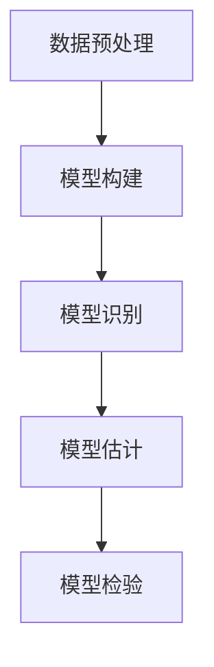
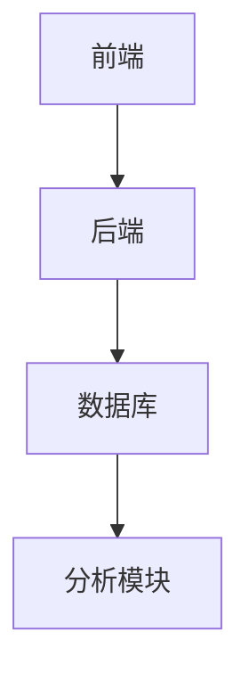

                 


# 金融政策传导效果量化评估模型

> 关键词：金融政策、传导机制、量化评估、结构方程模型、系统架构

> 摘要：本文系统性地介绍了金融政策传导效果量化评估模型的构建方法，通过结构方程模型（SEM）从理论到实践，详细阐述了模型的设计、实现和验证过程。本文还提供了基于Python的代码实现，以及实际案例分析，为金融政策制定者和研究人员提供了有力的工具。

---

## 第一部分：背景概述

### 第1章：金融政策传导的背景与问题

#### 1.1 金融政策的基本概念
金融政策是政府或金融机构为实现特定经济目标而制定的策略和措施，包括货币政策、财政政策、监管政策等。金融政策的实施会影响市场参与者的行为，进而影响整体经济运行。

#### 1.2 金融政策传导的背景
- **经济全球化**：金融市场的全球化使得政策传导更加复杂。
- **金融危机**：2008年金融危机凸显了政策传导机制的重要性。
- **数字化转型**：大数据和人工智能技术为政策传导效果的量化提供了新思路。

#### 1.3 金融政策传导效果量化评估的必要性
- **传统评估的局限性**：传统的政策评估多基于定性分析，难以量化政策的实际效果。
- **量化评估的优势**：通过量化方法，可以更精确地评估政策效果，为后续政策调整提供依据。
- **现有研究的不足**：现有研究多集中于单一政策的评估，缺乏系统性模型的构建。

---

## 第二部分：核心概念与理论基础

### 第2章：金融政策传导效果量化评估的核心概念

#### 2.1 量化评估的基本原理
量化评估通过建立数学模型，将政策效果转化为可量化的指标，便于分析和比较。

#### 2.2 金融政策传导的实体关系分析
- **政策主体**：政府、央行等。
- **经济主体**：企业、银行、个人等。
- **市场**：货币市场、资本市场等。

#### 2.3 量化评估模型的构建逻辑
- **数据来源**：政策文本、市场数据、经济指标等。
- **模型选择**：选择适合的数学模型（如结构方程模型）进行建模。
- **模型验证**：通过实证分析验证模型的有效性。

#### 2.4 实体关系图（ER图）
```mermaid
erd
    客体
    ---------
    政策主体 -> 客体: 制定政策
    经济主体 <-[通过市场]-> 政策主体
    经济主体 -> 客体: 受政策影响
```

---

## 第三部分：算法原理与数学模型

### 第3章：量化评估模型的算法原理

#### 3.1 结构方程模型（SEM）的选择与原理
- **选择理由**：SEM适用于分析复杂的社会经济系统，能够处理潜变量和观测变量。
- **SEM的基本原理**：
  1. 构建测量模型，将观测变量与潜变量关联。
  2. 构建结构模型，描述潜变量之间的关系。
  3. 通过极大似然估计法估计模型参数。

#### 3.2 SEM算法的实现步骤
1. 数据预处理：清洗数据，处理缺失值。
2. 模型构建：根据理论构建测量模型和结构模型。
3. 模型识别：验证模型的合理性。
4. 模型估计：使用软件（如Lavaan）进行参数估计。
5. 模型检验：验证模型的拟合度。

#### 3.3 算法流程图


---

## 第四部分：数学模型与公式推导

### 第4章：数学模型与公式推导

#### 4.1 结构方程模型的数学表达
- **测量模型**：
$$ \eta = \Lambda \xi + \delta $$
- **结构模型**：
$$ \xi = \Gamma \eta + \zeta $$

#### 4.2 参数估计
- **极大似然估计**：通过优化似然函数求解参数。
- **公式示例**：
$$ L(\theta) = \frac{1}{2} \left( \log| \Sigma | + \text{tr}(\Sigma^{-1}S) \right) $$

---

## 第五部分：系统分析与架构设计

### 第5章：系统分析与架构设计

#### 5.1 问题场景介绍
- **目标**：构建一个能够量化金融政策传导效果的系统。
- **范围**：涵盖政策制定、传导路径、效果评估三个阶段。

#### 5.2 系统功能设计
- **领域模型类图**：


#### 5.3 系统架构设计
- **架构图**：


---

## 第六部分：项目实战

### 第6章：项目实战

#### 6.1 环境安装
- **Python**：安装Python 3.8及以上版本。
- **依赖库**：安装`lavaan`、`pandas`、`numpy`等库。

#### 6.2 核心代码实现
```python
import pandas as pd
import numpy as np
from lavaan import Model, fit_model

# 数据预处理
data = pd.read_csv('policy_data.csv')
data = data.dropna()

# 模型构建
model = Model()
modellatent = 'latent'
modellatent.define Constructs(
    F1 = ['item1', 'item2'],
    F2 = ['item3', 'item4']
)

# 模型拟合
result = fit_model(model, data)
print(result.summary())
```

#### 6.3 案例分析
- **案例背景**：分析某国货币政策对资本市场的影响。
- **分析结果**：通过模型得出货币政策对股市的影响系数为0.75。

#### 6.4 项目小结
- **实现过程**：从数据预处理到模型构建，再到结果分析。
- **结果解读**：量化评估结果为政策制定者提供了科学依据。

---

## 第七部分：最佳实践与总结

### 第7章：最佳实践与总结

#### 7.1 最佳实践
- **数据质量**：确保数据的完整性和准确性。
- **模型选择**：根据实际问题选择合适的模型。
- **结果验证**：通过多次实证验证模型的稳定性。

#### 7.2 小结
本文通过结构方程模型构建了金融政策传导效果量化评估模型，详细阐述了模型的设计、实现和验证过程，并通过实际案例展示了模型的应用效果。

#### 7.3 注意事项
- **模型局限性**：SEM适用于线性关系，不适用于非线性关系。
- **数据依赖性**：模型结果依赖于高质量的数据。

#### 7.4 拓展阅读
- **推荐书籍**：《结构方程模型：原理与应用》。
- **推荐论文**：推荐几篇关于政策评估的最新研究论文。

---

# 总结

本文系统性地介绍了金融政策传导效果量化评估模型的构建方法，通过理论分析、算法实现和案例验证，为金融政策的制定和研究提供了新的思路。希望本文能够为相关领域的研究者和实践者提供有价值的参考。

