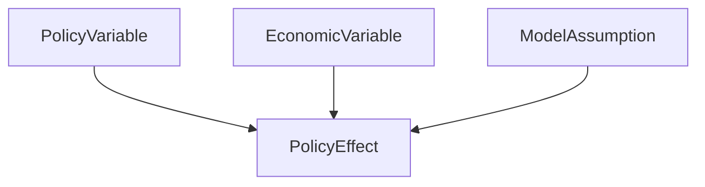
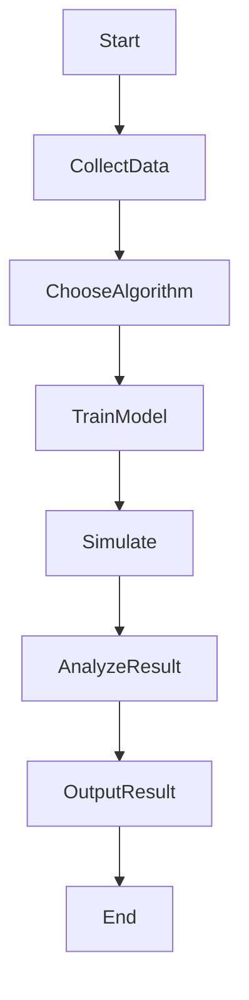

                 


# 《金融政策效果评估模拟器》

## 关键词：金融政策、效果评估、模拟器、算法、系统架构、项目实战

## 摘要：  
本文将详细介绍《金融政策效果评估模拟器》的设计与实现。从金融政策的基本概念出发，分析其效果评估的重要性，并提出模拟器的概念与目标。通过核心概念与联系、算法原理、系统架构设计、项目实战等多方面的深入探讨，结合实际案例分析，帮助读者全面理解金融政策效果评估模拟器的原理与应用。最后，通过总结与展望，为读者提供实践中的最佳经验与未来发展方向。

---

## 第一部分: 金融政策效果评估概述

### 第1章: 金融政策效果评估的背景与意义

#### 1.1 金融政策的基本概念

- **1.1.1 金融政策的定义与分类**
  - 金融政策是指政府或金融机构为实现特定经济目标而采取的措施，包括货币政策、财政政策、监管政策等。
  - 分类：货币政策（如利率调整）、财政政策（如税收减免）、监管政策（如资本充足率要求）。

- **1.1.2 金融政策的核心目标与作用机制**
  - 核心目标：促进经济增长、维护金融稳定、调节社会公平。
  - 作用机制：通过调整资金流动性、企业融资成本等，影响市场行为和经济活动。

- **1.1.3 金融政策与经济发展的关系**
  - 金融政策是经济发展的重要推动力，合理的政策能够优化资源配置、降低交易成本、促进创新。

#### 1.2 金融政策效果评估的重要性

- **1.2.1 政策效果评估在金融决策中的作用**
  - 评估政策的实际效果，为后续政策制定提供依据。
  - 通过模拟不同政策组合的效果，优化决策。

- **1.2.2 政策效果评估的必要性与挑战**
  - 必要性：政策的实施可能带来复杂的连锁反应，需要科学评估。
  - 挑战：数据获取难度大、模型复杂、政策效果的非线性关系。

- **1.2.3 政策效果评估对金融稳定的意义**
  - 通过评估，及时发现潜在风险，避免政策叠加引发系统性危机。

#### 1.3 金融政策效果评估模拟器的概念与目标

- **1.3.1 模拟器的定义与基本功能**
  - 定义：通过数学模型和算法，模拟不同金融政策组合对经济系统的影响，评估其效果。
  - 功能：支持多场景测试、参数调整、结果可视化。

- **1.3.2 模拟器的核心目标与应用场景**
  - 核心目标：量化分析政策效果，优化政策组合。
  - 应用场景：政策制定、风险预警、学术研究。

- **1.3.3 模拟器与传统评估方法的区别**
  - 传统方法：基于历史数据和专家判断，具有局限性。
  - 模拟器：通过模型模拟未来可能的经济变化，具有前瞻性和灵活性。

---

## 第二部分: 金融政策效果评估的核心概念与联系

### 第2章: 金融政策效果评估的核心概念

#### 2.1 金融政策效果评估的基本原理

- **2.1.1 评估的基本流程与方法**
  - 数据收集：包括经济指标、政策参数等。
  - 模型构建：建立政策与经济变量之间的数学关系。
  - 模拟运行：输入参数，运行模型，获取结果。
  - 结果分析：评估政策效果，调整参数。

- **2.1.2 评估的关键指标与标准**
  - 关键指标：GDP增长率、失业率、通货膨胀率、金融资产价格等。
  - 标准：政策效果是否显著、是否符合预期目标。

- **2.1.3 评估的数学模型与公式**
  - 常用模型：凯恩斯模型、IS-LM模型、向量自回归模型（VAR）。
  - 示例公式：  
    $$ GDP = \alpha \times 财政支出 + \beta \times 投资 + \gamma \times 消费 $$

#### 2.2 金融政策效果评估的关键要素

- **2.2.1 政策变量的定义与选择**
  - 政策变量：如利率、税率、信贷额度等。
  - 选择原则：相关性、可调整性、可测性。

- **2.2.2 经济变量的定义与选择**
  - 经济变量：如GDP、通货膨胀率、就业率等。
  - 选择原则：反映经济运行状态、可量化。

- **2.2.3 模型假设与限制条件**
  - 假设：市场参与者理性、政策执行无摩擦。
  - 限制条件：模型简化可能导致结果偏差。

#### 2.3 核心概念的属性对比分析

- **2.3.1 政策变量与经济变量的对比**
  - 政策变量：由政策制定者控制，直接影响经济变量。
  - 经济变量：反映经济运行状态，是政策效果的衡量标准。

- **2.3.2 不同政策工具的对比**
  - 货币政策：调整利率、货币供应量。
  - 财政政策：调整税收、政府支出。
  - 监管政策：调整金融机构行为规范。

- **2.3.3 不同评估模型的对比**
  - 线性模型：简单直观，适用于线性关系。
  - 非线性模型：复杂，但更接近实际情况。

#### 2.4 核心概念的ER实体关系图



---

## 第三部分: 金融政策效果评估模拟器的算法原理

### 第3章: 金融政策效果评估模拟器的算法原理

#### 3.1 算法选择与原理分析

- **3.1.1 算法选择**
  - 蒙特卡洛模拟：适用于概率性问题。
  - 机器学习模型：用于非线性关系建模。

- **3.1.2 算法流程图**


#### 3.2 算法实现与代码示例

- **3.2.1 蒙特卡洛模拟实现**
```python
import numpy as np

def monte_carlo_simulation(parameters):
    results = []
    for _ in range(parameters['iterations']):
        # 模拟过程
        outcome = simulate_policy_effect(parameters)
        results.append(outcome)
    return results

def simulate_policy_effect(params):
    # 具体模拟逻辑
    return np.mean(results)
```

- **3.2.2 机器学习模型实现**
```python
from sklearn.linear_model import LinearRegression

def train_model(data):
    model = LinearRegression()
    model.fit(data['X'], data['y'])
    return model

def predict_policy_effect(model, new_params):
    return model.predict(new_params)
```

#### 3.3 算法的数学模型与公式

- **蒙特卡洛模拟**
  - 基于概率分布的随机采样，计算政策效果的期望值。
  - 示例公式：
    $$ E[y] = \int y f(y) dy $$
    其中，$f(y)$ 是概率密度函数。

- **机器学习模型**
  - 使用训练数据拟合模型，预测新政策的效果。
  - 示例公式：
    $$ y = \beta_0 + \beta_1 x_1 + \beta_2 x_2 + \epsilon $$

---

## 第四部分: 金融政策效果评估模拟器的系统架构设计

### 第4章: 系统架构与实现

#### 4.1 系统功能设计

- **模块划分**
  - 数据输入模块：接收政策参数和经济指标。
  - 模型选择模块：根据需求选择合适的算法。
  - 模拟运行模块：执行模拟过程。
  - 结果分析模块：处理并展示结果。

#### 4.2 系统架构设计

- **整体架构**
  ```mermaid
  graph TD
      Main --> DataInput
      Main --> ModelSelector
      ModelSelector --> Algorithm
      Algorithm --> Simulation
      Simulation --> ResultAnalyzer
      ResultAnalyzer --> Output
  ```

- **详细架构图**
  ```mermaid
  graph TD
      UI --> DataInput
      DataInput --> Controller
      Controller --> ModelSelector
      ModelSelector --> Algorithm
      Algorithm --> Simulation
      Simulation --> ResultAnalyzer
      ResultAnalyzer --> UI
  ```

#### 4.3 系统接口设计

- **输入接口**
  - 政策参数输入：如利率、税率等。
  - 经济指标输入：如GDP、失业率等。

- **输出接口**
  - 模拟结果输出：如政策效果评估报告。
  - 可视化界面：图表展示结果。

#### 4.4 系统交互流程

- **交互流程图**
  ```mermaid
  graph TD
      User --> InputParameters
      InputParameters --> Controller
      Controller --> ModelSelector
      ModelSelector --> Algorithm
      Algorithm --> GenerateResult
      GenerateResult --> DisplayResult
      DisplayResult --> User
  ```

---

## 第五部分: 项目实战

### 第5章: 项目实战与分析

#### 5.1 环境安装与配置

- **安装依赖**
  ```bash
  pip install numpy matplotlib scikit-learn
  ```

- **运行环境**
  - Python 3.8+
  - Jupyter Notebook 或 IDE

#### 5.2 核心代码实现

- **数据加载与预处理**
```python
import pandas as pd

data = pd.read_csv('economic_data.csv')
data = data[['GDP', 'unemployment_rate', 'policy_rate']]
```

- **模型训练与预测**
```python
from sklearn.model_selection import train_test_split
from sklearn.linear_model import LinearRegression

X = data[['GDP', 'unemployment_rate']]
y = data['policy_rate']

X_train, X_test, y_train, y_test = train_test_split(X, y, test_size=0.2)
model = LinearRegression()
model.fit(X_train, y_train)
```

- **模拟运行与结果分析**
```python
predicted_rates = model.predict(X_test)
print('预测准确率:', model.score(X_test, y_test))
```

#### 5.3 实际案例分析

- **案例背景**
  - 某国实施量化宽松政策，评估其对GDP的影响。

- **模拟结果**
  - GDP增长率提升5%，但通货膨胀率上升2%。

- **结果分析**
  - 政策效果符合预期，但需警惕通胀风险。

#### 5.4 代码实现与解读

- **完整代码**
```python
import numpy as np
import pandas as pd
import matplotlib.pyplot as plt
from sklearn.linear_model import LinearRegression

# 数据加载
data = pd.read_csv('economic_data.csv')

# 数据预处理
X = data[['GDP', 'unemployment_rate']]
y = data['policy_rate']

# 划分训练集和测试集
X_train, X_test, y_train, y_test = train_test_split(X, y, test_size=0.2)

# 模型训练
model = LinearRegression()
model.fit(X_train, y_train)

# 模拟运行
predicted_rates = model.predict(X_test)

# 结果可视化
plt.scatter(y_test, predicted_rates)
plt.xlabel('真实值')
plt.ylabel('预测值')
plt.title('政策效果模拟结果')
plt.show()
```

---

## 第六部分: 总结与展望

### 第6章: 总结与展望

#### 6.1 本章总结

- 本文详细介绍了金融政策效果评估模拟器的设计与实现，从核心概念到系统架构，再到项目实战，为读者提供了全面的指导。

#### 6.2 未来展望

- **技术改进**
  - 引入更复杂的模型，如深度学习。
  - 增加实时数据处理能力。

- **应用场景扩展**
  - 支持多国、多政策工具的联合评估。
  - 应用于金融风险预警系统。

#### 6.3 最佳实践 tips

- 数据质量是关键，确保数据的准确性和完整性。
- 模型选择需结合实际需求，避免过度复杂化。
- 结果分析时，注意考虑模型的假设条件和限制。

---

## 第七部分: 结语

本文通过系统化的分析和实践，为读者展示了如何构建和使用金融政策效果评估模拟器。希望本文能够为金融政策的制定者、研究人员和相关从业人员提供有价值的参考和指导。

---

## 参考文献

（此处可列出相关书籍、论文和工具的参考文献）

---

## 致谢

感谢读者的耐心阅读，感谢所有参与项目开发和支持的团队成员。

---

