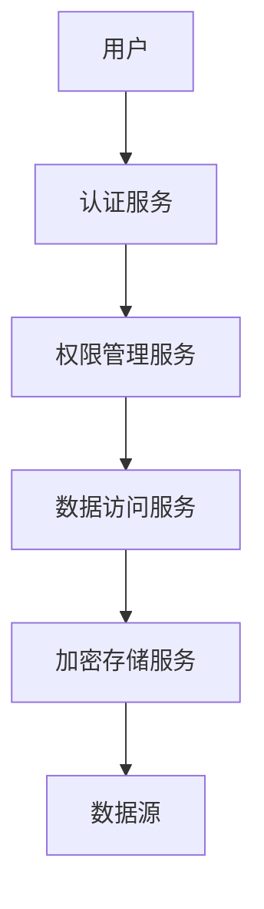
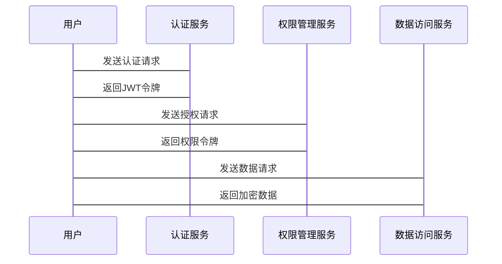

                 


# 《金融数据安全与隐私保护框架》

---

## 关键词：
- 金融数据安全
- 隐私保护框架
- 数据加密
- 访问控制
- 匿名化处理

---

## 摘要：
金融数据安全与隐私保护是当前数字经济发展中的核心问题。随着金融业务的数字化和网络化，金融数据的敏感性和重要性日益凸显，数据泄露和隐私侵犯的风险也在不断增加。本文将从金融数据的基本概念出发，分析数据安全与隐私保护的威胁与挑战，详细讲解数据加密、访问控制、匿名化处理等核心技术和隐私保护框架的设计原则。同时，结合实际案例，介绍如何构建安全可靠的金融数据隐私保护系统，并总结最佳实践和未来发展趋势。

---

# 第1章: 金融数据安全与隐私保护的背景与挑战

## 1.1 金融数据的基本概念
### 1.1.1 金融数据的定义与分类
- 金融数据的定义：包括交易数据、用户信息、财务记录等。
- 金融数据的分类：交易数据、用户数据、市场数据、机构数据。
- 数据的生命周期：收集、存储、处理、共享、销毁。

### 1.1.2 金融数据的重要性与价值
- 数据是金融业务的核心资产。
- 数据驱动金融创新和服务优化。
- 数据的价值体现在支持决策和风险管理。

### 1.1.3 金融数据的生命周期管理
- 数据的生成与收集。
- 数据的存储与处理。
- 数据的共享与销毁。

## 1.2 金融数据安全的威胁与挑战
### 1.2.1 常见的金融数据安全威胁
- 网络攻击：如DDoS、钓鱼攻击等。
- 数据泄露：未经授权的访问或内部员工泄露。
- 数据篡改：恶意修改数据完整性。
- 数据丢失：因系统故障或自然灾害导致数据丢失。

### 1.2.2 数据泄露的严重性与影响
- 对个人隐私的侵害：可能导致身份盗窃、欺诈等。
- 对金融机构的损失：罚款、声誉损失、客户信任度下降。
- 对社会的影响：可能导致金融系统不稳定。

### 1.2.3 数据隐私保护的法律与合规要求
- 《通用数据保护条例》（GDPR）：欧盟的严格隐私保护法规。
- 《个人数据保护法》（中国的《个人信息保护法》）。
- 金融机构的内部合规要求。

## 1.3 隐私保护的重要性与必要性
### 1.3.1 隐私保护的核心概念
- 隐私：个人对其信息的控制权。
- 数据最小化：仅收集实现目的所需的最少数据。
- 用户同意：明确授权数据的使用。

### 1.3.2 金融隐私保护的特殊性
- 金融数据的敏感性：涉及资金、账户信息等。
- 用户信任的重要性：隐私泄露会直接导致信任缺失。
- 法律合规的严格性：金融行业受到更严格的监管。

### 1.3.3 隐私保护与数据利用的平衡
- 数据利用的需求：支持金融创新和服务优化。
- 隐私保护的必要性：防止滥用和泄露。
- 如何在两者之间找到平衡点。

## 1.4 金融数据安全与隐私保护框架的必要性
### 1.4.1 框架的目标与作用
- 目标：保护金融数据的机密性、完整性和可用性。
- 作用：提供统一的安全标准和隐私保护策略。

### 1.4.2 框架的适用范围与边界
- 适用范围：金融机构、支付平台、数据处理机构。
- 边界：明确框架的覆盖范围和限制条件。

### 1.4.3 框架的核心要素与组成
- 数据分类与分级：根据敏感程度进行分类。
- 安全策略：制定访问控制、加密等措施。
- 隐私保护技术：如匿名化处理、加密技术等。

---

# 第2章: 金融数据安全与隐私保护的核心概念

## 2.1 数据安全与隐私保护的定义与属性
### 2.1.1 数据安全的定义与特征
- 数据安全：保护数据的机密性、完整性和可用性。
- 特征：预防性、动态性、技术性。

### 2.1.2 隐私保护的定义与特征
- 隐私保护：确保个人数据不被未经授权的访问或使用。
- 特征：个性化、动态性、法律合规性。

### 2.1.3 数据安全与隐私保护的对比分析
- 对比表格：从目标、技术手段、合规要求等方面进行对比。

| 特性       | 数据安全                | 隐私保护                |
|------------|-------------------------|-------------------------|
| 目标       | 保护数据的机密性、完整性和可用性 | 保护个人隐私，防止数据滥用 |
| 技术手段   | 加密、访问控制、防火墙 | 匿名化、数据最小化、用户同意 |
| 合规要求   | 符合行业标准和法规       | 符合GDPR、个人信息保护法 |

---

## 2.2 核心概念的ER实体关系图
### 2.2.1 实体关系图的定义与作用
- ER图：描述系统中的实体及其关系。
- 作用：帮助理解系统结构和数据流动。

### 2.2.2 金融数据安全与隐私保护的核心实体
- 用户：包括个人和机构用户。
- 数据：包括交易数据、用户信息等。
- 安全策略：访问控制规则、加密算法等。
- 日志记录：记录数据访问和操作日志。

### 2.2.3 ER实体关系图展示
```mermaid
er
    actor: 用户
    actor: 攻击者
    actor: 管理者
    entity: 数据
    entity: 用户隐私
    entity: 安全策略
    entity: 日志记录
    entity: 授权访问
    entity: 加密数据
    entity: 匿名化处理
    relation: 用户 -> 授权访问
    relation: 授权访问 -> 数据
    relation: 数据 -> 加密数据
    relation: 数据 -> 匿名化处理
    relation: 攻击者 -> 破坏安全策略
    relation: 管理者 -> 安全策略
    relation: 安全策略 -> 日志记录
```

---

## 2.3 数据安全与隐私保护的核心技术
### 2.3.1 数据加密技术
- 对称加密：AES、DES。
- 非对称加密：RSA、椭圆曲线加密。
- 加密算法的选择与实现。

### 2.3.2 访问控制技术
- 基于角色的访问控制（RBAC）。
- 基于属性的访问控制（ABAC）。
- 访问控制的实现步骤。

### 2.3.3 匿名化处理技术
- 数据脱敏：如替换、遮蔽。
- 匿名化方法：如K-匿名性、L-多样性。

---

## 2.4 数据安全与隐私保护的核心原则
### 2.4.1 数据最小化原则
- 收集最少的数据。
- 处理数据时仅使用必要的字段。

### 2.4.2 数据访问控制原则
- 最小权限原则：用户只能访问必要的数据。
- 分层访问控制：根据角色和权限进行分级。

### 2.4.3 数据加密存储与传输原则
- 数据存储加密：防止数据被物理获取。
- 数据传输加密：防止数据在传输过程中被截获。

---

## 2.5 数据安全与隐私保护的合规要求
### 2.5.1 GDPR与个人信息保护法
- GDPR的核心要求：数据主体权利、数据处理合法性。
- 个人信息保护法：数据收集、存储、使用的规定。

### 2.5.2 金融机构的内部合规
- 内部政策制定：数据安全策略、隐私保护政策。
- 定期审计：检查合规性，发现和修复问题。

### 2.5.3 第三方服务的合规要求
- 第三方服务的使用：确保其符合数据安全和隐私保护要求。
- 合同约束：明确数据处理的责任和义务。

---

# 第3章: 数据安全与隐私保护的技术原理

## 3.1 数据加密技术的原理与实现
### 3.1.1 对称加密算法
- AES加密算法的原理：分组加密，128位、192位、256位密钥。
- 加密与解密的过程：明文→密钥→密文，密文→密钥→明文。

### 3.1.2 非对称加密算法
- RSA算法的原理：公钥加密，私钥解密。
- 椭圆曲线加密的原理：基于椭圆曲线的离散对数问题。

### 3.1.3 加密算法的实现步骤
1. 选择加密算法：根据需求选择对称或非对称加密。
2. 生成密钥：使用随机数生成器生成密钥。
3. 加密数据：将明文转换为密文。
4. 解密数据：将密文转换为明文。

### 3.1.4 加密算法的优缺点对比
- 对称加密：速度快，但密钥分发困难。
- 非对称加密：密钥分发方便，但速度较慢。

---

## 3.2 访问控制技术的原理与实现
### 3.2.1 基于角色的访问控制（RBAC）
- 角色定义：如管理员、普通用户、审计员。
- 权限分配：根据角色分配访问权限。
- 访问决策：根据用户角色和权限决定是否允许访问。

### 3.2.2 基于属性的访问控制（ABAC）
- 属性定义：如地理位置、时间、数据分类。
- 条件评估：根据属性的组合决定访问权限。
- 访问决策：动态评估属性条件，决定是否允许访问。

### 3.2.3 访问控制的实现步骤
1. 定义角色和属性：根据业务需求定义角色和属性。
2. 分配权限：为角色分配访问权限。
3. 实现访问控制：在系统中实现访问控制逻辑。

---

## 3.3 匿名化处理技术的原理与实现
### 3.3.1 数据脱敏技术
- 替换：如将姓名替换为随机字母。
- 遮蔽：如将手机号中的中间四位用****代替。
- 打乱：如将数据排序后随机重新排列。

### 3.3.2 匿名化方法
- K-匿名性：确保数据无法被唯一识别。
- L-多样性：确保数据的多样性，防止单一数据点被识别。

### 3.3.3 匿名化处理的实现步骤
1. 选择匿名化方法：根据数据类型和需求选择合适的方法。
2. 处理数据：对数据进行脱敏或匿名化处理。
3. 验证匿名化效果：确保处理后的数据无法被逆向还原。

---

## 3.4 数据安全与隐私保护的技术挑战
### 3.4.1 加密算法的计算复杂度
- 加密和解密的计算成本：对性能的影响。
- 如何在保证安全性的前提下优化计算效率。

### 3.4.2 访问控制的动态性
- 用户角色和权限的动态变化。
- 如何实时更新访问控制策略。

### 3.4.3 匿名化处理的数据可用性
- 匿名化处理后的数据是否仍可用于分析和决策。
- 如何在保护隐私的前提下支持数据分析。

---

## 3.5 数据安全与隐私保护的技术趋势
### 3.5.1 同态加密技术
- 支持在加密数据上进行计算。
- 应用场景：隐私计算、数据分析。

### 3.5.2 零知识证明技术
- 证明数据的存在性或正确性，而不泄露数据本身。
- 应用场景：身份验证、隐私保护。

### 3.5.3 数据可用性与隐私保护的平衡
- 如何在保护隐私的前提下支持数据共享和分析。
- 隐私计算框架：如Federated Learning、可信计算。

---

# 第4章: 金融数据安全与隐私保护的系统架构设计

## 4.1 系统架构设计的背景与目标
### 4.1.1 系统架构设计的背景
- 金融系统的复杂性：涉及多个业务模块和数据源。
- 数据安全与隐私保护的需求：需要统一的安全策略和隐私保护框架。

### 4.1.2 系统架构设计的目标
- 提供统一的安全策略和隐私保护框架。
- 支持数据的分类分级管理。
- 实现数据的加密存储与传输。

---

## 4.2 系统功能设计
### 4.2.1 数据分类与分级管理
- 数据分类：根据数据类型、敏感程度进行分类。
- 数据分级：制定不同级别的安全策略。

### 4.2.2 数据加密与解密功能
- 数据加密：支持多种加密算法，如AES、RSA。
- 数据解密：提供解密接口，确保数据的可用性。

### 4.2.3 访问控制功能
- 用户认证：支持多种认证方式，如密码、MFA。
- 权限管理：基于角色和属性的访问控制。
- 访问审计：记录用户的操作日志，便于审计和追溯。

---

## 4.3 系统架构设计
### 4.3.1 系统架构图


### 4.3.2 关键模块的设计
- 用户认证模块：负责用户的身份验证。
- 权限管理模块：根据用户角色和属性分配权限。
- 数据访问模块：根据权限控制数据的访问。
- 加密存储模块：负责数据的加密存储和解密。

---

## 4.4 系统接口设计
### 4.4.1 接口定义
- 用户认证接口：支持多种认证方式，如OAuth、JWT。
- 权限管理接口：根据用户角色和属性返回允许的操作。
- 数据访问接口：根据权限返回数据。

### 4.4.2 接口实现
- RESTful API：采用JSON格式传递数据。
- 接口的安全性：使用HTTPS、JWT进行身份验证和授权。

---

## 4.5 系统交互设计
### 4.5.1 交互流程图


### 4.5.2 交互过程
1. 用户向认证服务发送认证请求。
2. 认证服务验证用户身份，返回JWT令牌。
3. 用户向权限管理服务发送授权请求。
4. 权限管理服务验证权限，返回权限令牌。
5. 用户向数据访问服务发送数据请求。
6. 数据访问服务验证权限，返回加密数据。

---

## 4.6 系统架构设计的注意事项
### 4.6.1 架构的可扩展性
- 如何支持业务的扩展和变化。
- 如何适应新的安全威胁和技术发展。

### 4.6.2 架构的可维护性
- 如何方便地进行代码维护和功能升级。
- 如何快速定位和修复系统漏洞。

### 4.6.3 架构的安全性
- 如何确保系统的安全性，防止新的安全威胁。
- 如何进行定期的安全审计和漏洞扫描。

---

# 第5章: 项目实战——金融数据安全与隐私保护框架的实现

## 5.1 项目背景与目标
### 5.1.1 项目背景
- 某金融机构需要构建金融数据安全与隐私保护框架。
- 目标：保护用户隐私，确保数据安全，符合GDPR和本地法规。

### 5.1.2 项目目标
- 实现数据的分类与分级管理。
- 实现数据的加密存储与传输。
- 实现基于角色的访问控制。

---

## 5.2 环境安装与配置
### 5.2.1 开发环境
- 操作系统：Linux/Windows/MacOS。
- 开发工具：IntelliJ IDEA、PyCharm、VS Code。
- 依赖管理：使用虚拟环境管理Python依赖，如venv、pipenv。

### 5.2.2 项目安装
- 项目代码托管在GitHub上。
- 使用Git克隆项目代码。
- 使用pip安装项目依赖。

---

## 5.3 核心代码实现
### 5.3.1 数据分类与分级管理
- 数据分类：根据数据类型和敏感程度进行分类。
- 数据分级：制定不同的安全策略。

### 5.3.2 数据加密与解密
- 使用AES算法对数据进行加密。
- 使用Python的cryptography库实现加密和解密。

### 5.3.3 访问控制实现
- 基于角色的访问控制：使用Django的RBAC模块。
- 定义角色和权限，分配访问权限。

---

## 5.4 项目实现步骤
### 5.4.1 数据分类与分级管理
1. 数据分类：根据数据类型和敏感程度进行分类。
2. 数据分级：制定不同的安全策略，如高、中、低风险等级。

### 5.4.2 数据加密与解密
1. 数据加密：使用AES算法对敏感数据进行加密。
2. 数据解密：使用加密密钥对加密数据进行解密。

### 5.4.3 访问控制实现
1. 定义角色：如管理员、普通用户、审计员。
2. 分配权限：根据角色分配访问权限。
3. 实现访问控制：在系统中实现RBAC逻辑。

---

## 5.5 项目实现代码示例
### 5.5.1 数据分类与分级管理
```python
# 数据分类与分级管理
def classify_data(data_type, sensitivity):
    if data_type == 'user_info' and sensitivity == 'high':
        return 'critical'
    elif data_type == 'transaction' and sensitivity == 'medium':
        return 'high'
    else:
        return 'low'

# 示例
print(classify_data('user_info', 'high'))  # 输出: critical
print(classify_data('transaction', 'medium'))  # 输出: high
```

### 5.5.2 数据加密与解密
```python
from cryptography.fernet import Fernet

# 数据加密
def encrypt_data(data, key):
    cipher = Fernet(key)
    encrypted_data = cipher.encrypt(data.encode())
    return encrypted_data

# 数据解密
def decrypt_data(encrypted_data, key):
    cipher = Fernet(key)
    decrypted_data = cipher.decrypt(encrypted_data).decode()
    return decrypted_data

# 示例
key = Fernet.generate_key()
data = 'Sensitive financial data'
encrypted = encrypt_data(data, key)
decrypted = decrypt_data(encrypted, key)
print(decrypted)  # 输出: Sensitive financial data
```

### 5.5.3 访问控制实现
```python
# 基于角色的访问控制
def has_permission(user_role, required_role):
    if user_role == 'admin' and required_role == 'admin':
        return True
    elif user_role == 'user' and required_role == 'user':
        return True
    else:
        return False

# 示例
print(has_permission('admin', 'admin'))  # 输出: True
print(has_permission('user', 'admin'))  # 输出: False
```

---

## 5.6 项目实现的注意事项
### 5.6.1 代码规范
- 遵循PEP8编码规范。
- 保持代码的可读性和可维护性。

### 5.6.2 安全性
- 避免硬编码密钥，确保密钥的安全存储。
- 定期进行代码审查和安全测试。

### 5.6.3 性能优化
- 优化加密算法的性能，减少计算开销。
- 使用缓存技术，提高访问控制的效率。

---

## 5.7 项目实现的案例分析
### 5.7.1 案例背景
- 某银行需要保护客户交易数据的隐私和安全。
- 客户数据包括姓名、地址、信用卡号等。

### 5.7.2 案例实现
1. 数据分类：将客户数据分为高、中、低风险等级。
2. 数据加密：使用AES算法对高风险数据进行加密。
3. 访问控制：仅允许管理员和授权员工访问高风险数据。

### 5.7.3 案例分析
- 数据分类：高风险数据包括信用卡号和交易记录。
- 数据加密：使用256位AES密钥对高风险数据进行加密。
- 访问控制：管理员和授权员工通过RBAC模块访问高风险数据。

---

## 5.8 项目实现的小结
### 5.8.1 实现的成果
- 成功构建了金融数据安全与隐私保护框架。
- 实现了数据的分类与分级管理、数据加密与解密、访问控制等功能。

### 5.8.2 实现的经验
- 数据分类与分级是数据安全的基础。
- 数据加密和访问控制是保护数据安全的核心。
- 定期进行安全测试和审计是确保系统安全的重要手段。

### 5.8.3 实现的不足
- 系统的性能优化还有提升空间。
- 第三方服务的合规性仍需进一步加强。

---

# 第6章: 金融数据安全与隐私保护框架的最佳实践

## 6.1 框架设计的原则
### 6.1.1 数据最小化原则
- 收集和处理最少的数据。
- 避免不必要的数据收集和存储。

### 6.1.2 最小权限原则
- 用户只能访问必要的数据。
- 权限分配遵循“最小权限”原则。

### 6.1.3 数据加密存储与传输
- 数据在存储和传输过程中必须加密。
- 使用强加密算法和安全协议，如TLS 1.2以上。

---

## 6.2 数据安全与隐私保护的注意事项
### 6.2.1 定期安全审计
- 定期进行安全审计，发现和修复漏洞。
- 使用自动化工具进行安全扫描。

### 6.2.2 员工培训与意识提升
- 定期进行员工安全培训，提高安全意识。
- 制定安全政策和操作规范。

### 6.2.3 第三方服务的合规性
- 确保第三方服务符合数据安全和隐私保护要求。
- 在合同中明确数据处理的责任和义务。

---

## 6.3 金融数据安全与隐私保护的未来发展趋势
### 6.3.1 隐私计算技术的发展
- 同态加密、零知识证明等隐私计算技术的应用。
- 支持在加密数据上进行计算，保护数据隐私。

### 6.3.2 数据共享与分析的隐私保护
- 数据联邦、可信计算框架的应用。
- 支持数据共享和分析，同时保护隐私。

### 6.3.3 人工智能在数据安全中的应用
- 使用AI技术进行异常检测和威胁识别。
- 基于机器学习的实时监控和风险预警。

---

## 6.4 金融数据安全与隐私保护的未来挑战
### 6.4.1 新型安全威胁的应对
- 如何应对AI驱动的攻击和新型网络威胁。
- 如何在动态变化的环境中保持系统的安全性。

### 6.4.2 技术与法规的结合
- 如何在技术发展的同时，确保符合不断变化的法规要求。
- 如何在全球化背景下应对不同国家的隐私保护法规。

### 6.4.3 用户隐私意识的提升
- 如何提高用户的隐私保护意识。
- 如何通过教育和宣传，增强用户的隐私保护能力。

---

## 6.5 金融数据安全与隐私保护的总结与展望
### 6.5.1 总结
- 金融数据安全与隐私保护是金融机构的核心任务。
- 需要结合技术手段和管理措施，构建全面的安全框架。

### 6.5.2 展望
- 隐私计算技术将得到更广泛的应用。
- 数据共享与分析的隐私保护将成为重要研究方向。
- 人工智能在数据安全中的应用将更加深入。

---

## 6.6 最佳实践 Tips
1. 数据分类与分级是数据安全的基础，必须重视数据的分类和分级管理。
2. 数据加密是保护数据机密性的核心手段，必须采用强加密算法。
3. 访问控制是保护数据完整性的重要措施，必须遵循最小权限原则。
4. 定期进行安全审计和漏洞扫描，确保系统的安全性。
5. 培训员工，提高安全意识，是保障数据安全的重要手段。

---

## 6.7 小结
金融数据安全与隐私保护是金融机构的核心任务，也是数字化时代的重要挑战。通过构建全面的金融数据安全与隐私保护框架，结合数据分类与分级管理、数据加密、访问控制等技术手段，可以有效保护金融数据的安全和隐私。同时，还需要定期进行安全审计和优化，确保系统的安全性与合规性。

---

## 6.8 注意事项
1. 数据分类与分级管理需要结合业务需求，制定合理的分类标准。
2. 数据加密需要选择合适的加密算法，并确保密钥的安全管理。
3. 访问控制需要根据用户角色和权限，制定合理的访问策略。
4. 定期进行安全测试和优化，确保系统的安全性。
5. 遵守相关法律法规，确保数据处理的合规性。

---

## 6.9 拓展阅读
- 《数据加密与隐私保护技术》。
- 《金融数据安全架构设计与实现》。
- 《隐私计算技术与应用》。
- 《GDPR与个人信息保护法解读》。

---

通过以上章节的详细讲解，我们可以全面理解金融数据安全与隐私保护的核心概念、技术原理和实现方法，掌握构建安全可靠的金融数据隐私保护框架的关键步骤和最佳实践。

