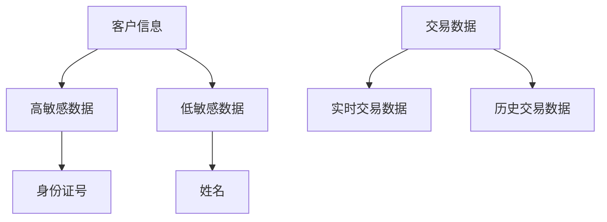
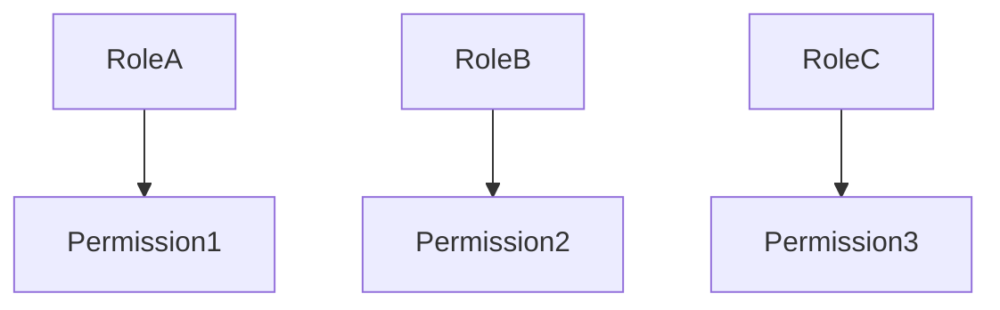
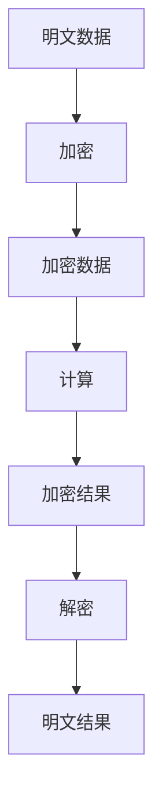
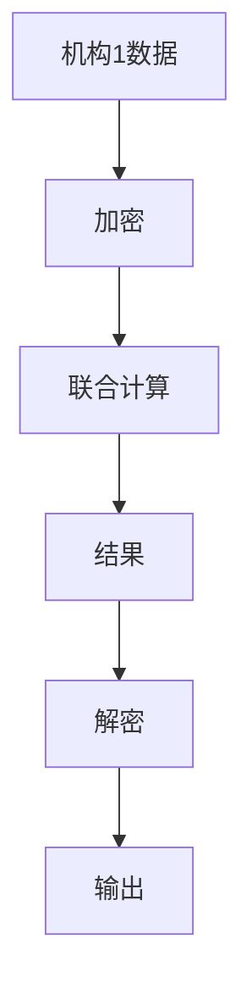
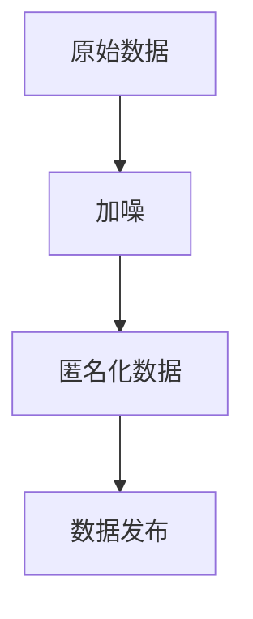
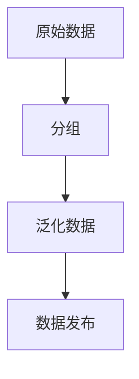
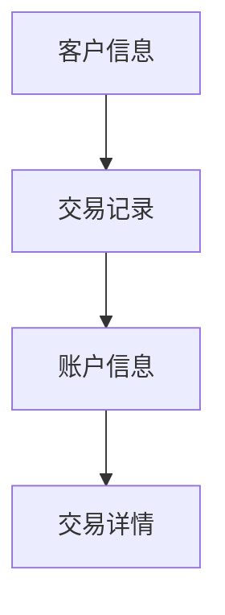
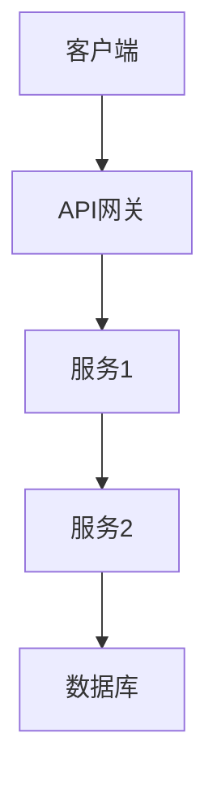

                 


# 《金融数据安全与隐私保护框架设计》

## 关键词：  
金融数据安全、隐私保护、数据加密、访问控制、隐私计算、数据分类、安全架构  

## 摘要：  
随着数字化转型的加速，金融行业面临的网络安全威胁日益严峻。金融数据的敏感性和高价值使其成为攻击者的主要目标。本篇文章详细探讨了金融数据安全与隐私保护的核心概念、技术实现和系统设计，结合实际案例分析，为金融行业构建安全可靠的隐私保护框架提供了系统化的解决方案。  

---

# 第1章：金融数据安全与隐私保护的背景与挑战  

## 1.1 金融数据安全的重要性  
### 1.1.1 金融数据的敏感性与价值  
金融数据涵盖了客户信息、交易记录、财务数据等，这些数据不仅涉及个人隐私，还关系到企业的核心竞争力。  
- 客户信息：包括姓名、身份证号、手机号、银行账户等，一旦泄露可能导致身份盗窃和财产损失。  
- 交易记录：涉及金额、时间、地点等，可能被用于洗钱、欺诈等非法活动。  
- 财务数据：包括企业的收入、支出、利润等，可能被用于商业间谍活动。  

### 1.1.2 金融数据泄露的潜在风险  
- **声誉损失**：数据泄露可能导致客户信任度下降，企业形象受损。  
- **经济损失**：数据泄露可能带来直接的经济损失，如罚款、赔偿等。  
- **法律风险**：数据泄露可能违反《个人信息保护法》《网络安全法》等法律法规，面临法律制裁。  

### 1.1.3 隐私保护的法律与合规要求  
- **GDPR（通用数据保护条例）**：要求企业明确数据处理目的、方式，并获得用户授权。  
- **中国《个人信息保护法》**：规定数据处理者必须采取必要措施确保个人信息安全。  

## 1.2 当前金融数据安全面临的挑战  
### 1.2.1 数据泄露事件的典型案例分析  
- **案例1**：某银行客户信息泄露事件，导致数百万用户的个人信息被公开。  
- **案例2**：某支付平台交易数据泄露，涉及数万笔交易记录。  

### 1.2.2 数据孤岛与共享的矛盾  
- 数据孤岛：不同部门或机构之间的数据无法互联互通，导致数据利用率低。  
- 数据共享：需要在保护隐私的前提下实现数据共享，以支持跨机构的金融业务。  

### 1.2.3 新兴技术对数据安全的影响  
- **区块链技术**：虽然提供了数据不可篡改性，但其透明性可能暴露部分敏感信息。  
- **人工智能**：在数据分析中可能暴露用户隐私，尤其是在训练模型时。  

## 1.3 金融数据安全与隐私保护的目标  
### 1.3.1 数据机密性、完整性和可用性的平衡  
- **机密性**：确保数据仅被授权人员访问。  
- **完整性**：防止数据被篡改或损坏。  
- **可用性**：确保合法用户能够及时访问数据。  

### 1.3.2 隐私保护的核心原则与框架  
- **最小化原则**：仅收集实现业务目标所必需的最少数据。  
- **目的限制原则**：数据仅用于授权的目的，不得用于其他用途。  

### 1.3.3 金融数据安全的长期目标与短期挑战  
- **长期目标**：构建覆盖全生命周期的金融数据安全体系。  
- **短期挑战**：快速应对新兴的安全威胁，如零日攻击、高级持续性威胁（APT）。  

## 1.4 本章小结  
本章从金融数据的敏感性、数据泄露的潜在风险以及隐私保护的法律要求出发，分析了当前金融数据安全面临的挑战，并提出了数据安全与隐私保护的核心目标。

---

# 第2章：金融数据安全与隐私保护的核心概念  

## 2.1 金融数据分类与访问控制  
### 2.1.1 数据分类的维度与方法  
- **维度**：根据数据的敏感性、用途、生命周期等维度进行分类。  
- **方法**：基于规则的分类、基于机器学习的分类等。  

### 2.1.2 常见的金融数据分类框架  
- **客户信息**：分为高敏感数据（如身份证号）和低敏感数据（如姓名）。  
- **交易数据**：分为实时交易数据和历史交易数据。  



### 2.1.3 数据分类与隐私保护的关系  
- 数据分类为隐私保护提供了基础，不同类别的数据采取不同的保护措施。  

## 2.2 访问控制模型  
### 2.2.1 基于角色的访问控制（RBAC）  
- **角色定义**：根据职责划分角色，如“普通员工”、“财务主管”。  
- **权限分配**：基于角色分配访问权限，如“普通员工”只能查看数据，而“财务主管”可以修改数据。  



### 2.2.2 基于属性的访问控制（ABAC）  
- **属性**：包括用户属性（如职位）、资源属性（如数据分类）、环境属性（如时间）。  
- **动态权限控制**：权限根据属性动态变化。  

### 2.2.3 访问控制模型的优缺点对比  

| 模型 | 优点 | 缺点 |  
|------|------|------|  
| RBAC | 简单易懂，便于管理 | 角色间可能存在权限冲突 |  
| ABAC | 灵活性高，支持动态控制 | 实现复杂，管理成本高 |  

## 2.3 数据加密与解密  
### 2.3.1 对称加密与非对称加密的区别  

| 类型 | 描述 | 优缺点 |  
|------|------|---------|  
| 对称加密 | 加密和解密使用同一密钥 | 速度快，适合大文件加密 |  
| 非对称加密 | 加密和解密使用不同密钥 | 安全性高，适合公钥分发 |  

### 2.3.2 常见的金融数据加密算法  
- **AES（高级加密标准）**：常用于对称加密。  
- **RSA**：常用于非对称加密。  

## 2.4 数据匿名化技术  
### 2.4.1 数据匿名化的定义与目标  
- **定义**：通过技术手段去除或加密数据中的敏感信息，使其无法被还原。  
- **目标**：在保护隐私的前提下，支持数据的分析与利用。  

### 2.4.2 常见的数据匿名化方法  
- **数据扰动**：通过添加噪声或随机化处理，降低数据的可识别性。  
- **数据泛化**：将数据进行汇总或分组，减少信息粒度。  

### 2.4.3 数据匿名化与数据可用性的权衡  
- 过强的匿名化可能导致数据失去分析价值。  
- 需根据具体需求选择合适的匿名化方法。  

## 2.5 本章小结  
本章详细介绍了金融数据分类、访问控制模型以及数据加密与匿名化技术的核心概念，并通过对比分析，为后续的系统设计奠定了基础。  

---

# 第3章：金融数据安全与隐私保护的算法原理  

## 3.1 加密算法与隐私保护  

### 3.1.1 同态加密算法  
- **定义**：允许在加密数据上进行计算，结果与对明文计算后再加密的结果相同。  
- **应用场景**：支持在不暴露原始数据的情况下进行数据分析和计算。  

#### 算法流程图  



#### 同态加密的数学模型  

$$ E(x) = x + r $$  
$$ D(E(x)) = x $$  

其中，$r$ 是随机噪声。  

### 3.1.2 安多方计算（SMC）  
- **定义**：在不泄露各方数据的情况下，联合计算出结果。  
- **应用场景**：支持多方机构在保护隐私的前提下进行数据联合分析。  

#### 安多方计算流程图  



#### 安多方计算的数学模型  

$$ f(x_1, x_2, \dots, x_n) = y $$  

其中，$x_i$ 是各方数据，$y$ 是计算结果。  

## 3.2 数据匿名化与隐私保护  

### 3.2.1 数据扰动技术  
- **加噪法**：在数据中添加随机噪声，降低数据的可识别性。  
- **替换法**：用虚拟值替换敏感数据，例如将地址替换为区域名称。  

#### 数据扰动流程图  



### 3.2.2 数据泛化技术  
- **汇总法**：将数据进行汇总，例如将具体金额泛化为“1000-2000元”。  
- **分组法**：将数据分组，例如按年龄分组为“18岁以下”、“18-30岁”等。  

#### 数据泛化流程图  



## 3.3 本章小结  
本章详细介绍了加密算法与数据匿名化技术的原理，并通过流程图和数学模型展示了其在金融数据安全中的应用。  

---

# 第4章：金融数据安全与隐私保护的系统架构设计  

## 4.1 问题场景介绍  
- **问题描述**：某银行需要构建一个支持隐私保护的金融数据处理系统，确保客户信息和交易数据的安全。  
- **目标**：设计一个安全、高效的金融数据处理系统。  

## 4.2 系统功能设计  

### 4.2.1 领域模型设计  



### 4.2.2 功能模块  
- **数据采集模块**：负责采集客户信息和交易数据。  
- **数据处理模块**：对数据进行分类、加密和匿名化处理。  
- **数据存储模块**：将处理后的数据存储在数据库中。  

## 4.3 系统架构设计  

### 4.3.1 分层架构  



### 4.3.2 组件交互  

- **客户端**：向API网关发送请求。  
- **API网关**：负责认证和授权，然后将请求分发到后端服务。  
- **后端服务**：处理请求，调用数据库进行数据查询或存储。  

## 4.4 系统接口设计  
- **API接口**：  
  - `GET /api/customer/{id}`：获取客户信息。  
  - `POST /api/transaction`：提交交易记录。  

## 4.5 本章小结  
本章通过问题场景分析和系统功能设计，构建了一个支持隐私保护的金融数据处理系统架构。  

---

# 第5章：金融数据安全与隐私保护的项目实战  

## 5.1 环境安装  
- **开发环境**：Python 3.8+，JDK 8+，MySQL 5.7+。  
- **依赖安装**：  
  ```bash
  pip install cryptography pandas mysql-connector-python
  ```

## 5.2 系统核心实现  

### 5.2.1 数据加密模块  

```python
from cryptography.hazmat.primitives.asymmetric import rsa
from cryptography.hazmat.primitives.asymmetric.padding import PaddingMode
from cryptography.hazmat.primitives.asymmetric.utils import encode_dss_signature, decode_dss_signature
from cryptography.hazmat.primitives import hashes

# 生成RSA密钥对
private_key = rsa.generate_private_key(
    public_exponent=65537,
    key_size=2048
)
public_key = private_key.public_key()

# 加密函数
def encrypt(data):
    data_to_encrypt = data.encode('utf-8')
    ciphertext = public_key.encrypt(
        data_to_encrypt,
        PaddingMode.RSA_PKCS1_v1_5()
    )
    return ciphertext

# 解密函数
def decrypt(ciphertext):
    plaintext = private_key.decrypt(ciphertext)
    return plaintext.decode('utf-8')
```

### 5.2.2 数据匿名化模块  

```python
import pandas as pd

def anonymize_data(df, sensitive_columns):
    for col in sensitive_columns:
        df[col] = df[col].apply(lambda x: f'*{x[-1]}')
    return df
```

## 5.3 代码应用解读与分析  
- **数据加密模块**：使用RSA算法对敏感数据进行加密，确保数据在传输过程中的安全性。  
- **数据匿名化模块**：对客户信息中的敏感字段进行匿名化处理，例如将身份证号“12345678901”替换为“*1”。  

## 5.4 实际案例分析  
- **案例描述**：某银行客户信息泄露事件，客户信息包括姓名、身份证号、手机号等。  
- **解决方案**：使用上述模块对客户信息进行加密和匿名化处理，确保数据的安全性。  

## 5.5 本章小结  
本章通过实际项目案例，详细讲解了金融数据安全与隐私保护的实现过程，并提供了可复用的代码实现。  

---

# 第6章：金融数据安全与隐私保护的最佳实践  

## 6.1 小结  
- 数据分类与访问控制是金融数据安全的基础。  
- 加密算法与数据匿名化技术是保护隐私的核心。  
- 系统架构设计是实现金融数据安全的关键。  

## 6.2 注意事项  
- **数据分类**：根据数据的敏感性和用途进行分类，避免一刀切。  
- **访问控制**：结合RBAC和ABAC，灵活控制数据访问权限。  
- **加密技术**：选择合适的加密算法，平衡安全性与性能。  

## 6.3 拓展阅读  
- **推荐书籍**：《网络安全与隐私保护》《金融数据安全技术》  
- **推荐博客**：关注安全领域的技术博客，如Krebs on Security、Schneier on Security。  

## 6.4 本章小结  
本章总结了金融数据安全与隐私保护的最佳实践，并为读者提供了进一步学习和研究的方向。  

---

# 附录：术语表  

- **金融数据**：涉及金融业务的各类数据，包括客户信息、交易记录等。  
- **隐私保护**：保护个人隐私，防止未经授权的数据访问和泄露。  
- **数据分类**：根据数据的敏感性和用途进行分类。  
- **访问控制**：通过规则和策略控制数据访问权限。  

---

# 参考文献  

1. 《网络安全与隐私保护》，作者：[作者姓名]。  
2. 《金融数据安全技术》，作者：[作者姓名]。  
3. GDPR（通用数据保护条例）。  
4. 中国《个人信息保护法》。  

---

以上是《金融数据安全与隐私保护框架设计》的完整目录和内容大纲，涵盖了从背景介绍到实际项目实现的全过程，适合技术从业者和研究人员阅读。

